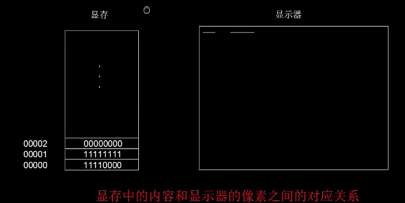
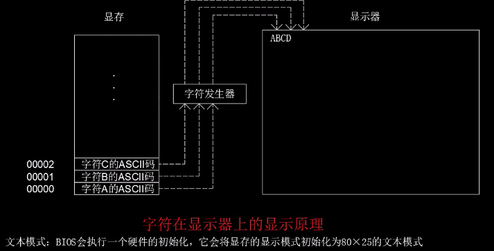
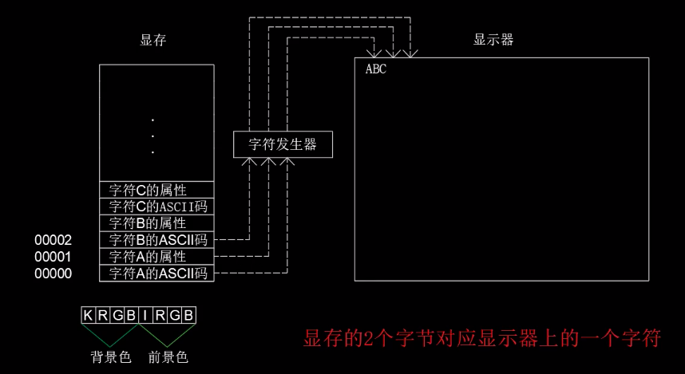

[TOC]

## 控制显卡

### 显卡和显存

显卡: 为显示器提供内容

显示器: 将显卡提供的内容显示到屏幕上

集成显卡: 集成到主板上, 和主板是一体的

独立显卡: 独立生产和销售的一个部件

显卡存储器: 简称`显存`, 每个显卡都有自己的存储器



显示器的最小单位是像素, 一个像素对应了屏幕上的一个点, 大量的像素点组合到一起就能显示出图像. 对于显示器来说显示黑白是最简单的, 因为只有控制每个像素是亮或者不亮就可以了. 那如何来控制这个像素点亮或者不亮呢? 这里就需要用到显存了

如果, 我们用 0 表示不亮, 1 表示亮. 那么只要将显存中的每个 bit 和显示器上的每个像素对应起来就可以了, 显卡会从显存中周期性的提取这些 bit 从而呈现到显示器上

如上图中, 显存中依次为 `11110000` `11111111` `00000000`, 那么显示器上就会依次显示 `4个亮点4个暗点` `8个亮点` `8个暗点`

**而图像模式分为 黑白模式和真彩色模式**, 如果想让显示器显示出颜色很明显一个 bit 是不够用的, 计算机会使用 24 个 bit (3 个字节来表示), 可以表示出 1600+万种颜色. 如果使用真彩色模式, 在相同分辨率的情况下, 真彩色模式要比黑白模式需要更大的显存, 屏幕上同样的一个像素点, 真彩色需要 24bit, 是黑白色的 24 倍

而**显卡除了图像模式外还有文本模式**, 但是我们一般情况下是接触不到的. 文本模式比较特别, 相识文本是一个比较麻烦的事情:

-   一个字符会占用很多个像素
-   不同字符的像素分布也是不同的

为了解决这个问题, 计算机工程师设计了一个专门的电路, 成为**字符发生器**. 我们需要在屏幕的哪个位置显示哪个字符, 就只需要在显存的对应位置存入对应的 ASCII 码, 然后显卡会将显存中的内读取到字符发生器中, 然后由字符发生器来告诉显示器应该如果显示内容, 如下图:



也就是说在文本模式下, 显存不再和显示器上的像素点直接相关

计算机在启动时会加载 BIOS, 显卡为文本模式会将显示器初始化为 80 字 25 行, 总计一屏 2000 个字符

而在实际上, 显存的一字节并不是正好对应的显示器上的一个字符, 而是两个字节对应一个显示器上的一个字符, 如下图:



字符的属性为: 前四位为背景色, 后四位为前景色

| 位   | 7    | 6      | 5      | 4      | 3    | 2   | 1   | 0   |
| ---- | ---- | ------ | ------ | ------ | ---- | --- | --- | --- |
| 属性 | 闪烁 | 背景 R | 背景 G | 背景 B | 高亮 | R   | G   | B   |

| R   | G   | B   | 颜色 |
| --- | --- | --- | ---- |
| 0   | 0   | 0   | 黑色 |
| 0   | 0   | 1   | 蓝色 |
| 0   | 1   | 0   | 绿色 |
| 0   | 1   | 1   | 青色 |
| 1   | 0   | 0   | 红色 |
| 1   | 0   | 1   | 粉色 |
| 1   | 1   | 0   | 黄色 |
| 1   | 1   | 1   | 白色 |

在 BIOS 中, 显存的位置在`外围板卡`的 320KB 中, 位置为`B800-BFFF`


### 显卡中写入数据

-   mov 指令

    -   功能: 用于数据的传送

    -   格式: mov 目的操作数, 源操作数 --> 如: mov ax, 0x22

        -   注意:

            1. 目的操作数必须是一个容器 --> 寄存器或内存单元
            2. `传送`的本质是`复制`
            3. 目的操作数和源操作数的数据宽度必须一致
            4. 目的操作数和源操作数不能同时为内存单元
            5. 不允许数字直接传送到端寄存器中, 只能 : mov 段寄存器, 通用寄存器/内存单元

        -   例子:

            目的操作数 --> 寄存器

            -   `mov AX, BX`(寄存器)
            -   `mov AX, [0x33]`(内存单元)
            -   `mov AX, 0x66` (数字/立即数)

            目的操作数 --> 内存单元

            -   `mov [0x04], BX` (寄存器)
            -   `mov [0x04], [0x33]`(内存单元) <font color='red'>错误, 不能同时为内存单元</font>
            -   `mov [0x04], 0x66` (数字/立即数)

            `mov AX, BL` <font color='red'>错误, AX 为 16 位, BL 为 8 位</font>

            `mov CS, 0x22` <font color='red'>错误, CS 是代码段寄存器, 不能直接使用数字</font>

-   名字

    由标号和变量组成:

-   标号

    标号由一组放在语句前头的标识符后跟一个 " ： " 来定义，用以指定相应程序段在内存的首地址位置。

    任何一个标号一经定义就具有 3 种属性：

    -   标号的段地址；
    -   标号的偏移地址；
    -   标号的类型； 1 ） NEAR-- 该标号只能在段内转移； 2 ） FAR-- 在段间使用；

    标号和名字一经定义便具有以下两类三种属性：

    1. 段值: 标号和名字对应存储单元的段地址
    2. 偏移值: 标号和名字对应存储单元的偏移地址
    3. 类型: 标号、子程序名的类型可以是 NEAR （近）和 FAR （远），分别表示段内或段间

-   变量

    变量一经定义，通常具有 5 种属性（即特征）：

    1. 变量的段地址（ SEG ）；
    2. 变量的偏移地址（ OFFSET ）；
    3. 变量类型（ TYPE ）：所定义变量所占字节数；由 DB 、 DW 、 DD 、 DQ 、 DT 伪指令定义的变量类型分别为 1 ， 2 ， 4 ， 8 ， 10 。前 3 种类型又分别称为 BYTE 类、 WORD 类、 DWORD 类。
    4. 变量长度（ LENGTH ）：所定义变量的个数；
    5. 变量大小（ SIZE ）：定义中分配给同一变量名所有变量的总字节数；

    变量定义实质上是对数据区内存的一种安排，这种安排对汇编语言编程是非常重要的，它是在汇编过程中完成的。编写程序时，直接引用变量的名字，而汇编过程中，对任何变量的引用，都自动转换为变量相应的偏移地址。

    变量名的类型可以是 BYTE （字节）、 WORD （字）和 DWORD （双字）等

    -   地址操作符
        取得名字或标号的段地址和偏移地址两个属性
        -   [ ] 将括起的表达式作为存储器地址
        -   \$ 当前偏移地址
    -   `：` 采用指定的段地址寄存器
    -   `OFFSET 名字 / 标号` 返回名字或标号的偏移地址
    -   `SEG 名字 / 标号` 返回名字或标号的段地址

-   简单记忆方法：
    1. 凡是名字后边有冒号的，是标号，也就是给这段程序标记一个记号，从其他地方转移过来有个目标。
    2. 凡是名字后边从不出现冒号的，是变量（关键字除外）。

**例子**

将汇编地址的十进制打印到屏幕上:

1. 通过标号 number 拿到汇编地址
2. 分解各个位数: number = 0x0100 (十六进制) = 1 0000 0000B (二进制)

    1. 1 0000 0000 除以 1010 (二进制 10), 商 1 1001, 余数 110 (个位 6)
    2. 0001 1001 除以 1010, 商 10, 余数 101 (十位 5)
    3. 10 除以 1010, 商 0, 余数 10 (个位 2)
    4. 商 0, 运算结束

3. 推算出表号十进制形式的 ASCII 码:
    - 0 --> 11 0000 = 0 + 11 0000
    - 1 --> 11 0001 = 1 + 11 0000
    - 2 --> 11 0010 = 10 + 11 0000
    - 3 --> 11 0011 = 11 + 11 0000
    - ....

-   DB (declare byte) 指令: |声明并初始化数据

    |声明数据的本质就是在内存中占用一块空间, 初始化数据的本质就是为这个空间赋值

    db 指令时一个**伪指令**. `伪指令用于指示(命令)汇编程序如何汇编源程序，又称为命令语句`

    mov 指令: 会被编译器编译为对应的**机器指令**. 作用为: **控制处理器**, 将数据传送到指定位置

    db 指令: 会被编译器编译为对应的一些**数据**. 作用为: **控制编译器**, 来|声明并初始化一些数据

    类似的指令还有:

    -   DW : Word, |声明的每个数字占用 2 个字节的宽度
    -   DD : Double Word, |声明的每个数字占用 4 个字节的宽度
    -   DQ : Quad Word, |声明的每个数字占用 8 个字节的宽度

-   DIV (division) 指令: 除法

    -   16 位数 ÷ 8 位数

        除数: 由 8 位通用寄存器或者内存单元来提供

        被除数 : AX --> 必须被存储到 AX 寄存器中

        计算结果: AH --> 余数 AL --> 商

        结构: div 除数, 如: div CL

    -   32 位数 ÷ 16 位数

        除数: 由 16 位通用寄存器或者内存单元来提供

        被除数 : 高 16 位被存储到 DX, 低 16 位被存储到 AX

        计算结果: DX --> 余数 AX --> 商

        结构: div 除数, 如: div CL

-   XOR (exclusive OR) : 异或指令. 对两数进行异或运算, 相同则为 0, 不同则为 1
-   JMP (jump): 跳转指令, 通过改变 CS 和 IP 的值来使处理器转移到 jmp 锁指定的位置去执行

    -   `jmp 0x005c, 0x003d` cs --> 0x005c ip --> 0x003d
    -   `infi jmp near infi`

        -   `near` 修饰符, 表示这个指令的操作数是 16 位的
        -   `infi` 一个标号

            `标号的汇编地址 - 当前指令的汇编地址 - 当前指令的长度 = 操作数`

            这里的 `标号的汇编地址` 和 `当前指令的汇编地址` 相同, 所以操作数为 `-3`, `-3` 的二进制(补码加一)为 `1111111111111101`, 十六进制为 `FFFD`, 在 8086 中就是 `FDFF`

            这条指令不会改变代码段寄存器 CS 的值

            `指令指针寄存器 IP + 该指令的操作数 + 该指令的长度 = xxx`

            会将 IP 的值修改为 `xxx`, 在这里假设 IP 的值为 0, `该指令的操作数` 已经计算出来是 `-3`, `该指令的长度` 为 3, 所以计算结果 `xxx` 依然为 0, 所以这条指令会无限循环

-   times 重复执行, 伪指令

```armasm
mov ax, 0xb800
; 将b800传入ax寄存器中
mov es, ax
; 将 ax 寄存器中的值传入附加段寄存器 es 中
; 为什么写为 mov es, 0xb800 ?
; 因为 Intel 不允许, 值允许 mov [段寄存器], [通用寄存器/内存单元]
; b800 为显存的端地址
; --------------------------------------------------------
mov byte [es:0x00], 'W'
; 将字符串L的ASCII码存储到显卡的第一个UNC单元中
; 上面的指令相当于 mov byte [es:0x00] 0101  0111b / 87 / 0x57 分别为 'W' 的二进制, 十进制, 十六进制形式
; 地址必须用方括号括起来
; byte/word: 明确告诉编译器这条指令的数据宽度
; 不需要修饰: mov [00], AL / mov AX, [00]
mov byte [es:0x01], 0x07
; 将字符 W 的属性存储到显示器第二个存储单元中
; 属性值07: 黑底白字, 无闪烁, 无加亮

mov byte [es:0x02], 'h'
mov byte [es:0x03], 0x07

mov byte [es:0x04], 'y'
mov byte [es:0x05], 0x07

mov byte [es:0x06], ' '
mov byte [es:0x07], 0x07

mov byte [es:0x08], 's'
mov byte [es:0x09], 0x07

mov byte [es:0x0a], 'o'
mov byte [es:0x0b], 0x07

mov byte [es:0x0c], ' '
mov byte [es:0x0d], 0x07

mov byte [es:0x0e], 's'
mov byte [es:0x0f], 0x07

mov byte [es:0x10], 'e'
mov byte [es:0x11], 0x07

mov byte [es:0x12], 'r'
mov byte [es:0x13], 0x07

mov byte [es:0x14], 'i'
mov byte [es:0x15], 0x07

mov byte [es:0x16], 'o'
mov byte [es:0x17], 0x07

mov byte [es:0x18], 'u'
mov byte [es:0x19], 0x07

mov byte [es:0x1a], 's'
mov byte [es:0x1b], 0x07

mov byte [es:0x1c], ' '
mov byte [es:0x1d], 0x07

mov byte [es:0x1e], '?'
mov byte [es:0x1f], 0x07
; --------------------------------------------------------
mov ax, number
; 将 number 存储到 ax 中, 作为下次除法运算被除数的低16位
; 编译器在编译的时候会将 number 替换为其锁对应的汇编地址
mov dx, 0
; 将 0 存储到 dx 中, 作为下次除法运算的被除数的高16位
mov bx, 10
; 将除数 10, 也就是二进制的 1010 存储到 bx 中
; 以上3条指令就为除法运算做好了准备工作
; --------------------------------------------------------
mov cx, cs
; 将代码段寄存器 cs 的值, 也就是 0x0000, 传送到 cx 中
mov ds, cx
; 将寄存器 cx 的值, 也就是 0x0000, 传送到 ds 中
; ds 寄存器中存储的是本程序在内存中的段地址
; --------------------------------------------------------
div bx
; 对应第一次除法
; 商也存在 ax 中, 作为下次除法是被除数
; 余数, 也就是标号的个位数, 存储在 dx 中
mov [0x7c00+number+0x00], dl
; 将第一次除法运算得到的标号个位上的值 存入了我们使用 db 所声明的第一个存储单元中
; 这里 dl 是 dx 的低位, 余数存到了 dx 中, 由于余数很小, 不会储存到 dh 中, 所以这里用 dl, 并且如果使用 dx 的话就会占用两个内存单元
xor dx, dx
; 异或指令, 对两数进行异或运算, 并将结果存到操作数中
; 这条指令的作用: 将 dx 中的值清清零, 为第二次出发做准备
div bx
; 第二次除法
mov [0x7c00+number+0x01], dl
; 将第二次除法运算得到的标号十位上的值 存入了我们使用 db 所声明的第二个存储单元中
xor dx, dx

div bx
; 第三次除法
mov [0x7c00+number+0x02], dl
; 将第二次除法运算得到的标号百位上的值 存入了我们使用 db 所声明的第三个存储单元中
; --------------------------------------------------------
mov al, [0x7c00+number+0x02]
; 将百位上的值传送到 al 中
add al, 0x30
; 获得百位上数值的ASCII码, 0x30 ==> 11 0000b
mov [es:0x020], al
; 将存如显存中
mov byte [es:0x021], 0x04
; 将字符属性存储到显示器第二个存储单元中
; 属性值04: 黑底红字, 无闪烁, 无加亮

mov al, [0x7c00+number+0x01]
; 将十位上的值传送到 al 中
add al, 0x30
mov [es:0x022], al
mov byte [es:0x023], 0x04

mov al, [0x7c00+number+0x00]
; 将个位上的值传送到 al 中
add al, 0x30
mov [es:0x024], al
mov byte [es:0x025], 0x04

mov byte [es:0x26], 'D'
mov byte [es:0x27], 0x07
; --------------------------------------------------------
infi jmp near infi
; 无限循环: 让处理器一致跳转到 infi
; --------------------------------------------------------
number db 0,0,0,0,0
; 标号: number = 汇编地址 = 0x0100
; 数据格式: 以字母开头
; --------------------------------------------------------
times 249 db 0
; 让编译器重复生产 db 0 --- 249 次
db 0x55, 0xaa
; 硬盘主引导扇区的有效标志
; 主引导扇区一共512K, 最后必须以 55 AA 结尾
```

**P.S** 上面的程序并没有进行分数据段和代码段
