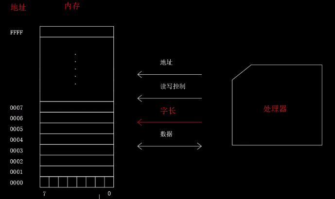
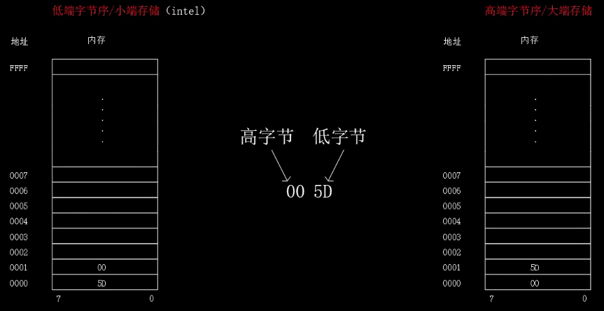
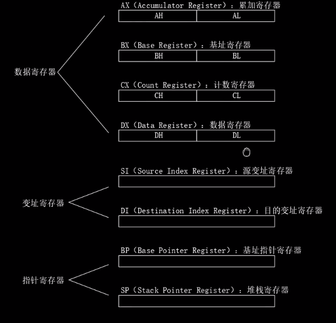
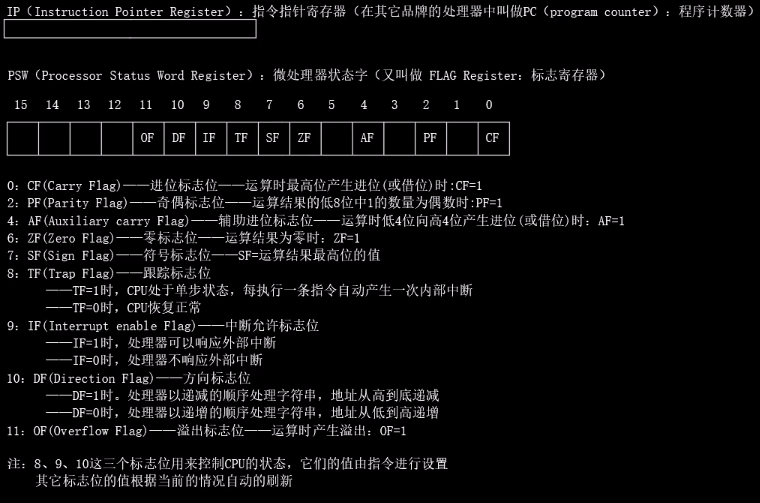
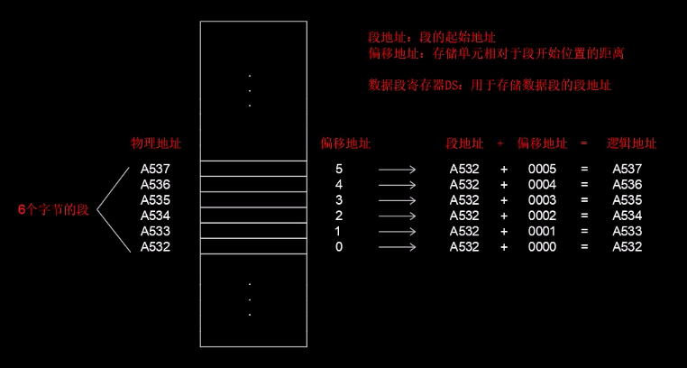
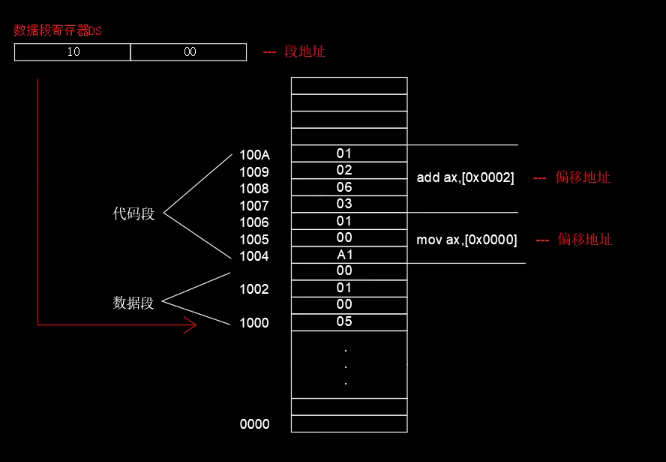

[TOC]

## 汇编基础

-   汇编的诞生

    10111000 00111111 00000000 (**机器指令/二进制**) ---> B8 3F 00 (**十六进制**) ---> mov AX, 3F (**汇编形式**) 含义: 将 AX 寄存器的值设置为 3F

    用比较容易理解的形式替换掉机器指令

-   编译器

    计算机只能识别机器指令/机器语言, **编译**就是把汇编语言翻译为机器指令

-   寄存器, 内存

    

    内存是按照字节来组织数据的, 也就是说我们可以访问的最小单位是 1 字节, 即不论是读还是写最小也是按照一个字节来操作, 所以说**字节是内存最基本的存储单元**.

    

    内存中每个字节的中的位也是有高低之分的

    通过精心的设计我们可以**单次访问**内存中的一个字节, 一个字, 一个双字或者一个四字, 分别对应了 8 位,16 位,32 位,64 位, 上图中的`字长`就是来控制单次访问的数据长度的

-   字节序

    

    存储 `00 5D` 先存储 5D 后存储 00, 即**先存低位后存高位就是低端字节序/小端存储**. 如果先存储 00 后存储 5D, 也就是**先存高位后存低位就是高端字节序/大端存储**. `Intel 采用的是小端存储`.

-   8086 的寄存器

    一共有 14 个寄存器, 可以分为 3 部分:

    **8 个通用寄存器**:

    

    -   又可以分为 3 类寄存器:

        1. 数据寄存器 AX BX CX DX 都可以拆分为两个 8 位的寄存器来使用, 如 AX 就可以拆分为 AH AL(H height L low)
        2. 变址寄存器 SI DI
        3. 指针寄存器 BP SP

    **4 个段寄存器**: CS DS ES SS

    

    **2 个控制寄存器**: IP PSW

    

-   数据段和代码段

    

    计算机在存储时会将指令集中存储到一起, 成为代码段. 也会将数据集中到一起存储, 叫做数据段

    如图, 第一个代码段为 `A1 00 01` 对应的指令为 `mov ax, [0x0100]` , 表示将地址为 0100 的数据存储到 AX 寄存器中.

    第二个代码段为 `03 06 02 01`, 其中 `03 06` 是操作码, `02 01` 为地址 0102, 对应的指令为 `mov ax, [0x0102]`, 将地址 0102 的数和 AX 寄存器中的数据相加并存储

    程序的重定位 在编程是要使用逻辑地址或者相对地址而不是物理地址或者绝对地址, 当程序被加载的时候逻辑地址或者相对地址会根据程序实际程序被加载的位置来重新计算地址的值, 也就是说逻辑地址会根据程序实际被加载的位置随之发生变化以适应新的位置, 这种变化就叫做程序的重定位

    -   **内存分段机制**

        

        
        如上图

        实际上, 处理器会将指令中的内存地址视为**偏移地址**, 把 DS 寄存器中存储的段地址和偏移地址相加得到逻辑地址 = 物理地址

        重定位就是通过改变数据段寄存器 DS 中的值实现的

        之前的例子是将指令中的地址直接当做物理地址使用的, 其实是错误的, 只是易于理解才使用的

    -   DS 和 ES
        计算机中并不是只有 DS[数据段寄存器]存储段地址, 还有 ES[附加段及存储器]也能存储段地址, 在没有指定的情况下, 处理器默认使用 DS

        `mov ax, [0001]` 使用 DS 为段地址, 0001 为段内偏移地址

        `mov ax, [DS:0001]` 指定使用 DS

        `mov ax, [ES:0001]` 指定使用 ES

    -   CS 和 IP

        CS[代码段寄存器]: 用于存储代码段的起始地址, 也就是代码段的偏移地址

        IP[指令指针寄存器]: 用于存储代码段在段内的偏移地址

        CS + IP = 指令的逻辑地址 = 指令的实际位置

    -   8086 的内存分段机制

        内存地址引线: 20 根

        逻辑地址: 20 为

        段地址: 20 位(左移 4 位得到: 每个分段必须加载到地址最低为 = 0 的地址)

        偏移地址: 16 位(每个段最大的长度 = 65536 个字节)

        20 根引线就最多可以访问 20 位地址, 但是 8086 的寄存器是 16 位的, 所以在计算地址时需要进行处理:

        假设段地址为 F000, 偏移地址为 025C, 逻辑地址为 F000(16 进制)左移 4 位, 变成 F0000, 逻辑地址 = F0000 + 025C = F025C

        由于逻辑地址需要左移 4 位, 那么得到的结果的最低位一定为 0. 所以每个加载到的段地址的最低位一定要是 0, 就不能将分段加载到 82341 这个位置
