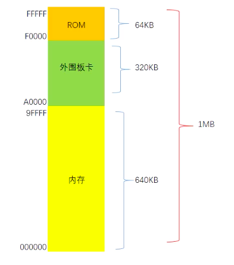

[TOC]

## 计算机的启动

现代计算机的软件都是基于操作系统的, 所有的程序也都要符合操作系统的程序规范才能运行, 不同的操作系统有不同的要求, 所以, 不同的操作系统之前的软件是不通用的.

那么, 能不能绕过操作系统让计算机来直接执行程序呢? 当然是可以的.

### 计算机的重启和关机

计算机在启动或者重启的时候, 处理器会对寄存器执行一个初始化的操作, 其中:

-   CS[代码段寄存器]: FF FF
-   其他寄存器: 00 00



8086 有 20 根地址引线, 所以可以访问 1MB 的空间 (2^20^ = 1024 \* 1024 byte = 1MB), 这 1MB 的寻址空间, 从物理上被分为 3 大部分:

-   ROM (Read-Only Memory) 只读存储器. 内容无法更改, 厂家在出厂时将指令固化在 ROM 里, 及时断电内容也不会消失, 占据顶端的 64 KB. 它还有另外一个名称 **BIOS** (Basic Input Output System) 基本输入输出系统
-   内存占据了底端的 640 KB, 也就是说一个 8086 的处理器, 最多能访问 640 kB 的内存. 如果过大的内存别不会被访问到
-   外围板块, 如显卡. 占据 320 KB

计算机在开机时, 会读取到地址为 FFFF0 (FFFF 左移一位 + 0000)的指令, 此时计算机就有指令可以执行. FFFF0 距离 顶端 FFFF 只有 16 个字节的长度, 所以在 FFFF0 通常是一条跳转指令.

跳转指令时通过改变 CS 和 IP 的值, 使处理器从 ROM 中较低的位置去执行

```sh
# 跳转指令
jmp F000: 005C
```

`jmp`是 jump 的缩写 F000 是段地址, 005C 是偏移地址. 执行完成上面的指令后, CS 就被设置为 F000, IP 被设置为 005C. 处理器就会进入下一个执行周期, 从 F005C 这个位置开始执行, 这样就可以有更多的空间去执行指令

### 硬盘

相对于内存来说, U 盘/软盘/光盘/硬盘就是外存

这里主要了解硬盘


硬盘中一般会有多个**盘片**组成，每个盘片包含两个面，每个盘面都对应地有一个读/写磁头。受到硬盘整体体积和生产成本的限制，盘片数量都受到限制，一般都在 5 片以内。盘片的编号自下向上从 0 开始，如最下边的盘片有 0 面和 1 面，再上一个盘片就编号为 2 面和 3 面。
如下图：


下图显示的是一个盘面，盘面中一圈圈灰色同心圆为一条条磁道，从圆心向外画直线，可以将磁道划分为若干个弧段，每个磁道上一个弧段被称之为一个**扇区**（图践绿色部分）。扇区是磁盘的最小组成单元，通常是 512 字节。（由于不断提高磁盘的大小，部分厂商设定每个扇区的大小是 4096 字节）


硬盘通常由重叠的一组盘片构成，每个盘面都被划分为数目相等的磁道，并从外缘的“0”开始编号，具有相同编号的磁道形成一个圆柱，称之为磁盘的**柱面**。磁盘的柱面数与一个盘面上的磁道数是相等的。由于每个盘面都有自己的磁头，因此，盘面数等于总的磁头数。 如下图


硬盘的第一个扇区是 0 面 0 道 1 扇区, 也叫做**主引导扇区**, 面和道都是从 0 开始编号, 扇区从 1 开始编号

#### 磁盘容量计算

存储容量 ＝ 磁头数 × 磁道(柱面)数 × 每道扇区数 × 每扇区字节数

上图 中磁盘是一个 3 个圆盘 6 个磁头，7 个柱面（每个盘片 7 个磁道） 的磁盘，图 3 中每条磁道有 12 个扇区，所以此磁盘的容量为：

存储容量 6 _ 7 _ 12 \* 512 = 258048

每个磁道的扇区数一样是说的老的硬盘，外圈的密度小，内圈的密度大，每圈可存储的数据量是一样的。新的硬盘数据的密度都一致，这样磁道的周长越长，扇区就越多，存储的数据量就越大。

#### 磁盘读取响应时间

-   寻道时间：磁头从开始移动到数据所在磁道所需要的时间，寻道时间越短，I/O 操作越快，目前磁盘的平均寻道时间一般在 3－15ms，一般都在 10ms 左右。
-   旋转延迟：盘片旋转将请求数据所在扇区移至读写磁头下方所需要的时间，旋转延迟取决于磁盘转速。普通硬盘一般都是 7200rpm，慢的 5400rpm。
-   数据传输时间：完成传输所请求的数据所需要的时间。

小结一下：从上面的指标来看、其实最重要的、或者说、我们最关心的应该只有两个：寻道时间；旋转延迟。
读写一次磁盘信息所需的时间可分解为：寻道时间、延迟时间、传输时间。为提高磁盘传输效率，软件应着重考虑减少寻道时间和延迟时间。

#### 块/簇

磁盘块/簇（虚拟出来的）。 块是操作系统中最小的逻辑存储单位。操作系统与磁盘打交道的最小单位是磁盘块。
通俗的来讲，在 Windows 下如 NTFS 等文件系统中叫做簇；在 Linux 下如 Ext4 等文件系统中叫做块（block）。每个簇或者块可以包括 2、4、8、16、32、64…2 的 n 次方个扇区。

为什么存在磁盘块？
读取方便：由于扇区的数量比较小，数目众多在寻址时比较困难，所以操作系统就将相邻的扇区组合在一起，形成一个块，再对块进行整体的操作。

分离对底层的依赖：操作系统忽略对底层物理存储结构的设计。通过虚拟出来磁盘块的概念，在系统中认为块是最小的单位。

#### page

操作系统经常与内存和硬盘这两种存储设备进行通信，类似于“块”的概念，都需要一种虚拟的基本单位。所以，与内存操作，是虚拟一个页的概念来作为最小单位。与硬盘打交道，就是以块为最小单位。

#### 扇区、块/簇、page 的关系

扇区： 硬盘的最小读写单元

块/簇： 是操作系统针对硬盘读写的最小单元

page： 是内存与操作系统之间操作的最小单元。

扇区 <= 块/簇 <= page

### 操作系统的自举

有了上面的基础, 我们可以看一下系统在重启/开机时执行的步骤:

1. 重启: 寄存器被初始化, `CS: FF FF` `IP: 00 00`
2. 处理器进入机器周期的循环, 到 `FFFF0` 去取指令 `jmp F000: 005C`, 更改了 CS 和 IP 的值, `CS: F000` `IP: 005C`
3. 到 `F005C` 去取指令并依次执行
4. BIOS 所做的最后一件事: 将主引导扇区中的内容加载到 7C00 的位置处
5. BIOS 做的最后一条指令 `jmp 0000: 7C00`, `CS: 0000` `IP: 7C00`
6. 处理器去 `7C00` 执行主引导扇区中的命令. 主引导扇区中的指令执行了两件事:
    1. 加载操作系统自举代码到内存中
    2. 通过一条跳转指令, 使处理器去执行操作系统的自举代码

如果我们将自己写的程序写入主引导扇区会怎么样呢?

在第 4 步中, BIOS 会将我们的程序加载到内存中. 处理器会去跳过操作系统并且执行我们的程序. 这也是不依赖操作系统让计算机来运行我们的程序的唯一的办法

### 向硬盘写入数据

向主引导扇区写入数据, 建议在虚拟机里进行, <font color='red'>千万不要在自己电脑上试 !</font> 要是成功了电脑就废了
