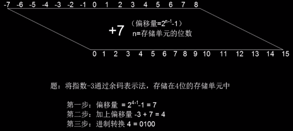

[TOC]

# 数据的存储

## 正数存储

### 无符号表示法

-   步骤

1. 转换为二进制
2. 二进制位数不足 n 位的, 左边(高位)补 0

-   举例

    -   例一 将 7 存储到 8 位存储单元中
        ```
        1. 将 7 转为二进制 111
        2. 高位补 0 , 0000 0111
        ```
    -   例二 将 258 存储到 16 位存储单元中
        ```
        1. 将 258 转为二进制 1 0000 0010
        2. 高位补 0 , 0000 0001 0000 0010
        ```

-   复原: 逆运算即可

### 符号加绝对值表示法

在整数存储中不常用, 却常用于存储模拟信号(存储音频部分会用到)

使用最高位表示符号, 0 - 正, 1 -负

-   步骤

1. 将绝对值转为二进制
2. 二进制不足 n-1 位的, 左边(高位)补零
3. 加上符号位

-   举例

    -   例一 将 28 存储到 8 位存储单元中
        ```
        1. 28 转二进制, 1 1100
        2. 补零, 001 1100
        3. 符号位, 0001 1100
        ```
    -   例二 将 -28 存储到 8 位存储单元中
        ```
        1. 28 转二进制, 1 1100
        2. 补零, 001 1100
        3. 符号位, 1001 1100
        ```

-   复原: 逆运算

### 补码表示法

存储整数最常用的方法

取补码常用方法:

1. 取反加 1
    ```
            1001 1100
    取反 -> 0110 0011
    加一 -> 0110 0100
    ```
2. 从右开始复制, 指=直到复制到第一个 1, 然后将其他位取反
    ```
            1001 1100
    复制 ->       100
    取反 -> 0110 0100
    ```

注意: `将是一个数连续取两次补码, 最终得到原数`

-   步骤

1. 绝对值转换为二进制
2. 二进制位数不足 n 位的, 左边(高位)补 0
3. 如果要存储的整数是正数和 0, 就结束; 如果存储是负数, 则取补码后存储

-   举例

    -   例一 将 28 存储到 8 位存储单元中
        ```
        1. 28 转二进制, 1 1100
        2. 补零, 0001 1100
        3. 正数, 结束
        ```
    -   例二 将 -28 存储到 8 位存储单元中
        ```
        1. 28 转二进制, 1 1100
        2. 补零, 0001 1100
        3. 负数, 取补码 1110 0100
        ```

-   复原: 判断正负后逆运算

例子: 计算机中存储了整数 1110 0100, 请复原

    ```
    最高位是 1 , 负数
    取补码 -> 0001 1100
    转十进制 -> 4 + 8 + 16 = 28
    加符号 -> -28
    ```

导致问题:

使用补码表示法将 255 存储到 8 位存储单元中

1. 转二进制 255 -> 1111 1111
2. 不需要补零
3. 正数, 直接存储

复原:

1. 最高位为 1, 负数
2. 补码 -> 000 0001
3. 转为十进制并补存符号 -1

### 小结

| 存储的内容 | 无符号 | 符号加绝对值 | 二进制补码 |
| ---------- | ------ | ------------ | ---------- |
| 0000       | 0      | 0            | 0          |
| 0001       | 1      | 1            | 1          |
| 0010       | 2      | 2            | 2          |
| 0011       | 3      | 3            | 3          |
| 0100       | 4      | 4            | 4          |
| 0101       | 5      | 5            | 5          |
| 0110       | 6      | 6            | 6          |
| 0111       | 7      | 7            | 7          |
| 1000       | 8      | -0           | -8         |
| 1001       | 9      | -1           | -7         |
| 1010       | 10     | -2           | -6         |
| 1011       | 11     | -3           | -5         |
| 1100       | 12     | -4           | -4         |
| 1101       | 13     | -5           | -3         |
| 1110       | 14     | -6           | -2         |
| 1111       | 15     | -7           | -1         |

## 实数的存储

-   规范化

    101.11 -> 1.0111 \* 2^2

    -0.0101 -> -1.01 \* 2^-2

    移动小数点, 使小数点左边只有一个 1

-   符号, 指数, 尾数

    `-1.01 * 2^-2` 的符号: `-` 指数: `-2`, 尾数: `01`

-   余码系统

    用于存储指数的方法

    `特点:` 在每个要被存储的数字上面加上一个偏移量

    

-   IEEE 标准

    IEEE: 电气和电子工程师协会

    -   单精度 32 位 (余 127 码)

        ```
        S[符号 1位] E[指数 8位] M[尾数 23位]
        ```

        127 = 2^(8-1)-1

    -   双精度 64 位 (余 1023 码)

        ```
        S[符号 1位] E[指数 11位] M[尾数 52位]
        ```

        1023 = 2^(11-1)-1

### 完整步骤

1. 确定 S 值: 正数为 0 , 负数为 1
2. 将数字转为二进制
3. 规范化
4. 确定 E 和 M
5. 连接 S,E,M

**例子:**

-   例一

    将十进制数 5.75 以单精度存储到计算机中

    ```
    1. S = 0
    2. 5.75 = 101.11
    3. 101.11 = 1.0111 * 2^2
    4. E = 2 + 127 = 129 = 1000 0001
       M = 0111 = 0111 0000 0000 0000 0000 000
    5. 5.75 = 0 1000 0001 0111 0000 0000 0000 0000 000
    ```

-   例二

    将十进制数 -0.0234375 以单精度存储到计算机中

    ```
    1. S = 1
    2. 0.0234375 = 0.000 0011
    3. 0.000 0011 = 1.1 * 2^-6
    4. E = -6 + 127 = 121 = 0111 1001
       M = 1 = 1000 0000 0000 0000 0000 000
    5. -0.0234375 = 1 0111 1001 1000 0000 0000 0000 0000 000
    ```

### 溢出

数太大了内存放不下

## 文本存储

如 ASCII 码, 就是每个常用英文字符和一个二进制对应, 计算机会翻译成对应的字符

其他的编码集基本也是这样:

UTF-8: 是一个变长的编码集

UTF-32: 一个一对一的编码集, 相对于 UTF-8 来说是使用空间换时间

## 音频 图像 视频

-   音频

    1. 模拟数据: 随时间或空间而连续变化的数据 (如正弦, 余弦等)
    2. 采样: 选择有限的点, 来度量它们的值并记录下来
    3. 采样率: 每秒的采样数量
    4. 量化: 将样本值四舍五入为一个整数
    5. 编码:
        - 样本是正数 : 无符号表示法
        - 样本是有正有负 : 符号加绝对值表示法
    6. 每样本位 (位深度): 每个样本存储时所占用的二进制位数
    7. 位率: 每秒音频存储时所用的二进制位数 = 位深度 \* 采样率

        例: 16b \* 40000 个/s = 640000b/s ≈ 78kb/s

    8. 编码标准: 具体的编码细节, 现在最主流的就是 MP3 (MPEG Layer 3)

-   图像

    -   光栅图

        1. 模拟数据, 图像的颜色随空间连续变化
        2. 采样(扫描) 得到 样本(像素)
        3. 解析度: 每英寸的图像要采集多少个像素
        4. 色彩深度: 像素的位数

            真彩色: 24 位, 可以表示 1677 7216 种颜色

            索引色 (调色板色): 8 位, 可以表示 256 种颜色

            ```
            例子: 用300万像素的手机拍摄一张图片, 这张图片的大小是多少

            真彩色: 300 0000 * 24 = 7200 0000b
                    7200 0000 / 8 / 1024 / 1024 ≈ 8.6 M

            索引色: 300 0000 * 8 = 2400 0000b
                    2400 0000 / 8 / 1024 / 1024 ≈ 2.9 M
            ```

        5. 编码标准: BMP TIF PNG JPG
        6. 缺点: 体积大, 放大后失真

    -   矢量图

        存储的不是图像的像素, 而是绘制图像的公式及颜色等, 所以在放大矢量图时计算机会根据公式重新绘制图像, 所以并不会失真

        编码标准: DWG DXF 等

-   视频
    -   就是一系列图像一张接一张的图像而播放而形成的, 我们将单个的图像称为帧
    -   从存储一张图像变成存储一堆图像
    -   编码标准: MPEG
    -   封装格式 (视频 + 音频): AVI RMVB MP4 WMV 等
