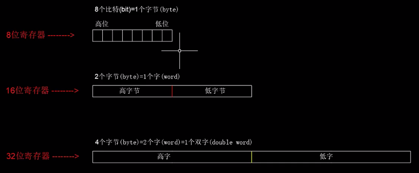
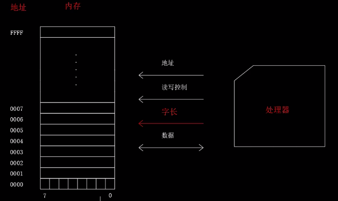
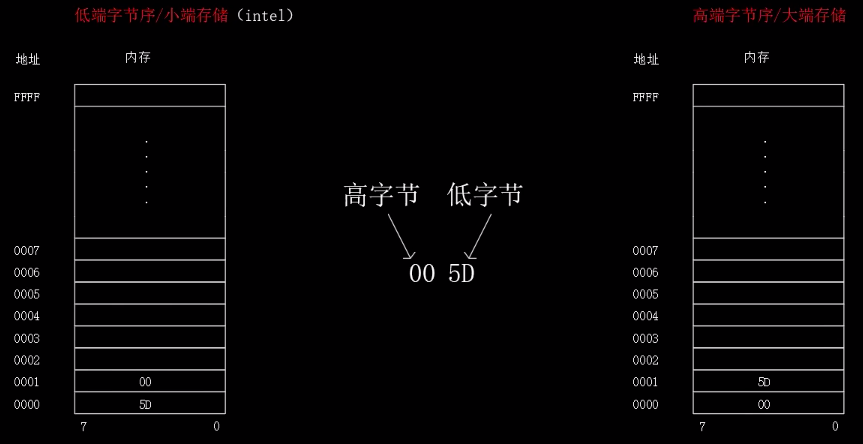
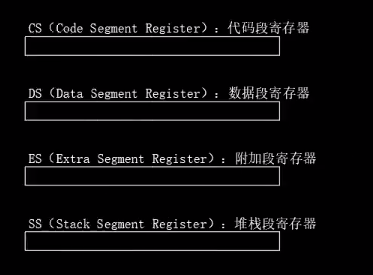
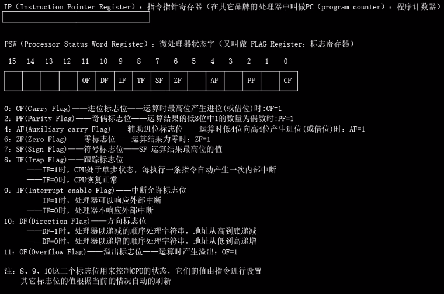

[TOC]

## 汇编基础

-   汇编的诞生

    10111000 00111111 00000000 (**机器指令/二进制**) ---> B8 3F 00 (**十六进制**) ---> mov AX, 3F (**汇编形式**) 含义: 将 AX 寄存器的值设置为 3F

    用比较容易理解的形式替换掉机器指令

-   编译器

    计算机只能识别机器指令/机器语言, **编译**就是把汇编语言翻译为机器指令

-   寄存器, 内存

    

    内存是按照字节来组织数据的, 也就是说我们可以访问的最小单位是 1 字节, 即不论是读还是写最小也是按照一个字节来操作, 所以说**字节是内存最基本的存储单元**.

    

    内存中每个字节的中的位也是有高低之分的

    通过精心的设计我们可以**单次访问**内存中的一个字节, 一个字, 一个双字或者一个四字, 分别对应了 8 位,16 位,32 位,64 位, 上图中的`字长`就是来控制单次访问的数据长度的

-   字节序

    

    存储 `00 5D` 先存储 5D 后存储 00, 即**先存低位后存高位就是低端字节序/小端存储**. 如果先存储 00 后存储 5D, 也就是**先存高位后存低位就是高端字节序/大端存储**. Intel 采用的是小端存储.

-   8086 的寄存器

    一共有 14 个寄存器, 可以分为 3 部分:

    **8 个通用寄存器**:

    

    -   又可以分为 3 类寄存器:

        1. 数据寄存器 AX BX CX DX 都可以拆分为两个 8 位的寄存器来使用, 如 AX 就可以拆分为 AH AL(H height L low)
        2. 变址寄存器 SI DI
        3. 指针寄存器 BP SP

    **4 个段寄存器**: CS DS ES SS

    

    **2 个控制寄存器**: IP PSW

    

-   指令的加载
