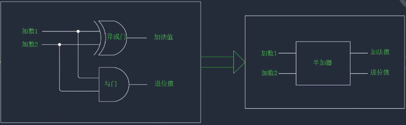

[TOC]

# 自制计算机

## 电报机与继电器

电报机就是通过继电器实现的, 继电器有初始开和初始关两种

略

## 布尔代数

布尔值, 通俗来说就是来表示两种对立的状态

比较常用的布尔值: `true/false` `1/0` `yes/no` `on/off`

运算符:

-   AND ^ 或 ·
-   OR ∨ 或 +
-   NOT ¬ 或 ~ 或 '

常量: 是固定的, 要么是 0 要么是 1

变量: 值不固定, 用 x, y, z 来表示

表达式: 运算符与常量/变量的组合, 例如: x + 0 \* 1

函数:

-   本质: 有一个或多个变量的表达式
-   表示:

    -   真值表: 把变量有可能会出现的任何组合及其对应的结果列出来做成一个表, 这就是真值表, 如下表就可以是一个真值表

        | 变量                              | 结果 |
        | --------------------------------- | ---- |
        | x &nbsp;&nbsp;&nbsp;&nbsp;&nbsp;y | F    |
        | 0 &nbsp;&nbsp;&nbsp;&nbsp;&nbsp;0 | 1    |
        | 0 &nbsp;&nbsp;&nbsp;&nbsp;&nbsp;1 | 0    |
        | 1 &nbsp;&nbsp;&nbsp;&nbsp;&nbsp;0 | 1    |
        | 1 &nbsp;&nbsp;&nbsp;&nbsp;&nbsp;1 | 1    |

*   表达式:

    -   真值表 --> 表达式:

        1. 找出输出为 1 的行
        2. 将值为 0 的输入进行 NOT 运算, 然后将本行所有输入进行 AND 运算, 得到小表达式
        3. 将所有的小表达式进行或运算

        经过上述步骤后得到的表达式为: `x' · y' + x · y' + x · y`

    -   无论多复杂的函数, 转换方式都是一样的
    -   **结论:** 所有的布尔函数都可以通过与或非这三种运算构成

有两个变量的函数

<table>
    <tr>
        <th rowspan="2">Function</th><th>x</th><th>0</th><th>0</th><th>1</th><th>1</th>
    </tr>
    <tr>
        <th>y</th><th>0</th><th>1</th><th>0</th><th>1</th>
    </tr>
    <tr>
        <td>Constant 0</td><td>0</td><td>0</td><td>0</td><td>0</td><td>0</td>
    </tr>
    <tr>
        <td>And</td><td>x · y</td><td>0</td><td>0</td><td>0</td><td>1</td>
    </tr>
    <tr>
        <td>x And Not y</td><td>x · y'</td><td>0</td><td>0</td><td>1</td><td>0</td>
    </tr>
    <tr>
        <td>x</td><td>0</td><td>0</td><td>0</td><td>1</td><td>1</td>
    </tr>
    <tr>
        <td>Not x And y</td><td>x' · y</td><td>0</td><td>1</td><td>0</td><td>0</td>
    </tr>
    <tr>
        <td>y</td><td>y</td><td>0</td><td>y</td><td>0</td><td>y</td>
    </tr>
    <tr>
        <td>Xor</td><td>x · y' + x' · y</td><td>0</td><td>1</td><td>1</td><td>0</td>
    </tr>
    <tr>
        <td>Or</td><td>x + y</td><td>0</td><td>1</td><td>1</td><td>1</td>
    </tr>
    <tr>
        <td>Nor</td><td>(x + y)'</td><td>1</td><td>0</td><td>0</td><td>0</td>
    </tr>
    <tr>
        <td>Equivalence</td><td>x · y + x' · y'</td><td>1</td><td>0</td><td>0</td><td>1</td>
    </tr>
    <tr>
        <td>Not y</td><td>y'</td><td>1</td><td>0</td><td>1</td><td>0</td>
    </tr>
    <tr>
        <td>If y then x</td><td>x + y'</td><td>1</td><td>0</td><td>1</td><td>1</td>
    </tr>
    <tr>
        <td>Not x</td><td>x'</td><td>1</td><td>1</td><td>0</td><td>0</td>
    </tr>
    <tr>
        <td>If x then y</td><td>x' + y</td><td>1</td><td>1</td><td>0</td><td>1</td>
    </tr>
    <tr>
        <td>Nand</td><td>(x · y)'</td><td>1</td><td>1</td><td>1</td><td>0</td>
    </tr>
    <tr>
        <td>Constant 1</td><td>1</td><td>1</td><td>1</td><td>1</td><td>1</td>
    </tr>
</table>

`Nand` 函数可以替代 OR AND NOT, 或者说`Nand`运算的组合可以代替 OR AND NOT 运算

例如: x + y = (x Nand x) Nand (y Nand y)

**结论 :** 所有的布尔函数都可以通过 Nand 函数构成

## 逻辑门 与 加法器

又叫做门电路或者布尔门, 逻辑门的本质就是会做逻辑运算的电路

如: 一个用两个开关控制的串联电路

| 开关 1 | 开关 2 | 灯泡 |
| ------ | ------ | ---- |
| 断开   | 断开   | 灭   |
| 断开   | 闭合   | 灭   |
| 闭合   | 断开   | 灭   |
| 闭合   | 闭合   | 亮   |

就可以抽象为 :

| 输入 | 输出 | 输出 |
| ---- | ---- | ---- |
| 0    | 0    | 0    |
| 0    | 1    | 0    |
| 1    | 0    | 0    |
| 1    | 1    | 1    |

上面的表格和`与`运算的结果一直, 相同的我们可以用一个并联电路来表示 `或`, 用其他的电路来表示 `非` `Nand` 等等 ...

下面的加法计算

```
        1 0 0 1 0 1
    +   0 0 1 1 0 1
    =   1 1 0 0 1 0
```

第 1 位: 1+1=0, 进 1
第 2 位: 1+0=1
第 3 位: 1+1=0, 进 1
第 4 位: 0+1+1=0, 进 1
第 5 位: 0+0+1=1
第 6 位: 1+0=1

加法值分析表:

| 加数 1 | 加数 2 | 结果 |
| ------ | ------ | ---- |
| 0      | 0      | 0    |
| 1      | 0      | 1    |
| 0      | 1      | 0    |
| 1      | 1      | 1    |

进位值分析表:

| 加数 1 | 加数 2 | 结果 |
| ------ | ------ | ---- |
| 0      | 0      | 0    |
| 1      | 0      | 0    |
| 0      | 1      | 0    |
| 1      | 1      | 1    |

观察加法值分析表和进位值分析表, 可以发现加法值和 `异或` 运算真值表相同, 进位值分析表和 `与` 运算真值表相同, 就是说输入两个加数并且输出一个加法值和一个进位值就可以用如下的电路表示出来, 由于这只进行了两个数相加没有考虑进位的情况, 也就是说只进行了"一半"加法运算, 所以被称为**半加器**



如果考虑进位值的情况就是一个完整的加法过程, 如下, 就是**全加器**


如下就是一个可以进行 8 位运算的**加法器**, 由 8 个全加器组成, 每个全加器负责一位的运算


对上图进行封装就得到了一个 8 为加法器, 如果在所有的输入端装上开关, 在所有的输出端加数灯泡那么我们就可以通过电路开关的通断来控制输入, 灯泡的亮灭来计算出结果


这样我们就实现了从逻辑运算到加法, 但是这样的电路会有很大的缺陷:

只有第一个全加器将进位值计算出来并传到第二个全加器中, 第二个全加器才开始工作, 也就是说, 在这样的电路中全加器并不是同时工作的, 所以加法器的速度取决于计算的位数和每个全加器的速度, 这种计算方法就叫做**脉冲进位**

现代计算机已经不再使用脉冲进位, 而使用的是**前置进位**, 并且也使用晶体管来替代继电器, 但是也是由基本的逻辑门组成的, 原理相同
