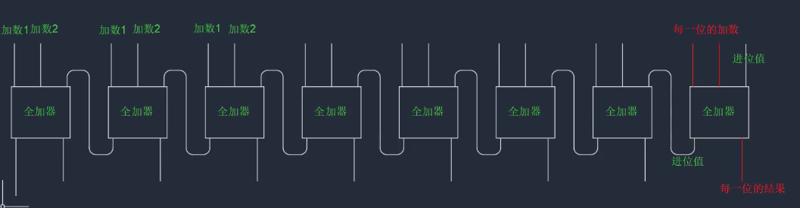
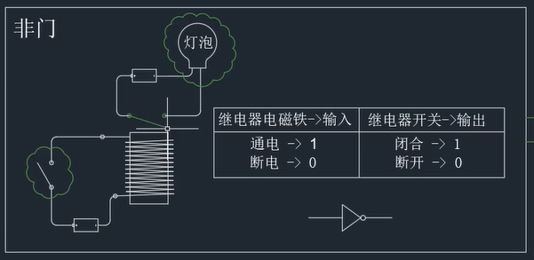

[TOC]

# 自制计算机

P.S

自制计算机的参考图: https://github.com/Mao-PC/Notes/tree/master/Base/%E8%AE%A1%E7%AE%97%E6%9C%BA%E7%BB%84%E6%88%90%E5%8E%9F%E7%90%86/%E5%8F%82%E8%80%83

可以下载这个链接下的 `配图.pdf` 文件

## 电报机与继电器

电报机就是通过继电器实现的, 继电器有初始开和初始关两种

略

## 布尔代数

布尔值, 通俗来说就是来表示两种对立的状态

比较常用的布尔值: `true/false` `1/0` `yes/no` `on/off`

运算符:

-   AND ^ 或 ·
-   OR ∨ 或 +
-   NOT ¬ 或 ~ 或 '

常量: 是固定的, 要么是 0 要么是 1

变量: 值不固定, 用 x, y, z 来表示

表达式: 运算符与常量/变量的组合, 例如: x + 0 \* 1

函数:

-   本质: 有一个或多个变量的表达式
-   表示:

    -   真值表: 把变量有可能会出现的任何组合及其对应的结果列出来做成一个表, 这就是真值表, 如下表就可以是一个真值表

        | 变量                              | 结果 |
        | --------------------------------- | ---- |
        | x &nbsp;&nbsp;&nbsp;&nbsp;&nbsp;y | F    |
        | 0 &nbsp;&nbsp;&nbsp;&nbsp;&nbsp;0 | 1    |
        | 0 &nbsp;&nbsp;&nbsp;&nbsp;&nbsp;1 | 0    |
        | 1 &nbsp;&nbsp;&nbsp;&nbsp;&nbsp;0 | 1    |
        | 1 &nbsp;&nbsp;&nbsp;&nbsp;&nbsp;1 | 1    |

*   表达式:

    -   真值表 --> 表达式:

        1. 找出输出为 1 的行
        2. 将值为 0 的输入进行 NOT 运算, 然后将本行所有输入进行 AND 运算, 得到小表达式
        3. 将所有的小表达式进行或运算

        经过上述步骤后得到的表达式为: `x' · y' + x · y' + x · y`

    -   无论多复杂的函数, 转换方式都是一样的
    -   **结论:** 所有的布尔函数都可以通过与或非这三种运算构成

有两个变量的函数

<table>
    <tr>
        <th rowspan="2">Function</th><th>x</th><th>0</th><th>0</th><th>1</th><th>1</th>
    </tr>
    <tr>
        <th>y</th><th>0</th><th>1</th><th>0</th><th>1</th>
    </tr>
    <tr>
        <td>Constant 0</td><td>0</td><td>0</td><td>0</td><td>0</td><td>0</td>
    </tr>
    <tr>
        <td>And</td><td>x · y</td><td>0</td><td>0</td><td>0</td><td>1</td>
    </tr>
    <tr>
        <td>x And Not y</td><td>x · y'</td><td>0</td><td>0</td><td>1</td><td>0</td>
    </tr>
    <tr>
        <td>x</td><td>0</td><td>0</td><td>0</td><td>1</td><td>1</td>
    </tr>
    <tr>
        <td>Not x And y</td><td>x' · y</td><td>0</td><td>1</td><td>0</td><td>0</td>
    </tr>
    <tr>
        <td>y</td><td>y</td><td>0</td><td>y</td><td>0</td><td>y</td>
    </tr>
    <tr>
        <td>Xor</td><td>x · y' + x' · y</td><td>0</td><td>1</td><td>1</td><td>0</td>
    </tr>
    <tr>
        <td>Or</td><td>x + y</td><td>0</td><td>1</td><td>1</td><td>1</td>
    </tr>
    <tr>
        <td>Nor</td><td>(x + y)'</td><td>1</td><td>0</td><td>0</td><td>0</td>
    </tr>
    <tr>
        <td>Equivalence</td><td>x · y + x' · y'</td><td>1</td><td>0</td><td>0</td><td>1</td>
    </tr>
    <tr>
        <td>Not y</td><td>y'</td><td>1</td><td>0</td><td>1</td><td>0</td>
    </tr>
    <tr>
        <td>If y then x</td><td>x + y'</td><td>1</td><td>0</td><td>1</td><td>1</td>
    </tr>
    <tr>
        <td>Not x</td><td>x'</td><td>1</td><td>1</td><td>0</td><td>0</td>
    </tr>
    <tr>
        <td>If x then y</td><td>x' + y</td><td>1</td><td>1</td><td>0</td><td>1</td>
    </tr>
    <tr>
        <td>Nand</td><td>(x · y)'</td><td>1</td><td>1</td><td>1</td><td>0</td>
    </tr>
    <tr>
        <td>Constant 1</td><td>1</td><td>1</td><td>1</td><td>1</td><td>1</td>
    </tr>
</table>

`Nand` 函数可以替代 OR AND NOT, 或者说`Nand`运算的组合可以代替 OR AND NOT 运算

例如: x + y = (x Nand x) Nand (y Nand y)

**结论 :** 所有的布尔函数都可以通过 Nand 函数构成

## 逻辑门 与 加法器

又叫做门电路或者布尔门, 逻辑门的本质就是会做逻辑运算的电路

如: 一个用两个开关控制的串联电路

| 开关 1 | 开关 2 | 灯泡 |
| ------ | ------ | ---- |
| 断开   | 断开   | 灭   |
| 断开   | 闭合   | 灭   |
| 闭合   | 断开   | 灭   |
| 闭合   | 闭合   | 亮   |

就可以抽象为 :

| 输入 | 输出 | 输出 |
| ---- | ---- | ---- |
| 0    | 0    | 0    |
| 0    | 1    | 0    |
| 1    | 0    | 0    |
| 1    | 1    | 1    |

上面的表格和`与`运算的结果一直, 相同的我们可以用一个并联电路来表示 `或`, 用其他的电路来表示 `非` `Nand` 等等 ...

下面的加法计算

```
        1 0 0 1 0 1
    +   0 0 1 1 0 1
    =   1 1 0 0 1 0
```

第 1 位: 1+1=0, 进 1
第 2 位: 1+0=1
第 3 位: 1+1=0, 进 1
第 4 位: 0+1+1=0, 进 1
第 5 位: 0+0+1=1
第 6 位: 1+0=1

加法值分析表:

| 加数 1 | 加数 2 | 结果 |
| ------ | ------ | ---- |
| 0      | 0      | 0    |
| 1      | 0      | 1    |
| 0      | 1      | 0    |
| 1      | 1      | 1    |

进位值分析表:

| 加数 1 | 加数 2 | 结果 |
| ------ | ------ | ---- |
| 0      | 0      | 0    |
| 1      | 0      | 0    |
| 0      | 1      | 0    |
| 1      | 1      | 1    |

观察加法值分析表和进位值分析表, 可以发现加法值和 `异或` 运算真值表相同, 进位值分析表和 `与` 运算真值表相同, 就是说输入两个加数并且输出一个加法值和一个进位值就可以用如下的电路表示出来, 由于这只进行了两个数相加没有考虑进位的情况, 也就是说只进行了"一半"加法运算, 所以被称为**半加器**


如果考虑进位值的情况就是一个完整的加法过程, 如下, 就是**全加器**


如下就是一个可以进行 8 位运算的**加法器**, 由 8 个全加器组成, 每个全加器负责一位的运算



对上图进行封装就得到了一个 8 为加法器, 如果在所有的输入端装上开关, 在所有的输出端加数灯泡那么我们就可以通过电路开关的通断来控制输入, 灯泡的亮灭来计算出结果


这样我们就实现了从逻辑运算到加法, 但是这样的电路会有很大的缺陷:

只有第一个全加器将进位值计算出来并传到第二个全加器中, 第二个全加器才开始工作, 也就是说, 在这样的电路中全加器并不是同时工作的, 所以加法器的速度取决于计算的位数和每个全加器的速度, 这种计算方法就叫做**脉冲进位**

现代计算机已经不再使用脉冲进位, 而使用的是**前置进位**, 并且也使用晶体管来替代继电器, 但是也是由基本的逻辑门组成的, 原理相同

## 反馈与振荡器



用非门组成如下电路


可以看出, 这个电路会周期性的交替输出 0 1 0 1 ..

振荡器显示的波形是方形的, 所以也被称为**方波**, 因为跳动的很有规律就像脉搏一下也叫做**脉冲**

如果 1 秒产生了 10 个脉冲, 那么频率就是 10Hz, 周期就是 0.1 s

在老式的钟表里就是使用了 频率为 1Hz 周期为 1s 的振荡器, 每秒产生一个脉冲秒针就前进一格. 因此这种震荡脉冲也被称为时钟信号或者时钟脉冲

## D 型触发器与边沿触发

或非门 `Nor (x + y)'`


将两个或非门连接起来


上图中可以看出:

-   **输入 1,0 会输出 1**, 这时把输入改为 0,0 但是仍然会输出 1
-   **输入 0,1 会输出 0**, 这时把输入改为 0,0 仍然输出 0
-   **当输入为 0,0 时, 会保存上次的输出结果**

对于输入 1,1 的情况先不用讨论, 如果这时把把输入做成开关, 输出端装上灯泡, 就会发现一个神奇的现象:

-   上面的开关接通, 下面的开关断开, 灯泡会亮; 这时将上面的开关断开, 灯泡仍然会发光

两个或非门电路真值表

| 输入 1 | 输入 2 | 输出           |
| ------ | ------ | -------------- |
| 1      | 0      | 1              |
| 0      | 1      | 0              |
| 0      | 0      | 保持上次的输出 |
| 1      | 1      | 不讨论         |

现在改造两个或非门电路, 增加输入 3 并入输入 1 和输入 2 进行与运算


-   输入 3 为 1, 电路的运行结果取决于输入 1 和输入 2
-   输入 3 为 0, 电路的运行结果会维持上次的输出结果

所以说输入 3 是很关键的, 它决定了是更改数据还是保持数据

这个电路成立的前提是输入 1 和输入 2 不能同时为 1, 做如下


这样就完成了一个**D 型触发器**, 因为是用来控制 1 位存储的, 所以也叫做**1 位存储器**, 真值表如下

| 数据端(输入 1) | 触发端(输入 3) | 存储端       |
| -------------- | -------------- | ------------ |
| 1              | 1              | 1            |
| 0              | 1              | 0            |
| 1              | 0              | 保持数据不变 |
| 0              | 0              | 保持数据不变 |


对电路做如下改动:


-   当触发端为 0 时, 经过非门后为 1, 第一个 D 型触发器就处于被触发的状态, 数据端的值就可以到达第一个 D 型触发器的输出端, 也就是第二个触发器的数据端, 第二个 D 型触发器的触发端为 0, 所以数据是无法到达存储端的, 第二个 D 型触发器输出的值还是原来的值

-   当触发端为 1 时, 经过非门后为 0, 第一个 D 型触发器数据端的值就不可以到达第一个 D 型触发器的输出端, 也就是第二个触发器的数据端, 第二个 D 型触发器的触发端为 1, 所以数据是能到达存储端的, 还是原来的值

-   当触发端的值从 0 变成 1 时, 触发了第二个 D 型触发器, 第一个 D 型触发器数据库的结果作为数据端值发送给了第二个 D 型触发器, 这个值就会到达存储端


也就是说这个电路在触发端从 0 变成 1 的时候触发并保存数据, 因此也被称为**边沿 D 型触发器**, 严格的来说是**上升沿 D 型触发器**

下图为**下降沿 D 型触发器**, 和上升沿 D 型触发器相比就是把非门的位置做了修改


## RAM 存储器

存储器本质上就是一个容器, 用于存储数据:

-   对于容器我们一般都是有两个操作: 装入(写)/取出(读)
-   容器只有一个入口, 无论是装入还是取出, 都从一个口进出
-   对容器的装入和取出操作不能同时进行

会发现 D 型触发器从数据端写入, 存储端读出, 是不符合要求的. 而且我们只能控制数据端的写入, 存储端的存储是自动进行, 所以我们需要对这个 1 位存储器进行改造, 如下图


在原来 D 型触发器的基础上

-   触发端为**W**, 在闭合的情况下就开始写入数据
-   数据端为**D**, 负责读写数据
-   存储端为**R**, 控制一个继电器, 能控制是否读取读取数据

数据完成一次读写的过程为:

1. W=0 R=0, 不进行读写
2. W=1 R=0 时, 数据会保存到 1 位存储器中, 继电器断开, D 不能读取数据
3. W=0 R=0
4. W=0 R=1, 不会向 1 位存储器中写入, 继电器闭合, 只能进行数据读取

整个过程中不会出现 W=1 R=1 的情况

将 8 个 1 位存储器连起来就组成了一个 8 位存储器, 只能同时对这个 8 位存储器来读写


如果需要更大的存储器, 可以以 8 位存储器为单位来组成, 需要的容量越大, 就连接更多的 8 位存储器, 如下图为一个 32 位的存储器


32 位存储器, 由 4 个 8 位存储器组成, 共**4 层**, 每次只能读写 8 位数据, 也就是说**每次只能对一层数据进行操作**, 对某层的数据进行读写的时候其他的楼层必须保持为默认状态(W=0, R=0), 否则会造成数据冲突

### 优化

-   但是这样组成的存储器是有缺陷的, 每次进行读写操作时, 都需要对对应层的 WR 进行操作, 32 位的存储器只需要对 4 个 WR 进行操作, 如果是 8G 的存储器呢, 工作量太大了, 必须进行优化

    

    地址译码器就是来解决楼层的地址问题的, 具体方法是:

    1. 最高楼层转为 2 进制, 图中为 32 位存储器, 最高为 3 层, 3 = 11, 长度为 2
    2. 需要最高楼层长度个数个开关, 如图就需要 2 个开关: A0 A1
    3. 每个开关打开为 0, 闭合为 1, 这样就可以表示 0 ~ 3 的(00 ~ 11)所有地址

    如: A0 = 1, A1 =1, W = 0, R = 1, 就代码读取第 3 层数据

    假设译码器有 A0~A1 共计 32 个开关, 就能控制 2^32 层, 大约为 42 亿层

    **译码器搭建思路**

    **需求:** 在 A0,A1,W 都等于 0, R 等于 1 的时候, r 的值才等于 1 而在其他的任何情况 r 的值都等于 0

    真值表

      <table>
          <tr><th colspan="4">输入</th><th>输出</th></tr>
          <tr><td>A0</td><td>A1</td><td>W</td><td>R</td><td>r</td></tr>
          <tr><td>0</td><td>0</td><td>0</td><td>0</td><td>1</td></tr>
          <tr><td colspan="4">其他输入组合</td><td>0</td></tr>
      </table>

    表达式: `A0' · A1' · W' · R`

    逻辑电路

    

    多个叠加就可以控制每层电路

    

    经过封装后就是地址译码器

-   每层执行操作后, 都要把 W 和 R 重置为 0 才能保持操作正确执行, 可以把 D 型触发器(1 位存储器)替换为边沿 D 型触发器, 这样就不需要每次操作把 WR 重置为 0, 因为边沿 D 型触发器每次都会自动重置

## 寄存器


8 位寄存器就是由 8 个 D 型触发器的触发端连接起来的, D0~D7 为数据端, Q0~Q7 为存储端. 这样这 8 个触发器就被连接到一起组成了一个同时读写

这就是最普通也是最常用的一种寄存器


如果使用边沿触发的 D 型触发器来搭建寄存器的话, 多个连接起来就是下图这样


在每个数据端 D 和存储端 Q 连接处连接上一个灯泡 💡,假设第一个触发器的输出端是 1, 其他触发器的输出端都是 0, 即第一个灯泡是亮的 其他的都是灭的, 触发端 CP 每次触发 1 就会向后传递到写一个边沿 D 型触发器, 也就是下一个灯泡就会亮起, 这样一直触发 CP 就会变成一个跑马灯

在触发端再加一个非门改造为一个振荡器就可以使 CP 自动触发, 封装后就是下图


使用边沿触发的好处就可以很好的控制, 单使用 D 型触发器来构建寄存器是不可控制的
