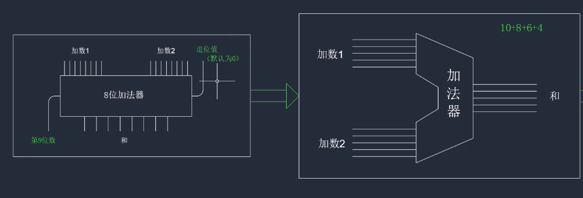
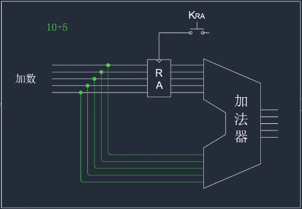
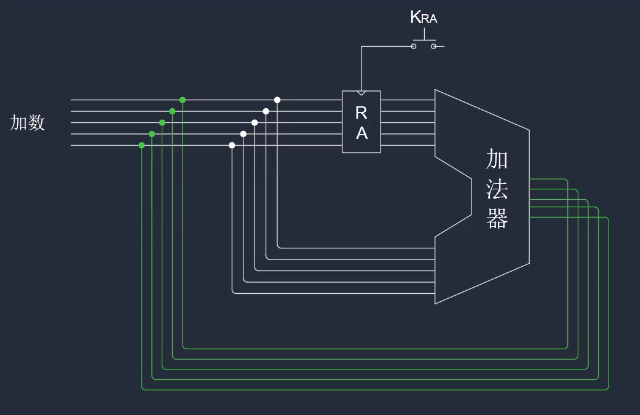
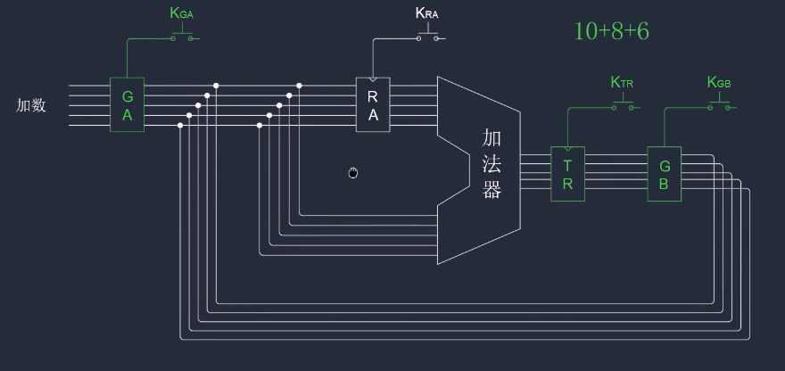
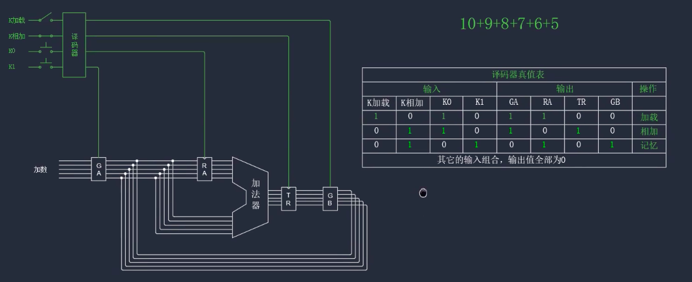
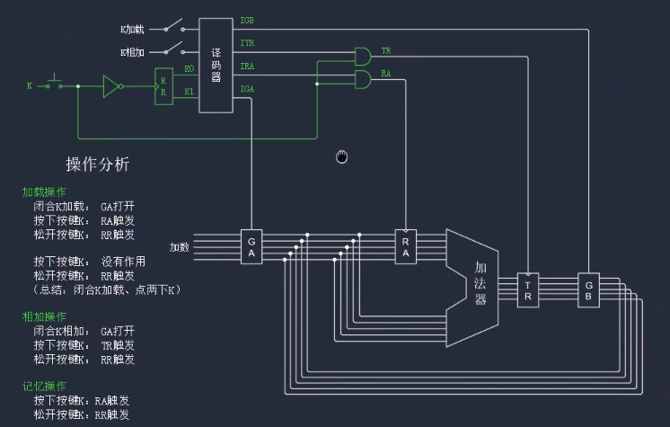

# 自制计算机 2

## 连续的加法

加法器可以通过封装后得到

加法器有很明显的缺点: 如果是多个数字进行相加, 如 `10 + 8 + 6`, 应该如何进行呢?

加数 1 输入 10 , 加数 2 输入 8, 得到结果为 18, 在加数 1 输入 18 ,加数 2 输入 6, 得到加过 24. **能不能让加法器自己记住中间的结果(18)并自动参与和下一个加数的运算呢?**

首先, 我们对加法器进行改造,如下

把两个加数合并为一个输入端, 并在加数输入端增加一个边边沿触发器 RA, 触发端为 KRA

在计算 `10 + 5` 时:

1. 输入端输入第一个加数 10, 10 会到达 RA 和 加法器下端的输入端
2. 按下 KRA, RA 会存储并输出 10, 到达加法器的上端, 此时加法器会输出 20
3. 输入第二个加数 5, 会到达 RA 和 加法器下端的输入端, 不触发 RA, 此时加法器的上面的输入端为 10, 下面为 5, 会输入结果 15

这样我们就已经得到了一个只需要一个输入端的电路.

然后我们在此基础上改造电路如下:

将加法器的输出端连接到输入端上, 这样就可以使输出结果自动成为下一次的输入参数, 但是这样做有很明显的弊端: **输出结果和原始加法器的下端的输入端成为一个闭环**, 如果使用这个电路进行运算会出现的现象:

输入加数 10, 并按下 KRA, 加法器的上端为 10 , 下端为 10, 输出 20, 然后 20 作为第二个加数输入到了加法器下端, 此时加法器上端为 10, 下端为 20, 会输出 30, 然后 30 会作为第三个参数输入 ...

所以结果作为参数输入的过程需要被控制, 对电路进行如下改造:

图中的 GA 和 GB 是一组继电器, 并且在 GA 闭合时 GB 打开, GB 闭合时 GA 打开. TR 是一个边沿触发器

在计算 `10 + 8 + 6` 的步骤:

1. 输入端输入第一个加数 10, **按住 KGA不放**. 10 达到了 RA 和加法器下端
2. 触发 KRA, RA 存储并输出 10, 此时加法器输出 20, 由于 KTR没有触发, 所以 20 并没有向后输出
3. 输入第二个参数 8, 8 达到了 RA 和加法器下端, 此时加法器上面的输入端为 10, 下面的输入端为 8 ,输出 为 18.
4. 触发 KTR, TR 保存并输出了 18
5. **按住 KGB不放**, TR 输出的 18 会作为下一个加数到达 RA 和加法器下端, 此时加法器上面的输入端为 10 ,下面为 18 ,输出为 28, 但是 KTR没有触发, 所以 28 并没有向后输出
6. 触发 KRA, RA 保存并输出了 18, 此时加法器上面的输入端为 18 ,下面为 18 ,输出为 36, 但是 KTR没有触发, 所以 36 并没有向后输出
7. 输入端输入第三个加数 6, **按住 KGA不放** 6 达到了 RA 和加法器下端, 此时加法器上面的输入端为 18, 下面的输入端为 6 ,输出 为 24.
8. 触发 KTR, TR 保存并输出了 24, 运算完成

以上步骤可以总结为:

-   1: 加载, 输入第一个加数(KGA - KRA)
-   2: 相加, 输入下一个加数, 然后和上一个加数相加, 并将结果存储起来(KGA - KTR)
-   3: 记忆, 将终结结果保存到加法器上面的输入端, 以备下次的运算(KGB - KRA)

2 个加数: 1-2
3 个加数: 1-2-3-2
4 个加数: 1-2-3-2-3-2

多输入一个加数就要多进行一次 3-2

## 简化操作

连续的加法在每次输入加数的时候触发操作太多, 需要优化

现在在连续的加法基础上进行如下改造

在原型的电路中加入译码器

通过译码器真值表发现, 如果是多个数相加, 第一步加载完成后, 相加和记忆这两步值需要改变 K0 和 K1 这这个值就可以完成

## 先后问题

优化完成电路后, 还有问题, **加载**步骤进行时, 必须是要先闭合 KGA, 然后再触发 KRA, 如果同时闭合的话就会造成数据不能够存到 RA 里

因为加法操作中大部分都是在不断的触发 K0 和 K1, 而这些操作就是 1 在 K0 和 K1 直接不停的循环. RR 是一个循环移位寄存器(上升沿)来代替 K0 和 K1 来给译码器输入, 并且在初始状态下 K0 = 1, K1 = 0, 闭合一次 K(触发一次 RR), 它们的值就会交换

加法步骤:

-   输入第一个加数
-   **闭合 `K加载`**, 由于 K0=1, 所以 IGA=1, IRA=1
    -   传输门 GA 打开,数据被传送到了 RA
    -   但是 RA 没有触发, 因为 IRA 要和 K 的另一路输出进行与运算
    -   只闭合了`K加载`, GA 就被打开了
-   K 键:

    -   **按下 K 键**, 会产生两路脉冲
        -   第一路通过非门到达循环位移寄存器, 但是将上升沿变为下降沿, 所以循环位移寄存器并没有触发, 译码器会保持原来输出
        -   第二路到达与 IRA 连接的与门, RA 从 0 变成 1, 产生一个上升沿, 寄存器 RA 被触发, 第一个加数就存到了 RA 中
    -   **松开 K 键**, 会产生一个下降沿, 非门将下降沿变为上升沿, RR 被触发, K0=0, K1=1,这时译码器所有的输出都为 0

我们**通过闭合`K加载`来打开传输门, 按下 K 键来出发寄存器**, 这样就解决了先后问题

尽管现在我们已经解决了加载操作, 但是还需要**再按**一次 K 键:

-   按下的时候

    -   第一路不会触发 RR 寄存器.
    -   第二路输出, 因为译码器输出的全都是 0, 所以也不会触发任何一个寄存器

    也就是说, 在按下的时候不会产生任何作用

-   松开的时候, 会触发 RR, 使得 K0=1. K1=0

这也是我们的目的所在, 是**RR 恢复到初始状态**, 因为下一步是要输入第二个加数进行相加:

-   输入第二个加数
-   断开**K 加载**, 闭合**K 相加**
    -   由于 K0= 1, 所以 IGA=1, ITR=1
    -   传输门 GA 打开, 数据进入加法器并和第一个加数进行相加, 并且结果输入到了 TR 门口, 但是 TR 没有触发, 因为 ITR 还需要和按键 K 的另一路输出进行与运算
-   K 键
    -   **按下 K 键**
        -   因为非门存在, 所以 RR 没有触发
        -   但是 RA 被触发，因为按键 K 的第二路输出和 IRA 做与运算. 被触发后，RA 将中间结果存储在了加法器中
    -   **松开 K 键**
        -   RR 被触发，使得 K0=1、K1=0. RR 又重新回到了最初始的状态，为下一次相加操作做好了准备

综上, 我们现在步骤变成了:

-   闭合 K 加载, 点 2 下 K 键, 完成第一个加数的加载
-   断开 K 加载, 闭合 K 相加, 点 2 下 K 键, 完成第二个参数的相加和记忆

    点 2 下 K 键, 完成第三个参数

    ...

    点 2 下 K 键, 完成第 N 个参数的相加

-   最后一个加数相加为止, 最终的结果被存储到了 RA 中

改电路运行的特点:

1. 闭合 K 加载或 K 相加, 就会打开某一个传输门. 因为 K0 和 K1 的值不需要手动设置
2. 必须按下 K 按键，寄存器才会被触发. 因为，与寄存器相连的输出端要和 K 的输出进行与运算. 所以，不按下 K，寄存器是不会被触发的

现在，我们不但解决了先后的问题，而且进一步简化了操作.
因为，K0、K1 这两个开关被 K 这一个开关取代了.
之前，我们需要对 K0 和 K1 这两个开关进行操作.
而现在，我们的大部分操作基本上就变成了不断地输入加数，然后点击按键 K 就可以了
