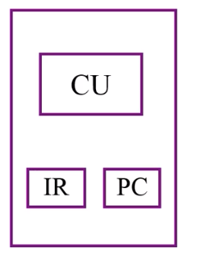
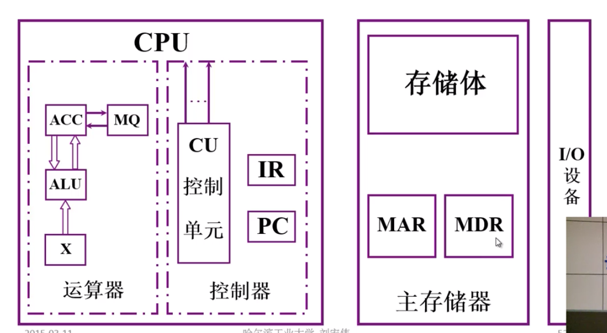

# 计算机的基本组成

## 冯诺依曼计算机的特点

-   计算机由五大部分组成 (运算器、控制器、存储器、输入设备、输出设备)
-   指令和数据是按照同等地位存于存储器, 可按地址访问
-   指令和数据都是使用二进制表示
-   指令由操作码和地址码组成
-   **存储程序** [核心特征]
-   以运算器为中心

## 计算机硬件框图

1. 冯诺依曼计算机硬件框图:

    

    以**运算器**为核心

    - 运算器: 算术运算, 逻辑运算
    - 存储器: 存放数据和程序
    - 控制器: 指挥控制程序的运行
    - 输入设备: 将信息转换为机器能识别的信息
    - 输出设备: 将信息转换成人们属性的形式

2. 以运算器为中心的计算机

    

    实际上就是为了将不需要运算的数据直接存储到存储器中，从而提升计算机性能

3. 现代计算机硬件框图

    
    

系统复杂性管理的方法-2 (3Y)

-   层次化(Hierachy): 将被设计的系统划分为多个模块或子模块
-   模块化(Modularity): 有明确定义(well-defined)的功能和接口
-   规则性(Regularity): 模块更容易被重用

## 存储器的基本组成

-   存储体:
    存储体 - 存储单元 - 存储元件 (0/1)
    大楼 - 放假 - 床位 (无人/有人)

    **存储单元** 存放二进制码
    **存储字** 存储单元中二进制代码的组合
    **存储字长** 存储单元中二进制代码位数, 每个存储单元赋予一个地址
    **按地址寻访**

-   MAR:
    存储器地址寄存器, 反映存储单元的个数
-   MDR:
    存储器数据寄存器, 反映存储字长

MAR = 4 位, MDR = 8 位: 存储单元个数为 16(4\*4), 存储字长为 8. 可以想象为一个长方体, 底面为边长为 4 的正方形, 高为 8 的.

## 运算器的基本组成及操作过程

|     | ACC                      | MQ                 | X      |
| --- | ------------------------ | ------------------ | ------ |
| +   | 被加数   和(运算结果) |                    | 加数   |
| -   | 被减数   差(运算结果) |                    | 减数   |
| \*  | 乘积高位                 | 乘数   乘积低位 | 被乘数 |
| \\  | 被除数   余数         | 商                 | 除数   |

这个可以暂时先不用记，因为后面的章节会有具体计算过程的讲解，理解原理后就好记了

## 控制器的基本结构

控制器的功能:

-   解释指令
-   保证指令的按需执行

完成一条指令的步骤:

1. 取指令 PC
   PC 存放当前预执行指令的地址, 具有技术功能 (PC) + 1 -> PC
2. 分析指令 IR
   IR 存放当前预执行的指令
3. 执行指令 CU

## 总结

综上, 计算机的组成为

一个取数指令的执行过程:

1. PC 将指令的地址送发给 MAR
2. MAR 将指令地址发给 存储体
3. 在控制器的控制下, 存储体把指定存储单元中保存的取数指令发给 MDR
4. MDR 将指令发送给 IR
5. IR 中指令的操作码部分发送给 CU (分析指令)
6. IR 中地址码发送给 MAR
7. MAR 将地址码发送给 存储体
8. 在控制器的控制下, 存储体把指定地址保存的数发给 MDR
9. 将数据发送给 ACC

存数指令 ACC -> 存储体

1 - 6 取指令的过程基本相同, 在第 3 步中取的是取数指令, 在第 6, 7 步中的地址是数据存放的地址

7. ACC 中的数据发送到 MDR
8. MDR 将数保持到 存储体 中

## 计算机硬件的主要指标

1. 机器字长
   CPU 一次能够处理数据的位数与 CPU 中**寄存器位数**有关
2. 运算速度
    - 主频
    - 核数, 每个核支持的线程数
    - 吉布森法
    - CPI 执行一条指令所需要的时钟周期数 越小越好, 最好一条指令只需要一个时钟周期就可以完成
      现在有可以多个指令同时执行的计算机, 可以使用 IPC 来衡量, 一个时钟周期可以运行多少指令
    - MIPS 每秒执行多少百万条指令
    - FLOPS 每秒完成浮点运算的次数
3. 存储容量
   存放二进制信息的总位数
    - 主存容量有 2 中表示方法:
        - 存储单元个数 \* 存储字长: MAR^2\*MDR
        - 字节数
    - 辅存容量 字节数
