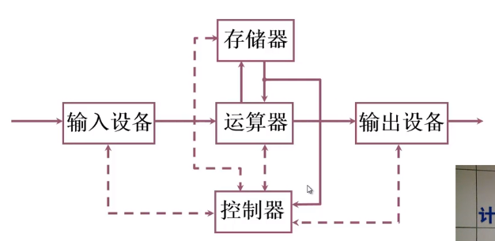
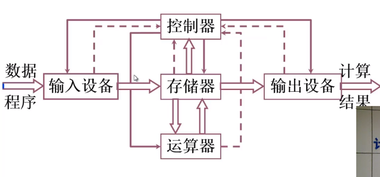
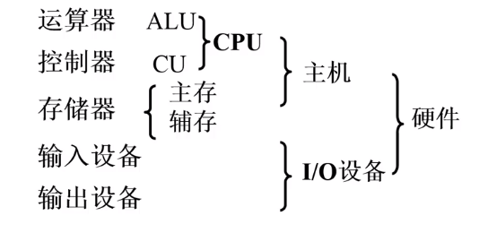
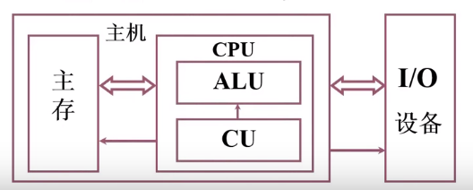
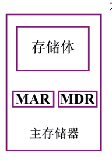
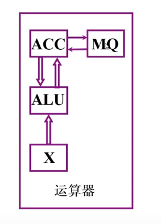

# 计算机的基本组成

## 冯诺依曼计算机的特点

- 计算机由五大部分组成 (运算器、控制器、存储器、输入设备、输出设备)
- 指令和数据是按照同等地位存于存储器, 可按地址访问
- 指令和数据都是使用二进制表示
- 指令由操作码和地址码组成
- **存储程序** [核心特征]
- 以运算器为中心

## 计算机硬件框图

1. 冯诺依曼计算机硬件框图:

   

   以**运算器**为核心

   - 运算器: 算术运算, 逻辑运算
   - 存储器: 存放数据和程序
   - 控制器: 指挥控制程序的运行
   - 输入设备: 将信息转换为机器能识别的信息
   - 输出设备: 将信息转换成人们属性的形式

2. 以运算器为中心的计算机

   

   实际上就是为了将不需要运算的数据直接存储到存储器中，从而提升计算机性能

3. 现代计算机硬件框图

   
   

系统复杂性管理的方法-2 (3Y)

- 层次化(Hierachy): 将被设计的系统划分为多个模块或子模块
- 模块化(Modularity): 有明确定义(well-defined)的功能和接口
- 规则性(Regularity): 模块更容易被重用

## 存储器的基本组成

- 存储体:
  存储体 - 存储单元 - 存储元件 (0/1)
  大楼 - 放假 - 床位 (无人/有人)

  **存储单元** 存放二进制码
  **存储字** 存储单元中二进制代码的组合
  **存储字长** 存储单元中二进制代码位数, 每个存储单元赋予一个地址
  **按地址寻访**

- MAR:
  存储器地址寄存器, 反映存储单元的个数
- MDR:
  存储器数据寄存器, 反映存储字长

MAR = 4 位, MDR = 8 位: 存储单元个数为 16(4\*4), 存储字长为 8. 可以想象为一个长方体, 底面为边长为 4 的正方形, 高为 8 的.

## 运算器的基本组成及操作过程

