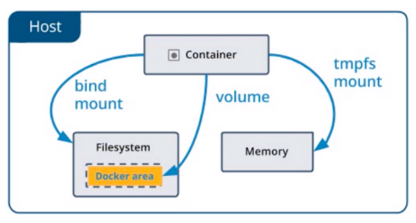

[TOC]

# docker

官网: https://www.docker.com

文档: https://docs.docker.com/

## 简介

Docker 是一个开源的引擎，可以轻松的为任何应用创建一个轻量级的、可移植的、自给自足的容器。开发者在笔记本上编译测试通过的容器可以批量地在生产环境中部署，包括 VMs（虚拟机）、 bare metal、OpenStack 集群和其他的基础应用平台。

Docker 通常用于如下场景：

-   web 应用的自动化打包和发布；
-   自动化测试和持续集成、发布；
-   在服务型环境中部署和调整数据库或其他的后台应用；
-   从头编译或者扩展现有的 OpenShift 或 Cloud Foundry 平台来搭建自己的 PaaS 环境。


传统虚拟机在虚拟出一套硬件后, 在其上运行一个完整操作系统, 在系统上再运行所需应用进程


而容器的应用进程之间运行与宿主内核, 容器内没有自己的内核, 而且也没有进行硬件虚拟, 因此会比传统虚拟机更为轻便

**Docker 架构**


Docker 使用的 C/S 架构模式, 使用远程 API 来使用和创建 Docker 容器

**Docker 的核心概念**

-   **镜像 (Image)**
    操作系统分为内核和用户空间. 对于 Linux 而言, 内核启动后悔挂载 root 文件系统为其用户空间支持. 而 Docker 镜像, 就相当于是一个 root 文件系统. 比如官方镜像 centos 7.6 就包含了一套完整的 centos 7.6 最小系统的 root 文件系统

    Docker 镜像是一个特殊的文件系统, 除了提供容器运行时所需要的程序, 库, 资源, 配置等文件外, 还包含了一些为运行时准备的一些配置参数 (如匿名卷, 环境变量, 用户等). 镜像不包含任何动态数据, 其内容在构建之后也不会被改变

    镜像构建时，会一层层构建，前一层是后一层的基础。每一层构建完就不会再发生改变，后一层上的任何改变只发生在自己这一层。  比如，删除前一层文件的操作，实际不是真的删除前一层的文件，而是仅在当前层标记为该文件已删除。在最终容器运行的时候，虽然不会看到这个文件，但是实际上该文件会一直跟随镜像。因此，在构建镜像的时候，需要额外小心，每一层尽量只包含该层需要添加的东西，任何额外的东西应该在该层构建结束前清理掉。

    分层存储的特征还使得镜像的复用、定制变的更为容易。甚至可以用之前构建好的镜像作为基础层，然后进一步添加新的层，以定制自己所需的内容，构建新的镜像。

-   **容器 (Container)**
    镜像（Image）和容器（Container）的关系，就像是面向对象程序设计中的 类 和 实例 一样，镜像是静态的定义，容器是镜像运行时的实体。容器可以被创建、启动、停止、删除、暂停等 。

    容器的实质是进程，但与直接在宿主执行的进程不同，容器进程运行于属于自己的独立的 命名空间。前面讲过镜像使用的是分层存储，容器也是如此。

    容器存储层的生存周期和容器一样，容器消亡时，容器存储层也随之消亡。因此，任何保存于容器存储层的信息都会随容器删除而丢失。

    按照 Docker 最佳实践的要求，容器不应该向其存储层内写入任何数据 ，容器存储层要保持无状态化。所有的文件写入操作，都应该使用数据卷（Volume）、或者绑定宿主目录，在这些位置的读写会跳过容器存储层，直接对宿主(或网络存储)发生读写，其性能和稳定性更高。数据卷的生存周期独立于容器，容器消亡，数据卷不会消亡。因此， 使用数据卷后，容器可以随意删除、重新 run ，数据却不会丢失。

-   **仓库 (Repository)**

    镜像构建完成后，可以很容易的在当前宿主上运行，但是， 如果需要在其它服务器上使用这个镜像，我们就需要一个集中的存储、分发镜像的服务，Docker Registry 就是这样的服务。

    一个 Docker Registry 中可以包含多个仓库（Repository）；每个仓库可以包含多个标签（Tag）；每个标签对应一个镜像。所以说：镜像仓库是 Docker 用来集中存放镜像文件的地方类似于我们之前常用的代码仓库。

    通常，一个仓库会包含同一个软件不同版本的镜像，而标签就常用于对应该软件的各个版本 。我们可以通过<仓库名>:<标签>的格式来指定具体是这个软件哪个版本的镜像。如果不给出标签，将以 latest 作为默认标签.。

    这里补充一下 Docker Registry 公开服务和私有 Docker Registry 的概念：

    Docker Registry 公开服务 是开放给用户使用、允许用户管理镜像的 Registry 服务。一般这类公开服务允许用户免费上传、下载公开的镜像，并可能提供收费服务供用户管理私有镜像。

    最常使用的 Registry 公开服务是官方的 Docker Hub ，这也是默认的 Registry，并拥有大量的高质量的官方镜像，网址为：hub.docker.com/ 。在国内访问 Docker Hub 可能会比较慢国内也有一些云服务商提供类似于 Docker Hub 的公开服务。比如 时速云镜像库、网易云镜像服务、DaoCloud 镜像市场、阿里云镜像库等。

    除了使用公开服务外，用户还可以在 本地搭建私有 Docker Registry 。Docker 官方提供了 Docker Registry 镜像，可以直接使用做为私有 Registry 服务。开源的 Docker Registry 镜像只提供了 Docker Registry API 的服务端实现，足以支持 docker 命令，不影响使用。但不包含图形界面，以及镜像维护、用户管理、访问控制等高级功能。

## Docker 命令

### 镜像操作

**获取镜像 :**

docker pull : 从镜像仓库中拉取或者更新指定镜像

语法

```sh
docker pull [OPTIONS] NAME[:TAG|@DIGEST]
```

OPTIONS 说明：

-   -a :拉取所有 tagged 镜像

-   --disable-content-trust :忽略镜像的校验,默认开启

实例

```sh
# 从 Docker Hub 下载 java 最新版镜像。
docker pull java
# 从 Docker Hub 下载 REPOSITORY 为 java 的所有镜像。
docker pull -a java
```

**运行镜像 :**

docker run ：创建一个新的容器并运行一个命令

语法

```sh
docker run [OPTIONS] IMAGE [COMMAND] [ARG...]
```

OPTIONS 说明：

-   -a stdin: 指定标准输入输出内容类型，可选 STDIN/STDOUT/STDERR 三项；
-   **-d: 后台运行容器，并返回容器 ID；**
-   **-i: 以交互模式运行容器，通常与 -t 同时使用；**
-   -P: 随机端口映射，容器内部端口随机映射到主机的高端口
-   -p: 指定端口映射，格式为：主机(宿主)端口:容器端口
-   **-t: 为容器重新分配一个伪输入终端，通常与 -i 同时使用；**
-   --name="nginx-lb": 为容器指定一个名称；
-   --dns 8.8.8.8: 指定容器使用的 DNS 服务器，默认和宿主一致；
-   --dns-search example.com: 指定容器 DNS 搜索域名，默认和宿主一致；
-   -h "mars": 指定容器的 hostname；
-   -e username="ritchie": 设置环境变量；
-   --env-file=[]: 从指定文件读入环境变量；
-   --cpuset="0-2" or --cpuset="0,1,2": 绑定容器到指定 CPU 运行；
-   -m :设置容器使用内存最大值；
-   --net="bridge": 指定容器的网络连接类型，支持 bridge/host/none/container: 四种类型；
-   --link=[]: 添加链接到另一个容器；
-   --expose=[]: 开放一个端口或一组端口；

**查看已有镜像 :**

`docker images` 或者 `docker image ls`

```sh
docker images [OPTIONS] [REPOSITORY[:TAG]]
```

-   -a :列出本地所有的镜像（含中间映像层，默认情况下，过滤掉中间映像层）；
-   --digests :显示镜像的摘要信息；
-   -f :显示满足条件的镜像；
-   --format :指定返回值的模板文件；
-   --no-trunc :显示完整的镜像信息；
-   -q :只显示镜像 ID。

查看仓库名和标签均为\<none>的镜像 (虚悬镜像 - dangling iamge)

```sh
docker images -f dangling=true
```

一般来说虚悬镜像已经没有存在的必要了, 可以使用 `docker images prune` 删除

**查看镜像, 容器, 数据卷所占用空间 :**

`docker system df`

**删除镜像 :**

`docker image rm` 或者 `docker rmi`

```sh
docker image rm [option] <image1> <image2>
```

-   -f :强制删除；

-   --no-prune :不移除该镜像的过程镜像，默认移除；

可以配合 `docker images -q`来使用

```sh
# 删除镜像名为mysql的镜像
docker rmi $(docker images -q mysql)

# 删除在mysql前的镜像
docker rmi $(docker images -q -f before=mysql)
```

### 容器操作

**启动容器**

1. 新建并启动 `docker run`

```sh
# 启动并打印 hello
docker run centos /bin/echo 'Hello'

# 使用 -it 进行交互
docker run -it centos
```

2. 启动已终止容器 `docker container start` 或者 `docker start`

**终止容器运行**

`docker container stop xx` 或者 `docker stop xx`

重启命令: `docker container restart xx` 或者 `docker restart xx`

**查看容器**

`docker container ls` 或者 `docker ps`

后面增加 `-a` 可以查看所有的容器 (包括已经停止的)

**容器内执行命令**

docker exec ：在运行的容器中执行命令

语法

```sh
docker exec [OPTIONS] CONTAINER COMMAND [ARG...]
```

OPTIONS 说明：

-   -d :分离模式: 在后台运行
-   -i :即使没有附加也保持 STDIN 打开
-   -t :分配一个伪终端

```sh
# 连接到已经启动的容器
docker exec -it centos

# 直接执行命令
docker exec 4f5e260957e1 /bin/echo 'hello'
```

**导入和导出容器**

`docker export` :将文件系统作为一个 tar 归档文件导出到 STDOUT。

语法

```sh
docker export [OPTIONS] CONTAINER
```

OPTIONS 说明：

`-o` :将输入内容写到文件。

```sh
docker export 4f5e260957e1 > a.tar
```

`docker import` : 从归档文件中创建镜像。

语法

```sh
docker import [OPTIONS] file|URL|- [REPOSITORY[:TAG]]
```

OPTIONS 说明：

-   -c :应用 docker 指令创建镜像；
-   -m :提交时的说明文字；

```sh
cat a.tar | docker import - myCentos
# 或者
docker import  a.tar - myCentos
```

**删除容器**

`docker container rm xx` 或者 `docker rm xx`

清除所有终止状态的镜像 `docker container prune`

## Dockerfile 构建私有镜像

Dockerfile 具体属性可以参考: https://docs.docker.com/engine/reference/builder/ 或者 https://www.cnblogs.com/lighten/p/6900556.html

**特殊说明 :**

**FROM**

除了已有镜像外, Docker 提供了一个特殊镜像 `scratch`, 这是一个虚拟镜像, 表示并不存在镜像, 一个空白的镜像

**COPY 和 ADD**

COPY 复制文件, 格式为: `COPY <源路径> <目标路径>`

ADD 和 COPY 功能基本一致, 但在 COPY 的基础上增加了一些功能, 尽可能使用 COPY

所有的文件复制操作均使用 COPY, 仅在需要解压缩的场合使用 ADD

例子: 构建一个 Nginx 镜像

创建 Dockerfile, 内容如下

```dockerfile
FROM nginx
RUN echo '<h1>Hello Docker</h1>' /usr/share/nginx/html/index.html
```

在这个文件目录下执行:

```sh
docker build -t mynginx:1.0 .
```

`docker build` 命令用于使用 Dockerfile 创建镜像。

语法

```sh
docker build [OPTIONS] PATH | URL | -
```

在这次执行的脚本中
`-t`是表示指定 tag
`.` 表示当前路径

这样就构建完了 mynginx 镜像, 通过 `docker images`查看

```sh
> docker images
REPOSITORY          TAG                 IMAGE ID            CREATED             SIZE
mynginx             1.0                 1623f82fbe5d        2 minutes ago       109MB
```

然后修改 Dockerfile 如下:

```dockerfile
FROM nginx
RUN echo '<h1>Hello Docker</h1>' > /usr/share/nginx/html/index.html
COPY a.html /usr/share/nginx/html/
```

其中需要 copy 文件 a.html, 内容如下:

```html
testeststestetse
```

再次构建 `docker build -t mynginx:2.0 .`

结果为:

```sh
>docker images
REPOSITORY          TAG                 IMAGE ID            CREATED             SIZE
mynginx             2.0                 cc85f651d85b        7 seconds ago       109MB
mynginx             1.0                 1623f82fbe5d        21 minutes ago      109MB
```

## Docker 容器中运行 Java 程序

编写 Dockerfile, 内容如下:

```dockerfile
# 引用基础镜像
FROM tomcat:7.0.88-jre8
# 作者
MAINTAINER mao <xxx@163.com>
# 定义环境变量
ENV TOMCAT_BASE /usr/local/tomcat
# 复制 war 包
COPY ./session-web-0.0.1-SNAPSHOT.war $TOMCAT_BASE/webapps/
```

构建镜像: `docker build -t webdemo:1.0 .`

运行镜像:

```sh
docker run --name webdemo -itd -p 8888:8080 webdemo:1.0
```

访问 `http://ip:8888/session-web-0.0.1-SNAPSHOT/user/login` 就可以看到访问的页面了

## 搭建 Docker 私有仓库

在 https://hub.docker.com/ 上注册 docker 账号, 然后在命令行界面执行 `docker login`, 可以通过 `docker logout`退出

可以通过`docker search`来查找官方镜像, 并使用 `docker pull`命令来下载到本地. 用户也可以使用`docker push`来讲本地镜像推送到 DockerHub 上

**私有仓库**

基于公司内部项目构建的镜像, `docker-registry`是 Docker 官方提供的工具, 可以用于构建私有仓库

安装 `docker-registry` 可以通过获取官方的 registry 镜像来运行, 默认供安装容器的 /var/lib/registry 目录下, 可以使用 `-v` 来指定存放路径

```sh
docker run --name registry -d -p 5000:5000 --restart=always -v /opt/data/registry:/var/lib/registry registry
```

**在私有仓库上传, 搜索, 下载镜像**

生成新的 tag

```sh
docker tag webdemo:1.0 127.0.0.1:5000/webdemo:1.0
```

使用`docker push`来上传

```sh
docker push 127.0.0.1:5000/webdemo:1.0
```

在推送镜像这一阶段很可能会出现 <font color='red'>connection refused</font> 错误, 这是因为 Docker 默认不允许使用非 HTTPS 方式推送镜像

对于使用 systemd 的系统, 可以在 /etc/docker/daemon.json 中写入:

```json
{
    "registry-mirrors": ["https://registry.docker-cn.com"],
    "inseure-registries": ["192.168.100.100:5000(宿主机IP)"]
}
```

可以通过`curl 127.0.0.1:5000/v2/_catalog` 来查看仓库中的镜像

删除原有镜像, 从仓库中下载新的镜像

```sh
docker rmi 127.0.0.1:5000/webdemo:1.0
docker pull 127.0.0.1:5000/webdemo:1.0
```

## Docker 数据管理

一般有两种方式: **数据卷 (Volumes)** 和 **挂载主机目录 (Bind mounts)**



**数据卷** 是一个可以提供一个或多个容器使用的特殊目录, 它绕过 UFS, 可以提供很多有用的特性:

-   数据卷可以在容器之间共享和重用
-   对数据卷的修改会立马生效
-   对数据卷更新不会影响镜像
-   数据卷默认会一致存在即是容器被删除

Docker 中提供了两种挂载方式, `-v` 和 `-mount`, 官方推荐使用 `-mount`

```docker
# 创建数据卷
docker volume create my-volume

# 查看所有的数据卷
docker volume ls

# 查看指定的数据卷信息消息
docker volume inspect my-volume

# 启动一个挂载数据卷的容器
docker run --name session-web -d -p 8888:8080 --mount source=my-volume, target=/webapp session-web:latest
docker run --name session-web -d -p 8888:8080 -v my-volume:/webapp session-web:latest

# 删除数据卷
docker volume rm my-volume

# docker的数据卷完全独立于容器, 所以在删除容器时不会删除数据卷, 如果需要在删除容器同时删除数据卷可以使用
docker rm -v

# 删除无主数据卷
docker volume prune
```

使用 --mount 可以指定挂载一个本地主机目 (或者文件) 录到容器中, 如下脚本就是将本机的/src/webapp 目录加载到容器的/opt/webapp 目录, 通常可以用来测试容器是否能正常工作.

```docker
docker run --name session-web -d -p 8888:8080 --mount type=bind,source=/src/webapp,target=/opt/webapp session-web:latest
```

本地目录必须是绝对路径, 使用 `-v` 如果本地目录不存在就会创建一个, 使用 `--mount` 如果本地路径不存在会报错, Docker 挂载的主机目录默认权限为读写, 可以通过增加 `readonly` 来指定为只读

## Docker Compose 集成式应用组合

定义和运行多个 Docker 容器的应用, 其前身为 Fig

GitHub 地址: https://github.com/docker/compose

通过上述介绍我们了解到, 使用一个 Dockerfile 文件, 可以让用户很方便定义一个单独的应用容器. 但是在工作中经常会碰到多个容器相互配合来完成的任务的情况, 如一个 web 项目, 除了 web 容器本身还需要数据库容器, 缓存容器, 负载均衡容器等等来配合

Compose 就恰好能满足这一的需求, 可以通过一个单独 docker-compose.yml 模板文件来定义一组向关联的应用容器为一个项目

**核心概念 :**

-   **服务 (service)**: 一个应用的容器, 实际上可以包括若干运行相同镜像的容器实例
-   **项目 (project)**: 由一组关联的应用容器组成的一个完整的业务单元

一个**项目**可以由多个**服务 (容器)**管理而成的

**Compose 的默认管理对象是项目**, 通过子命令对项目中的一组容器进行生命周期管理

**Compose 项目**由 Python 编写, 实现上调用了 Docker 服务提供的 API 来对容器进行管理

### 安装和卸载

Compose 可以通过 Python 的 pip 进行安装, 也可通过下载编译好的二进制文件使用.

Docker for Mac 和 Docker for Windows 都自带 docker-compose, Linux 需要通过二进制或者 pip 安装, 可以通过 `docker-compose version` 来验证

**示例**

1.  下载 dubbo-admin https://github.com/apache/dubbo-admin/tree/master

2.  修改 dubbo-admin-master⁩ ▸ ⁨dubbo-admin⁩ ▸ ⁨src⁩ ▸ ⁨main⁩ ▸ ⁨resources⁩ 下的 application.properties 文件, 修改 dubbo.registry.address 值为自己的 ZooKeeper 服务器

3.  打包项目 `mvn clean package -Dmaven.test.spik=true`

4.  编写 Dockerfile 如下:

    ```dockerfile
    # 镜像
    FROM openjdk:8-jdk-alpine

    VOLUME [ "/temp" ]

    ADD dubbo-admin-0.0.1-SNAPSHOT.jar app.jar

    ENTRYPOINT ["java", "-Djava.security.egd=file:/dev/.urandom", "-jar", "/app.jar"]
    ```

5.  编写 docker-compose.yml 文件

    ```yml
    version: '3.4'
    services:
        zk_server:
            image: zookeeper:latest
            ports:
                - 2181:2181
        dubbo-admin:
            image: dubbo-admin:1.0
            links:
                - zk_server:zookeeper
            ports:
                - 7001:7001
    ```

6.  启动 compose `docker-compose up`

7.  在浏览器中输入 URL: `ip:7001` 输入 guest 账号密码时就可以看到 dubbo 的管理的界面

关于 docker-compose 的具体参数说明可以输入 `docker-compose --help` 或者 参考 https://docs.docker.com/compose/reference/overview/ 或者 https://www.jianshu.com/p/658911a8cff3

基础格式为 `docker-compose [-f <arg>...] [options] [COMMAND] [ARGS...]`

常用参数介绍:

-   **build** 配置构建时，Compose 会利用它自动构建镜像，该值可以是一个路径，也可以是一个对象，用于指定 Dockerfile 参数

    模板:

    ```yml
    version: '3.4'
    services:
        webapp:
            build:
                context: ./dir
                dockerfile: Dockerfile-alternate
                args:
                    buildno: 1
    ```

    **context :** 构建 Dockerfile 路径
    **dockerfile :** Dockerfile 文件名
    **args :** 构建时使用的参数

-   **command：** 覆盖容器启动后默认执行的命令

    ```sh
    command echo "helloworld"
    ```

-   **container-name :** 指定容器名称. 默认会使用 `项目名称_服务名称_序号` 这样的格式
    ```sh
    container-name: docker-wencontainer
    ```
-   **configs :** 仅用于 swarm mode
-   **deploy :** 仅用于 swarm mode
-   **device :** 映射关系
-   **depends_on :** 解决容器依赖, 解决先后问题
-   **dns :** 自定义 DNS 服务器
-   **environment：** 环境变量配置，可以用数组或字典两种方式
    ```yml
    environment:
        RACK_ENV: development
        SHOW: 'ture'
    # -------------------------
    environment:
        - RACK_ENV=development
        - SHOW=ture
    ```
-   **expose：** 暴露端口，只将端口暴露给连接的服务，而不暴露给主机, 仅可以作为内部端口使用
    ```
    expose:
        - "3000"
        - "8000"
    ```
-   **extra_hosts** 类似 docker 中的 `--add-host` 参数, 额外指定 hosts 信息

<font color="red">... 太多了不想抄了, 用的时候还是看文档吧</font>
