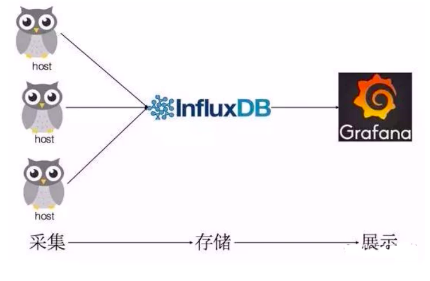
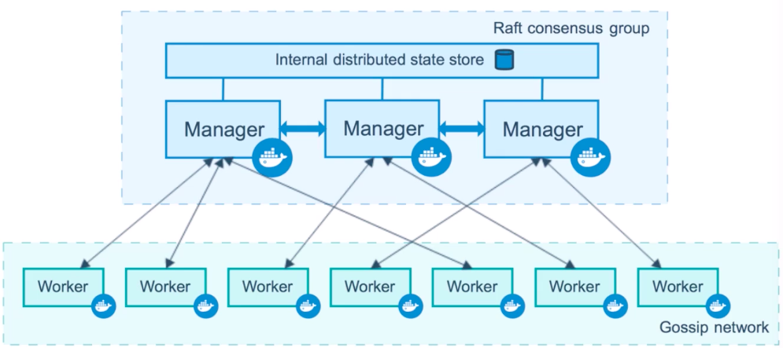
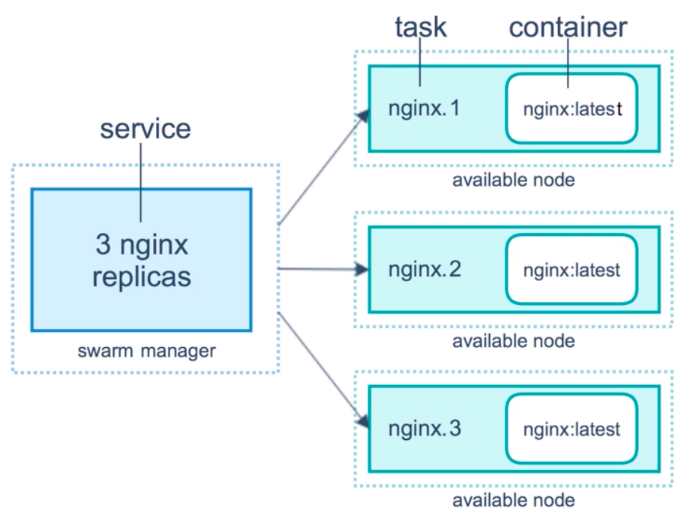
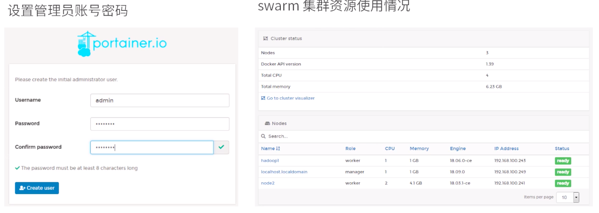

[TOC]

# Docker 最佳实践

## Docker 监控

对于容器的监控方案有很多种: docker stats, Scout, Data Dog, Sysdig Cloud, Sensu Monitoring Framework, CAdvisor 等

### docker stats

结果示例:

```sh
CONTAINER ID        NAME                        CPU %               MEM USAGE / LIMIT     MEM %               NET I/O             BLOCK I/O           PIDS
15c703363278        dubbo-admin_dubbo-admin_1   0.78%               316.7MiB / 1.952GiB   15.84%              21.6kB / 234kB      12.3kB / 0B         35
99af844bc26a        dubbo-admin_zk_server_1     0.41%               50.3MiB / 1.952GiB    2.52%               2.38kB / 0B         41kB / 16.4kB       29
9abce0fae3ae        centos                      0.42%               54.73MiB / 1.952GiB   2.74%               141MB / 5.01MB      131MB / 646MB       18
```

可以很方便的看到当前宿主机上的所有 CPU, 内存及网络流量等. 但是**只统计当前宿主机的左右容器, 而获取的数据时实时的, 没有存储功能也不能预警**

### CAdvisor

Scout, Data Dog, Sysdig Cloud 都提供了交晚上的监控功能, 但是都收费. Sensu Monitoring Framework 免费但是搭建负责. 综合考虑可以使用 CAdvisor

CAdvisor 是谷歌的开源产品, 在 dockerhub 上有 image. 主要功能有:

-   展示 Host 和容器两个层次的数据
-   展示历史变化数据

CAdvisor 只在本机默认存储 2 分钟的数据, 可以将数据存储到 InfluxDB (一个 go 编写的数据库) 中

Granfana 是一个 数据监控分析可视化平台, 支持多种数据源配置和丰富插件已经模板功能. 支持图表权限控制和报警

综上, 我们使用 **CAdvisor + InfluxDB + Granfana** 来监控容器:



-   CAdvisor: 负责收集容器随时间变化的数据
-   InfluxDB: 负责存储时序数据
-   Granfana: 负责分析和展示数据

**具体步骤:**

1. 部署 InfluxDB

    ```sh
    docker run -d --name influxdb -p 8086:8086 -p 8083:8083 -v ~/Dev/Docker/monitor/data:/var/lib/influxdb --hostname=influxdb influxdb
    ```

    连接到 InfluxDB `docker exec -it influxdb influx`

    创建数据库和用户

    ```sql
    create database "test"
    create user "root" with password 'root' with all privileges
    ```

2. 部署 CAdvisor (略)
3. 部署 Granfana (略)

上面的步骤可以通过如下 docker-compose.yml 替代

```yml
version: '3.1'

volumes:
	grafana_data: {}

	services:
		influxdb:
			image: tutum/influxdb:0.9
			#image: tutum/influxdb
			#image: influxdb
			restart: always
		#user:
		environment:
			- PRE_CREATE_DB=cadvisor
		ports:
			- "8083:8083"
			- "8086:8086"
		expose:
			- "8090"
			- "8099"
		volumes:
			- ./data/influxdb:/data

 	cadvisor:
 	 	#image: google/cadvisor:v0.29.0
 	 	image: google/cadvisor
 	 	links:
 	 	  	- influxdb:influxsrv
 	 	command: -storage_driver=influxdb -storage_driver_db=cadvisor -storage_driver_host=influxsrv:8086
 	 	restart: always
 	 	ports:
 	 	  	- "8080:8080"
 	 	volumes:
 	 	  	- /:/rootfs:ro
 	 	  	- /var/run:/var/run:rw
 	 	  	- /sys:/sys:ro
 	 	  	- /var/lib/docker/:/var/lib/docker:ro

 	grafana:
 	 	#image: grafana/grafana:2.6.0
 	 	user: "104"
 	 	image: grafana/grafana
 	 	user: "104"
 	 	#user: "472"
 	 	restart: always
 	 	links:
 	 	  	- influxdb:influxsrv
 	 	ports:
 	 	  	- "3000:3000"
 	 	volumes:
			- grafana_data:/var/lib/grafana
 	 	environment:
 	 	  	- HTTP_USER=admin
 	 	  	- HTTP_PASS=admin
 	 	  	- INFLUXDB_HOST=influxsrv
 	 	  	- INFLUXDB_PORT=8086
 	 	  	- INFLUXDB_NAME=cadvisor
 	 	  	- INFLUXDB_USER=root
 	 	  	- INFLUXDB_PASS=root
```

使用 `docker-compose up`来启动 compose, 启动成功后, 访问 `ip:3000` 将会看到 Granfana 界面, 使用 admin/admin 来登录

## 日志监控

Docker 会默认手机程序的输出内容存储到一个 json.log 文件

以一行一个作为一条 json 存储, 具体可以在 run 启动容器的时候执行 log-driver 进行配置.
具体可以参考 https://docs.docker.com/config/containers/logging/configure/#supported-logging-drivers

Docker 默认使用 json-file driver 作为 log driver, 而 gelf 则是我们需要使用的 log driver

当容器多了, 或者采用 swarm 集群部署 Docker 的时候, 各种日志分散在各个 json.log 中, 当查找问题或者做相关统计的时候, 分散的日志是非常不友好的. 我们需要一个集中管理日志的工具

很多场景下使用 ELK 来作为日志架构, 我们使用的 graylog 很相似, 算是后起之秀

-   Docker 原生支持 graylog, 直接将日志发送到 graylog (通过 gelf 协议)
-   graylog 官方提供了将本身部署到 Docker 的支持, 提供了 docker-compose.yml 来快速部署 graylog 栈, 包含了 MongoDB, ElasticSearch

官方地址: https://hub.docker.com/r/graylog/graylog/

可以参考 [示例参考](./docker-compose-graylog)

**步骤:**

1. 创建一个目录来部署 graylog, 假设目录为 `/root/graplog` 以下所有操作都在 `/root/graplog` 下进行

2. 初始化目录和配置文件

    ```sh
    #创建数据目录
    mkdir -p ./graylog/data
    #创建配置文件目录
    mkdir -p ./graylog/config
    cd ./graylog/config
    #直接下载官方推荐配置文件
    wget https://raw.githubusercontent.com/Graylog2/graylog2-images/2.1/docker/config/graylog.conf
    #日志配置文件
    wget https://raw.githubusercontent.com/Graylog2/graylog2-images/2.1/docker/config/log4j2.xml
    ```

    修改下载完的 graylog.conf 中的 root_timezone 为： `root_timezone = +08:00`

3. 新建 docker-compose.yml 来供 docker-compose 快速启动完整服务，文件内容请参考 [示例参考](./docker-compose-graylog)

4. 启动服务: `docker-compose up`
   启动整个服务，如果没有问题的话，会看到 graylog webserver started 的终端输出消息。
   访问 http://{server}:9090/
   会看到 graylog 的 web 界面，使用用户名 admin，密码：admin 来登录后台，至此部署完成。

**系统配置:**

1. input 配置
   graylog 的日志收集通过定义 input 对象来完成，在 graylogweb 管理界面按照如下图片进入 input 对象配置：
   

    选择 GELF UDP 协议来新建一个输入器（input）

    

    填好相关属性，新建：

    

2. Docker 配置

    如果 docker 通过命令行启动，可以在 run 命令中加上如下参数：

    ```docker
    docker run --log-driver=gelf --log-opt gelf-address=udp://{graylog服务器地址}:12201  --log-opt tag=<当前容器服务标签，用来供graylog查询的时候进行分类>  <IMAGE> <运行命令>
    ```

    如果通过 docker-compose 命令，则可以在 docker-compose.yml 中加入相关配置,以下用 tomcat 容器举例:

    ```yml
    version: '2'
    services:
    tomcat:
    	image: tomcat:7
    	volumes:
    		- /etc/localtime:/etc/localtime
    		- /etc/timezone:/etc/timezone
    		- /data/tomcat-adtp/logs:/usr/local/tomcat/logs
    		- /data/tomcat-adtp/webroot:/usr/local/tomcat/webapps/ROOT
    	environment:
    		- JAVA_OPTS=-Xmx1g
    		- JAVA_OPTS=-Xms3g
    	ports:
    		- "80:8080"
    	logging:
    	driver: "gelf"
    	options:
    		gelf-address: "udp://graylogserver:12201"
    		tag: front-tomcat
    ```

    容器启动的时候可能会有下面这个提示：

    ```log
    tomcat_1  | WARNING: no logs are available with the 'gelf' log driver
    ```

    可以无视这个警告，日志还是会继续发送过去的。到这里为止我们可以在 graylog 的 web 后台中看到 tomcat 所产生日志了。

## 集群资源管理

Docker Swarm 提供 Docker 容器集群, 是 Docker 官方对容器云生态进行支持的核心方案, 使用它用户可以将多个 Docker 主机分装为单个大型的 Docker 主机, 快速打造一套容器云平台

注意: Docker 1.12.0+ Swarm mode 已经内嵌入了 Docker 引擎, 成为 docker 子命令 `docker swarm`

**核心概念 :**

-   **节点** Docker 的主机可以主动初始化成为一个 Swarm 集群或者加入一个 Swarm 集群, 这个运行 Docker 主机就成为一个 Swarm 集群的节点(node)
    节点分为管理(Manager)节点和工作(Worker)节点
    
-   **任务** Task 是 Swarm 中最小的调度单位, 目前来说就是一个单一的容器
-   **服务** Services 是一组任务的集合, 服务定义了任务的属性
    服务有两种模式:

    -   replicated services 按照一定规则在各个工作节点上运行指定个数的任务
    -   global services 每个工作节点上运行一个任务

    两种模式可以通过 docker service create 的 --mode 参数指定

    **任务, 服务, 容器**之间的关系
    

**集群步骤 :**

-   **初始化集群 :** `docker swarm init --advertise-addr 192.168.100.249`, 如果有主机有多个网卡, 拥有多个 IP,必须使用 `--advertise-addr`来指定 IP, 执行`docker swarm init`命令的节点会自动成为管理节点
-   **增加工作节点 :** 在另外两台服务器执行上一步创建管理节点的时候输出的加入 swarm 集群命令

    ```docker
    docker swarm join --token SWMTKN-1-41c4l1lm2xnhkpgn3v2dtd14icz6ih5zrji0vr487cpix0tpx4-6q8sryx0knwvv88fnvq2k0cc7 192.168.100.249:2377
    ```

    如果把这个命令忘了, 可以在 manager 节点上执行`docker swarm join-token manager`来重新获取

-   **查看集群 :** `docker node ls`
-   执行 `docker node promote [hostname]`可以将指定 hostname 赋予可以升级成为 leader 的权限, 当当前 leader 挂了之后可以这些 hostname 可以选举成为 leader

**部署服务**

使用 `docker service`命令来管理 Swarm 集群中的服务, 该命令只能在管理节点上运行

-   **新建服务** 在创建好的 Swarm 集群中运行一个名 Nginx 的服务

    ```docker
    docker service create --replicas 3 -p 80:80 --name nginx nginx:latest
    ```

    输入任意节点的 IP 就可以看到 Nginx 默认页面

-   **查看服务**

    ```docker
    # 查看当前Swarm集群运行的服务
    docker service ls
    # 查看某个服务的详情
    docker service ps nginx
    # 查看某个服务的日志
    docker service logs nginx
    ```

-   **删除服务** `docker service rm nginx`

**可视化资源管理**

**portainer**是一个图形化 swarm 资源管理工具

```docker
# 查询partainer镜像
docker search portainer
# 拉取
docker pull portainer/portainer
# 运行
docker run -d -p 9000:9000 --name portainer --restart always -v /var/run/docker.sork:/var/run/docker.sork portainer/portainer
```



**快速扩容**

-   **命令方式**
    在创建好的 Swarm 集群中运行一个名 Nginx 的服务, 并使用 `--replicas` 指定副本数

    ```docker
    docker service create --replicas 3 -p 80:80 --name nginx nginx:latest
    ```

    或者

    ```docker
    docker service create -p 80:80 --name nginx nginx:latest
    docker service scale nginx=3
    docker service ls
    ```

-   **portainer 方式**
    可以通过 portainer web 管理界面的 service 节点来动态的增加,删除副本数
