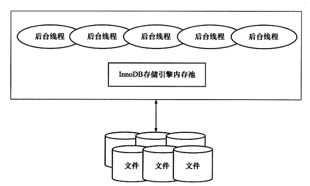
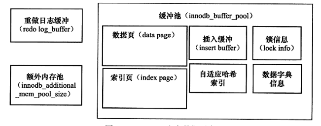

## InnoDB引擎

### InnoDB的版本

版本|功能
-|-
老版本的InnoDB|支持ACID，MVCC
InnoDB 1.0.x | 增加了compress和dynamic页格式
InnoDB 1.1.x | 增加了Linux AIO，多回滚段
InnoDB 1.2.x | 增加了全文索引，在线索引添加

### InnoDB体系架构

#### 后台线程
- MasterThread  
    非常核心的后台线程，主要负责将缓存池的数据异步刷新到磁盘，保证数据的一致性，包括脏页的刷新、合并插入缓存、UNDO页的回收等。

- IO Thread  
    InnoDB才用了大量的AIO来处理IO请求，IO Thread就是负责这些IO请求的回调处理。  
    在1.0之前，有4个IO Thread：write、read、insert buffer和log IO Thread。  
    1.0 之后，read Thread和 write Thread 分别增大到了4个。

- Purge Thread  
    事务被提交后，其所使用的undolog可能不再需要，Purge Thread来回收已使用并未分配的undo页。  
    1.1之前，purge操作仅在InnoDB的Master Thread中完成。  
    1.1之后，purge操作可以独立到单独的线程中进行，来减轻Master Thread的工作。

- Page Clear Thread  
    在1.2.x 引入，是为了把脏读也的刷新放到单独的线程中完成。减轻Master Thread的工作

#### 内存
- 缓存池  
    简单的来说就是一块内存区域，用来弥补磁盘速度较慢对数据库性能的影响。在数据库进行读取页操作时，首先将磁盘中读到的页放到缓存池中，下一次再读取相同的页就会先去缓存池中查找。若在缓存池中，称该页在缓存池中被命中，直接读取，否则回磁盘读取。  

    InnoDB的内存结构：

    

- LRU List、Free List、Flush List  
    - LUR List  
        通常来说，缓冲池是同LRU（Lastest Recent Used，最近最少使用）算法来进行管理的。即：使用最频繁的页在LRU列表的前端，最少使用的页在尾端。当缓冲池容量到打上限后，会释放尾端的页。  
        InnoDB中缓冲池中页的大小默认为16K，同样使用LRU进行管理，但是略有不同：新读取到的页不会直接放到LRU列表的首部，而是放到了midpoint位置。默认midpoint在LRU列表的5/8处（也就是尾端的3/8处）。midpoint之前的称为new列表，midpoint之后称为old列表。  
        不才用朴素LRU算法的原因：索引或者数据扫描的操作通常会使缓冲池中的页被刷出（就是满了，释放内存），而这些也通常来说仅在这次查询中需要，并不是热点数据。如果放到首部，那么非常可能将热点数据刷出。  
        为了解决这个问题，InnoDB引入了innodb_old_blocks_time，用于表示页读取到midpoint位置后需要多久才会被加入到LRU的热端。  
    
    - Free List  
        LRU用来管理已经读取到的页，单数据库刚启动时，LRU是空的，这是的页都在Free List中。
        当需要从缓存池中分页时，首先从Free List中查询是否有可用的空闲页，若有就将该页从Free List中删除，放人LRU List中。否则，淘汰LRU List最末尾的页，将空间分配给新的页。当页从old部分加入到new部分时，称此操作为 page made young，而因为 innodb_old_blocks_time的设置而导致页没有从old移动到new时称为 page not made young。

    - Flush List  
        在LUR列表中的页被修改后，称该页为脏页（dirty page），即缓冲池和磁盘的数据产生了不一致。这时数据库会通过checkpoint机制将脏页刷新会磁盘中，而Flush 列表即为脏页列表。脏页即存在与LRU列表中页存在于Flush列表中。LRU List管理缓冲池中页的可用性，Flush List用来将脏页刷新到磁盘。  

- 重做日志缓冲（redo log buffer）  
    InnoDB首先将重做日志信息放到这个缓冲区中，然后按照一定频率刷新到日志文件中。一般每秒默认8M，可以通过innodb_log_buffer_size控制

- 额外的内存池  
    一些数据结构本身的内存进行分配时，需要从额外内存池中申请，当该区域内存不够时，会从缓冲池中申请。因此，在申请了很大的InnoDB缓冲池时，也应考虑相应的增加这个值。  

#### Checkpoint

缓冲池是为了协调CPU速度和磁盘速度的鸿沟。所以页的所有操作都是首先在缓冲池中完成的。  

如果每次都将更新操作刷新到磁盘，开销会非常大。同时，缓冲刷新到磁盘的过程中如果宕机数据就不可恢复了。为了避免这个问题，数据库普遍使用了Write Ahead Log策略，即当事务提交时先写重做日志，再修改页。当数据库因宕机导致数据丢失时，会通过重做日志来恢复。这是ACID中D（Durability 持久性）的要求。  

当重做日志可以无限增大，缓冲池也足够大，能够完全缓存所有的数据。就不需要将缓冲池中更新的也刷新会磁盘，那么这是完全可以在数据库宕机时通过重做日志来恢复。但是这两点显然是不能够打到的，就算在某种特定场景中能够达到，如果通过重做日志恢复整个数据库的代价也会非常高。  

**Checkpoint** 就是用来解决以下几个问题才提出的：  
- 缩短数据库的恢复时间  
- 缓冲池不够用时，将脏页刷新到磁盘  
- 重做日志不可用时，刷新日志

当数据库宕机时，不需要恢复所有的重做日志，因为Checkpoint之前的数据已经刷新到了磁盘上，大大的缩减了恢复时间。  

InnoDB引擎中，存在两种Checkpoint：  
- **Sharp Checkpoint：** 数据库关闭时将所有的脏页刷新到磁盘中，默认的工作方式，参数为innodb_fast_shutdown = 1  
- **Fuzzy Checkpoint：** 数据库运行时使用，值刷新一部分脏页，一般有以下几种Fuzzy Checkpoint：
    - **Master Thread Checkpoint：** 对于Master Thread中发生的Checkpoint，差不多是以每秒或者每十秒的速度按一定比例刷新到磁盘上，这个过程时异步的。  
    - **FLUSH_LRU_LIST Checkpoint：** InnoDB保证LRU列表中有差不多100个空闲页。在InnoDB1.1.x之前，检查LRU列表中是否有足够的空间是发生在用户查询线程中，会阻塞用户查询。如果不够100个可用的空闲页，那么就会将LRU列表中的尾端的页移除，移除页中如果有脏页，就需要进行Checkpoint。在InnoDB1.2.x中这些检查被放到了一个单独的Page Clear线程中，并且可以配置。  
    - **Async/Sync Flush Checkpoint：** 是指重做日志不可用的情况，需要强制把一些页刷新回磁盘，此时的脏页是从脏页列表中选取的。是为了保证重做日志的循环可用，在InnoDB1.2.x前是会阻塞所有用户的查询线程，从1.2.x后，也就是MySQL 5.6版本，这部分操作被单独放到了Page Clear Thread中。  
    - **Dirty Page too much Checkpoint：** 脏页数量太多，导致InnoDB强制Checkpoint。  

#### Master Thread 工作方式
##### InnoDB 1.0.x版本之前的Master Thread
Master Thread具有最高的线程优先级别，内部有多个循环（loop）组成：主循环（loop）、后台循环（backgroup loop）、暂停循环（suspend loop）。Master Thread会根据数据库运行状态在各个循环之间切换。  
Loop被称为主循环，因为大部分操作都在这个循环中，分为每秒操作和每十秒操作：
