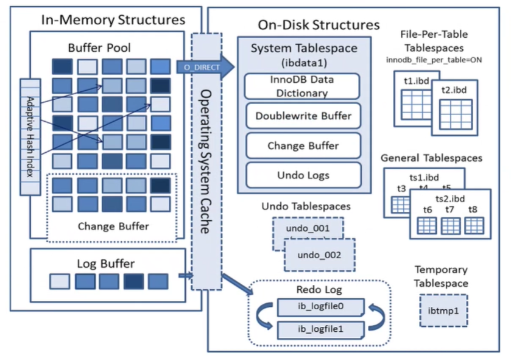
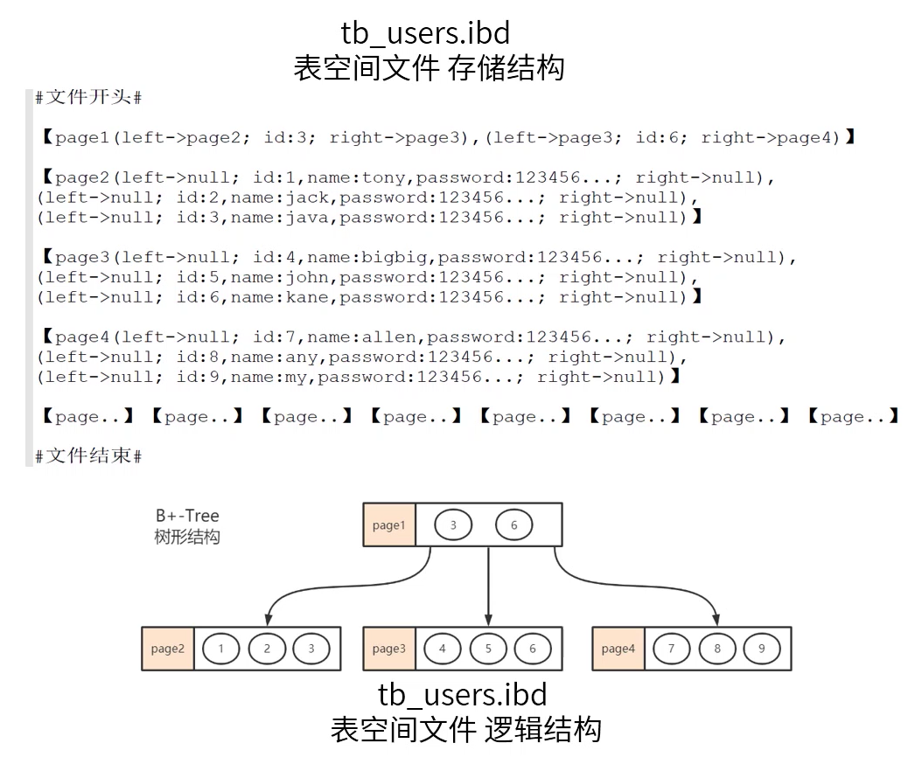
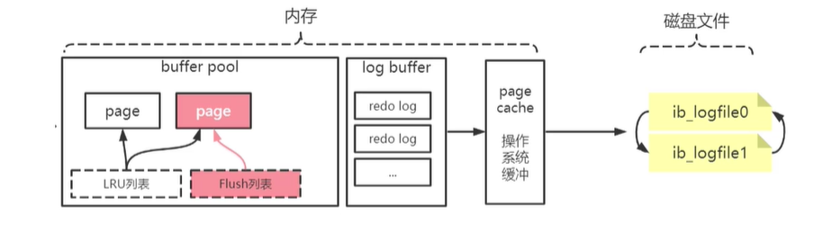
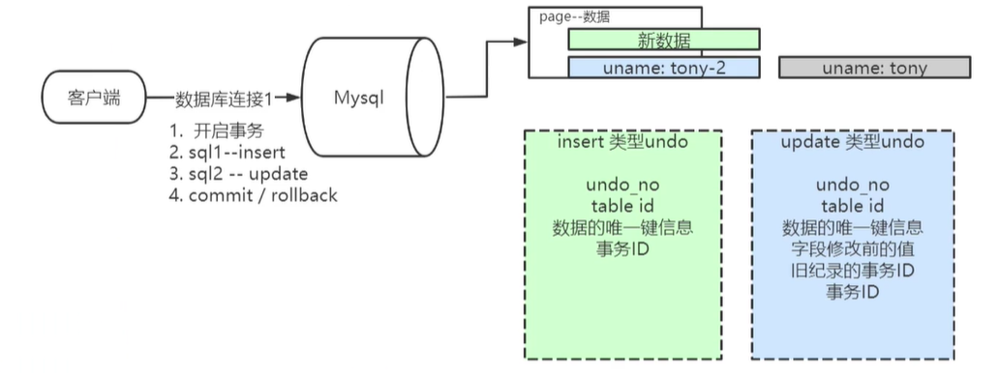

[toc]

# InnoDB 整体架构

**单表 idb 文件内容说明**

InnoDB 以 page 为单位, 将数据从磁盘中读取出来

- InnoDB 中page的大小默认为 16 kb (可配置)
- 操作系统中的 page 大小为 4kb
- 机械硬盘扇区 512 byte
- SSD 中 page 大小为 4kb

以上所说的大小, 可以理解为各个层级中, 对于磁盘操作的最小单位

**InnoDB 磁盘数据存储概念梳理**

设定: 一条记录 5 kb, InnoDB一次读取 16 kb 得出: 最多查询出 3 条记录

如果InnoDB查id为 9 的数据就需要查询 3 次才能查到, 如果 id 为 1000的数据, 那么就会需要更多次的查询.

 这样查询会很慢, 所以 InnoDB会在第一页上保存一个索引, 这样每次查询数据都只需要 2 次查询操作, 先去查找索引, 然后根据索引去查找数据

关于B+树与索引请参考 [索引与树](索引与树.md)

## ACID与InnoDB

- Atomicity 原子性

  事务通常由多个语句组成. 原子性保证将每个事务视为一个 "单元", 改事务要么成功要是失败

- Consistency 一致性

  事务的执行不能破坏数据库的完整性和一致性, 一个事务在执行之前和执行之后, 数据库都必须处于一致性状态

- Isolation 隔离性

  通常数据库会有多个事务同事执行, 隔离可确保事务的并发执行不会相互干扰

- Durability 持久性

  持久性保证一旦事务被提交, 即使在系统故障 (例如: 停电或者奔溃) 的情况下, 事务也将保持执行

### Redo Log

redo 日志记录落盘后, 代表数据一定记录下来, 事务 commit 成功

**目标**: 性能的保证以及 一致性, 持久性的保证

数据说明时候更新到对应的表空间 ? 

CheckPoint - 检查点

- 缓冲池不够用时, 将脏页刷新到磁盘
- 重置日志不可用时, 刷新脏页

### Undo Log

**目标**: 原子性 隔离性

`insert` 数据只对当前事务或者提交之后可见, 所以 `insert` 的 `undo log` 在事务 `commit` 后就可以释放了

`update undo` 信息, 还要等到其他依赖此日志的事物完毕后才会被清除