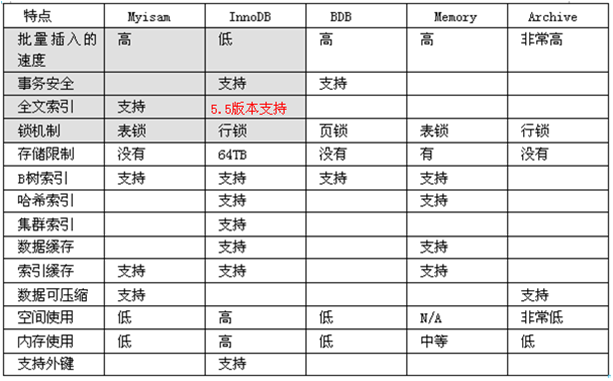

## MySQL 引擎

-   InnoDB  
     支持事务，面向在线事务处理（OLTP）  
     特点：行锁，支持外键，默认读取操作不会产生锁，5.5.8 版本后的默认引擎  
     InnoDB 将数据放在一个逻辑表空间中，在 4.1 之后可以将每个 InnoDB 的表单独存放到一个独立的 idb 文件中  
     通过多版本并发控制（MVCC）来获得高并发性，实现了 SQL 标准的 4 级隔离级别，默认为 REPEATABLE。同时使用 next-key-locking 来避免幻读（phantom）。还提供了插入缓存（insert buffer）、二次写（double write）、自适应 hash 索引（adaptive hash index）、预读（read ahead）等功能。  
     对于表中存储的数据，采用了聚集（clustered）的方式，因此每张表的存储都是按照主键的顺序存放。InnoDB 的表必须有主键，如果没有显示定义主键，那么会为每一行生产一个 6 字节的 ROWID 作为主键。

-   MyISAM
    不支持事务、表锁，支持全文索引，主要面向 OLAP 数据库应用。在 5.5.8 版本之前是 MySQL 的默认引擎。  
    MyISAM 由 MYD 和 MYI 组成，MYD 用来存放数据文件，MYI 用来存放索引文件可以通过 myisampack 来压缩和解压数据文件，压缩后的表是只读的。  
    在 MySQL5.0 之前，MyISAM 默认支持表最大为 4G，5.0 之后支持 256TB
-   NDB
    集群存储引擎，数据全部存放于内存里（从 5.1 开始，可以将非索引文件放到硬盘上），主键查找速度极快。
    由于 NDB 的连接(jion)操作是在数据库层完成因此查询速度慢。

- Memory
     将数据放到内存中，数据库重启或发生奔溃，数据会全部丢失。非常适合存储临时数据的临时表已经数据仓库的维度表。默认使用hash索引  
     只支持表锁，并发性能差，并且不支持TEXT和BLOB类型。存储varchar是按照char进行的，浪费内存。  
     在使用Memory作为临时表来存放查询的中间查询结果集。如果中间结果集大于表的容量设置，又或者结果集中含有TEXT或者BOLB类型的字段，就会转为MyISAM存储，而MyISAM 不缓存数据文件，所以这时产生的临时表对查询性能由损失。

- Archive
     只支持insert和select操作，从5.1之后支持索引。使用zlib算法讲数据行（row）压缩后存储，压缩比一般可以达到1：10。非常适合存储归档数据，如日志信息。使用行锁来实现高并发，但本身事务部安全，主要是为了提供插入和压缩功能。  

- Federated 
     不存放数据，指向远程MySQL数据库上的表。

- Maria
     可以看做是MyISAM的后续版本。特点是：支持缓存文件和索引文件，应用了行锁，提供了MVCC功能，支持事务和非事务安全的选项，更好的BOLB处理性能。  

各个存储引擎的比较：

---

[MySQL 基础](./README.md)  
[MySQL 总结](../README.md)  
[主页](../../../)
