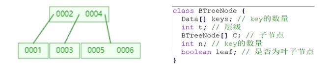
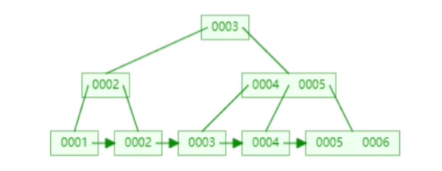

[toc]

## 索引与磁盘操作的关系


数据可视化 https://www.cs.usfca.edu/~galles/visualization/Algorithms.html


>  硬盘的存储容量 = 磁头数(盘面) * 磁道(柱面)数 * 每道扇区数 * 每道扇区字节数  
>
> 每个扇区 512 b

硬盘的相关知识请参考: [计算机的启动](../../../Base/汇编/计算机的启动.md)

每次操作系统去读取数据, 要先磁盘上的磁头读取一个扇区并把扇区的数据放到内存中


### 数据在磁盘中的存储

有如下数据库用户表

| 名        | 长度 |
| --------- | ---- |
| user_id   | 10   |
| user_name | 50   |
| password  | 8    |
| img       | 30   |
| remark    | 30   |

可以发现每条数据需要占用空间 `10+50+9+30+30 = 128`


该表存在数据如下

| user_id | user_name |
| ------- | --------- |
| 1       | tony      |
| 2       | jack      |
| 3       | java      |
| 5       | bigbig    |
| 6       | john      |
| 7       | kane      |
| 8       | allen     |
| 9       | any       |
| 10      | tom       |
| ...     | ...       |


磁盘每个扇区为 `512b` 也就是说每4条数据正好存放到一个扇区中, 如果有100条记录, 需要占用25个扇区, 也就是说, 如果要查找 `id = 100` 的数据, 最多需要访问25次硬盘, 即 **25** 次磁盘查询

一些硬件的延迟数据 https://colin-scott.github.io/personal_website/research/interactive_latency.html

那么如果每条数据都这样轮询去查找的话会效率会很低, 应该如果改进呢?


### 索引优化


在关系数据库中，索引是一种单独的、物理的对数据库表中一列或多列的值进行排序的一种存储结构，它是某个表中一列或若干列值的集合和相应的指向表中物理标识这些值的数据页的逻辑指针清单。索引的作用相当于图书的**目录**，可以根据目录中的页码快速找到所需的内容


用新华字典来比作整个数据库的话, 每个字和字的解释就是数据库中存储的一条条数据. 目录是索引. 但是字典还可以通过偏旁部首或是拼音来查找, 这样查找方法也是利用索引来找到每条数据所在的页码 (指针).


在磁盘上建立索引, 如: 用id+引用地址

| id   | 索引   |
| ---- | ------ |
| 1    | 地址 1 |
| 2    | 地址 2 |
| 3    | 地址 3 |
| 4    | 地址 4 |
| ...  | ...    |

索引中 id 长度为 10, 索引长度假定为 6, 也就是一条索引的长度为 `16 byte` , 一个block (扇区)存储 `512 / 16 = 32` 条数据, 即 100 条记录占 `100 / 32 = 4` 个 block. 加上数据占用的 25 个block 一共占用 29 block


在有索引的情况下, 查找一条记录需要最多 `4 次索引查询 + 1 次数据查询 = 5` 次磁盘查询


如果数据逐渐增多, 如增加到了 1000 条数,那么索引就需要 `1000 / 32 = 32` 个 block, 即查询一条数据最多就需要 33 次磁盘查询, 如果是上百万条数据查询索引的次数也会增加很多


### 多重索引


假设现有 1000 条数据, 也就会占用 32 个block. 我们为索引**创建二阶索引**

| id   | 指针              |
| ---- | ----------------- |
| 32   | 第 1 个索引块地址 |
| 64   | 第 2 个索引块地址 |
| 96   | 第 3 个索引块地址 |
| 128  | 第 4 个索引块地址 |
| ...  | ...               |

二阶索引数量 `1000 / 32 = 32` 条, 即 `32 / 32 = 1` 个block

查询数据最多需要 `1 次二阶索引查询 + 1 次一阶索引查询 + 1 次磁盘查询 = 3` 次


如果随着数据量的增长, 需要不断为索引创建新的索引, 这些多重索引会组成一个树结构


## 树型结构在索引中的应用


索引的保存: 在数据有变化的时候同时修改索引. 然后在查找数据是通过索引来找到数据的地址

如果数据在插入时是无序的 (依次插入了 id 为 10, 4, 11, 7, 8 ...), 需要查找n个block才能查询希望的数据

如果将这些索引数据看做一个数组, 那如何在数组中找一条数据呢? 
一般的做法都是先对数组排序, 然后使用**查找算法**来查找数据

也就是说, 无论数据如何变化, 都要保证索引的顺序. 但是数据的变化会使得需要频繁的移动索引数据位置, 增加了磁盘操作


那使用哪种数据结构来记录索引才会方便查找并且在变动试减少磁盘操作呢?


### 二叉查找树


1. 若任意节点的左子树不空, 则左子树上所有节点的值均不大于它的根节点的值
2. 若任意节点的右子树不空, 则右子树上所有节点的值均不小于它的根节点的值
3. 任意节点的左右子树也分别为二叉搜索树


如下

```
		   	 100
		   /     \
		 50		  150
	   /    \    /    \
	  45    55  125    180
	  					 \
	  					 185
	  					 	\
	  					 	190
```


如果查询 id 为 55 的数据就只需要查找 2 次


但是很可能会出现如下情况

```
    100
      \
      110
      	\
      	120
      	  \
      	  130
      	    \
      	    140
      	      \
      	      150
```

这样的情况并不会让查找变快, 很明显这棵树右子树太重了, 是不平衡的


###  二叉平衡查找树


1. 是一颗二叉搜索树
2. 每个节点的左右子树的高度之差的绝对值最多为 1 (保持平衡)


```
		1
	  /   \
	 2     4
	 	 /   \
	 	3	  5
```


缺点:

- 只有两个查找路径, 造成层级过高
- 为了平衡需要移动的磁盘上很多数据位置


### B-Tree


本质是平衡多路查找树, M 阶的 B 树包含以下属性:

- 每个节点最大包含m个子节点
- 除了根节点和也节点外, B 树中的每个节点至少包含 m/2 个子节点
- 根节点必须只有具有 2 个节点
- 所有叶节点必须处于同一级别 (**从上往下构建**)




缺点: 不完美, 单节点存放的 key 过少


### B+ Tree





基于 B-Tree, 所有数据存在叶子节点

优势: 读取的子节点中能够存储更大的索引 key, 数据做顺序读取时性能更好

