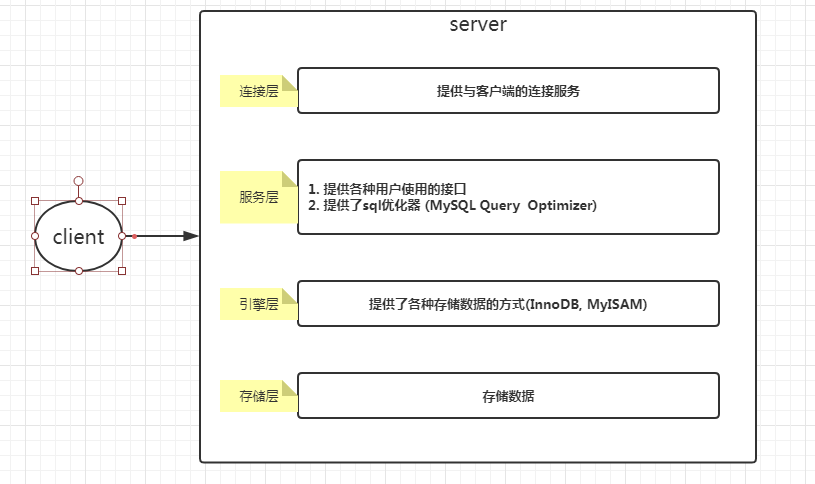

## MySQL 逻辑分层

连接层 , 服务层, 引擎层, 存储层

引擎:

-   InnoDB(默认): 事物优先 (适合高并发; 行锁)
-   MyISAM: 性能优先 (表锁)

> 查询 MySQL 支持哪些引擎 : show engines;  
> 查看当前使用的引擎 : show variables like '%storage_engine%';
> 指定数据库引擎 :
>
> > 在创建时指定 : create table ( ... ) ENGINE = MyISAM ;  
> > 修改引擎 : ALTER TABLE xxx ENGINE=INNODB;

---

[MySQL 优化](./README.md)  
[主页](../../../../../)
