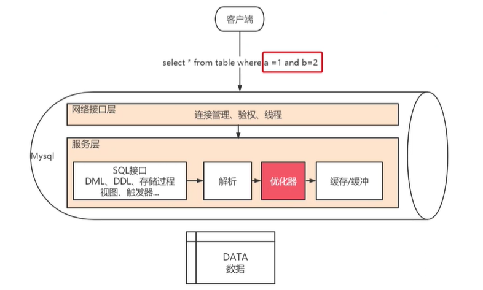

## MySQL 逻辑分层

连接层 , 服务层, 引擎层, 存储层


引擎:

-   InnoDB(默认): 事物优先 (适合高并发; 行锁)
-   MyISAM: 性能优先 (表锁)

> 查询 MySQL 支持哪些引擎 : show engines;  
> 查看当前使用的引擎 : show variables like '%storage_engine%';
> 指定数据库引擎 :
>
> > 在创建时指定 : create table ( ... ) ENGINE = MyISAM ;  
> > 修改引擎 : ALTER TABLE xxx ENGINE=INNODB;


**查询优化器概述**


查询优化器的任务是找到知心 SQL 查询的最佳计划, 是 MySQL 数据库的一个核心功能模块.

根据表/列/索引的详细信息以及 SQL 语句中的条件, 很多方面来让 SQL 高效的执行





如上图执行SQL `select * from table where a = 1 and b = 2` , 假设现在表中 `a = 1` 的数据有 100 条, `b = 2` 的数据有 200 条, `a = 1 and b = 2` 的有 50 条, 那应该先执行哪个条件的查询呢? 这个查询条件并不是根据 SQL 的书写顺序来执行的,  而是由查询优化器来决定的


优化器选择执行效率最高的查询的一组操作被成为 **查询执行计划** , 也称为 **explain** 计划

分析 explain 计划可以发现一些导致 SQL 低效的原因

查询执行计划的方法:

```mysql
explain <select statement>
-- explain [FORMAT=JSON] sql语句 \G
-- FORMAT=JSON 用意是以json格式输出执行计划内容, []是可选项, \G 输出格式又列转成行的方式
```

---

[MySQL 优化](./README.md)  
[主页](../../../../../)