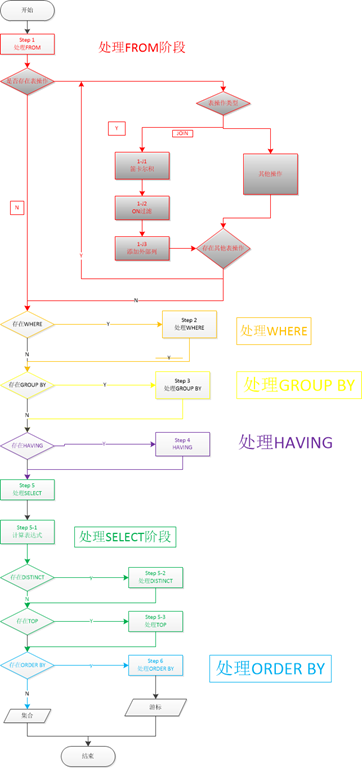

## SQL 解析过程及索引

### sql 的解析过程

SQL 优化的原因: 性能低, 执行时间太长, 等待时间太长, sql 语句欠佳(连接查询), 索引失效, 服务器参数设置不合理(缓存区, 线程数 ...)

**编写过程 :**

```sql
select .. from .. join .. on .. where .. group by .. having .. order by .. limit ..
```

**解析过程 :**

```sql
from .. on .. join .. where .. group by .. having .. select .. order by .. limit ..
```



> 具体 SQL 语句的解析过程可以点击[这里](http://www.cnblogs.com/myprogram/archive/2013/01/24/2874666.html), 上面的图也是复制这位博主的.  
> 以及这里 : [步步深入：MySQL 架构总览->查询执行流程->SQL 解析顺序](https://www.cnblogs.com/annsshadow/p/5037667.html)

### 索引

SQL 优化, 主要就是优化索引

索引(index): 就是目录(官方定义: 是帮助 MySQL 高效获取数据的数据结构), MySQL 使用 B+ 树

> 3 层的 B 树可以存放上百万数据  
> MySQL 中使用的是 B+树, 数据统一存放到叶节点中  
> B+ 树中查询任意数据次数均为 n 次(n 是 B+ 树的高度)  
> B 树的资料可以参考: [浅谈算法和数据结构: 十 平衡查找树之 B 树](http://www.cnblogs.com/yangecnu/p/Introduce-B-Tree-and-B-Plus-Tree.html)

索引的缺点:

-   索引本身很大, 可以存放到内存, 硬盘里 (一般是在硬盘里)
-   索引不是所有情况都适用:
    -   数据量少
    -   频繁更新的字段
    -   很少使用的列
-   索引会降低增删改的效率

索引的优点:

-   提供查询效率(降低了 i/o 的使用率)
-   降低了 CPU 的使用率(B 树本身有序, 不需要重新排序)

索引的分类:

-   主键索引 : 不能重复, 不能为 null
-   唯一索引 : 不能重复 , 可以为 null , name, age 之类的字段不能做唯一索引, 会有重复
-   单值索引 : 也就是普通索引 单列
-   复合索引 : 多个列构成的索引

> 如果一个字段是 primary key, 则该字段就是主键索引


索引相关概念: 

- **聚集索引 (聚簇索引)** InnoDB 表都有一个称为聚集索引的特殊索引 (默认主键, 没有则选唯一键, 都没有则选择隐式的 rowid 键)
- **二级索引 (非聚簇索引)** 所有非聚集索引, 都称为二级索引
- **单列索引** 索引只涉及一个列
- **多列索引 (复合索引, 联合索引, 组合索引)** 索引涉及多个列 (最多 16 列)
- **覆盖索引** <font color="red">**这不是一种索引**</font>, 是指 `查询语句所需的列, 被包含在查询条件中的索引列里` 的场景, 例如 `select count(a.user_id) from tb_users where a.user_id < 1000`


**创建索引 :**

第一种方式

```sql
# create 索引类型 索引名 on 表名(字段)
# 单值
create index dept_index on tb(dept);
# 唯一索引
create unique index bid_index on tb(bid);
# 复合索引
create index dept_name_index on tb(dept, name);
```

第二种方式

```sql
# alter table 表名 add 索引类型 索引名(字段)
# 单值
alter table tb add index dept_index(dept);
# 唯一索引
alter table tb add unique index bid_index(bid);
# 复合索引
alter table tb add index dept_name_index(dept, name);
```

**删除索引**

```sql
# drop index 索引名 on 表名
drop index bid_index on tb;
```

**查询索引**

```sql
# show index from 表名
show index from tb;
```

---

[MySQL 优化](./README.md)  
[主页](../../../../../)
