## explain 的参数说明

---

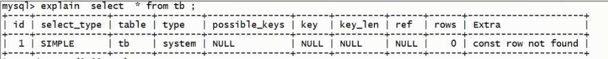

### 简单参数解释

| 参数          | 说明                   |
| ------------- | ---------------------- |
| id            | 编号                   |
| select_type   | 查询类型               |
| table         | 表名                   |
| type          | 类型                   |
| possible_keys | 预测使用的类型         |
| key           | 实际使用的索引         |
| key_len       | 实际使用索引的长度     |
| ref           | 表之间的引用           |
| rows          | 通过索引查询到的数据量 |
| Extra         | 额外的信息             |

### 具体说明

#### id 说明

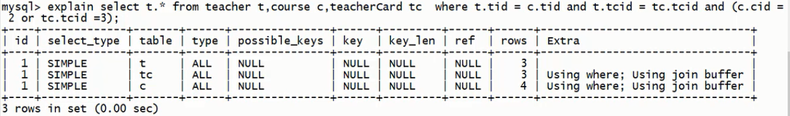
id 值相同, 从上到下, 顺序执行. **表的执行顺序是按照 rows 从小到大排列的[笛卡尔积]**, 数据少的表优先查询

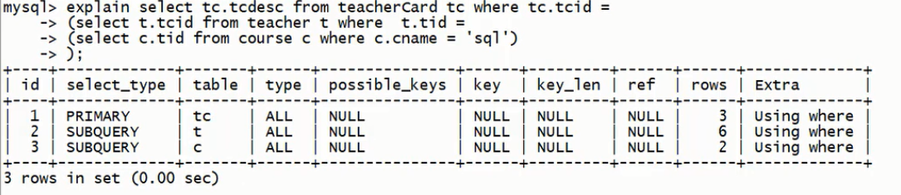
id 值不同, 值越大越优先执行

#### select_type 查询类型

| select-type  | 说明                                                                                                                                                                                                                                                                                                                                                                 |
| ------------ | -------------------------------------------------------------------------------------------------------------------------------------------------------------------------------------------------------------------------------------------------------------------------------------------------------------------------------------------------------------------- |
| PRIMARY      | 包含子查询的主查询 (最外层)                                                                                                                                                                                                                                                                                                                                          |
| SUBQUERY     | 子查询 (非最外层)                                                                                                                                                                                                                                                                                                                                                    |
| SIMPLE       | 简单查询 (不包含子查询, union)                                                                                                                                                                                                                                                                                                                                       |
| DERIVED      | 衍生查询 (使用了临时表): <br/> 1. 在 from 子查询中只有一张表, 例如: <br/> select cr.cname from (select _ form course from tid in (1,2)); cr <br/> 2. 在 from 子查询中, 如果有 table1 union table2 , 则说 table1 就是 derived, table2 就是 union. 例如: <br/> select cr.cname from (select _ from course where tid = 1 union select \* from course where tid = 2) cr; |
| UNION        | 上例                                                                                                                                                                                                                                                                                                                                                                 |
| UNION RESULT | 告知开发人员, 哪些些表存在 union 查询                                                                                                                                                                                                                                                                                                                                |

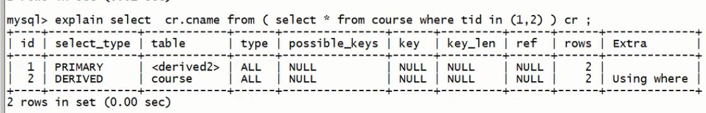
上图说明了 derived 的第一种情况, table 为<derived2>, 对应了 id 为 2,select_type 为 derived 的子查询

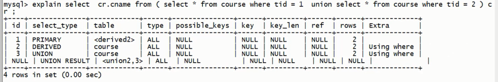
上图是 derived 的第二种情况, id 为 null 的行 select_type 为 union result, table 为<union2,3>, 对应了 id 为 2 和 id 为 3 的查询结果进行了 union

> 要使用索引优化的前提: **有索引**.

#### type 索引类型

平时出现比较多的是:  
**system > const > eq_ref > ref > range > index > all**  
从左到右效率逐渐降低, system 和 const 只是理想情况; 实际优化后能达到 ref 和 range

| type 类型 | 具体情况                                                                                                                                            | 结果表现                                                           |
| --------- | --------------------------------------------------------------------------------------------------------------------------------------------------- | ------------------------------------------------------------------ |
| system    | 只有一条数据的系统表或衍生表只有一条数据的主查询                                                                                                    | 结果只有一条数据                                                   |
| const     | 仅能查的一条数据的 sql, 用于 primary key 或者 unique 索引 (与索引类型有关)                                                                          | 结果只有一条数据                                                   |
| eq_ref    | 唯一性索引, 对于<strong>每个</strong>索引键的查询, 返回匹配<strong>唯一一行</strong>数据 (有且只有一个, 不能多, 不能没有), 常见于唯一索引和主键索引 | 结果多条, 但每条数据是唯一的                                       |
| ref       | 非唯一性索引, 对于每个索引键, 返回匹配的所有行                                                                                                      | 结果多条, 每条数据是 0 条或多条                                    |
| range     | 检索指定范围的行, where 条件后是一个查询范围, 如: between, > , < , >= ... 特殊: in 有时会失效, 从而转为 all 级别                                    | select t.\* from teacher t where t.id < 3 , t.id 为索引            |
| index     | 查询全部索引中数据                                                                                                                                  | select tid from teacher; tid 为 teacher 表的索引, 只需要扫描索引表 |
| all       | 查询全部表中数据                                                                                                                                    | select name from teacher; name 不是 teacher 表的索引, 需要全表扫描 |

#### possible_keys 和 key

possible_keys 可能用到的索引  
key 实际使用到的索引

#### key_len 索引的长度

作用: 经常用于判断符合索引是否被完全使用

> MySQL 中 utf8 1 个字符 3 个字节, gbk 1 个字符 2 个字节, latin 1 个字符 1 个字节, 以下例子都使用 utf8 编码格式

在 MySQL 中 utf8 一个字符占 3 个字节, 所以如果一个表中有唯一索引为 char(20) not null, 则 key*len = 20 * 3 = 60  
如果索引字段可以为 null, MySQL 会使用一个字节标识
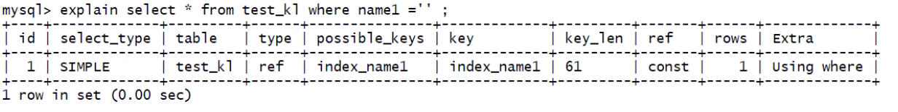
上图中的 test*k1 的 key_len 为 61, 该表中的索引是 char(20) 可以为 null. 所以在这里 key_len = 20 * 3 + 1 = 61  
如果一个表中存在符存在了一个非空索引 name 和一个可以为空的索引 name1, 然后执行以下语句:

```sql
alter table test_k1 add index name_name1_index (name, name1);
```

为表增加一个复合索引 name_name1_index , 则 key_len = 60 + 61 = 121  
此时执行以下 sql, 就可以复合索引的使用情况

```sql
select * from test_k1 where name1 = ''; #这里的key_len = 121
select * from test_k1 where name = '';  #这里的key_len = 60
```

MySQL 使用 2 个字符标识可变长度  

name2 是一个 varchar(20) 的索引, 所以此时的 key_len = 20 \* 3 + 1(null) + 2(可变长度) = 63

#### ref

作用: 指明当前表所参照的字段, 只有两个值 const 和 被引用的索引
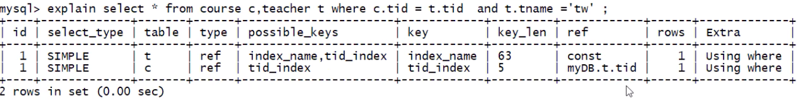
上图中, t.tname = 'tw', 'tw' 为常量, 索引第一行的 ref 为 const, c.tid = t.tid, ref 为 myDB.t.tid, 表明了 table c 的 tid_index 索引引用了 table t 的 tid 索引, myDB 是数据库名

#### rows

被索引优化查询的数据个数 (实际被通过索引查出的数据个数)

#### Extra

**using filesort** : 性能消耗比较大, 需要额外的一次排序(查询), 常见于 order by 语句中

> '排序' 的前提是必须先执行查询, 然后才能执行排序操作

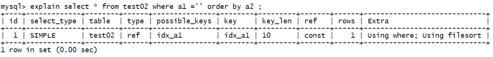
对于上图中的查询来说, 查询字段为 a1, 但是根据 a2 字段排序, 所以需要 '额外' 的执行一次查询

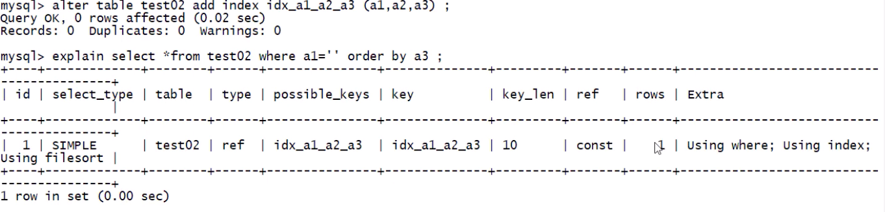
上图中, 表中存在了复合索引 idx_a1_a2_a3 (a1, a2, a3), 这里也出现了 using filesort, 因为这里把 复合索引中的 a2 '跨'了过去

**_小结:_**

| 索引类型 | 出现 using filesort 的原因                                                           | 避免方法                                               |
| -------- | ------------------------------------------------------------------------------------ | ------------------------------------------------------ |
| 单索引   | 如果排序和查找的是同一个字段, 就不会出现 using filesort , 如果不是同一个字段就会出现 | where 哪些字段, 就 order by 哪些字段                   |
| 符合索引 | 不能跨列 (最佳左前缀)                                                                | where 和 order by 按照复合索引的顺, 不要跨列或无序使用 |

**using temporary** : 性能损耗大, 用到了临时表. 常见于 group by 语句中. 如果已经有表了, 但不适用, 必须再来一张

> sql 的执行顺序: 先 where 后 group by

分别执行下列 sql:

```sql
select a1 from test02 where a1 in ('1', '2', '3') group by a2;
```

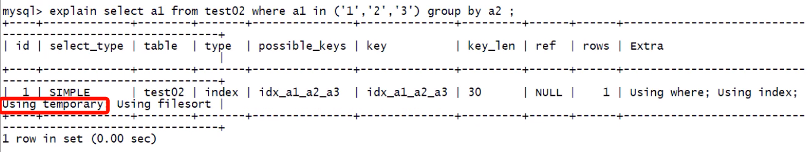

```sql
select * from test03 where test03 where a2=2 and a4=4 group by a2, a4;
```

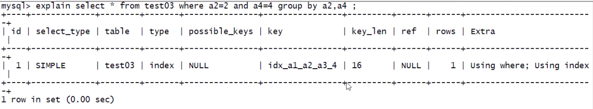

```sql
select * from test03 where test03 where a2=2 and a4=4 group by a3;  # 这里先执行 where a2=2 and a4=4 查询的结果集中没有 a3, 所以在执行 group by 需要另一个临时表
```

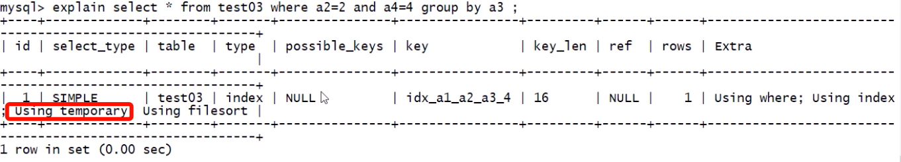
**_避免方法:_** 查询哪些列就根据哪些列 group by

**using index** : 性能提升, 索引覆盖. 原因: **不读取原文件, 只从索引文件中获取数据 (不需要回表查询)**. 只要使用到的列, 全部都在索引中, 就是 using index.

```sql
select a1, a2 from test02 where a1 = '' or a2 = '';
```

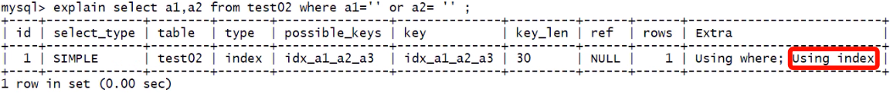
从上图中可以看出, test02 表中有一个复合索引 idx_a1_a2_a3, 在查询时值查了 a1,a2 都在复合索引中, 索引此时 extra 为 using index

索引覆盖 (using index) 会对 possible_keys 和 key 造成影响:

```sql
select a1, a2 from test02;
```

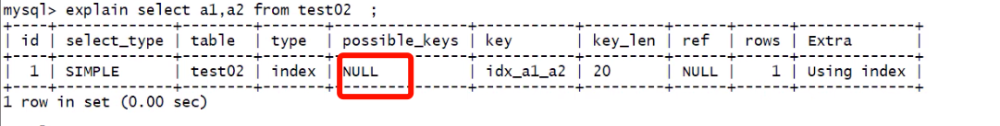

**_影响:_**

-   如果有 where , 索引只会出现在 key 中
-   如果没有 where , 索引回出现在 possible_keys 和 key 中

**using where** : 需要回表查询  
假设 age 为索引列, 查询语句为

```sql
select age , name  from ... where age = ... ; # 这条sql中必须回原表查name字段 , 所以会显示 using where
```

**impossible where** : where 永远为 false

```sql
select * from test02 where a1 = 'y' and a1 = 'x';
```

[extra 优化示例](./extra优化示例.md)  

---
[MySQL优化](./README.md)  
[主页](../../../../../)