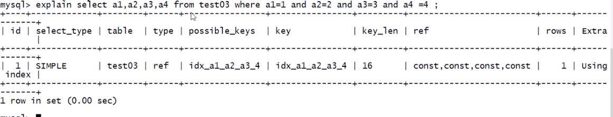
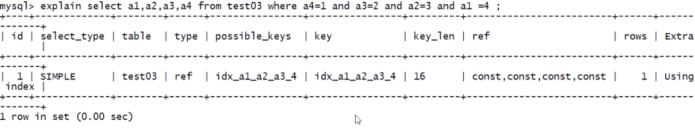
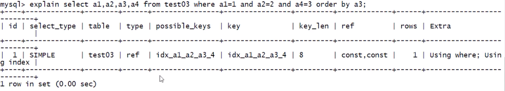
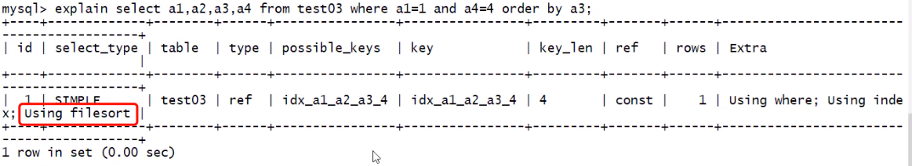
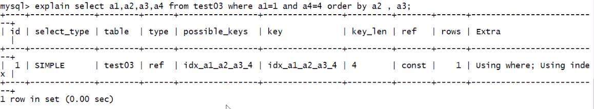

## 优化示例

---

建表语句:

```sql
create table test02 (
    a1 int(4) not null,
    a2 int(4) not null,
    a3 int(4) not null,
    a4 int(4) not null
);
alter table test03 add index idx_a1_a2_a3_a4 (a1, a2, a3, a4);
```

---

```sql
# 推荐写法 where 后的条件和复合索引顺序完全一致
select a1, a2, a3, a4 from test03 where a1 = 1 and a2 = 2 and a3 = 3 and a4 =4;
```



```sql
# where 后的条件和复合索引顺序不一致
select a1, a2, a3, a4 from test03 where a4 = 1 and a3 = 2 and a2 = 3 and a1 =4;
```


这里会发现, 第二条 sql where 后的条件和复合索引顺序不一致, 但是结果却和第一条 sql 的结果完全一致, 这是因为在 sql 执行前, **_经过了 sql 优化器的调整_** .

---

```sql
select a1, a2, a3, a4 from test03 where a1 = 1 and a2 = 2 and a4 = 3 order by a3;
```


上图中 extra 为 using where; using index, 说明了一部分是需要需要回表查询, 另一部分可以是用索引查询.  
在 where 条件中, a1, a2 使用了复合索引 idx_a1_a2_a3_a4, 此时 key_len = 8 = (3 + 1) \* 2, 也证明了这一点. 所以在 extra 中会出现 using index. 而 a4 因为跨列, 变成了无效索引, 索引需要回表查询, 在 extra 中出现了 using where . order by 中没有出现出现 using filesort, 这里的 a3 没有和 where 条件中的 a1, a2 跨列.

```sql
select a1, a2, a3, a4 from test03 where a1 = 1 and a4 = 3 order by a3;
```


上图 extra 中出现了 using filesort, 原因是跨列使用.

> 跨列使用是指: 把 where 和 order by 拼起来, 还是'跨'过了复合索引的某些列

上个 sql 中, 拼接以后顺序为 a1 - a2 - a4 - a3, 所以 a1, a2, a3 没有跨列  
在本 sql 中, 拼接后顺序为 a1 - a4 - a3, 造成了跨列

```sql
select a1, a2, a3, a4 from test03 where a1 = 1 and a4 = 3 order by a2, a3 ;
```


上图中的 where 和 order by 拼接后为 a1 - a4 - a2 - a3, a4 失效, 剩下的顺序符合复合索引顺序, 所以在 extra 中没有出现 using filesort

---

**_小结_** : 如果复合索引和使用顺序完全一致且不跨列使用, 则复合索引全部使用
