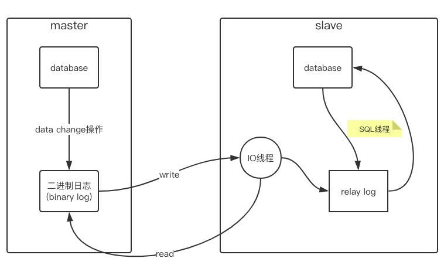
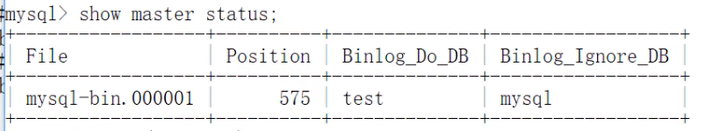

## 主从复制

主从复制是集群在数据库中的体现

-   原理:

    

    1. master 将改变的数据记录到二进制日志中 (binary log), 该过程称为二进制日志事件
    2. slave 将 master 的 binary log 拷贝到自己的 relay log (中继日志文件)中
    3. relay log 将数据读取到自己的数据库汇总

所以说, 主从复制是异步的, 串行化的, 有延迟的

-   配置:

    master : my.ini  
    slave : my.cnf

    配置前的准备:

    -   关闭防火墙:

        Windows : 控制面板 -> 系统和安全 -> Windows 防火墙
        Linux : server iptables stop - mysql

    -   允许远程连接

        支持 root 用户允许远程连接 mysql 数据库

        > grant all privileges on _._ to 'root'@'%' identified by '123456' with grant option;  
        > flush privileges;

    ### master my.ini 配置

    ```ini
    [mysqld]
    # 主机名 id
    server-id=1
    # binary log 二进制日志文件, 一般放在mysql目录的data文件夹, 这里是mysql-bin 文件, 会自动生成
    log-bin=".../data/mysql-bin"
    # 错误记录文件
    log-error=".../data/mysql-error"
    # 主从同步时忽略的数据库
    binlog-ignore-db=mysql
    # 主从同步时同步的数据库(默认是全部)
    binlog-do-db=test
    ```

    主库授权 哪台计算机中的数据库是自己的从库 (授权 192.168.1 网段汇总所有的数据库)

    > grant replication slave,reload,super on \*.\* to 'root'@'192.168.1.%' identified by 'root';  
    > flush privileges;

    查看主数据库的状态

    show master status;
    

    > file : mysql-bin.000001  
    > position : 575  
    > binlog_do_db: test  
    > binlog_ignore_db: mysql  
    > 以上参数 file 和 position 会发生改变, 每次在主从同步时, 需要查看这个属性值  
    > 在 data 目录下会有一个 mysql-index 文件, 里面记录了当前使用的二进制文件, 也就是现在的 file 属性. position 是二进制文件的游标

    ### slave my.cnf 配置

    配置大体一样

    ```ini
    [mysqld]
    # id
    server-id=2
    # binary log 二进制日志文件, 这里直接写文件名, 会直接放到data目录下
    log-bin=mysql-bin
    # 主从同步时同步的数据库(默认是全部)
    replicate-do-db=test
    ```

    从库授权 哪台计算机中的数据库是自己的主库

    > change master to master_host='主机 ip',master_user='主机用户',master_password='主机密码',master_log_file='主机 file',master_log_pos=主机 position

    如果之前配置过主从同步, 在执行上面命令有可能会报错:
    <font color='red'>This operator cannot be performed wiith a running slave; run STOP SLVAE first</font>  
    执行 STOP SLVAE 后再次执行上面配置就好了

    ### 开启主从同步

    start slave  
    检查工作状态 show slave status \G  
    主要观察 slave_io_running 和 slave_sql_running 确保二者都是 yes, 如果不都是 yes , 需要看下方的报错日志

    有可能的错误: 主从使用了相同的 ID  
    show variables = 'server_id';  
    虽然设置了 server-id = 2, 但是在执行时确实是 server-id = 1, 原因有可能 MySQL 自身 bug, 也有可能是因为主从数据库版本不一致造成  
    解决方法:  
    不用修改 mysql.cfg 方式配置, 使用命令设置 set global server-id = 2

---

[MySQL 优化](./README.md)  
[主页](../../../../../)
