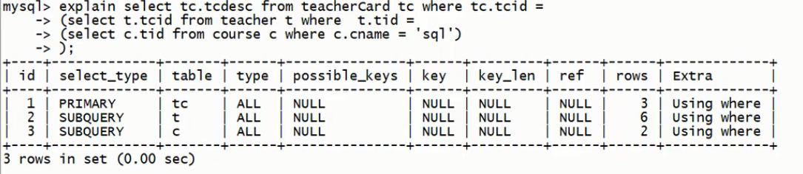
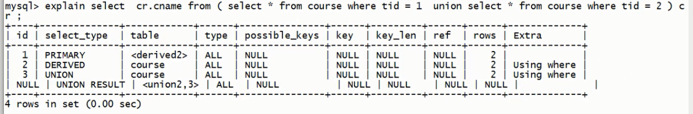

# MySQL优化准备

## explain 的参数说明

### 简单参数解释

参数 | 说明
-|-
id | 编号
select_type | 查询类型
table | 表名
type | 类型
possible_keys | 预测使用的类型
key | 实际使用的索引
key_len | 实际使用索引的长度
ref | 表之间的引用
rows | 通过索引查询到的数据量
Extra | 额外的信息

### 具体说明

#### id说明

id值相同, 从上到下, 顺序执行. __表的执行顺序是按照rows从小到大排列的[笛卡尔积]__, 数据少的表优先查询

id值不同, 值越大越优先执行

#### select_type 查询类型
select-type | 说明
-|-
PRIMARY | 包含子查询的主查询 (最外层)
SUBQUERY | 子查询 (非最外层)
SIMPLE | 简单查询 (不包含子查询, union)
DERIVED | 衍生查询 (使用了临时表):   1. 在from子查询中只有一张表, 例如:   select cr.cname from (select * form course from tid in (1,2)); cr   2. 在from子查询中, 如果有 table1 union table2 , 则说table1就是derived, table2 就是union. 例如:   select cr.cname from (select * from course where tid = 1 union select * from course where tid = 2) cr; 
UNION | 上例
UNION RESULT | 告知开发人员, 哪些些表存在union查询

上图说明了derived的第一种情况, table为<derived2>, 对应了id为2,select_type为derived的子查询

上图是derived的第二种情况, id为null的行select_type为union result, table为<union2,3>, 对应了id为2 和 id为3的查询结果进行了union

#### type 索引类型
要多type优化的前台: __有索引__. 平时出现比较多的是:  
__system > const > eq_ref > ref > range > index > all__  
从左到右效率逐渐降低, system和const只是理想情况; 实际优化后能达到ref 和 range

type类型 | 具体情况 | 结果表现 
-|-|-
system| 只有一条数据的系统表或衍生表只有一条数据的主查询 | 结果只有一条数据
const | 仅能查的一条数据的sql, 用于primary key 或者 unique 索引 (与索引类型有关) | 结果只有一条数据
eq_ref | 唯一性索引, 对于<strong>每个</strong>索引键的查询, 返回匹配<strong>唯一一行</strong>数据 (有且只有一个, 不能多, 不能没有), 常见于唯一索引和主键索引 | 结果多条, 但每条数据是唯一的
ref | 非唯一性索引, 对于每个索引键, 返回匹配的所有行 | 结果多条, 每条数据是0条或多条
range | 检索指定范围的行, where 条件后是一个查询范围, 如: between, > , < , >= ... 特殊: in 有时会失效, 从而转为 all级别 |  select t.* from teacher t where t.id < 3 , t.id 为索引
index | 查询全部索引中数据 | select tid from teacher; tid为teacher表的索引
all | 查询全部表中数据 | select name from teacher; name不是teacher表的索引
