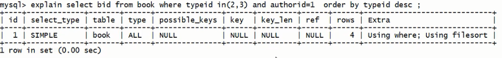
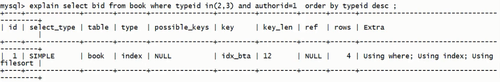

# 优化示例

## 单表优化

数据准备 :   
```sql
create table book (
    bid int(4) primary key,
    name varchar(20) not null,
    authorid int(4) not null,
    publicid int(4) not null,
    typeid int(4) not null
);

insert into book values (1, 'tjava', 1, 1, 2);
insert into book values (1, 'tc', 2, 1, 2);
insert into book values (1, 'wx', 3, 2, 1);
insert into book values (1, 'math', 4, 2, 3);
commit;
```

```sql
# 查询 authorid=1 且 typeid 为2或3的 bid , 并按照 typeid 排序
select bid from book where typeid in (2,3) and authorid = 1 order by typeid desc;
```
explain 结果为: 


缺点:  

- type 为 all, 效率最低
- key, possible_key 为 null, 没有索引
- extra 存在 using filesort

### 优化

```sql
# 加索引
alter table book add index idx_bta (bid, typeid, authorid);
```
结果: 

有了一定的优化  

- type 为 index
- key 中有了索引
- extra 中有 using index


## 两表优化

## 三表优化

---
[MySQL优化](./README.md)  
[主页](../../../../../)