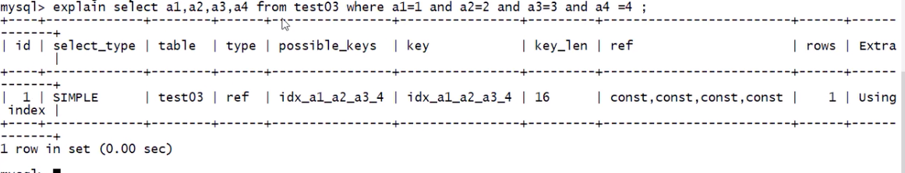
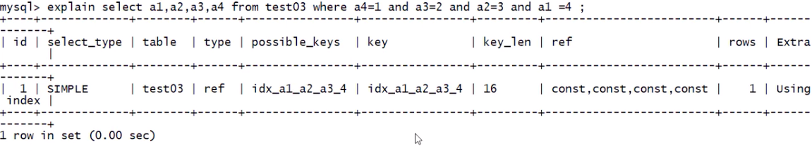

## 优化示例

---

建表语句:

```sql
create table test02 (
    a1 int(4) not null,
    a2 int(4) not null,
    a3 int(4) not null,
    a4 int(4) not null
);
alter table test03 add index idx_a1_a2_a3_a4 (a1, a2, a3, a4);
```

---

```sql
# 推荐写法 where 后的条件和复合索引顺序完全一致
select a1, a2, a3, a4 from test03 where a1 = 1 and a2 = 2 and a3 = 3 and a4 =4;
```



```sql
# where 后的条件和复合索引顺序不一致
select a1, a2, a3, a4 from test03 where a4 = 1 and a3 = 2 and a2 = 3 and a1 =4;
```


这里会发现, 第二条 sql where 后的条件和复合索引顺序不一致, 但是结果却和第一条 sql 的结果完全一致, 这是因为在 sql 执行前, **_经过了 sql 优化器的调整_** .

---

```sql
# where 后的条件和复合索引顺序不一致
select a1, a2, a3, a4 from test03 where a1 = 1 and a2 = 2 and a4 = 3 order by a3;
```
