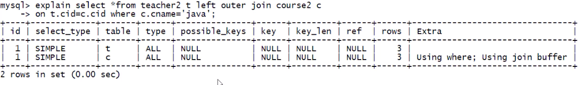
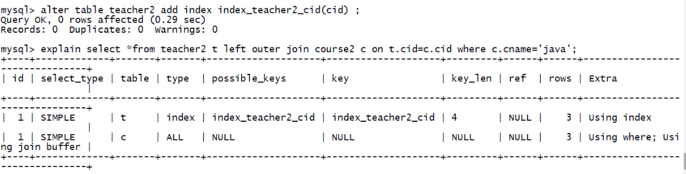
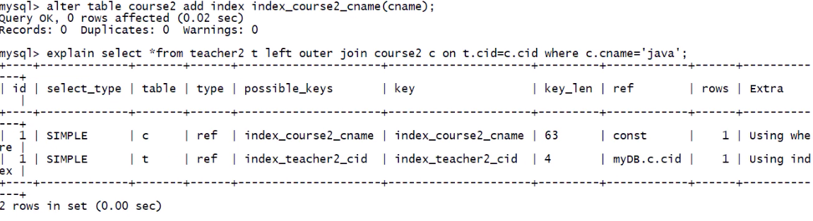

# 优化示例

## 单表优化

数据准备 :

```sql
create table book (
    bid int(4) primary key,
    name varchar(20) not null,
    authorid int(4) not null,
    publicid int(4) not null,
    typeid int(4) not null
);

insert into book values (1, 'tjava', 1, 1, 2);
insert into book values (2, 'tc', 2, 1, 2);
insert into book values (3, 'wx', 3, 2, 1);
insert into book values (4, 'math', 4, 2, 3);
commit;
```

```sql
# 查询 authorid=1 且 typeid 为2或3的 bid , 并按照 typeid 排序
select bid from book where typeid in (2,3) and authorid = 1 order by typeid desc;
```

explain 结果为:


缺点:

-   type 为 all, 效率最低
-   key, possible_key 为 null, 没有索引
-   extra 存在 using filesort

### 优化

```sql
# 加索引, 三个字段都加
alter table book add index idx_bta (bid, typeid, authorid);
```

结果:

有了一定的优化

-   type 为 index
-   key 中有了索引
-   extra 中有 using index

> 索引一旦进行升级优化, 需要将前的旧索引删掉, 防止干扰

```sql
# 删除原来的索引
drop index idx_bta on book;
# 根据SQL 的解析顺序, 调整索引顺序
alter table book add index idx_tab ( typeid, authorid, bid);
```

where 条件只用到了 typeid 和 authorid, 这里可以只把复合索引变成这两个字段复合, 但是三个字段复合话, 在执行 select 时就不需要回表查询, 所以这里复合索引保留了 bid, 只是调整了顺序


-   经这次优化, 去掉了 extra 中的 using filesort

```sql
# 删除原来的索引
drop index idx_tab on book;
# 调整复合索引, 原SQL中 in 有时会失效, in失效后会造成typeid索引失效从而导致复合索引typeid后的索引失效, 所以typeid在复合索引最前是不合适的
alter table book add index idx_atb ( authorid, typeid, bid);
# 调整查询SQL
select bid from book where authorid = 1 and typeid in (2,3) order by typeid desc;
```


-   经过上述优化, type 级别提升 index -> ref (不同版本的 MySQL 有可能会出现 range)

上图中 extra 出现的 using where(回表查询)是因为 in 使得索引失效, 所以 typeid 字段需要回表查询

```sql
select bid from book where authorid = 1;
```


上图中 extra 值出现了 using index, 可以充分证明了上次优化是 in 破坏了索引, 而且在上次优化的 key_len=4, 说明了复合索引值使用了第一个 authorid 字段

**小结 :**

-   最佳左前缀, 在按照 SQL 解析顺序创建索引, 保持索引定义和使用顺序一致
-   索引需要逐步优化
-   把含有 in 的范围查询放到 where 最后, 防止索引失效

## 两表优化

数据准备 :

```sql
create table teacher2 (
    tid int(4) primary key,
    cid int(4) not null
);
insert into teacher2 values(1,2);
insert into teacher2 values(2,1);
insert into teacher2 values(3,3);

create table course2 (
    cid int(4) ,
    cname varchar(20)
);
insert into course2 values(1,'java');
insert into course2 values(2,'python');
insert into course2 values(3,'kotlin');
commit;
```

```sql
# 优化目标SQL
select * from teacher2 t left join course2 c on t.cid = c.cid where c.cname = 'java';
```

结果


多张表时索引应该加在哪儿?

-   **小表驱动大表** , 即 小表.x = 大表.y (本例中数据量一致, 假设 teacher2 表为小表)
-   索引建立在经常使用的字段上 (本例中 t.cid = c.cid , t.tid 经常使用)
    -   一般左连接, 给左表加, 右连接, 给右表加

> 假设小表中有 10 条数据, 大表中有 300 条数据
>
> ```python
> # 小表.x = 大表.y
> for i in range( 10) :
>   for j in range(300) :
>       ...
>
>
> # 大表.y = 小表.x
> for i in range( 300) :
>   for j in range(10) :
>       ...
> ```
>
> 上面两个总的循环次数一致, 但是外层循环次数小程序执行效率更高

```sql
# 给teacher2表 cid加索引
alter table teacher2 add index index_teacher2_cid(cid);
```



> 这里的 extra 中 有 using join buffer, 是 SQL 优化器加的连接缓存

-   优化后将 type 级别提升到了 index

```sql
# 给 where 后的字段加索引
alter table course2 add index index_course2_cname(cname);
```



-   优化后将 type 的级别提升到了 ref

## 三表优化

---

[MySQL 优化](./README.md)  
[主页](../../../../../)
