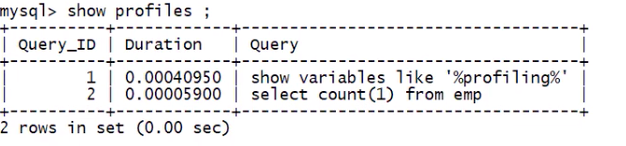
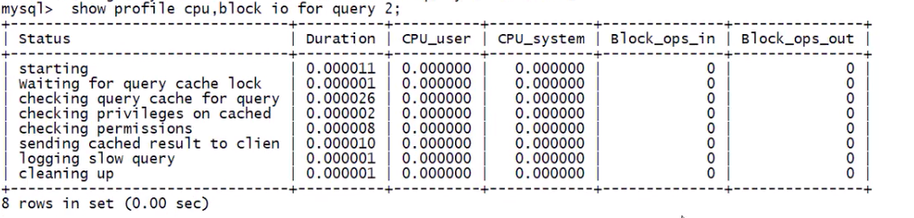

## 分析海量数据

数据准备:

```sql
create database testdata;
use testdata;
# 部门表
create table dept (
    dno int(5) primary key default 0,
    dname varchar(20) not null default '',
    loc varchar(30) default ''
) engine = innodb default charset = utf8;

# 员工表
create table emp (
    eid int(5) primary key,
    ename varchar(20) not null default '',
    job varchar(20) not null default '',
    deptno int(5) not null default 0
) engine = innodb default charset = utf8;


delimiter $ # 定义以 $ 结尾
# 随机字符串的存储函数
create function randstring (n int) returns varchar(255)
begin
    declare all_str varchar(100) default 'ABCDEFGHIJKLMNOPQRSTUVWXYZabcdefghijklmnopqrstuvwxy';
    declare return_str varchar(255) default '';
    declare i int default 0;
    while i < n
    do
        set return_str = concat(return_str, substring(all_str, floor(1+rand()*52), 1));
        set i = i + 1;
    end while;
    return return_str;
end $


# 随机整数的存储函数
create function ran_num() returns int(5)
begin
    declare i int default 0;
    set i = floor(rand()*100);
    return i;
end $


# 给emp表插数据
create procedure insert_emp(in eid_start int(10), data_times int(10))
begin
    declare i int default 0;
    set autocommit = 0; # 关闭自动提交
    repeat
        insert into emp values(eid_start + i, randstring(5), 'other', ran_num());
        set i = i+1;
        until i = data_times
    end repeat;
    commit;
end $


# 给dept表查数据
create procedure insert_dept(in dno_start int(10), data_times int(10))
begin
    declare i int default 0;
    set autocommit = 0; # 关闭自动提交
    repeat
        insert into dept values(dno_start + i, randstring(5), randstring(8));
        set i = i+1;
        until i = data_times
    end repeat;
    commit;
end $

delimiter ; # 还原, 以 ; 结尾

# 调用方法, 插入数据
call insert_emp(1000, 800000);
call insert_dept(10, 30);
```

> 在执行存储过程时, 有可能会报错:  
> <font color='red'>ERROR 1418 (HY000): This function has none of DETERMINISTIC, NO SQL,or READS SQL DATA in its declaration and binary logging is enabled(you _might_ want to use the less safe log_bin_trust_function_creators variable)</font>  
> 有可能是存储过程如之前的慢查询日志冲突了  
> 解决方法:
>
> -   临时解决 (设置 log_bin_trust_function_creators 开启)  
>     show variables like '%log_bin_trust_function_creators%';  
>     set global log_bin_trust_function_creators = 1;
> -   永久解决  
>     在 MySQL 配置文件 [mysqld] 里增加 log_bin_trust_function_creators = 1

\_\_分析海量数据:

> 本身比较费性能. 这些仅仅在开发, 调优过程中打开. 在最终部署实施时一定要关闭

1. profiles

    > profiles 默认关闭

    ```sql
    # 查看profiles是否打开
    show variables like '%profiling%';
    # 打开profiles
    set profiles = on;
    # 查看profiles
    show profiles;
    ```

    

    profiles 会记录从打开 profiles 的所有 SQL, 但是只能看到总共消费的时间, 看不到具体每个部分(cpu, i/o 等)消费的时间

2. 精确分析 SQL: SQL 诊断

    ```sql
    # 显示所有细节
    show profile all for query 上一步查询到的 Query_ID

    #显示cpu , block io 相关的细节
    show profile cpu, block io for query 上一步查询到的 Query_ID
    ```

    

3. 查询全局日志

    ```sql
    # 查看是否打开
    show variables like '%general_log%';
    # 打开全局日志
    set global general_log = 1;
    # 可以保存到表中或者文件中, 二者选择一个

    # 设置日志记录到表中
    set global log_output = 'table'

    # 设置日志记录到文件中
    set global log_output = 'table'
    set global general_log_file = '/tem/general_log.log'
    # 查看profiles
    show profiles;
    ```

    会记录开启之后的全部日志: mysql.general_log 表中  
    这些记录并不会有查询使用多少时间, 只是一个日志, 从侧面大概分析. 正在要分析还是需要 profiles

---

[MySQL 优化](./README.md)  
[主页](../../../../../)
