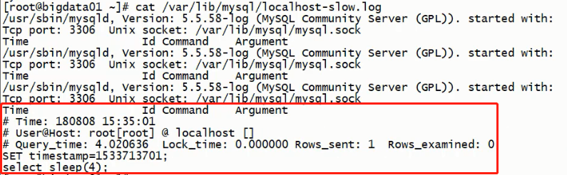

## SQL 排查 - 慢查询日志

> 慢查询日志: MySQL 功能的一种日志功能, 用于记录 MySQL 中响应时间超过阀值的 SQL 语句 (long_query_time, 默认 10 秒)

慢查询日志默认是 **关闭** 的, 建议在开发调优时打开, 而最终部署时关闭

```sql
# 检查是否开启慢查询日志
show variables like '%slow_query_log%';
```

开启慢查询日志

-   临时开启
    ```sql
    # MySQL退出并重启自动停止(在内存中开启)
    set global slow_query_log = 1;
    ```
-   永久开启  
     在 /etc/my.cnf 文件中的 [mysqld] 下追加
    ```ini
    ...
    [mysqld]
    # 开启慢查询
    ...
    slow_query_log = 1
    # 存放日志的文件
    slow_query_log = /var/lib/mysql/localhost-slow.log
    ...
    ```

慢查询阀值 :

```sql
# 查看阀值
show variables like '%long_query_time%';
```

设置阀值 :

-   临时设置
    ```sql
    # 修改后重新登录后生效 MySQL退出并重启自动重置
    set global long_query_time = 1;
    ```
-   永久开启设置
    在 /etc/my.cnf 文件中的 [mysqld] 下追加
    ```properties
    ...
    [mysqld]
    ...
    # 需要重启服务才能生效
    long_query_time = 3
    ...
    ```

查看慢查询 SQL :

```sql
# 数据量较少时, 不会出现慢查询, 模拟慢查询可以使用sleep
select sleep(4);

# 查询时间超过阀值的SQL数量
show global status like '%slow_queries%';
```

查看慢查询 SQL:

-   可以通过 slow_query_log 自定义的日志文件

    

-   通过 mysqldumpslow 工具查看 , 可以增加过滤条件来定位慢查询 SQL  
    这是一个 MySQL 自带的工具, 具体参数可以通过 mysqldumpslow --help 查看, 一下简单说明下常用的参数 :  
    s : 排序  
    r : 逆序  
    l : 锁定时间  
    g : 正则匹配

```shell
-- 返回记录最多的3个SQL
mysqldumpslow -s r -t 3 /var/lib/mysql/localhost-slow.log
-- 返回访问最多的3个SQL
mysqldumpslow -s c -t 3 /var/lib/mysql/localhost-slow.log
-- 按照时间排序 , 前十条包含 left join 的SQL
mysqldumpslow -s t -t 10 -g /var/lib/mysql/localhost-slow.log
```

---

[MySQL 优化](./README.md)  
[主页](../../../../../)
