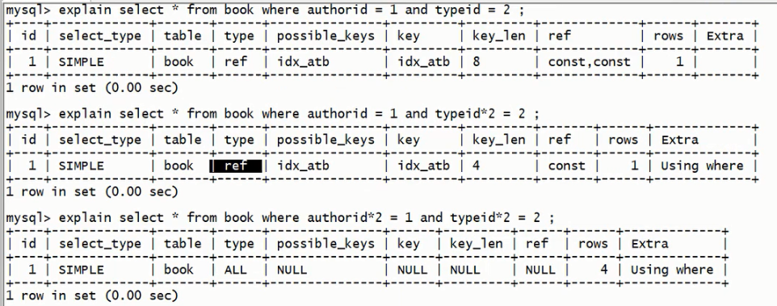
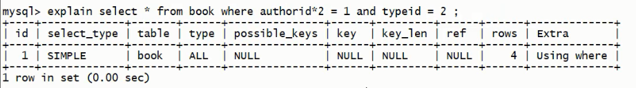
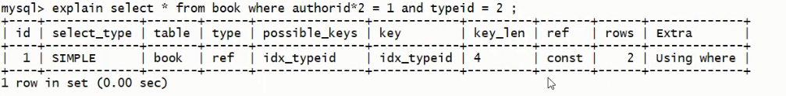

## 索引失效原因

1. 复合索引 :  
    a. 不要跨列或无序使用 (最佳左前缀)  
    b. 尽量全索引匹配
    c. 不能使用不等于 (!= , <>)
2. 不要在索引上进行任何操作 (计算, 函数, 类型转换等), 否则索引失效.  
    __错误示例 1__ :  
    假设 xx.a 是索引  select * from xx where xx.a * 3 = 9;

    __错误示例 2__ :  
    ```sql
    # 分别执行下面三条SQL
    select * from book where authorid = 1 and typeid = 2;
    select * from book where authorid = 1 and typeid*2 = 2;
    select * from book where authorid*2 = 1 and typeid*2 = 2;
    ```
    

    从结果可以看出 :  
    第一条SQL, key_len = 8 使用了复合索引的前两个字段, type = ref  
    第二条SQL, key_len = 4, 只使用了第一个字段, 因为第二个索引字段 typeid 使用进行了计算造成了索引失效, extra = using where, 需要回表查询  
    第三条SQL, key_len = null, key = null 没有使用索引, 因为两个索引字段都进行了计算, type 也变成了 all
    ```sql
    # 运行SQL
    select * from book where authorid*2 = 1 and typeid = 2;
    ```
    
    上面的SQL运行结果, key = null, type = all, 因为author索引失效, 而造成复合索引整体失效 (最佳左前缀)  
    ```sql
    # 删除复合索引
    drop index idx_atb on book;
    # 分别增加为authorid 和 typeid 字段增加单值索引
    alter table book add index idx_authorid(authorid);
    alter table book add index idx_typeid(typeid);
    ```
    
    单值索引是不会受到影响的
