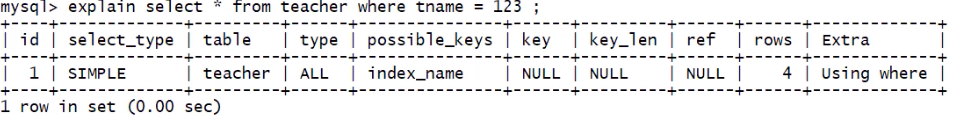
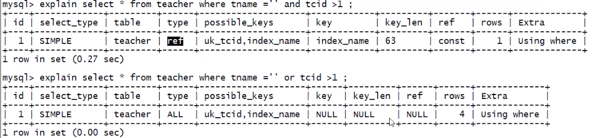
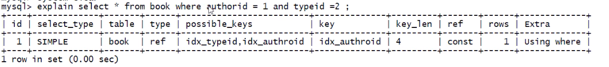
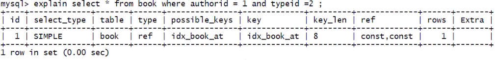
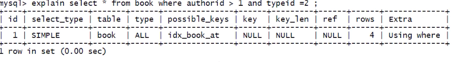
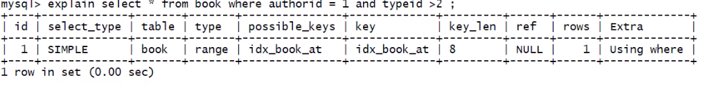
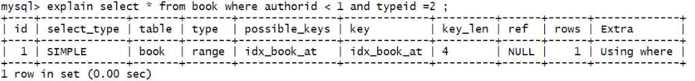
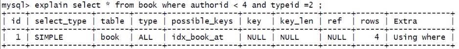

## 索引失效原因

1. 复合索引 :  
   a. 不要跨列或无序使用 (最佳左前缀)  
   b. 尽量全索引匹配

2. 不要在索引上进行任何操作 (计算, 函数, 类型转换等), 否则索引失效.  
   **错误示例 1** :  
   假设 xx.a 是索引 select _ from xx where xx.a _ 3 = 9;

    **错误示例 2** :

    ```sql
    # 分别执行下面三条SQL
    select * from book where authorid = 1 and typeid = 2;
    select * from book where authorid = 1 and typeid*2 = 2;
    select * from book where authorid*2 = 1 and typeid*2 = 2;
    ```

    

    从结果可以看出 :  
     第一条 SQL, key_len = 8 使用了复合索引的前两个字段, type = ref  
     第二条 SQL, key_len = 4, 只使用了第一个字段, 因为第二个索引字段 typeid 使用进行了计算造成了索引失效, extra = using where, 需要回表查询  
     第三条 SQL, key_len = null, key = null 没有使用索引, 因为两个索引字段都进行了计算, type 也变成了 all

    ```sql
    # 运行SQL
    select * from book where authorid*2 = 1 and typeid = 2;
    ```

    
    上面的 SQL 运行结果, key = null, type = all, 因为 author 索引失效, 而造成复合索引整体失效 (最佳左前缀)

    ```sql
    # 删除复合索引
    drop index idx_atb on book;
    # 分别增加为authorid 和 typeid 字段增加单值索引
    alter table book add index idx_authorid(authorid);
    alter table book add index idx_typeid(typeid);
    ```

    
    单值索引是不会受到影响的

    **错误示例 3** :

    ```sql
    # tname 是字符类, 这里使用 tname = 123, 做了类型转换
    select * from teacher where tname = 123
    ```

    

3. 不能使用不等于 (!= , <>) 和 is null (is not null), 否则造成失效, 如果是复合索引, 则会造成自身已经右侧所有索引失效
4. 一般来说, 范围查询 (>, <, in), 索引本身有效, 右侧失效 [不 100%正确]
5. 为了防止出现范围查询造成的索引失效, 应该尽量使用覆盖索引 (using index)
6. like 尽量以常量开头, 不要以%开头 (like '%...'), 否则索引失效. 如果必须以%开头, 使用索引覆盖, 挽救一点
7. 尽量不要使用 or, 否则索引失效  

   **示例**
   
   

### 概率优化

SQL 优化, 只是一种概率上的优化, 不是 100% 会优化

-   原因: 服务层中有 SQL 优化器, 可能会影响开发人员的优化

**示例 1**

```sql
select * from book where authorid = 1 and typeid = 2;
```


上图中的 possible_keys 和 key 不符, 在该表中 authorid 和 typeid 两个字段都有索引

```sql
# 删除book表中原先的索引
drop index idx_authorid on book;
drop index idx_typeid on book;
alter table book add index idx_book_at (authorid, typeid);

# explain SQL
select * from book where authorid = 1 and typeid = 2;
```


复合索引, possible_keys 和 key 一致, key_len = 8, 两个字段都使用了

**示例 2**

```sql
select * from book where authorid > 1 and typeid = 2;
```


'>' 使自身和右侧索引全部失效

```sql
# 使 typeid > 2
select * from book where authorid = 1 and typeid > 2;
```


'>' 并没有使自身索引失效

```sql
# 将第一个SQL的 > 变成 <
select * from book where authorid < 1 and typeid = 2;
```


只使用了一个索引

```sql
# 把 authorid < 1 变成 authorid < 4
select * from book where authorid < 4 and typeid = 2;
```


索引全部失效

## 一些其他的优化方法

-   exist 和 in

    ```sql
    select ... from table where exist (子查询);
    select ... from table where 字段 in (子查询);
    ```

    如果主查询的数据集较大, 使用 in 效率高

    如果子查询的数据集较大, 使用 exist 效率高

    原因: exist 是用主查询结果去子查询中匹配结果, in 用子查询结果去主查询中匹配结果, **小表驱动大表**

-   order by

    order by 经常伴随这 using filesort , using filesort 有两种算法 (根据 I/O 的次数): **双路排序** 和 **单路排序**

    | 算法     | 版本              | 扫描磁盘次数 | 排序过程                                                                                                                                                                           |
    | -------- | ----------------- | ------------ | ---------------------------------------------------------------------------------------------------------------------------------------------------------------------------------- |
    | 双路排序 | MySQL4.1 之前默认 | 2 次         | 第 1 次扫描 : 从磁盘读取排序字段, 对排序字段(在 buffer 中)进行排序; <br>第 2 次扫描 : 扫描其他字段                                                                                 |
    | 单路排序 | MySQL4.1 之后默认 | 1 次         | 直接读取所有字段, 然后在 buffer 中进行排序, 但是会有一定的隐患, 有可能需要多次 I/O<br> 原因: buffer 大小是有限的, 如果数据量过大, 就无法把所有字段一次性读取完成, 会进行"分片读取" |

    -   单路排序会比双路排序占用更多的 buffer, 在使用单路排序时, 如果数据量过大, 可以适当加大 buffer 的容量: set max_length_for_sort_data = 1024 单位是 byte
    -   如果 max_length_for_sort_data 太小 (需要排序的列的总大小超过了 max_length_for_sort_data 定义的大小), MySQL 会自动 单路 => 双路

    提高 order by 查询策略:  
    a. 选择使用单路, 双路; 调整 max*length_for_sort_data 大小  
    b. 避免使用 select * ... 原因:

        1.  * 还需要计算 * 代表了哪些字段
        2.  * 永远不会使用索引覆盖 using index

    c. 复合索引, 不要跨列, 无序使用  
    d. 尽量保证全部的排序字段 排序的一致性 (都是升序或都是降序)

---

[MySQL 优化](./README.md)  
[主页](../../../../../)
