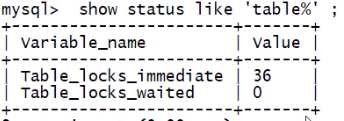
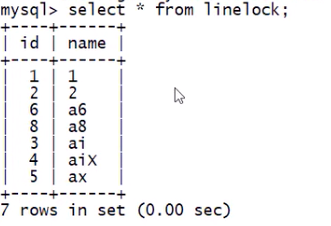
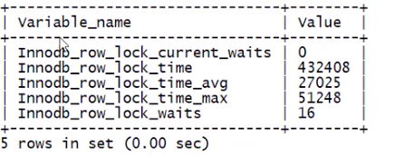

## 锁机制详解

    锁是为了解决资源共享造成的并发问题

锁机制分类:

-   根据操作类型分为: 读锁, 写锁

    | -    | 别名           | 说明                                                   |
    | ---- | -------------- | ------------------------------------------------------ |
    | 读锁 | 共享锁, 乐观锁 | 对同一条数据, 多个读操作可以同时进行, 互补干扰         |
    | 写锁 | 互斥锁, 悲观锁 | 如果当前写操作没有完毕, 则无法进行其他的读操作, 写操作 |

*   根据操作范围分为: 表锁, 行锁, 页锁

    | -    | 范围                   | 例子                                    | 死锁         | 特点                                 |
    | ---- | ---------------------- | --------------------------------------- | ------------ | ------------------------------------ |
    | 表锁 | 一次性对一张表整体加锁 | MyISAM 存储引擎使用表锁, 开销小, 加锁块 | 无死锁       | 锁范围大, 容易发生锁冲突, 并发度低   |
    | 行锁 | 一次性对一张表整体加锁 | InnoDB 存储引擎, 开销大, 加锁慢         | 容易出现死锁 | 锁范围小, 不容易发生锁冲突, 并发度高 |
    | 页锁 | 很少见, 暂不用了解     | -                                       | -            | -                                    |


    -   表锁

        ```sql
        # 数据准备
        # MyISAM自带表锁
        create table tablelock (
            id int primary key auto_increment,
            name varchar(20)
        ) engine = myisam;

        # 插数据
        insert into tablelock (name) values ('a1');
        insert into tablelock (name) values ('a2');
        insert into tablelock (name) values ('a3');
        insert into tablelock (name) values ('a4');
        insert into tablelock (name) values ('a5');
        commit;

        ```

        -   读锁

            加锁为 tablelock 加 read 锁后, 分别在两个会话中运行 SQL:

            ```sql
            # 会话 0:
            lock table tablelock read;
            select * from tablelock; # ok
            delete from tablelock where id = 1; # error

            select * from emp; # error
            delete from emp where eid = 1; # error

            # 会话 1:
            select * from tablelock; # ok
            delete from tablelock where id = 1; # 会一直等待, 直到会话0 将锁释放

            select * from emp; # ok
            delete from emp where eid = 1; # ok
            ```

            **读锁结论 :**

            1. 会话 0 对 A 表加 read 锁,那么会话 0:
               可以对 A 进行读操作, 不能进行写操作. 且不能对其他表进行读\写操作. 即, 该表只能对 A 进行读取, 其他操作都不能进行
            2. 会话 0 对 A 表加 read 锁, 其他会话:
               a. 可以对其他表(A 表以外的表)进行读\写操作
               b. 对 A 表 读-可以, 写-需要等到释放锁

        -   写锁

            会话 0 加 write 锁 (SQL 省略)
            **写锁结论 :**

            1. 会话 0 对 A 表加 write 锁,那么会话 0 :
               可以对 A 表可以做任何操作(增删改查), 但是不能操作其他表
            2. 会话 0 对 A 表加 write 锁,那么其他会话:
               可以对 A 表做任何操作(增删改查), 但是必须等待释放锁

        MySQL 表级锁的锁模式:

        MyISAM 在执行查询(select)语句前, 会自动给涉及的所有表加读锁; 在执行更新操作(DML)前, 会自动给所有涉及到的表加写锁;
        所以在对 MyISAM 表进行操作, 会发生以下情况:
            1. 对 MyISAM 表的读操作(加读锁), **不会阻塞** 其他进程(会话)对同一张表的 **读请求**, 但会阻塞对同一张表的写请求, 只有当 **读锁释放后**, 才会执行其他进程的写操作
            2. 对 MyISAM 表的写操作(加写锁), **会阻塞** 其他进程(会话)对同一张表的所有请求, 只有当读锁 **释放后**, 才会执行其他进程的操作

        表锁分析相关 SQL:

        ```sql
        # 查看哪些表被加锁, 1 代表加了锁
        show open tables;

        # 分析表锁定的严重程度
        show status like 'table%';

        # 增加锁
        lock table 表1 read/write, 表1 read/write , ...

        # 释放锁
        unlock tables;
        ```


        > 分析表锁定的严重程度 : show status like 'table%';
        >
        > 
        >
        > Table_locks_immediate: 可以获取到的锁, Table_locks_waited: 需要等待的表锁数(如果值越大, 说明存在更大的锁竞争)
        > 一般建议: Table_locks_immediate/Table_locks_waited > 5000 采用 InnoDB 引擎, 小于 5000 采用 MyISAM


    -   行锁

        > MySQL DML语句会自动commit, Oracle不会.
        >
        > 为了演示行锁, 需要把MySQL的自动提交关闭:
        > 方式一: set autocommit = 0;
        > 方式二: start transaction
        > 方式三: begin

        ```sql
        # 数据准备
        create table linelock (
            id int primary key auto_increment,
            name varchar(20)
        ) engine = InnoDB;

        # 插数据
        insert into linelock (name) values ('a1');
        insert into linelock (name) values ('a2');
        insert into linelock (name) values ('a3');
        insert into linelock (name) values ('a4');
        insert into linelock (name) values ('a5');
        commit;
        ```

        操作 :
        ```sql
        # 会话0: 写操作, 没有commit
        insert into linelock values ('a6');

        # 会话1: 写操作, 修改同一条数据, 会出现"等待状态", 直到锁被释放
        update linelock set name = 'ax' where id = 6;
        ```

        __行锁总结 :__

        1. 如果会话 x 对某条数据 A 进行 DML 操作, 则其他会话需要等 x 结束事务后才能对 A 进行操作
        2. 表锁是通过 unlock tables 和 事务 来解锁 ; 行锁只能通过事务解锁 [commit, rollback]
        3. 行锁锁的是一行数据, 因此操作的是不同的数据就不会相互干扰

        __行锁的注意事项 :__

         1. 如果没有索引或者索引失效, 行锁会转为表锁.
            __例如 :__
            ```sql
            # linelock 表中存在了 name 的索引, name 字段是 varchar 类型
            # 会话0:
            update linelock set name = '22' where name = 2
            # 会话1:
            update linelock set name = '33' where name = 3
            ```
            执行上面的 SQL 会发现会话1被阻塞了, 就是因为 会话0 的 name 字段为varchar, 而 where条件 name = 2 出现了类型转换, 从而导致 name 索引失效, 行锁也变成了表锁
        2. 行锁实际加锁的范围就是 where 后面的范围 (不是实际的值)

            行锁的一种情况:
            间隙锁 [ 值在范围内, 但却不存在 ]

            

            ```sql
            # 如上图中, 在1-8中, 没有 id = 7 的数据, id = 7 就是间隙, 在执行下面的SQL语句时 MySQL会自动给 id = 7 加锁, 就是间隙锁
            update linelock set name = 'x' where id < 9 and id > 1;

            # 另一个会话在执行和 id = 7 相关的DML语句时, 就会阻塞, 直到锁被释放
            insert into linelock values (7, '333');
            ```
        3. 通过 for update 对query语句加锁:
            ```sql
            select * from linelock where id = 3 for update;
            ```


        行锁:

        InnoDB引擎默认行锁;
        - 缺点: 比表锁性能损耗大
        - 优点: 并发能力强

        行锁分析相关SQL:
         ```sql
         show status like '%innodb_row_lock%';
         ```
         

        Innodb_row_lock_current_waits: 当前正在等待锁的数量

        Innodb_row_lock_time: 从系统启动到现在等待总时长

        Innodb_row_lock_time_avg: 从系统启动到现在等待平均总时长

        Innodb_row_lock_time_max: 从系统启动到现在等待最大时间

        Innodb_row_lock_waits: 从系统启动到现在等待总次数

---

[MySQL 优化](./README.md)  
[主页](../../../../../)
