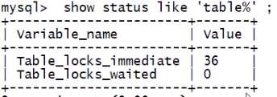
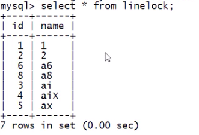
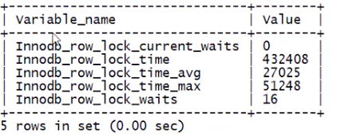

[toc]

## 锁类型

    锁是为了解决资源共享造成的并发问题


**术语简介**

- 行级锁 (存储引擎实现)
  - 行共享锁, 独占锁
  - 间隙锁
  - Next-Key 锁
  - 插入意向锁
  - Predicate Locks
- 表级锁
  - MDL 元数据锁 (metadata lock)
  - 意向共享锁, 意向排它锁
  - 表共享锁, 独占锁
  - 自增锁


## 锁详解


锁机制分类:

-   根据操作类型分为: 读锁, 写锁
	|      | 别名                                 | 说明                                                   |
    | ---- | ------------------------------------ | ------------------------------------------------------ |
    | 读锁 | 共享锁, 乐观锁, S 锁                 | 对同一条数据, 多个读操作可以同时进行, 互补干扰         |
    | 写锁 | 互斥锁, 悲观锁, 独占锁, 排它锁, X 锁 | 如果当前写操作没有完毕, 则无法进行其他的读操作, 写操作 |

*   根据操作范围分为: 表锁, 行锁, 页锁

    |      | 范围                   | 例子                                    | 死锁         | 特点                                 |
    | ---- | ---------------------- | --------------------------------------- | ------------ | ------------------------------------ |
    | 表锁 | 一次性对一张表整体加锁 | MyISAM 存储引擎使用表锁, 开销小, 加锁块 | 无死锁       | 锁范围大, 容易发生锁冲突, 并发度低   |
    | 行锁 | 一次性对一条数据加锁   | InnoDB 存储引擎, 开销大, 加锁慢         | 容易出现死锁 | 锁范围小, 不容易发生锁冲突, 并发度高 |
    | 页锁 | 很少见, 暂不用了解     | -                                       | -            | -                                    |

### 表锁

#### Server 层的 MDL 锁

元数据锁**不依赖任何存储引擎**. 此锁不需要显示调用, 只有**有事务在执行**, 对应的连接就会取得元数据锁. 当事务执行的时候理论上是不能容忍表结构在中途发生变化

1. 分为 MDL 读锁和写锁两种
2. select 和 DML 语句申请读锁. MDL 读锁之间不冲突, 所以多个 select 和 DML 语句可以同时执行
3. DDL 语句申请写锁, 获取写锁时需要等待读锁释放, 且申请写锁会阻塞后续所有 MDL 锁的获取

操作示例 : 

```sql
  # 数据准备
  # MyISAM自带表锁
  create table tablelock (
  id int primary key auto_increment,
  name varchar(20)
  ) engine = myisam;
  
  # 插数据
  insert into tablelock (name) values ('a1');
  insert into tablelock (name) values ('a2');
  insert into tablelock (name) values ('a3');
  insert into tablelock (name) values ('a4');
  insert into tablelock (name) values ('a5');
  commit;
```

  - 读锁
  
    加锁为 tablelock 加 read 锁后, 分别在两个会话中运行 SQL:
  
      ```sql
      # 会话 0:
      lock table tablelock read;
      select * from tablelock; # ok
      delete from tablelock where id = 1; # error
    
      select * from emp; # error
      delete from emp where eid = 1; # error
    
      # 会话 1:
      select * from tablelock; # ok
      delete from tablelock where id = 1; # 会一直等待, 直到会话0 将锁释放
    
      select * from emp; # ok
      delete from emp where eid = 1; # ok
      ```
  
    **读锁结论 :**
  
    1. 会话 0 对 A 表加 read 锁,那么会话 0:
       可以对 A 进行读操作, 不能进行写操作. 且不能对其他表进行读\写操作. 即, 该表只能对 A 进行读取, 其他操作都不能进行
    2. 会话 0 对 A 表加 read 锁, 其他会话:
       a. 可以对其他表(A 表以外的表)进行读\写操作
       b. 对 A 表 读-可以, 写-需要等到释放锁
  
  - 写锁
  
    会话 0 加 write 锁 (SQL 省略)
    **写锁结论 :**
  
    1. 会话 0 对 A 表加 write 锁,那么会话 0 :
       可以对 A 表可以做任何操作(增删改查), 但是不能操作其他表
    2. 会话 0 对 A 表加 write 锁,那么其他会话:
       可以对 A 表做任何操作(增删改查), 但是必须等待释放锁

#### 独占和共享


- 共享锁 (S) 独占锁 (X)

  当加了 LOCK_X 表级锁时, 所有其他的表级锁请求都要等待

  执行了 `LOCK TABLE tablename READ`时, 会加 LOCK_S 锁

  表空间 discard 或者 import, `LOCK TABLE tablename WRITE`时 需要加 LOCK_X  锁

- 意向共享锁 (IS)

  事务想要在获得表中某些记录的共享锁, 需在表上先加意向共享锁

- 意向互斥锁 (IX)

  事务想要在获得表中某些记录的互斥锁, 需在表上先加意向互斥锁

表锁中意向锁, 就相当于一个**标识**, 在对该表加 X/S 锁时先对表加 IX/IS 锁, 在其他事务需要对表加锁时会先去查看该表是否被加了意向锁, 然后决定是否对该表加锁

|      | X    | IX   | S    | IS   |
| ---- | ---- | ---- | ---- | ---- |
| X    | 冲突 | 冲突 | 冲突 | 冲突 |
| IX   | 冲突 | 兼容 | 冲突 | 兼容 |
| S    | 冲突 | 冲突 | 兼容 | 兼容 |
| IS   | 冲突 | 兼容 | 兼容 | 兼容 |


#### 自增锁


Auto-inc 锁时一种特殊的表级锁, 和AUTO_INC, 表级S锁以及X锁不相容

AUTO_INC 的加锁逻辑 InnoDB的锁模式相关. 具体行为受到参数 `innodb_autoinc_lock_mode`的影响


- **模式 0 传统锁定模式**

  以SQL为单位, 执行 `insert` SQL时, 加**表级**自增锁, 执行结束释放锁, 保证**连续性**

  例如: 批量插入很耗时,了这期间其他 SQL 可能就拿不到锁了

- **模式 1 自动模式(InnoDB默认)**

  未知数量的批量插入采用传统模式, 以SQL为单位

  普通的插入 (mysql 能计算出行数), 采用轻量级的互斥锁, 分配自增值后就释放

- **模式 2**

  分配自增值时加锁, 分配完毕后释放锁. 因为事务并行执行, 可能导致批量插入时自增值不连续


MySQL 表级锁的锁模式:

MyISAM 在执行查询(select)语句前, 会自动给涉及的所有表加读锁; 在执行更新操作(DML)前, 会自动给所有涉及到的表加写锁;
所以在对 MyISAM 表进行操作, 会发生以下情况:

1. 对 MyISAM 表的读操作(加读锁), **不会阻塞** 其他进程(会话)对同一张表的 **读请求**, 但会阻塞对同一张表的写请求, 只有当 **读锁释放后**, 才会执行其他进程的写操作
2. 对 MyISAM 表的写操作(加写锁), **会阻塞** 其他进程(会话)对同一张表的所有请求, 只有当读锁 **释放后**, 才会执行其他进程的操作

表锁分析相关 SQL:

```sql
# 查看哪些表被加锁, 1 代表加了锁
show open tables;

# 分析表锁定的严重程度
show status like 'table%';

# 增加锁
lock table 表1 read/write, 表1 read/write , ...

# 释放锁
unlock tables;
```


> 分析表锁定的严重程度 : show status like 'table%';
>
> 
>
> Table_locks_immediate: 可以获取到的锁, Table_locks_waited: 需要等待的表锁数(如果值越大, 说明存在更大的锁竞争)
> 一般建议: Table_locks_immediate/Table_locks_waited > 5000 采用 InnoDB 引擎, 小于 5000 采用 MyISAM

### 行锁


- 读锁 (S 锁)

  S 锁允许持有锁的事务进行读取

  例: `select * from ... lock in share mode` `insert into select ...` 语句, 对 select 的表上扫描到的数据加 LOCK_S 锁 

  数据行被事务添加 S 锁后, 其他事物可以添加 S 锁, 但是不能添加 X 锁

- 写锁 (X锁)

  X 锁允许持有锁的事务更新或者删除行

  例: `update`, `delete`, `select ... from update` 

  数据行被书屋添加 X 锁后, 其他事物不能再为改数据添加任意类型的锁

- 间隙锁

  gap 间隙锁的定义: 间隙锁是对索引记录之间的间隙的锁定. **使用唯一特性的字段查询一行数据不使用间隙锁** (如主键, 唯一索引等等)

  - **NEXT-KEY 锁**

    **单记录锁和间隙锁的组合**, 锁定一个范围, 以及锁定记录本身

    **InnoDB 默认情况下用这个来实现范围的锁定**, 简单的理解: 锁定遍历过的范围, 锁定遍历过的已存在记录

    在窗口 A 中执行如下SQL

    ```shell
    # test 表中有a, b两个字段一共有 3 条记录
    mysql> select * from test;
    +---+---+
    | a | b |
    +---+---+
    | 1 | 2 |
    | 3 | 4 |
    | 7 | 6 |
    +---+---+
    3 rows in set (0.02 sec)
    ## 开启事务
    mysql> begin;
    Query OK, 0 rows affected (0.00 sec)
    
    mysql> select * from test where b = 4 for update;
    +---+---+
    | a | b |
    +---+---+
    | 3 | 4 |
    +---+---+
    1 row in set (0.02 sec)
    ```

    在窗口 B 插入一条新数据

    ```shell
    insert into test values(5,8);
    ```

    就会发现窗口 B 阻塞

    

    因为在执行 `select * from test where b = 4 for update;` 时, InnoDB会去遍历找到符合 `b = 4` 的数据后锁住遍历的所有数据条数+1条数据, 所以这里会锁住 3 条数据. 而第二个窗口中执行插入的数据为 `(5,8)` 在这个锁住的范围中, 就会被阻塞

    

    要查询 N 条数据, 需要遍历 **N + 1** 次. (一直找一直找, 找到一条不满足的条件为止). 所以叫NEXT-KEY

    在窗口 A 中执行 `rollback` 后窗口 B 会就会执行完成, 此时test表中的数据为

    ```shell
    mysql> insert into test values(5,8);
    # 这里阻塞了 46.97 s
    Query OK, 1 row affected (46.97 sec)
    
    mysql> select * from test;
    +---+---+
    | a | b |
    +---+---+
    | 1 | 2 |
    | 3 | 4 |
    | 7 | 6 |
    | 5 | 8 |
    +---+---+
    4 rows in set (0.02 sec)
    ```

    

  - 插入意向锁

    **间隙锁的一种**, 插入意向锁使用 `insert` 操作在插入行之前设置的一种间隙锁

    多个事务, 在同一个索引, 同一个范围区间进行插入记录的时候, 如果插入的位置不冲突, 不会阻塞彼此

  

- Predicate Locks
  
    InnoDB 支持对包含空间列的列进行 SPATIAL 索引
  
    多维数据中没有绝对的排序概念, 不好界定锁定范围

  

  ​		NEXT-KEY 锁机制不能很好地支持 Repeatable Read 或 Serialzable 事务隔离级别. 为了支持具有 SPATIAL 索引的表的隔离级别, InnoDB 引入了 Predicate Locks

  ​		Spatial 索引包含最小外接矩形值, 因此 InnoDB 通过用于查询的 MBR 值上设置 Predicate Locks 来强制对索引进行一致读取, 其他事务不能插入或修改与查询条件匹配的列

  ​		简单理解: 以查询条件为依据来加锁, 而不是通过数据本身的消息

  

  如果把事务的隔离级别降级为**读提交 (Read Committed, RC)**, 间隙锁会自动失效

  间隙锁只存在于特定的隔离级别中


> MySQL DML语句会自动commit, Oracle不会.
>
> 为了演示行锁, 需要把MySQL的自动提交关闭:
> 方式一: set autocommit = 0;
> 方式二: start transaction
> 方式三: begin

```sql
# 数据准备
create table linelock (
id int primary key auto_increment,
name varchar(20)
) engine = InnoDB;

# 插数据
insert into linelock (name) values ('a1');
insert into linelock (name) values ('a2');
insert into linelock (name) values ('a3');
insert into linelock (name) values ('a4');
insert into linelock (name) values ('a5');
commit;
```

操作 :
```sql
# 会话0: 写操作, 没有commit
insert into linelock values ('a6');

# 会话1: 写操作, 修改同一条数据, 会出现"等待状态", 直到锁被释放
update linelock set name = 'ax' where id = 6;
```

__行锁总结 :__

1. 如果会话 x 对某条数据 A 进行 DML 操作, 则其他会话需要等 x 结束事务后才能对 A 进行操作
2. 表锁是通过 unlock tables 和 事务 来解锁 ; 行锁只能通过事务解锁 [commit, rollback]
3. 行锁锁的是一行数据, 因此操作的是不同的数据就不会相互干扰

__行锁的注意事项 :__

1. 如果没有索引或者索引失效, 行锁会转为表锁.
	__例如 :__
   
    ```sql
    # linelock 表中存在了 name 的索引, name 字段是 varchar 类型
    # 会话0:
    update linelock set name = '22' where name = 2
    # 会话1:
    update linelock set name = '33' where name = 3
    ```

	执行上面的 SQL 会发现会话1被阻塞了, 就是因为 会话0 的 name 字段为varchar, 而 where条件 name = 2 出现了类型转换, 从而导致 name 索引失效, 行锁也变成了表锁
	
2. 行锁实际加锁的范围就是 where 后面的范围 (不是实际的值)

    行锁的一种情况:
    间隙锁 [ 值在范围内, 但却不存在 ]

    

    ```shell
    # 如上图中, 在1-8中, 没有 id = 7 的数据, id = 7 就是间隙, 在执行下面的SQL语句时 MySQL会自动给 id = 7 加锁, 就是间隙锁
    update linelock set name = 'x' where id < 9 and id > 1;

    # 另一个会话在执行和 id = 7 相关的DML语句时, 就会阻塞, 直到锁被释放
    insert into linelock values (7, '333');
    ```

3. 通过 for update 对query语句加锁:
    ```sql
    select * from linelock where id = 3 for update;
	```


行锁:

InnoDB引擎默认行锁;
- 缺点: 比表锁性能损耗大
- 优点: 并发能力强

行锁分析相关SQL:
```sql
show status like '%innodb_row_lock%';
```


Innodb_row_lock_current_waits: 当前正在等待锁的数量

Innodb_row_lock_time: 从系统启动到现在等待总时长

Innodb_row_lock_time_avg: 从系统启动到现在等待平均总时长

Innodb_row_lock_time_max: 从系统启动到现在等待最大时间

Innodb_row_lock_waits: 从系统启动到现在等待总次数

---

[MySQL 优化](./README.md)  
[主页](../../../../../)
