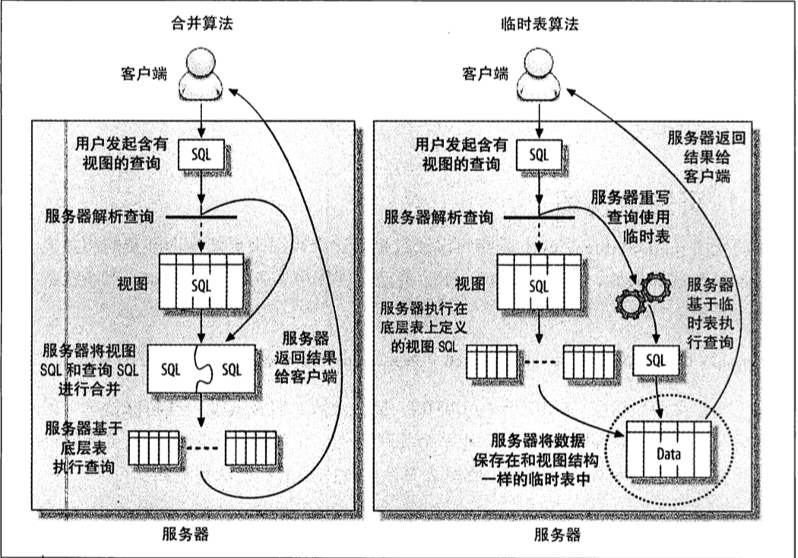

# MySQL 高级特性

## 分区表

对于用户来说, **分区表是一个独立的逻辑表, 但是底层由多个物理子表组成. 实际上是对一组底层表的句柄对象(Handler Object)的封装.** 对于分区表的请求, 会通过句柄对象转化成为对存储引擎的接口调用

MySQL 实现分区表的方式 --- 对底层的封装 --- 意味着索引也是按照分区的子表定义的, 而没有全局索引

MySQL 在创建表时使用`PARTITION BY` 子句定义每个分区存储的数据. 在执行查询的时候, 优化器会根据分区定义过滤那没有我们需要数据的分区, 这样就无须扫描所有分区了

分区的**主要目的就是将数据按照一个较粗的粒度分在不同的表中**, 将相关的数据放到一起, 如果想要批量删除整个分区的数据也会很方便

使用场景:

-   表分成大以至于无法全部都放在内存中, 或者只在表的最后部分有热点数据, 其他均是历史数据

-   分区表的数据更容易维护. 可以对一个分区进行优化, 检查, 修复等操作

-   分区表的数据可以分布在不同的物理设备上, 从而高效的利用多个硬件设置

-   可以使用分区表来避免某些特殊的瓶颈. 如 InnoDB 的单个索引的互斥访问

-   可以备份和恢复独立的分区, 这在非常大的数据集场景下效果非常好

限制:

-   一个表最大 1024 个分区
-   在 MySQL5.1 中, 分区表的表达式必须是整数,或者返回整数的表达式. 在 5.5 中, 某些场景可以直接使用列来分区
-   如果分区字段中有主键或者唯一索引的列, 那么所有主键或者唯一索引列必须包含进来
-   分区表中无法使用外键约束

### 分区表的原理

操作逻辑:

-   SELECT

    查询一个分区的时候, 分区层先打开并锁住所有的底层表, 优化器先判断是否可以过滤部分分区, 然后在调用对于的存储引擎接口访问各个分区的数据

-   INSERT

    写入一条数据, 分区层先打开并锁住所有的底层表, 然后确定哪个分区接收这条记录, 再将记录写入对应的底层表

-   DELETE

    删除一条数据, 分区层先打开并锁住所有的底层表, 确定数据对应的分区, 最后对相应底层表进行删除操作

-   UPDATE

    更新一条数据, 分区层先打开并锁住所有的底层表, 先确定需要更新的记录再哪个分区, 然后取出数据更新, 在判断更新后的数据应该放在哪个分区, 最后对底层表进行写入操作, 并对原数据所在底层进行删除操作

每个操作都会`分区层先打开并锁住所有的底层表`, 但这并不是说分区表在处理过程中都是锁住全表的, 如果存储引擎自己实现了行级锁, 例如 InnoDB 就会在分区层舒服对应表锁

### 分区表的类型

最多的是根据**范围分区**, 例如将每一年的销售额存放到不同的分区里:

```sql
CREATE TABLE sales (
    order_date DATETIME NOT NULL,
    -- other columns omitted
) ENGINE=InnoDB PARTITION BY RANGE(YEAR(order_date)) (
    PARTITION p_2010 VALUES LESS THAN (2010),
    PARTITION p_2011 VALUES LESS THAN (2011),
    PARTITION p_2012 VALUES LESS THAN (2012),
    PARTITION p_catchall VALUES LESS THAN MAXVALUE
);
```

其他的分区技术:

-   根据键值对分区, 来减少 InnoDB 的互斥量竞争
-   使用数据模函数分区, 然后将数据轮询放入不同的分区. 例如可以对日期进行模 7 分区
-   根据时间分区

### 如何使用分区表

首先肯定: 因为数据量大, 不能再每次重新的时候都扫描全表. 考虑到空间和维护上的消耗, 不能使用索引.

只有两条路可选: 所有查询都只在数据表上做顺序扫描, 或者将数据表和索引全部都缓存在内存里

在数据量超大的时候, B-Tree 索引就无法起作用了, 除非是所有覆盖查询, 否则数据库服务器需要根据索引扫描的结果回表. 索引维护(磁盘空间, IO 操作)的代价也非常高

为了保证大数据量的可扩展性, 一般有下面两个策略:

-   `全量扫描数据, 不用任何索引`

    可以使用简单的分区方式存放表, 不用任何索引, 根据分区的规则大致定位需要的数据位置. 只有使用 WHERE 条件将需要的数据限制在少数的分区中, 效率是很高的

-   `索引数据, 并分离热点`

    可以将热点数据单独放在一个分区中, 让这个分区的数据能够有机会缓存在内存中

### 什么情况下回出问题

我们讲的策略都是基于两个非常重要的假设: **查询都能过滤掉很多分区, 分区本身并不会代理很多额外的代价**

可能会遇到的问题:

-   **NULL 值会使分区过滤无效**

    分区表的第一个分区是一个特殊分区, 所有表达式为 NULL 或者是一个非法值的时候, 会将记录存放到第一个分区. 所以在进行操作时 MySQL 实际上会检查两个分区: 过滤条件的分区和第一个分区

    如果第一个分区非常大, 特别是`全量扫描数据, 不用任何索引`的时候, 代价非常大. 可以创建一个"无用"的第一分区, 这样即使需要检查第一分区, 代价也很小

    在 MySQL5.5 以后就**不需要**这个技巧了, 因为可以直接使用列本身而不是基于列的函数进行分区, 如 :`PARTITION BY RANGE COLUMS(order_date)`, 所以这个案例的最好解决办法是能使用这个语法

-   **分区和索引列不匹配**

    分区和索引列不匹配会导致查询无法进行分区过滤. 例如在列 a 上定义了索引, 而在列 b 上进行分区. 应该避免**建立和分区列不匹配的索引, 触发查询中还同时包含了可以过滤分区的条件**

    有可能会出现的问题: 一个关联查询中, 分区表是关联顺序的第二个表, 并且关联使用的索引和分区条件不匹配. 那么关联时针对第一个表符合的条件的每一行, 都需要访问并搜索第二个表的所有分区

-   **选择分区的成本可能很高**

    服务器需要扫描所有分区定义的列表来找到正确答案, 随之分区数的增长会越来越高. **可以通过限制分区的数量来缓解**, 通常来说, 100 个左右的分区是没有问题的

-   **打开并锁住所有底层表的成本可能很高**

    这个操作发生在分区过滤之前, 所有无法通过分区过滤来降低开销. 可以**通过批量操作的方式来降低单个操作的此类开销**, 当然同时需要**限制分区数量**

-   **维护分区的成本可能很高**

    新增或者删除分区会很快. 但是有些操作,如重组分区或者类似 ALTER 语句的操作会很慢, 这类操作昔阳复制数据. 重组分区会先创建一个临时的分区然后将数据复制到其中, 最后删除原分区

限制:

-   所有分区都必须使用相同的存储引擎
-   分区函数中可以使用的函数和表达式也有一些限制
-   某些存储引擎不支持分区
-   对于 MyISAM 的分区表不能使用 `LOAD INDEX INTO CACHE`

### 查询优化

对于访问分区表来说, 很重要的一点是要做 WHERE 条件中带人分区列, 有时候即使看似多余的也要带上.

MySQL 只能使用分区函数的列本身进行比较时才能过滤分区, 而不能根据表达式的值去过滤分区, 即使这个表达式就是分区函数也不行. 就和查询中使用独立的列才能使用索引时一样的

一个很重要的原则: **即便在创建分区时可以使用表达式, 但在查询时却只能根据列来过滤分区**

### 合并表

合并表(Merge table)是一种早期的,简单的分区实现, 和分区表相比有一些不同的限制,并且缺乏优化. 是一种淘汰的技术, 以下略

## 视图

MySQL5.0 后引入视图功能. 视图本身是一个虚拟表, 不存放任何数据, 在使用 SQL 语句访问视图的时候, 返回的是 MySQL 从其他表中生成的

实现视图最简单的方法是将 SELECT 语句的结果存放到临时表中. 当需要访问视图的时候, 直接访问这个临时表就可以了. 这样会有明显的性能问题, 优化器也很难在这个临时表上查询.

更好的方法是, **重写含有视图的查询, 将视图的定义 SQL 直接包含进查询的 SQL 中**

这两种方法分别被称为`合并算法(MERGE)`和`临时表算法(TEMPTABLE)`



如果视图中包含`GROUP BY`, `DISTINCT`, 任何聚合函数, `UNION`, 子查询等, **只要无法在原表记录和视图记录中建立一一映射的场景中, MySQL 都将使用临时表算法来实现视图**

### 可更新视图

可更新视图(updatable view)是可以通过更新这个视图来更新视图涉及的相关表

如果视图中包含`GROUP BY`, `DISTINCT`, 聚合函数已经一些特殊情况, 就不能被更新了.

限制情况:

-   被更新的列必须来自同一个表中.
-   所有使用临时表算法实现的视图都无法更新
-   不能更定义新视图列以外的列

### 视图对性能的影响

使用临时表实现的视图, 有时候性能会很糟糕. 外层查询的`WHERE`条件无法"下推"到构建视图的临时表查询中,临时表也无法建立索引(5.5 版本)

### 视图的限制

-   MySQL 还不支持物化视图
-   不支持在视图中创建索引
-   不会保存视图定义的原始 SQL 语句

    如果执行 `SHOW CREATE VIEW` 出来的创建语句以一种不友好的内部格式呈现, 充满了各种转译符和引号,没有代码格式化, 没有注释, 也没有缩进

    可以通过使用视图的 `.frm` 文件的最后一行获得一些信息. 如果有 FILE 权限甚至可以直接使用 SQL 语句中的 `LOAD_FILE()`来读取`.frm`文件中的视图创建信息, 加上一些字符处理工作, 就可以获得一个完整的视图创建语句了

## 外键约束

InnoDB 是目前 MySQL 中唯一支持外键的内置存储引擎

使用外键是由成本的. 比如外键通常都要求每次在修改数据的时候都要在另外一张表中执行一次查找操作.

在某些场景中, 外键会提升一些性能. 如果确保两个相关表始终有一致的数据, 那么使用外键比在应用中检查一致性性能要高很多, 外键在删除和更新上, 也比在应用中维护要高效, 不过, **外键维护操作是逐行进行的, 所以这样更新会比批量删除和更新要慢些**

外键约束使得查询要额外服务一些别的的表, 也意味着需要额外的锁. 有时会导致锁等待甚至会导致一些死锁.

只是使用外键作为约束, 那么通常在应用程序中实现改约束会更好

## 在 MySQL 内部存储代码

4 中形式存储代码: `触发器` `存储过程` `函数` `定时任务 (也叫做事件, 5.1以后可以使用)`

优点:

-   服务器内部运行, 离数据最近, 另外在服务器上执行还可以接受带宽和网络延迟
-   这是一种代码重用. 保证某些行为总是一致的, 所有也可以为应用提供一些安全性
-   可以简化代码的维护和版本更新
-   帮助提升安全, 比如提升更细粒度的权限控制. 一个常见的例子就是银行用于转移资金的存储过程
-   服务器端可以缓存存储过程的执行过程, 对于反复调用会大大降低消耗
-   存储程序的维护工作会很简单, 没有什么外部依赖
-   在应用开发和数据库开发人员之间更好的分工

缺点:

-   MySQL 本身没有提供好用的开发和调试工具, 编写存储代码就比其他数据库要难些
-   很难写复杂的字符串维护功能, 很难实现复杂逻辑
-   为部署带来额外的复杂性
-   可能有安全隐患, 如果数据库被攻破数据就泄漏了
-   存储过程会给数据库服务器增加额外的压力, 而数据库服务器的扩展性比应用服务器差很多
-   MySQL 没有什么选项可以控制存储程序的资源消耗,所以在存储过程的一个小小的错误, 可能直接把服务器拖死
-   MySQL 的存储代码功能还是非常弱的
-   调试存储过程是一件非常困难的事情
-   它和基于语句的二进制日志复制合作得并不好

### 存储过程和函数

略

### 触发器

触发器可以让你在执行 INSER, UPDATE 或者 DELETE 的时候, 执行一些特定的操作, 还可以自动更新反范式化数据或者汇总表数据

注意的点:

-   对于每个表的每一个事件, 最多只能定义一个触发器(不能在 AFTER INSERT 上定义两个触发器)
-   MySQL 只支持`基于行的触发`, 也就是说, 触发器始终是针对一条记录的, 而不是针对整个 SQL 语句的

限制:

-   可以掩盖服务器背后的工作
-   问题很难排查
-   可能导致死锁和锁等待

仅考虑性能, MySQL 触发器对服务器限制最大的就是`基于行的触发`的设计. **因为性能原因, 很多时候无法用触发器来维护汇总和缓存表**. 使用触发器而不是批量更新的一个重要原因是, 触发器可以保证数据一致性

在 MyISAM 表中, 并不能保证更新的原子性, 例如在一个 MyISAM 表中建立了一个 AFTER UPDATE 触发器来更新另一个 MyISAM 表, 第二个表遇到错误的时候, 第一个表并不能回滚

在 InnoDB 表上的触发器是在一个事务中完成的,所以是原子操作

一个绕过基于行触发的技巧:

对于 BEFORE 触发器除了处理的第一条记录, 触发器函数 ROW_COUNT()总是返回 1, 可以利用这点来绕过行触发, 而是针对一条 SQL 触发. 例子:

```sql
CREATE TABLE fake_statement_trigger
BEFORE INSERT ON sometbale
FOR EACH ROW
BEGIN
    DECLARE v_row_count INT DEFAULT ROW_COUNT();
    IF v_row_count <> 1 THEN
        -- Your code here
    END IF
END;
```

### 事件

MySQL5.1 引入. 类似 Linux 的定时任务, 不过是完全在 MySQL 内部实现

如果一个定时事件执行需要很长的时间, 那么有可能会出现这样的情况: 前面的事件还没有执行完, 下一个时间点的任务又开始了. MySQL 本身不会放着这种并发, 可以使用函数`GET_LOCK()`来确保当前只有一个事件在运行

### 在存储程序中保留注释

MySQL 客户端会自动过滤注释.

一个将注释存储到存储程序中的技巧是**使用版本相关的注释**, 这样的注释不会被删除. 可以做指定一个非常大的版本号, 如 99999

## 游标

MySQL 在服务器端提供只读的, 单向的游标, 而且只能在存储过程或者更底层的客户端 API 中使用. 因为 MySQL 游标中指向的对象都是存储在临时表中而不是时间查询到的数据, 所以是只读的

如果关闭游标的时候你只是扫描一个大结果的一小部分, 那么存储过程不仅没有减少开销, 反而会带来大量的额外开销. 需要考虑使用 LIMIT 来限制返回的结果数

如果游标返回了 BLOB 或者 TEXT 类型的列, MySQL 必须要创建临时表来存放, 这样性能会很糟糕

## 绑定变量

就是 Java 中处理 SQL 使用的 prepareStatement, 略

## 用户自定义函数 (略)

## 插件 (略)

## 字符集和校对

MySQL 使用字符集设置可以分为两类: 创建对象时的默认值, 在服务器和客户端通信时的设置

创建对象时的默认值:

-   创建数据库, 根据在服务器上的 `character_set_server`设置
-   创建表的时候, 根据数据的字符集设置指定表的字符集
-   创建列的时候, 更加表的设置指定列的字符集

在服务器和客户端通信时的设置:

-   服务器端总是假设看过的是按照`character_set_client`设置的字符集来传输数据生气了语句的
-   收到 SQL 语句时, 线将其转成`character_set_connection`
-   返回数据或者错误信息给客户端时, 转成`character_set_result`

字符集和校对规则如何影响查询:

当两个字符集不同的列来关联两个表的时候,MySQL 会尝试转换其中一个列的字符集.

在多字节字符集中, 一个字符不再是一个字节. 在 MySQL 中, `LENGTH()`会返回字节数, `CHAR_LENGTH()` 会返回字符数, 所以需要做`SUBSTRING()`的时候需要使用`CHAR_LENGTH()`

## 全文索引 (略)

## 分布式(XA)事务

建议阅读 [漫画：什么是分布式事务?](https://blog.csdn.net/bjweimengshu/article/details/79607522)

## 查询缓存

在 MySQL8.0 已删除, 这里不讨论了
