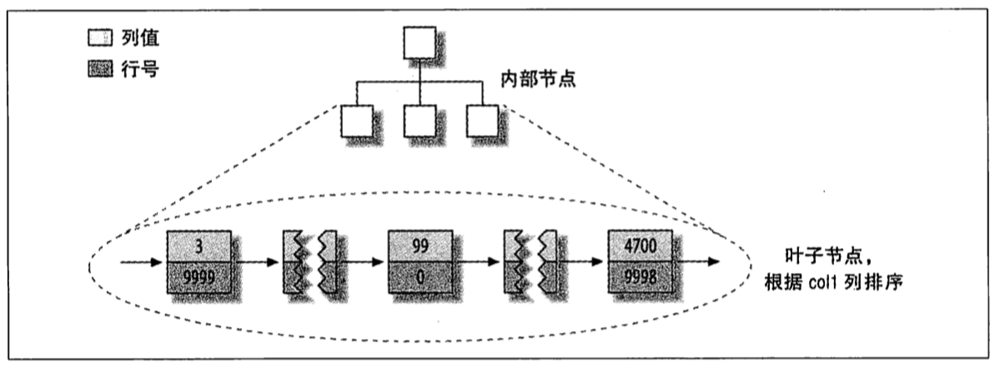

# 创建高性能的索引

索引(在 MySQL 中也叫做"键 (key)")是一种存储引擎用于快速找到记录的一种**数据结构**

## 索引基础

索引就相当于一本书的目录, 先在目录中找到对应的值, 然后更加匹配的所有记录再找到对应的数据行

### 索引的类型

> **B-Tree 索引**

大多数存储引擎都支持, Archive 是个例外, 在 MySQL5.1 之前 Archive 不支持人格索引, 5.1 之后开始支持单个自增列索引

不同引擎使用 B-Tree 索引的方法也不一样. MyISAM 使用前缀压缩使索引更小, 但是 InnoDB 按照原数据格式进行存储. MyISAM 通过数据的物理位置引用被索引的行, InnoDB 根据主键引用被索引的行

B-Tree 意味着索引的值都是按顺序存储的, 并且每个叶子页到根的距离完全相等

B-Tree 索引能够更快访问数据, 因为存储引擎不再需要进行全表扫描来获取需要的数据, 取而代之的是从索引的根节点开始搜索

B-Tree 索引列是按照顺序组织的, 所以很适合范围查找. **索引对多个值排序的依据是 `CREATE TABLE` 语句中定义索引时列的顺序**

假设有如下数据表:

```sql
CREATE TABLE People (
    last_name varchar(50) not null,
    first_name varchar(50) not null,
    dob date not null,
    gender enum('m', 'f') not null,
    key(last_name, first_name, dob)
);
```

可以使用 B-Tree 索引的查询类型:

-   **全值匹配** 和索引所有列进行匹配, 如可以查找姓名为 Cuba Allen, 出生于 2020-02-02 的人
-   **匹配最左前缀** 查找姓为 Allen 的人, 只使用索引的第一列
-   **匹配列前缀** 只匹配某一列的值开头的部分, 例如查询所有姓氏以 J 开头的人, 也只使用了索引的第一列
-   **匹配范围值** 查找姓氏在 Allen 和 Barrymore 直接的人. 只使用了索引的第一列
-   **精准匹配某一列并范围匹配另一列** 查找索引姓氏为 Allen 并且名字是以 K 开头的人, 使用了索引 last_name 全匹配, first_name 范围匹配
-   **只访问索引的查询** 查询只需要访问索引并不需要访问数据行

B-Tree 索引的**限制**:

-   如果**不按照最左列开始查找就无法使用索引**. 例如查询名字为 Bill 的人, 也无法查找特定生日的人. 因为 first_name 和 bod 都不是索引的最左列. 类似的, 也无法查找姓氏以某个字母结尾的人, 因为 `like '%J'` 不能使用 `%J` last_name 列

-   **不能跳过索引中的列** 即, 该表的索引不能查找 特定 last_name 和特定 dob 的数据. 如果查询 `SELECT * FROM People WHERE last_name = 'Allen' AND bod = '2020-02-02';` 只能使用索引的第一列

-如果查询中**有某个列的范围查询, 则其右边的所有列都无法使用索引**. 如 `SELECT * FROM People WHERE last_name = 'Allen' AND first_name LIKE 'J%' AND bod = '2020-02-02';`, 这个查询就只能使用前两列

具体例子可参考[索引失效的原因](../optimization/索引失效的原因.md)

这些限制都和索引顺序有关, 在优化性能的时候有可能需要相同列但不同顺序的索引来满足不同类型的查询

> **哈希索引**

基于哈希表实现, 只有**精确匹配到所有所有列**的查询才有效. 在 MySQL 中, 只用 Memory 引擎显式支持哈希索引, 支持的是**非唯一**哈希索引(就和 Java 的 Hashtbale 一样使用连地址解决哈希冲突)

优点: 索引自身只需要存储对应的哈希值, 所以索引的结构是否紧凑, 也使得哈希查找速度非常快

缺点:

-   哈希索引只包含哈希值和行指针, 不存才字段值, 所以**不能使用索引中的值来避免行读取**, 在大部分情况下对性能影响很小
-   不是按照顺序存储, **不能排序**
-   **不支持部分索引列匹配查询**, 因为哈希是使用索引列的全部内容来计算哈希值的
-   **只支持等值比较, 包括 `=, IN(), <=>`** (<> 和 <=> 是不同的运算), 也**不支持任何范围查询**, 如 `where price > 100`
-   如果有很多哈希冲突, 访问速度就不会特别快, 因为要循环遍历链表
-   **哈希冲突很多的话一些索引维护操作代价也会很高**

除了 Memory 引擎之外, NDB 集群引擎也支持**唯一**哈希索引, 并且在 NBD 中作用特殊, 在这里不讨论

InnoDB 有个特殊功能叫做"自适应哈希索引", 如果 InnoDB 注意到某些索引值被使用的特别频繁, 会在内存中基于 B-Tree 索引之上创建一个哈希索引. 但是这是完全自动的内部行为, 用户无法配置

**自定义哈希索引**

如需要存储大量的 URL, 并且需要更加 URL 进行搜索查找, 因为 URL 一般很长, 如果使用 B-Tree 存储, 存储的内容就会很大, 正常情况下需要如下查询:

```sql
SELECT id FROM url WHERE url="https://github.com/Mao-PC/Notes/blob/master/DB/MySql/%E9%AB%98%E6%80%A7%E8%83%BDMySQL/%E5%88%9B%E5%BB%BA%E9%AB%98%E6%80%A7%E8%83%BD%E7%9A%84%E7%B4%A2%E5%BC%95.md";
```

删除原来在 URL 上的索引, 新增一个被索引的 url_crc 列, 使用 CRC32 做哈希, 一下为查询方式

```sql
SELECT id FROM url WHERE url="https://github.com/Mao-PC/Notes/blob/master/DB/MySql/%E9%AB%98%E6%80%A7%E8%83%BDMySQL/%E5%88%9B%E5%BB%BA%E9%AB%98%E6%80%A7%E8%83%BD%E7%9A%84%E7%B4%A2%E5%BC%95.md" AND url_crc = CRC32("https://github.com/Mao-PC/Notes/blob/master/DB/MySql/%E9%AB%98%E6%80%A7%E8%83%BDMySQL/%E5%88%9B%E5%BB%BA%E9%AB%98%E6%80%A7%E8%83%BD%E7%9A%84%E7%B4%A2%E5%BC%95.md");
```

这样做性能就非常高, 因为 MySQL 优化器会使用这个选择性很高而体积很小的基于 url_crc 的索引来完成查找, 即使有相同的索引值, 查找依然很快.

另外一种方法是直接用完整的 URL 来做索引, 那样会非常慢

这样实现的缺陷是需要维护哈希值 可以手动维护也可以使用触发器实现(略)

如果使用这种方式, **切记不要使用 SHA1() 和 MD5()作为哈希函数**, 这两个会计算出很长的字符串, 会浪费空间并且查询也会较慢.

如果数据表非常大, CRC32()会出现大量的**哈希冲突**, 可以考虑使**用 MD5() 的一部分来作为自定义哈希函数**

处理哈希冲突, 当使用哈希索引进行查询的时候, 必须在 **WHERE 子句中包含常量值**, 如上面的查询, 不光包括了 CRC32 的值还有 url 本身的值

> **空间数据索引(R-Tree)**

推荐使用 GIS 解决方案 PostgreSQL 的 PostGIS

> **全文索引**

查找的是文本中的关键词, 做的是类似于搜索引擎的事情, 而不是简单的 WHERE 条件匹配

在相同列上同时创建全文索引和基于值的 B-Tree 索引不会有冲突, 全文索引更适用于 MACH AGAINST 操作, 而不是普通的 WHERE 条件操作

具体可以参考 [MySQL 高级特性](MySQL高级特性.md)

## 索引的优点

可以让服务器更快的定位到表的指定位置, 有如下 3 个优点:

1. 大大减少了服务器需要扫描的数据量
2. 可以帮助服务器避免排序和临时表
3. 可以将随机 IO 变为顺序 IO

**三星系统**: 索引将相关的记录放到一起获得一星; 索引中数据顺序和查找中的排序一致获得而星; 索引中的列包含了查询中需要的全部列获得三星

> 索引是最好的解决方案吗?

不总是. 对于非常小的表, 大部分情况下简单的全部扫描更高效; 对于中到大型的表, 索引非常有效; 对于特大型的表, 建立和使用索引的代价将随之增大. 需要只用计算可以直接区分出查询需要的一组数据, 而不是一条条记录匹配, 可以参考[MySQL 高级特性](MySQL高级特性.md)

如果**表的数量特别多, 可以建立一个元数据信息表**, 用来查询需要用到某些特性. 事实上, Infobright 就使用类似的实现

## 高性能的索引策略

帮助大家理解**如何高效的使用索引**

### 独立的列

是指索引不能是表达式的一部分, 也不能是函数的参数. 如下面的 SQL 就不能使用索引

```sql
SELECT actor_id FROM  sakila.actor WHERE actor_id + 1 = 5;
```

时钟将索引列单独放在比较符号的一侧

### 前缀索引和索引选择性

有时需要索引很长的字符列, 这回让索引变得很大且慢, 前面提到了使用模拟哈希索引解决, 但是这样有时还不够

通常可以索引开始的部分字符串, 但是这会降低索引的选择性.

> 索引的选择性是指不重复的索引值(也成为基数)和数据表的记录总数(#T)的比值, 范围从 `1/#T` 到 `1` 之间. 唯一索引的选择性是 1, 这是最好的索引选择性, 性能也是最好的

诀窍在于要选择足够长的前缀以保障较高的选择性, 同时又不能太长

### 多列索引

经常会听到 "把所有 where 条件里的列都建上索引", 这句话是非常错误的. 在多个列上建独立的单列索引大部分情况下并不能提高 MySQL 的查询性能.

在早期的 MySQL 版本中, 对于下面的 SQL 两个单列索引都不是好的选择:

```sql
SELECT film_id, actor_id, FROM  sakila.film_actor WHERE actor_id = 1 OR film_id = 1;
```

MySQL 执行这个查询会使用全表扫描, 除非改下为 `UNION` 方式:

```sql
SELECT film_id, actor_id, FROM  sakila.film_actor WHERE actor_id = 1 UNION ALL SELECT film_id, actor_id, FROM  sakila.film_actor WHERE film_id = 1 AND actor_id <> 1;
```

在 MySQL5.0 后查询可以同时使用这个两个单列索引进行扫描, 并且将结果进行合并. 这种算法有 3 个变种: `OR 条件的联合(union)` `AND 条件的相交(intersection)` `组合前面两种情况的联合及相交`

索引合并策略有时候是一种优化的结果, 实际上更多的时候说了表上的索引建的很糟糕:

-   当出现服务器对多个索引做相交操作时(通常有多个 AND), 通常意味着需要一个包含所有相关列的多列索引

-   当出现服务器对多个索引做联合操作时(通常有多个 OR), 通常需要大量消耗 CPU 和内存

### 选择合适的索引列顺序

在一个多列 B-Tree 索引中,**索引列的顺序意味着索引首先按照最左进行排序**, 其次是第二列. 所以索引可以按照**升序或者降序**进行扫描, 以满足精确符合列顺序的 ORDER BY, GROUP BY 和 DISTINCT 等居中的查询需求. 所以**多列索引的列顺序至关重要**

经验法则: **将选择性最高的列放到索引最前列**

### 聚簇索引

聚簇索引并不是一种单独的索引, 而是一种数据存储方式. 当表有聚餐索引时, 它的数据行实际上存放在所有的叶子也(leaf page)中. 因为无法吧数据行存放在两个不同的地方, 所以一个表只能有一个聚簇索引

没有主键 InnoDB 就会选择一个唯一的非空索引代替. 如果没有这样的索引, InnoDB 会隐式定义一个主键来作为聚簇索引

优点:

-   可以把相关数据保存在一起, 减少磁盘 IO
-   数据访问更快. 数据和索引保存在同一个 B-Tree 中
-   使用覆盖索引扫描的查询可以直接使用页节点中的主键值

缺点:

-   最大限度提高了 IO 密集型应用的性能, 但是如果数据全部在内存中, 访问顺序就没那么重要了
-   插入速度严重依赖于插入顺序
-   更新聚簇索引的代价很高
-   插入新行或者主键被更新导致需要移动行的时候, 可能面临"页分裂(page split)"的问题
-   聚簇索引可能导致全部扫描变慢, 尤其是行比较稀疏或者由于也分裂导致存储不联系的时候
-   二级索引(非聚簇索引)可能比想象中更大, 因为二级索引的叶子节点包含了引用行的主键列
-   二级索引访问需要两次索引查找,而不是一次 (因为二级索引保存的的是"行指针")

> InnoDB 和 MyISAM 的数据分布

MyISAM 按照数据插入的顺序存储在磁盘上, 如下图


主键分布:



索引分布


事实上, MyISAM 中主键索引和其他索引在结构上没有不同, 主键就是一个名为 PRIMARY 的唯一索引

InnoDB 支持聚簇索引, 数据分布为:


在 InnoDB 中, 局促索引就是表. 不想 MyISAM 那样需要独立的行存储

二级索引和聚簇索引很不同 二级索引的的叶子节点中存储的不是"行指针",而是主键值, 并以此作为指向行的指针. 这样减少了当行出现一定或者数据页分裂时二级索引的维护工作. 二级索引分布如下:


MyISAM 和 InnoDB 保存数据和索引的区别:


> 在 InnoDB 表中安主键顺序插入行

如果 InnoDB 表中没有什么数据需要拒绝, 可以定义一个代理键作为主键, 这种主键应该和数据无关, 最简单就是使用 AUTO_INCREMENT 自增 (很多自增 id 就是这样)

最好避免随机(不连续且值的分布范围非常大)的聚簇索引, 特别是对于 IO 密集的应用

如果使用 UUID 作为主键时, 因为主键时顺序存储的, 新的主键不一定比之前的大,索引 InnoDB 无法简单的总是把新行插入到索引的最后, 而是要寻找合适的位置, 通常是数据的中间位置, 并且分配空间

缺点:

-   写入的目标也可能已经刷新到磁盘上并从缓存中删除, 或者还没被加载到缓存中, 这将导致大量的随机 IO
-   因为写入是随机的, InnoDB 不得不频繁的做页分裂操作
-   由于频繁的页分裂操作, 页会变得稀疏且并被不规则的填充, 最终数据会有碎片

> 顺序的主键什么时候回造成更坏的结果 ?

-   高并发工作, 中间的上界会成为热点. 所有的插入都发生在这里, 并发插入可能导致间隙锁竞争
-   另一个热点可能是 AUTO_INCREMENT 锁机制. 可能需要考虑重新设计表或者应用, 或者更改 innodb_atoinc_lock_mode 参数

### 覆盖索引

如果一个索引包含(或者说覆盖)所有需要查询的字段的值, 就称之为 "覆盖索引"

如果一个查询只需要扫描索引而不需要回表查询锁带来的好处:

-   索引条目通常远小于数据行大小, 会极大地减少数据访问量
-   索引时按住顺序存储, 对于 IO 密集型的范围查询就会比随机从磁盘读取每一行 IO 要少得多
-   一些存储引擎如 MyISAM 内存只缓存索引, 数据依赖于操作系统来缓存, 因此访问数据需要一次系统调用, 这可能会导致严重的性能问题
-   InnoDB 的聚簇索引, 覆盖索引对 InnoDB 表特别有用

覆盖索引必须要存储索引列的值, 而哈希索引, 空间索引和全文索引等都不存储索引列的值, 索引 MySQL 只能使用 B-Tree 做覆盖索引

如下 SQL:

```sql
SELECT * FROM products WHERE actor='SEAN CARREY' AND title like '%APOLLO%';
```

无法使用覆盖索引的两个原因:

1. 没有任何索引很够覆盖这个查询. 因为查询从表中选择了所有列
2. MySQL 不能再索引中执行 LIKE 操作

可以进行如下改下:

```sql
SELECT * FROM products JION (
    SELECT prod_id FROM products WHERE actor='SEAN CARREY' AND title like '%APOLLO%'
) AS t1 ON (
    t1.prod_id=products.prod_id
);
```

这种方式叫做**延迟关联**, 因为延迟了对列的访问. 在查询的第一阶段使用覆盖索引, 在 FROM 子查询中匹配到 prod_id. 但是这种改进是在基于子查询的结果集不能过小的情况下才能使用的, 如果 Sean Carrey 演出了 50 部作品, 其中 10 部包含了 APOLLO, 那么查询效率反而会下降很多

### 使用索引扫描来做排序

**MySQL 有两种方式生成有序结果: 排序操作或者按索引顺序扫描**, 如果 EXPLAIN 的 type 值为"index", 则说明 MySQL 使用了索引扫描来做排序

设计索引时既满足排序又作用于查找行是最好的. 只有当索引的列顺序和`order by`子句顺序完全一致, 并且所有列的排序方向一致时, 才能使用索引对结果排序

如表:

```sql
CREATE TABLE rental (
    ...
    PRIMARY KEY (rental_id),
    UNIQUE KEY rental_date (rental_id, inventory_id, customer_id),
    KEY idx_fk_inventory_id (inventory_id),
    KEY idx_fk_customer_id (customer_id),
    KEY idx_fk_staff_id (staff_id),
    ...
);
```

对于 `SELECT rental_id, staff_id FROM sakila.rental` 一些不能使用索引做排序的查询:

-   排序方向不同

    `... WHERE rental_date = '2020-02-02' ORDER BY inventory_id DESC, customer_id ASC;`

-   引用了一个不在索引中的列:

    `... WHERE rental_date = '2020-02-02' ORDER BY inventory_id , staff_id`

-   WHERE 和 ORDER BY 无法组合成索引的最左前缀:

    `... WHERE rental_date = '2020-02-02' ORDER BY customer_id`

-   第一列上是范围条件, 其余列无法使用索引

    `... WHERE rental_date > '2020-02-02' ORDER BY inventory_id, customer_id;`

-   有多个等于条件. 对于排序来说, 这也是一致范围查询

    `... WHERE rental_date = '2020-02-02' AND inventory_id IN(1,2) ORDER BY customer_id;`

### 压缩(前缀压缩)索引

MyISAM 使用前缀压缩减少索引的大小, 从而让更多更多的索引放入内存中, 这种某些情况下能极大的提高提高性能, 默认只压缩字符串

压缩块使用更少的空间, 代价是某些操作可能更慢. 因为每个值的压缩前缀都依赖前面的值, MyISAM 无法在索引块使用二分查找而只能从头开始扫描. 倒序扫描会更复杂

测试证明对于 CPU 密集型应用, 压缩索引会使得索引在查找上慢好几倍

### 冗余和重复索引

> 重复索引

MySQL 允许在相同列上创建打个索引. 重复索引是指在相同的列上按照相同的顺序创建相同类型的索引, 应该避免这样的索引

如下 SQL 就会创建重复索引:

```sql
CREATE TABLE test (
    ID INT NOT NULL PRIMARY KEY,
    A INT NOT NULL,
    B INT NOT NULL,
    UNIQUE(ID),
    INDEX(ID)
) ENGINE = InnoDB;
```

> 冗余索引

冗余索引: 如果创建了索引(A,B), 在创建索引(A)就是冗余索引, 因为这只是前一个索引的前缀索引. 因此索引(A,B)也可以当做索引(A)使用(只对 B-Tree 生效). 其他林夕的索引(如哈希索引)不是 B-Tree 索引的冗余索引

冗余索引通常发生在为表添加新索引的时候

表中的索引越多插入速度就会越慢. 增加新的索引将会导致 INSERT, UPDATE, DELETE 等操作速度变慢, 特别是当新增索引后导致达到了内存瓶颈的时候

解决冗余索引和重复索引的方法: 删除这些索引. 可以通过复杂的访问 INFORMATION_SCHEMA 表的查询, 可以使用 Shlomi Noach 的 common_schame 来定位, 还可以使用 Percona Toolkit 中的 pt-duplicate-schema

### 索引和锁

索引可以让查询锁定更少的行:

-   InnoDB 的行锁效率很高, 内存使用很少, 但是锁定行的时候仍然会带来额外的开销
-   锁定超过需要的行会增加锁争用并减少并发性

## 案例学习(略)

## 维护索引和表

维护表有三个目的: 找到并修复损坏的表, 维护准确的索引统计信息, 减少碎片

> 找到并修复损坏的表

CHECK TABLE 通常能够找出大多数的表和索引的错误, 可以使用 REPAIR TABLE 命令来修复损坏的表

如果出现了损坏就一点要找到损坏的原因, 而不是简单的修复, 否则可能会不断的损坏. 可以通过设置 innodb_force_recovery 参数进入 InnoDB 的强制恢复模式来修复数据

> 更新索引统计信息

两个 API 可以统计存储引擎的索引值索引信息:

-   recordes_in_range() 通过向存储引擎传入两个边界值获取在这个范围大概有多少记录

-   info() 该接口返回各种类型的数据, 包括索引的基数(每个键值有多少记录)

> 减少碎片

B-Tree 可能会碎片化, 这回降低查询效率.

有 3 中类型的碎片: 行碎片, 行间碎片, 剩余空间碎片

可以通过 `OPTIMIZE TABLE` 或者导出再导入的方式来重新整理数据

## 总结

有如下 3 个原则始终要遵守:

1. 单行访问时很慢的
2. 按顺序访问范围数据时很快的
    - 顺序 IO 不需要多次磁盘寻道
    - 如果服务器能够按需要顺序读取数据, 那就不需要额外的排序操作, 并且 group by 查询也无需在做排序和将按行进行聚合计算了
3. 索引覆盖查询是很快的
