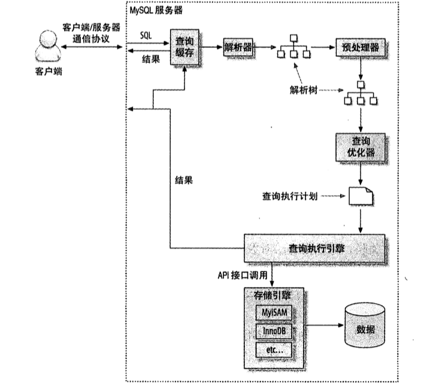
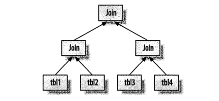
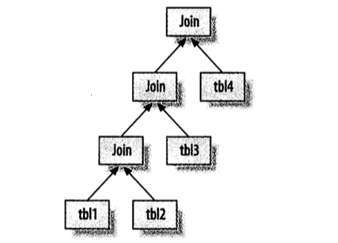
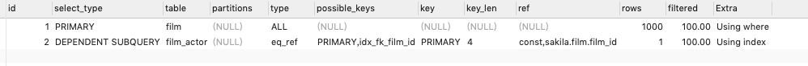

# 查询性能优化

## 为什么查询会慢

把查询看做一个任务, 那么它由一系列子任务组成, 每个子任务都会消耗时间. 优化查询, 实际上要优化子任务, 要么消除一些子任务, 要么减少子任务的执行次数, 要么子任务运行的更快

在完成这些任务的时候查询需要在不同的地方花费时间, 包括网络, CPU 计算, 生成统计信息和执行计划, 锁等待等操作...

在每个消耗大量时间的查询案例中, 我们都能看到一些不必要的额外操作, 某些操作被额外的重复了很多次, 某些操作执行得太慢了等. 优化查询的目的就是奸商和消除这些操作所花费的时间

## 慢查询基础: 优化数据访问

查询性能低下最**基本的原因就是访问的数据太多**, 对于低效的查询我们发现下面两个步骤分析总是很有效:

1. 确认应用程序是否在检索大量超过需要的数据
2. 确认 MySQL 服务器层是否在分析大量超过需要的数据行

### 是否向数据库请求了不需要的数据

有些查询会请求超过实际需要的数据, 然后这些多余的数据会被应用丢弃. 这回给 MySQL 服务器带来额外的负担, 并增加网络开销, 也会消耗应用服务器的 CPU 资源

一些典型的案例:

-   **查询不需要的记录**

    一个常见的错误以为 MySQL 只会返回需要的数据, 实际上 MySQL 会返回全部的结果集在进行计算. 如查询出所有的结果集然后取前 10 行结果. 最简单的办法就是在查询后加 LIMIT

-   **多表关联时返回全部列**

    如查询所有电影 Academy Dinosaur 中出现的演员

    ```sql
    SELECT * FROM sakila.actor
    INNER JION sakila.film_actor USING(actor_id)
    INNER JION sakila.film USING(film_id)
    WHERE sakila.film.title = 'Academy Dinosaur'
    ```

    上面的 SQL 会返回三个表的全部数据列, 应该这样写:

    ```sql
    SELECT sakila.actor.* FROM sakila.actor ...
    ```

-   **总是取出全部列** 总是使用 `SELECT *`

-   **重复查询相同的数据**

### MySQL 是否在扫描额外的记录

最简单衡量开销的三个指标如下:

-   响应时间
-   扫描的行数
-   返回的行数

> **响应时间**

响应时间是两个部分之和: **服务时间和排队时间**

但是实际的情况很复杂, 当看到一个查询响应时间的时候, 首先需要问问自己, 这是不是一个合理的值

> **扫描的行数和返回的行数**

一定程度上能够说明该查询找到需要的数据的效率

理想情况是扫描的行数和返回的行数是相同的. 扫描的行数对返回的行数比率通常很小, 一般在 1:1 和 10:1 直接, 不过有时候这个值也有可能非常大

> **扫描的行数和访问类型**

MySQL 有好多种方式可以查找并返回结果, 有些访问方式可能需要扫描很多行才能返回一行结果, 也有些可能无需扫描就能返回结果

在 EXPLAIN 的 type 列反应了访问类型

一般 MySQL 能够使用三种方式应用 WHERE 条件, 从好到坏依次为:

-   在索引中使用 WHERE 条件过了不匹配的记录. 这是在存储引擎层完成的
-   使用索引覆盖(在 Extra 列中出现 using index)来返回记录, 直接从索引中过了不需要的记录并返回命中的结果, 这是在 MySQL 服务器层完成的, 无需回表查询
-   从数据表中返回数据, 然后过滤不满足条件的记录(在 Extra 列中出现了 using where). 这是在 MySQL 服务器层完成的, 需要相差数据表中读取出记录然后过滤

需要大量扫描但是返回少数行 优化方法:

-   使用覆盖扫描, 把所有的需要用到的列都放到索引中
-   改变表结构. 例如使用汇总表
-   重新复杂的查询

## 重构查询的方式

### 一个复杂查询还是多个简单查询

在传统实现中, 总是强调数据库层完成尽可能多的工作, 在以前网络通信, 查询解析和优化是一件代价很高的工作. 但是这种 MySQL 中并不适用, MySQL 从设计上连接和断开都是很轻量级的, 在返回一个小的查询结果方面很高效

### 切分查询

有时候对于一个大查询我们要"分而治之", 将大查询切分成多个小查询, 每次只返回一部分数据

删除旧数据就是个好的案例. 定期清除大量数据, 如果用一个大的语句一次性完成可能需要一次锁住很多数据, 占满整个事务日志. 耗尽系统资源,阻塞很多小但是重要的查询

### 分解关联查询

对每一个表进行一次单表查询, 庵后将结果在应用程序中进行关联, 如:

```sql
SELECT * FROM tag
    JION tag_post ON tag_post.tag_id=tag.id
    JION post ON tag_post.post_id=post.id
WHERE tag.tag = 'mysql';
```

可以分解为:

```sql
SELECT * FROM tag WHERE tag='mysql'
SELECT * FROM tag_post WHERE tag_id=1234
SELECT * FROM post WHERE post.id in (123,456,789);
```

优势:

-   让缓存效率更高. (额, 8.0 版本已经移除了查询缓存...)
-   将查询分解后, 执行单个查询可以减少锁的竞争
-   子应用层做关联, 可以更容易对数据库进行拆分
-   查询本身效率也有可能会提升
-   可以减少冗余记录的查询. 只需要查询一次, 而在数据库做关联查询, 可能会重复访问一部分数据. 从这点看还可能会减少网络和内存的消耗
-   这样做相当于在应用汇总实现了哈希关联, 而不是使用 MySQL 的嵌套循环关联

在很多场景下, 会更加高效, 比如说:

-   应用能够方便的缓存单个查询结果的时候,
-   可以将数据分布到不同的 MySQL 服务器中,
-   能够使用 IN() 的方式代替关联查询的时候
-   当查询中使用同一个数据表的时候

## 查询执行的基础

查询执行路径:



1. 客户端发送一条查询给服务器
2. 服务器先检查查询缓存, 如果命中了缓存, 则立刻返回存储在缓存中的结果, 否则进入下一阶段 (8.0 以放弃了查询缓存)
3. 服务器进行 SQL 解析, 预处理, 再由优化器生成对应的执行计划
4. MySQL 更具优化器生成的执行计划, 调用存储引擎的 API 来执行查询
5. 将结果返回客户端

### MySQL 客户端/服务器通信协议

在同一时刻, 要么是由服务器向客户端发送数据, 要么有客户端向服务器发送数据, 这两个动作不能同时发生. 就想抛球游戏, 在任何时刻, 只有一个人控球

客户端用**一个**单独的数据包将查询传给服务器, 这就是为什么当查询语句很长时 max_allowed_packet 就特别重要, 一旦客户端发送了请求, 它能做的事就只是等待结果了

相反的, 一般服务器响应给用户的数据非常多, 由多个数据包组成. 服务器开始响应客户端请求时, **客户端必须完整的接收整个返回结果**. 这也是为什么在必要的时候在查询中药加数 limit 限制的原因

> **查询状态**

每个 MySQL 连接就是一个线程, 不同线程的状态表示了改线程当前在做什么.

使用 `SHOW FULL PROCESSLIST` 可以查询当前状态, 改命令返回结果中的 Command 列就表示当前的状态:

| 状态                           | 说明                                                                                                                                                                       |
| ------------------------------ | -------------------------------------------------------------------------------------------------------------------------------------------------------------------------- |
| Sleep                          | 线程正在等待客户端发送新的请求                                                                                                                                             |
| Query                          | 线程正在执行查询或者正在将结果发送给客户端                                                                                                                                 |
| Locked                         | 在 MySQL 服务器层, 改线程正在等待表锁. 在存储引擎级别实现的锁, 例如 InnoDB 的行锁并不会体现在线程状态中                                                                    |
| Analyzing and statistics       | 正在收集存储引擎的统计信息, 并生成查询的执行计划                                                                                                                           |
| Copying to tmp tblle [on disk] | 正在执行查询, 并且将结果集都复制到一个临时表中, 这种状态一般要么是在做 Group by 操作, 要么是文件排序操作, 或者是 union 操作. `on disk` 是 MySQL 正在将一个临时表放到磁盘上 |
| Sorting result                 | 对结果集进行排序                                                                                                                                                           |
| Sending data                   | 线程可能在多个状态之间传输数据, 或者正在生成结果集, 或者在向客户端返回数据                                                                                                 |

### 查询缓存 (略, 8.0 已删除)

### 查询优化处理

下一步是将 SQL 转换成一个执行计划, 再依照这个执行机构和存储引擎交互. 这包括多个阶段: 解析 SQL, 预处理, 优化 SQL 执行计划

> **语法解析器和预处理**

MySQL 通过关键字将 SQL 语句进行解析, 并生产一棵对于的"解析树"

预处理器根据一些 MySQL 规则进一步检查解析树是否合法, 下一步预处理器会验证权限

> **查询优化器**

MySQL 使用的是**基于成本的优化器**, 它将尝试预测一个查询使用某种执行计划的成本, 并选择其中成本最小的一个

有很多原因会导致 MySQL 优化器选择错误的执行计划:

-   统计信息不准确
-   执行计划中的成本估计不等同与实际执行的成本
-   MySQL 的最优可能和你想象的最优不一样. 有时候成本最低不一定是执行时间最短的
-   MySQL 从不考虑其他并发的查询
-   并不是任何时候都是基于成本的优化. 有时候也会基于一些固定规则
-   不会考虑不受其控制的操作成本, 例如执行存储过程或用户自定义函数的成本

优化策略可以简单的分为两种: **静态优化和动态优化**

静态优化可以直接对解析树进行分析, 并完成优化. 也可认为这是一种编译时优化

动态优化则和查询的上下文有关, 也可能和很多其他因素有关. 可以认为这是运行时优化

MySQL 对查询的静态优化只有一次, 但是动态优化则在每次执行时都需要重新评估. 有时甚至再重新的执行过程中也会重新优化

能够处理的优化类型:

-   查询定义关联表的顺序
-   将外连接转换成为内连接

    并不是所有的 OUTRE JION 语句都必须以外连接的方式执行. 很多因素都能会让外连接等同于一个内连接

-   使用等价变化规则

    用来简化并规范表达式, 可以合并和减少一些比较, 移除一些恒等和一些恒不成立的判断. 如 1=1 AND a > 5

-   优化 COUNT() MIN() MAX()

    索引和类是否可为空通常可以帮助优化这些表达式. 例如要找到某一列的最小值, 只需要查询对于 B-Tree 索引最左端的记录

    类似的, 没有 WHERE 的 count(\*)查询通常也可以使用存储引擎提供的一些优化

-   预估并转化常数表达式

    当检测到一个表达式可以转化为尝试的时候, 就会一直把改表达式作为一个常数进行优化处理. 有时候甚至在一个查询也能转成一个常数

-   覆盖索引扫描

-   提前终止查询

    在发现已经满足查询的时候, MySQL 能够立刻终止查询. 一个典型的例子是使用 limit 的时候, 还有其他情况例如查询条件不成立时会直接返回一个空结果

-   等值传播

    如果两个列值通过等式关联, 能够把其中一个类的 WHERE 条件传递到另一个上:

    ```sql
    SELECT film.film_id
    WHERE sakila.film
        INNER JION sakila.film_actor USING(film_id)
    WHERE film.film_id > 500;
    ```

    这里使用 film_id 等值关联, MySQL 知道这里的 WHERE 子句不仅适用于 film 表, 对于 film_actor 也同样适用

-   列表 IN() 比较

    在很多系统送 IN()完全等同于多个 OR 语句, 在 MySQL 这是**不成立**的. MySQL 将 IN() 列表中的数据先排序, 然后通过二分查找的方式来确定列表中 的值是否满足条件. 这是个 O(log n)复杂度操作. 等价转换为 OR 复杂度为 O(n) 对于 IN()列表中有大量值的时候, MySQL 的处理更快

> **数据和索引的统计信息**

统计信息**由存储引擎实现**, 不同的存储引擎可能会存储不同的统计信息. 某些引擎例如 Archive 根本没有存储任何统计信息

因为服务层没有统计信息, 索引查询优化器在生成查询执行方案时需要向存储引擎获取相应的统计信息. 包括: 每个表或者索引有多少个页面, 每个班的每个索引的基数是多少, 数据行和索引长度, 索引的分布信息等

> **MySQL 如何执行关联查询**

MySQL 任务每一个查询都是一次"关联"

关联策略和很简单: 对任何关联都执行嵌套循环关联操作, 即 MySQL 现在一个表中循环取出单条数据, 然后再嵌套循环到下一个表中寻找匹配的行, 依次下去, 直到找到所有表中匹配的行位置

请看下面的查询:

```sql
SELECT tbl1.col1, tbl2.clo2
FROM tbl1 INNER JION tbl2 USING(clo3)
WHERE tbl1.col1 IN(5,6);
```

假设 MySQL 按照查询中的表顺序进行关联操作, 那么下面的(python)伪代码就展示了 MySQL 将如何完成这个查询

```python
# 表 tbl1 字段 col1 执行 IN(5,6) 的结果集
outer_iter = list()

for outer_row in outer_iter:
    # 表 tbl2 字段 col2 执行 USING(col3) 的结果集
    inner_iter = list()
    for inner_row in inner_iter:
        print(outer_row.col1, inner_row.col2)
```

对于外连接上面的执行过程仍然适用:

```sql
SELECT tbl1.col1, tbl2.clo2
FROM tbl1 LEFT OUTER JION tbl2 USING(clo3)
WHERE tbl1.col1 IN(5,6);
```

```py
# 表 tbl1 字段 col1 执行 IN(5,6) 的结果集
outer_iter = list()

for outer_row in outer_iter:
    # 表 tbl2 字段 col2 执行 USING(col3) 的结果集
    inner_iter = list()
    if len(inner_iter) > 0 :
        for inner_row in inner_iter:
            print(outer_row.col1, inner_row.col2)
    else:
        print(outer_row.col1, None)
```

不是所有的查询都可以转换成上面的形式. 例如, 全外连接就无法通过嵌套循环和回溯方式完成, 这时当发现关联表中没有找到任何匹配行的时候, 则可能是因为关联时恰好从一个没有任何匹配的表开始. 这大概也是**MySQL 不支持全外连接**的原因

> **执行计划**

MySQL 生成查询的一棵指令树, 然后通过存储引擎完成这棵指令树并返回结果

任何多表查询都可以使用一棵树表示, 例如按照下图执行一个 4️ 四表关联操作



MySQL 总是从一个表开始一直嵌套循环, 回溯完成所有的表关联. 所以执行计划总是一棵左侧深度优先的树:



> **关联查询优化器**

MySQL 优化器最重要的一部分就是关联查询优化, 它决定了多个表关联时的顺序.

优化器会尝试在所有生成的关联顺序中选择一个成本最小的来生成执行计划树. 不过, 如果有超过 n 个表的关联, 那么需要检查 n 的阶乘中关联顺序, 称之为所有可能的执行计划的"搜索空间"

> **排序优化**

当不能使用索引生成排序结果的时候, MySQL 需要自己排序, MySQL 将这个过程统一称为文件排序(filesort)

如果排序的数据量小于"排序缓冲区", MySQL 使用内存进行"快速排序". 如果内存不够排序, 那么会将数据分块, 对每个独立的块使用"快速排序", 并将各个块的排序结果进行合并(merge), 最后返回结果

MySQL 有如下两种排序算法:

-   两次传输排序(旧版本使用)
    读取行指针和需要排序的字段, 对其镜像排序, 然后在根据排序结果读取所需要的数据行, 这需要两次数据传输

-   单次传输排序(新版本使用)

    先读取查询所需要的所有列, 然后根据给定类进行排序, 最后直接返回排序结果. 这个算法只需要一次顺序 IO 读取所有数据. 缺点是如果返回的列非常多,非常大,会额外占用大量的空间. 可能会有更多的排序快需要合并

当查询所需要所有的列的总长度不超过参数 `max_length_for_sort_data`时, MySQL 使用"单次传输排序"

在关联查询的时候如果需要排序, MySQL 会分两组情况来处理文件排序

-   如果 ORDER BY 子句中所有列都来自关联的第一个表,在处理第一个表的时候就进行文件排序. 在 EXPLAIN 结果中可以看到 Extra 中会有`Using filesort`

-   除上述情况的所有情况, MySQL 都会先将关联的结果存放到一个临时表中, 然后在索引的关联都结束后, 在进行文件排序. 在 EXPLAIN 结果中可以看到 Extra 中会有`Using temporary; Using filesort`. 如果有 LIMIT 的话, LIMIT 也会在排序后应用, 所以即使需要返回较少的数据,临时表和需要排序的数据量仍然会非常大

在 MySQL5.6 版本进行了改进, 对使用了 LIMIT 的子句, 不再对所有的结果进行排序

### 查询执行引擎 (略)

### 返回结果给客户端

查询执行最后一个阶段是将结果返回客户端. 即使不需要返回结果仍然会返回这个查询的一些信息, 如改查询影响到的行数

## MySQL 查询优化器的局限性

"嵌套循环"并不是对美中查询都是最优的

### 关联子查询

MySQL 的子查询实现得非常糟糕, 最糟糕的是 WHERE 条件中包含 IN()的子查询语句

例如:

```sql
SELECT * FROM sakila.film
WHERE film_id IN(
    SELECT film_id FROM sakila.film_actor WHERE actor_id = 1
);
```

一般认为会先执行子查询返回索引 actor_id 为 1 的 film_id, 然后通过 film_id 查询数据. 但是 MySQL 不是这样做的. MySQL 会先将相关的外层表压到子查询中, 也就是:

```sql
SELECT * FROM sakila.film
WHERE EXISTS(
    SELECT * FROM sakila.film_actor WHERE actor_id = 1
    AND film_actor.film_id = film.film_id
);
```

EXPLAIN 上面的 SQL 后的结果:



优化方法:

-   ```sql
        SELECT * FROM sakila.film
            INNER JOIN sakila.film_actor USING(film_id)
        WHERE actor_id = 1;
    ```

-   使用函数 GROUP_CONCAT() 在 IN() 中构造一个由逗号分隔的列表 (略, 因为不会...)

> 这里讨论的是 MySQL5.5 版本之前的. <font color='red'>亲测 5.7 版本 IN() 已经没有这个问题</font>

> **如何用好关联子查询**

-   不需要听取那些关于`绝对不要关联子查询`的真理
-   应该用测试来验证对子查询的执行计划和响应时间的假设

### UNION 的限制

如果希望 UNION 的各个子句能够根据 LIMIT 值取部分结果集, 或者希望能够先排好序再合并结果的话, 就需要在 UNION 的各个子句中分别使用这些子句

例如:

```sql
(
	SELECT first_name, last_name FROM sakila.actor ORDER BY last_name
)
UNION ALL
(
	SELECT first_name, last_name FROM sakila.customer ORDER BY last_name
)
LIMIT 20;
```

应该写为:

```sql
(
	SELECT first_name, last_name FROM sakila.actor ORDER BY last_name LIMIT 20
)
UNION ALL
(
	SELECT first_name, last_name FROM sakila.customer ORDER BY last_name LIMIT 20
) LIMIT 20;
```

现在临时表中只会包含 40 条记录.

### 索引合并优化

前面已经讨论过了, 当 WHERE 子句中包含多个复杂条件的时候, MySQL 能够访问单个表的多个索引以合并和交叉的过滤方式来定位需要查找的行

### 等值传递

等值传递有时会带来意想不到的额外消耗. 例如一个非常大的 IN()列表, 而 MySQL 发存在 WHERE, ON 或者 USING 的子句, 将这个列表的值和另一个表的某个列相关联. 那么优化器会将 IN()列表都复制应用到关联的各个表中. 通常这样做可以更高效存存储引擎过滤记录, 但是当这个列表非常大就会导致变慢

### 并行执行

无法利用多核特性来并行执行查询

### 哈希关联

MySQL 不支持哈希关联, 所有的关联都是嵌套循环关联

### 松散索引扫描(Oracle 的跳表扫描)

**不支持**松散索引扫描, 在 5.0 之后的版本在某些场景下支持, 例如在一个分组查询中需要找到分组最大值和最小值(但是在 5.7 版本中并没有)

### 最大值和最小值优化

MySQL 对于最大值和最小值优化的并不好. 例如:

```sql
SELECT MIN(actor_id) FROM sakila.actor WHERE first_name = 'PENELOPE';
```

在`first_name`上没有索引, 索引 MySQL 会进行一次全部扫描, 一个曲线优化的办法, 移除 MIN()使用 LIMIT 来重写:

```sql
SELECT actor_id FROM sakila.actor USE INDEX(PRIMARY) WHERE first_name = 'PENELOPE' LIMIT 1;
```

### 在同一个表上查询和更新

MySQL**不允许**在同一张表上同时进行查询和更新. 例如:

```sql
UPDATE tab1 AS outer_tbl
	SET cnt = (
		SELECT COUNT(*) FROM tbl AS inner_tbl
		WHERE inner_tbl.type = outer_tbl.type
	);
```

可以通过使用生产表的形式来绕过:

```sql
UPDATE tab1
	INNER JOIN(
		SELECT type, COUNT(*) AS cnt
		FROM tbl
		GROUP BY type
	) AS der USING(type)
SET tbl.cnt = der.cnt;
```

## 查询优化器的提示(hint)

具体参数略, 可以参考官方文档 [MySQL 8.0 hint](https://dev.mysql.com/doc/refman/8.0/en/optimizer-hints.html#optimizer-hints-overview)

如果对查询优化器选择的执行计划不满, 可以使用优化器提供的几个提示来控制最终的执行计划.

建议不要使用, 收效甚微但是维护成本巨大. 在 MySQL 版本升级的时候, `优化器提示`很可能会让新版的 MySQL 优化策略失效. **不建议使用**

## 优化特定类型的查询

### 优化 COUNT() 的作用

COUNT() 有两不同的作用:

-   统计某个列值的数量

    要求列值时非空的(不统计 NULL)

-   统计行数

    在括号里表达式值不可能为空时, 统计的就是行数. 如 COUNT(\*)就会忽略所有列而直接统计行数

一个容易产生的误解就是 MyISAM 的 COUNT()总是非常快的, 但是是有前提条件的, **只有在没有任何 WHERE 条时才会非常快**

> 简单的优化

利用 MyISAM 表 COUNT(\*)全表时非常快这个特性, 来加速一些特定条件的 COUNT()查询. 例如

```sql
SELECT COUNT(*) FROM world.City WHERE ID > 5;
```

这回让 MySQL 扫描很多的数据, 可以进行优化:

```sql
SELECT (SELECT COUNT(*) FROM world.City) - COUNT(*) FROM world.City WHERE ID <= 5;
```

这就就只扫描 5 行数据就能完成查询

> 在同一个查询中统计同一个列的不同值的数量, 以减少查询的语句量

例如: 通过一个查询返回各种不同颜色的商品数量, 以减少查询的语句量

此时不能用 OR, `SELECT COUNT(color='red' OR color = 'blue') FROM items;`, 这样无法区分颜色. 也不能在 WHERE 条件中指定颜色`SELECT COUNT(*) FROM items WHERE color = 'red' AND color = 'blue';` 因为条件是互斥的

```sql
SELECT SUM(IF(color='blue', 1, 0)) AS blue, SUM(IF(color='red', 1, 0)) AS red FROM Items;
```

使用 COUNT()来代替 SUM()也是一样的效果, 只需要将不满足条件的设置为 NULL 即可:

```sql
SELECT COUNT(color='blue' OR NULL) AS blue, COUNT(color='red' OR NULL) AS red FROM Items;
```

> 使用近似值

有些业务场景不要钱完全精确的 COUNT 值. 可以**使用 EXPLAIN 出来的优化器估算的行数就是一个不错的近似值**, EXPLAIN 不需要真正执行查询, 所以成本很低.

> 更复杂的优化

出来前面的方法, 在 MySQL 层面能做就只有索引覆盖扫描. 如果还不够, 就可以考虑修改应用架构, 可以增加汇总表或者 Memcached 这样的外部缓存系统

`快速, 精确和实现简单` 三者永远只能满足其二, 必须舍弃其中一个

### 优化关联查询

-   确保 ON 或者 USING 子句中的列上都有索引
-   确保任何的 GROUP BY 和 ORDER BY 中的表达式只涉及到一个表中的列, 这样 MySQL 才有可能使用索引优化这个过程

### 优化子查询

尽量使用关联查询代替, 但是也不是绝对的.

在 MySQL5.6 以上版本或者新版本的 MariaDB 可以直接互联关于子查询的建议

### 优化 GROUP BY 和 DISTINCT

在很多场景下 MySQL 都使用同一的方法优化这两种查询. MySQL 优化器会在内部处理的时候互相转化这两类查询

当无法使用索引的时候, GROUP BY 使用两种策略来完成: **临时表**或者**文件排序来做分组**

如果对关联查询做分组(GROUP BY), 并且是按照查找表中的某个列进行分组, 那么通常采用查找表的标识分组的效率会比较高. 例如:

```sql
SELECT actor.first_name, actor.last_name, COUNT(*)
FROM sakila.film_actor
    INNER JOIN sakila.actor USING(actor_id)
GROUP BY actor.first_name, actor.last_name;
```

可以优化为

```sql
SELECT actor.first_name, actor.last_name, COUNT(*)
FROM sakila.film_actor
    INNER JOIN sakila.actor USING(actor_id)
GROUP BY film_actor.actor_id;
```

### 优化 LIMIT 分页

最简单的办法是**尽可能使用覆盖索引**, 而不是查询所有的列. 然后**需要做一次关联操作再返回所需的列**. 对于偏移量很大的时候, 效率会提升很多. 例如:

```sql
SELECT film_id, description FROM sakila.film ORDER BY title LIMIT 50, 5;
```

最好改写为:

```sql
SELECT film_id, description FROM sakila.film
    INNER JOIN (
	SELECT film_id FROM sakila.film
	ORDER BY title LIMIT 50, 5
	) AS lim USING(film_id);
```

也可以将 LIMIT 查询转换为已知位置的查询. 例如:

```sql
SELECT film_id, description FROM sakila.film WHERE position BETWEEN 50 AND 54 ORDER BY position;
```

LIMIT 和 OFFSET 的问题, 实际上是 OFFSET 的问题, 它会导致 MySQL 扫描大量不需要的行然后抛弃. 如果记录上次电话的位置, 那么下次就可以直接从改位置开始扫描. 例如:

```sql
SELECT * FROM sakila.rental ORDER BY rental_id DESC LIMIT 20;
```

假设上面查询返回的主键为 16049 到 16030, 那么下一页查询就可以是:

```sql
SELECT * FROM sakila.rental WHERE rental_id < 16030  ORDER BY rental_id DESC LIMIT 20;
```

### 优化 SQL_CALC_FOUND_ROWS

分页时, 一个常用技巧就是在 LIMIT 语句上加上 SQL_CALC_FOUND_ROWS 提升(hint), 这样就可以获取到去掉 LIMIT 以后满足条件的行数, 可以作为分页的总页数. 实际上, MySQL 扫描到所有满足条件的行, 然后抛弃不需要的行, 而不是在满足 LIMIT 的行数后就终止扫描. 改提升的代价可能非常高

更好的设计是将具体页数换成`下一页`

另一种做法是先获取并缓存较多的数据. 例如, 缓存 1000 条, 然后每次分页都从这个缓存中取

### 优化 UNION 查询

MySQL 总是通过创建并填充临时表的方式来执行 UNION 查询. 经常需要手工将 WHERE, LIMIT , ORDER BY 等子句下推到 UNION 各个子句查询中.

触发确实需要服务器消除重复的行, 否则就一定要使用 `UNION ALL`, 这很重要, 如果没有 ALL 关键字, MySQL 会给临时表加数 DISTINCY , 这回导致对整个临时表做唯一性检查

### 静态查询分析 (略)

### 使用用户自定义表里 (略)

## 案例 (略)
