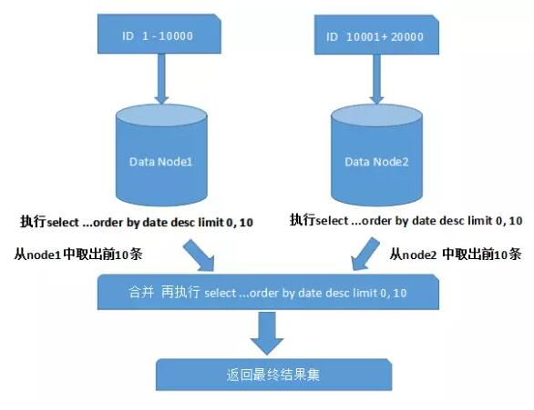
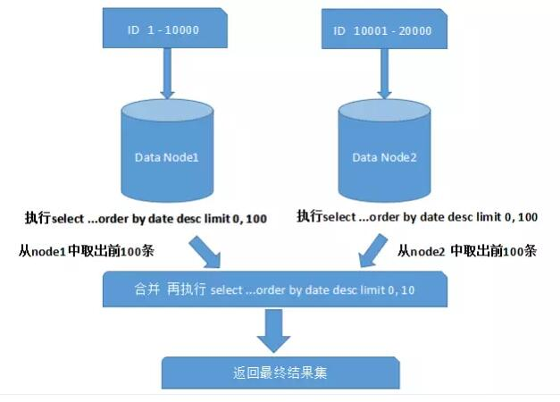
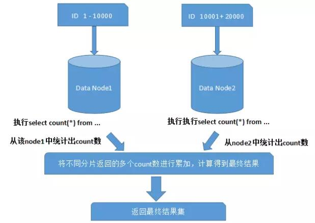

## 数据瓶颈之数据库分库分表方案

参考资料: [水平分库分表的关键步骤以及可能遇到的问题](https://www.infoq.cn/article/key-steps-and-likely-problems-of-horizontal-split-table?utm_source=infoq&utm_campaign=user_page&utm_medium=link)

### 分库类型

-   **垂直分表:**  
    一个 user 表有字段: id/userid/sex/password/adr/tel/code/age...
    user 表可以拆为:  
     user-base 表: id/userid/password  
     user-info 表: id/userid/sex/adr/tel/code/age
    **特点:** 每张表的结构不一样,每张表只有一列数据一致, 如本例中的 userid 字段  
    拆分字段的操作建议在数据库设计阶段就做好。如果是在发展过程中拆分，则需要改写以前的查询语句，会额外带来一定的成本和风险

-   **垂直分库:**  
    垂直分库在“微服务”盛行的今天已经非常普及了。基本的思路就是按照业务模块来划分出不同的数据库，而不是像早期一样将所有的数据表都放到同一个数据库中。如从所有表都在同一个库中分为, user 库, order 库, product 库  
    数据库的连接资源比较宝贵且单机处理能力也有限，在高并发场景下，垂直分库一定程度上能够突破 IO、连接数及单机硬件资源的瓶颈，是大型分布式系统中优化数据库架构的重要手段。

-   **水平分表:**
    水平拆分主要是通过 hash\取模 等方式,把不同的数据放到不同的表中.  
     如 user 表中有三条记录, 通过计算放到 user1 和 user2 表中  
     **特点:** 每张表中的结构都一样, 数据都不一样  
    能够降低单表的数据量，一定程度上可以缓解查询性能瓶颈。但本质上这些表还保存在同一个库中，所以库级别还是会有 IO 瓶颈。所以，一般不建议采用这种做法。

-   **水平分库:**  
    和水平分表的思想相同，唯一不同的就是将这些拆分出来的表保存在不同的数据库中。  
    某种意义上来讲，有些系统中使用的 **“冷热数据分离”**（将一些使用较少的历史数据迁移到其他的数据库中。而在业务功能上，通常默认只提供热点数据的查询），也是类似的实践。在高并发和海量数据的场景下，分库分表能够有效缓解单机和单库的性能瓶颈和压力，突破 IO、连接数、硬件资源的瓶颈。当然，投入的硬件成本也会更高。同时，这也会带来一些复杂的技术问题和挑战（例如：跨分片的复杂查询，跨分片事务等）

水平和垂直有一个**共同点:** 每张表的并集就是全部数据

### 分库分表的难点

#### 垂直分库带来的难点

##### 跨库 join 的问题

在拆分之前，系统中很多列表和详情页所需的数据是可以通过 sql join 来完成的。而拆分后，数据库可能是分布式在不同实例和不同的主机上，join 将变得非常麻烦。而且基于架构规范，性能，安全性等方面考虑，一般是禁止跨库 join 的。

**解决方案:**

-   全局表
    就是有可能系统中所有模块都可能会依赖到的一些表。为了避免跨库 join 查询，我们可以将这类表在其他每个数据库中均保存一份。同时，这类数据通常也很少发生修改（甚至几乎不会），所以也不用太担心“一致性”问题。

-   字段冗余
    “订单表”中保存“卖家 Id”的同时，将卖家的“Name”字段也冗余，这样查询订单详情的时候就不需要再去查询“卖家用户表”。
    字段冗余能带来便利，是一种“空间换时间”的体现。但其适用场景也比较有限，比较适合依赖字段较少的情况。

-   数据同步
    A 库中的 tab_a 表和 B 库中 tbl_b 有关联，可以定时将指定的表做同步。当然，同步本来会对数据库带来一定的影响，需要性能影响和数据时效性中取得一个平衡。

-   系统层组装
    通过调用不同模块的组件或者服务，获取到数据并进行字段拼装。比如同一个单据的主子表

##### 跨库事务（分布式事务）的问题

先略...

#### 垂直分库总结和实践建议

-   目前的数据库是否需要进行垂直分库？  
    根据系统架构和公司实际情况来，如果系统还是个简单的单体应用，并且没有什么访问量和数据量，那就别着急折腾“垂直分库”了, “过度设计”和“过早优化”是很多架构师和技术人员常犯的毛病。

-   垂直拆分有没有原则或者技巧？  
    没有什么黄金法则和标准答案。一般是参考系统的业务模块拆分来进行数据库的拆分。比如“用户服务”，对应的可能就是“用户数据库”。但是也不一定严格一一对应。有些情况下，数据库拆分的粒度可能会比系统拆分的粒度更粗。

-   后台报表系统中 join 的表都有 n 个了，分库后该怎么查？  
    有很多朋友跟我提过类似的问题。其实互联网的业务系统中，本来就应该尽量避免 join 的，如果有多个 join 的，要么是设计不合理，要么是技术选型有误。

#### 水平分库分表的关键步骤

##### 分布式全局唯一 ID

在很多中小项目中，我们往往直接使用数据库自增特性来生成主键 ID，这样确实比较简单。而在分库分表的环境中，数据分布在不同的分片上，不能再借助数据库自增长特性直接生成，否则会造成不同分片上的数据表主键会重复。简单介绍下使用和了解过的几种 ID 生成算法。

1. Twitter 的 Snowflake（又名“雪花算法”）
2. UUID/GUID（一般应用程序和数据库均支持）
3. MongoDB ObjectID（类似 UUID 的方式）
4. Ticket Server（数据库生存方式，Flickr 采用的就是这种方式）

其中，Twitter 的 Snowflake 算法是笔者近几年在分布式系统项目中使用最多的，未发现重复或并发的问题。该算法生成的是 64 位唯一 Id（由 41 位的 timestamp+ 10 位自定义的机器码 + 13 位累加计数器组成）。

##### 分库策略

-   **hash** 通过对表的一个或多个列的 Hash Key 进行计算，最后通过这个 Hash 码不同数值对应的数据区域进行分区。例如可以建立一个对表主键进行分区的表。
-   **range:** 以某个范围来分割数据, 如:
    1. 2013-2014 年的放到一张表中, 2014-2015 年放到另一张表中
    2. 数据每慢 100 万条就放到一个表中
    3. 每个省的数据存到不同的表/库中
-   **list:** 预定义, 预计在 n 年内数据增加 500 万条就设置 m 张表或 m 个库

##### 数据迁移，容量规划，扩容等问题

很少有项目会在初期就开始考虑分片设计的，一般都是在业务高速发展面临性能和存储的瓶颈时才会提前准备。因此，不可避免的就需要考虑历史数据迁移的问题。一般做法就是通过程序先读出历史数据，然后按照指定的分片规则再将数据写入到各个分片节点中。

##### 跨分片技术问题

-   **跨分片的分页排序**
    如下图: 取第一页数据(一页 10 条), 需要从不同的库中取出前 10 条数据, 然后将这些数据合并后再次取前 10 条
    
    上面这种是比较简单的情况, 对性能影响不大, 如果是取第十页数据呢?  
    

-   **跨分片的函数处理**
    在使用 Max、Min、Sum、Count 之类的函数进行统计和计算的时候，需要先在每个分片数据源上执行相应的函数处理，然后再将各个结果集进行二次处理，最终再将处理结果返回。如下图所示：
    

-   **跨分片 join**
    Join 是关系型数据库中最常用的特性，但是在分片集群中，join 也变得非常复杂。应该尽量避免跨分片的 join 查询, 通常有以下几种方式来避免：

    -   全局表(和垂直分库中的全局表相同)
    -   ER 分片  
        在关系型数据库中，表之间往往存在一些关联的关系。如果我们可以先确定好关联关系，并将那些存在关联关系的表记录存放在同一个分片(库)上，那么就能很好的避免跨分片 join 问题。在一对多关系的情况下，我们通常会选择按照数据较多的那一方进行拆分

-   **内存计算**  
     可以将数据丢给 spark 集群进行内存计算，最后将计算结果返回。

-   **跨分片事务问题**

### 我们的系统真的需要分库分表吗

一般 MySQL 单表 1000W 左右的数据是没有问题的（前提是应用系统和数据库等层面设计和优化的比较好）。如果单机无法满足，且很难再从其他方面优化，那么说明是需要考虑分片的。这种情况可以先去掉数据库中自增 ID，为分片和后面的数据迁移工作提前做准备。

很多人觉得“分库分表”是宜早不宜迟，应该尽早进行，因为担心越往后公司业务发展越快、系统越来越复杂、系统重构和扩展越困难…这种话听起来是有那么一点道理，但我的观点恰好相反，对于关系型数据库来讲，我认为**能不分片就别分片**，除非是系统真正需要，因为数据库分片并非低成本或者免费的。

推荐一个比较靠谱的过渡技术– **表分区**。主流的关系型数据库中基本都支持。不同的分区在逻辑上仍是一张表，但是物理上却是分开的，能在一定程度上提高查询性能，而且对应用程序透明，无需修改任何代码。笔者曾经负责优化过一个系统，主业务表有大约 8000W 左右的数据，考虑到成本问题，当时就是采用“表分区”来做的，效果比较明显，且系统运行的很稳定。

### 开源免费的分库分表解决方案

当前主要有两类解决方案：

1. 基于应用程序层面的 DDAL（分布式数据库访问层）
   比较典型的就是淘宝半开源的 TDDL，当当网开源的 Sharding-JDBC 等。分布式数据访问层无需硬件投入，技术能力较强的大公司通常会选择自研或参照开源框架进行二次开发和定制。对应用程序的侵入性一般较大，会增加技术成本和复杂度。通常仅支持特定编程语言平台（Java 平台的居多），或者仅支持特定的数据库和特定数据访问框架技术（一般支持 MySQL 数据库，JDBC、MyBatis、Hibernate 等框架技术）。
2. 数据库中间件，比较典型的像 mycat（在阿里开源的 cobar 基础上做了很多优化和改进，属于后起之秀，也支持很多新特性），基于 Go 语言实现 kingSharding，比较老牌的 Atlas（由 360 开源）等。这些中间件在互联网企业中大量被使用。另外，MySQL 5.x 企业版中官方提供的 Fabric 组件也号称支持分片技术，不过国内使用的企业较少。
   中间件也可以称为“透明网关”，大名鼎鼎的 mysql_proxy 大概是该领域的鼻祖（由 MySQL 官方提供，仅限于实现“读写分离”）。中间件一般实现了特定数据库的网络通信协议，模拟一个真实的数据库服务，屏蔽了后端真实的 Server，应用程序通常直接连接中间件即可。而在执行 SQL 操作时，中间件会按照预先定义分片规则，对 SQL 语句进行解析、路由，并对结果集做二次计算再最终返回。引入数据库中间件的技术成本更低，对应用程序来讲侵入性几乎没有，可以满足大部分的业务。增加了额外的硬件投入和运维成本，同时，中间件自身也存在性能瓶颈和单点故障问题，需要能够保证中间件自身的高可用、可扩展。

总之，不管是使用分布式数据访问层还是数据库中间件，都会带来一定的成本和复杂度，也会有一定的性能影响。所以，还需读者根据实际情况和业务发展需要慎重考虑和选择。

---

[数据库公共问题](README.md)

[主页](/)
