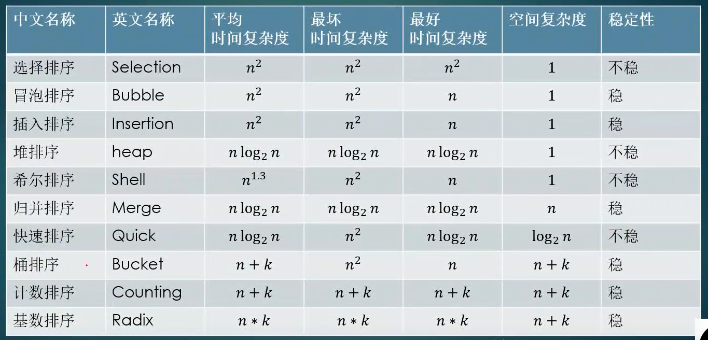

## 排序



重点记忆: 插入排序, 堆排序, 归并排序, 快速排序

宋词背诵法

```
    《忆秦娥 · 面试我最强》
                    —— 马士兵
    选炮插，

    快归堆希统计基，

    n 方 n老 n一三，

    对 n 加 k n 乘 k,

    不稳稳稳不稳稳，

    不稳不稳稳稳稳。
```

上面这阙马老师的词原题是《忆排序》, 但是我觉得词牌名最好不改, 所以自作主张把词牌名换回了忆秦娥

这阙词的大意为:

```
    选炮插，

    -- 选择排序, 冒泡排序, 插入排序

    快归堆希统计基，

    -- 快速排序, 归并排序, 堆排序, 希尔排序,  桶排序, 计数排序, 基数排序

    n 方 n老 n一三，

    -- 选择排序, 冒泡排序, 插入排序的平均时间复杂度为n^2; 快速排序, 归并排序, 堆排序为nlogn; 希尔排序为n^1.3

    对 n 加 k n 乘 k,

    -- 桶排序, 计数排序 都是n+k; 基数排序为 n*k

    不稳稳稳不稳稳，

    -- 稳定性: 选择排序 不稳; 冒泡排序, 插入排序 稳, 快速 不稳; 归并 稳

    不稳不稳稳稳稳。

    -- 堆排序 , 希尔排序 不稳;  桶排序, 计数排序, 基数排序 稳

```
