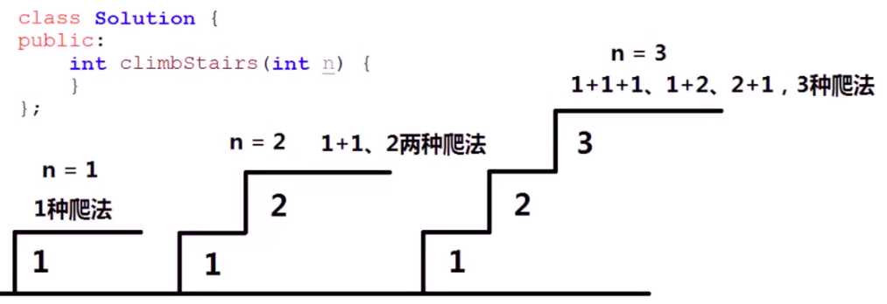
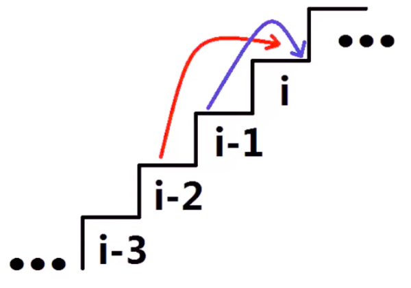
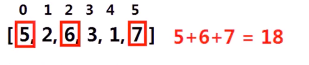
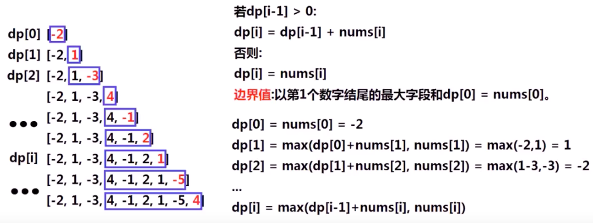

[TOC]

## 动态规划

dynamic programming, 也叫 DP 算法, 是**运筹学**的一个分支, 求解**决策过程最优化**的数学方法, 是 20 世纪 50 年代有美国数学家提出的最**优化原理**. 利用各个阶段直接的关系逐个求解, 最终求得**全局最优解**, 在设计动态规划算法时, 需要确认**原问题和子问题, 动态规划状态, 边界状态值, 状态转移方程**等关键因素.

### 例一: 爬楼梯

在爬楼梯时, 每次走上一节台阶或者两节台阶, 问 n 节楼梯共有多少上楼方式走法?



**分析**

每次最多爬 2 节, 楼梯的第 i 节, 只可能从 i-1 节与 i-2 节到达, 所有第 i 节有多少种爬法, 只与从 i-1 节与 i-2 节的爬法数量直接相关



第 i 节楼梯的爬法 = 第 i-1 节爬法+第 i-2 节爬法

而第 1 节只有 1 种爬法, 第 2 节只有 2 种爬法, 由此就可以推出第 3 节到第 i 节楼梯的爬法

```java
package com.example.test.alg;

/**
 * 功能描述: 爬楼梯-动态规划
 *
 * @auther: pikaqiu
 * @date: 2019/4/24 7:38 AM
 */
public class DPTest {

    public static void main(String[] args) {
        int[] dp = new int[20];

        dp[0] = 1;
        dp[1] = 2;

        for (int i = 2; i < dp.length; i++) {
            dp[i] = dp[i - 1] + dp[i - 2];
            System.out.println("第" + (i + 1) + "节楼梯共有" + dp[i] + "种爬法");
        }
    }
}
```

### 例二: 打家劫舍

在一条直线上, 有 n 个房屋, 每个房屋中有数量不等的财宝, 有一个强盗需要从房屋中盗取财宝, 由于房屋中有警报器, 如果同时从相邻的两个房屋中盗取财宝就会触发警报, 问在不触发警报的前提下, 最多可获得多少财宝?



**分析**

同时从相邻的两个房屋中盗取财宝就会触发警报, 所以:

-   在选择第 i 个房间就不能选择第 i-1 个房间
-   不选择第 i 个房间, 相当于只考虑前 i-1 个房间盗取财宝

只考虑一个房间, 最优解: 5
只考虑前两个房间 5 2, 最优解: 5
只考虑前三个房间 5 2 6, 最优解: 11
只考虑前四个房间 5 2 6 3, 最优解: 11
只考虑前五个房间 5 2 6 3 1, 最优解: 12
只考虑前六个房间 5 2 6 3 1 7, 最优解: 18

也就是说, **第 i 个房间的最优解 = max(前 i-1 个房间的最优解, 前 i-2 个房间的最优解+本房间财宝数量)**

**思路**

1. 原问题和子问题:
   问题为求前 n 个房间的最优解, 子问题为求前 1 个房间, 前 2 个... 前 n-1 个房间的最优解
2. 确认状态:
   第 i 个状态即为前 i 个房间的最优解
3. 确认边界值:
   前一个房间最优解为第一个房间
   前两个个房间最优解为第一, 第二个房间的最大值
4. 确认方程转移状态:
   在选择第 i 个房间就不能选择第 i-1 个房间  
   不选择第 i 个房间, 相当于只考虑前 i-1 个房间盗取财宝  
   dp[i] = max(dp[i-1], dp[i-2]+nums[i]); (i >= 3)

```java
package com.example.test.alg;

/**
 * 功能描述: 打家劫舍
 *
 * @auther: pikaqiu
 * @date: 2019/4/24 7:38 AM
 */
public class DPTest {

    public static void main(String[] args) {
        int[] nums = new int[]{5, 2, 6, 3, 1, 7};
        int[] dp = new int[nums.length];

        dp[0] = 5;
        dp[1] = 5;

        for (int i = 2; i < dp.length; i++) {
            dp[i] = Math.max(dp[i - 1], dp[i - 2] + nums[i]);
            System.out.println("第" + (i + 1) + "房间最优解: " + dp[i]);
        }
    }
}
```

### 例三: 最大子段和

给定一个数组, 就这个数组的连续子数组中, 最大的那一段的和. 如数组 \[-2,1,-3,4,-1,2,1,-5,4], 最大的子段为 \[4,-1,2,1], 和为 6

**分析**

本例不能使用上个例子中的思路, 因为要求需要连续子段, 前 i-1 个数组的最大和不一定包含第 i-1 . 所以也不能用 dp[i-1]+nums[i].

求 n 个数的数组最大子段和, 转化为分别求出第 1 个, 第 2 个, ... 第 i 个, ... 第 n 个**数字结尾**最大子段和, 在找出这 n 个结果中最大的.

动态规划算法:

第 i 状态 dp(i)即为第 i 个数字结尾的最大子段和(最优解), 由于以第 i-1 个数字结尾的最大子段和 dp(i-1) 和 nums[i] **相邻**



```java
package com.example.test.alg;

import java.util.Arrays;

/**
 * 功能描述:
 *
 * @auther: pikaqiu
 * @date: 2019/4/24 7:38 AM
 */
public class DPTest {

    public static void main(String[] args) {
        int[] nums = new int[]{-2, 1, -3, 4, -1, 2, 1, -5, 4};
        int[] dp = new int[nums.length];

        // 以第i个元素结尾的最大和
        int[] maxSum = new int[nums.length];

        maxSum[0] = -2;

        for (int i = 1; i < maxSum.length; i++) {
            if (maxSum[i-1] < 0) {
                maxSum[i] = nums[i];
            } else {
                maxSum[i] =  maxSum[i-1]+nums[i];
            }
        }
        System.out.println(Arrays.toString(maxSum));

        for (int i = 0; i < dp.length; i++) {
            dp[i] = max(maxSum,i);
            System.out.println("前" + (i + 1) + "个元素的最大子段和为: " + dp[i]);
        }
    }

    private static int max(int[] maxSum, int i) {
        int res = maxSum[i];
        for (int j = 0; j <= i; j++) {
            res = Math.max(res, maxSum[j]);
        }
        return res;
    }
}
```

### 例四: 找零钱

已知不同面值的钞票, 求如何用最少数量的钞票组成某个金额, 求可使用最少的钞票数量, 如果任意数量的已知钞票都无法组成该金额则返回 -1

例如:
钞票面值[1,2,5], 金额 11 = 5+5+1, 3 张  
钞票面值[2], 金额 3 , -1  
钞票面值[1,2,5,7,10], 金额 14 = 7+7, 2 张

**分析**

nums = [1,2,5,7,10] , 金额 14

dp[i], 代表金额 i 的最优解(即最小使用张数)  
数组 dp 中存储金额 1-14 的最优解

在计算 dp[i]是, dp[0], dp[1], ... dp[i-1]都是已知的:

金额 i 可由:
金额: i - 1 与 nums[0] 组合
金额: i - 2 与 nums[1] 组合
金额: i - 5 与 nums[2] 组合
金额: i - 7 与 nums[3] 组合
金额: i - 10 与 nums[4] 组合
