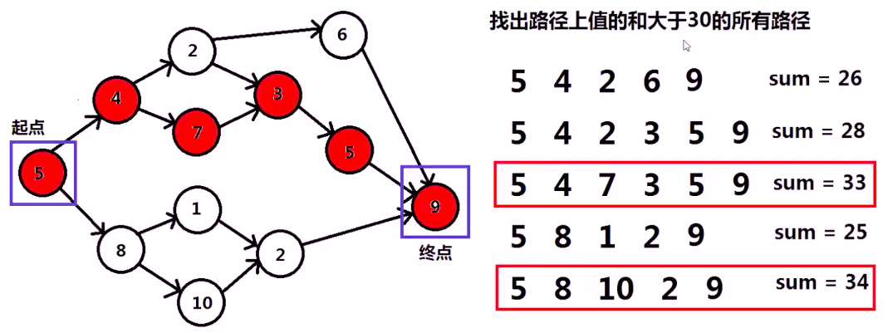
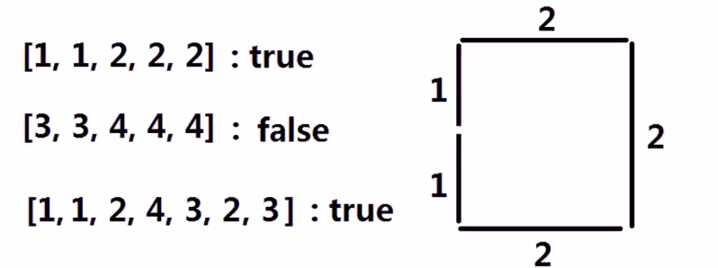

[TOC]

# 回溯算法

回溯法又称试探法, 当试探到某一步时, 发现原来的选择达不到目标, 就退回一步重新选择, 这种走不通就退回再走的技术被称为回溯法



## 子集

https://leetcode-cn.com/problems/subsets/

给定一组不含重复元素的整数数组 nums，返回该数组所有可能的子集（幂集）。

说明：解集不能包含重复的子集。

```
示例:
输入: nums = [1,2,3]
输出:
[
  [3],
  [1],
  [2],
  [1,2,3],
  [1,3],
  [2,3],
  [1,2],
  []
]
```

```java
package com.example.test.alg;

import java.util.ArrayList;
import java.util.List;
import java.util.Stack;

/**
 * 功能描述: 子集
 *
 * @auther: pikaqiu
 * @date: 2019/5/16 12:26 PM
 */
public class ddd {

    public static void main(String[] args) {

        int[] nums = new int[]{1, 2, 3};

        List<List<Integer>> list = new ArrayList<>();
        Stack<Integer> item = new Stack<>();


        generate(nums, item, list, 0);

        list.add(new ArrayList<>());

        System.out.println(list);
    }

    private static void generate(int[] arr, Stack<Integer> item, List<List<Integer>> list, int start) {

        if (start == arr.length) {
            return;
        }

        item.add(arr[start]);
        List<Integer> item1 = new ArrayList<>();
        item1.addAll(item);
        list.add(item1);

        generate(arr, item, list, start + 1);

        item.pop();

        generate(arr, item, list, start + 1);
    }
}
```

## 求无重复子集

给定一组含重复元素的整数数组 nums，返回该数组所有可能的子集。

例如: nums = \[2,1,2,2]

结果为: \[[],[1],[1,2],[1,2,2],[1,2,2,2],[2],[2,2],[2,2,2]]

注意: [2,1,1] 与 [1,2,2]是重复的

思路: 排序后去重

```java
package com.example.test.alg;

import java.util.*;

/**
 * 功能描述: 求无重复子集
 *
 * @auther: pikaqiu
 * @date: 2019/5/16 12:26 PM
 */
public class Test {

    public static void main(String[] args) {

        int[] nums = new int[]{2, 1, 2, 2};

        List<List<Integer>> list = new ArrayList<>();
        List<Integer> item = new ArrayList<>();

        generate(nums, item, list, 0);

        list.add(new ArrayList<>());

        System.out.println(list);
    }

    private static void generate(int[] arr, List<Integer> item, List<List<Integer>> list, int start) {

        if (start == arr.length) {
            return;
        }

        item.add(arr[start]);
        List<Integer> item1 = new ArrayList<>();
        item1.addAll(item);
        item1.sort(new Comparator<Integer>() {
            @Override
            public int compare(Integer o1, Integer o2) {
                return o1 - o2;
            }
        });
        if (!isEquals(item1, list)) {
            list.add(item1);
        }

        generate(arr, item, list, start + 1);

        item.remove(item.size() - 1);
        generate(arr, item, list, start + 1);
    }

    private static boolean isEquals(List<Integer> item, List<List<Integer>> list) {

        if (list != null && list.size() > 0) {
            for (List<Integer> l : list) {
                boolean flag = false;
                if (l.size() == item.size()) {
                    for (int i = 0; i < item.size(); i++) {
                        if (item.get(i) != l.get(i)) {
                            flag = false;
                            break;
                        } else {
                            flag = true;
                        }
                    }
                }
                if (flag) return true;
            }
        } else {
            return false;
        }

        return false;
    }
}
```

## 组合数之和

给定一组含重复元素的整数数组 nums，求该数组所有可能的子集中, 子集各个元素之和为 target 的子集, 结果中无重复子集。

例如: nums = \[10, 1, 2, 7,6,1,5] target = 8, 结果为: \[[1,7], [1,2,5], [2,6], [1,1,6]]

思路: 这里和上题思路一致, 多加一个判断

```java
package com.example.test.alg;

import java.util.ArrayList;
import java.util.Comparator;
import java.util.List;

/**
 * 功能描述: 组合数之和
 *
 * @auther: pikaqiu
 * @date: 2019/5/16 12:26 PM
 */
public class Test {

    public static void main(String[] args) {

        int[] nums = new int[]{10, 1, 2, 7, 6, 1, 5};
        int target = 8;

        List<List<Integer>> list = new ArrayList<>();
        List<Integer> item = new ArrayList<>();

        generate(nums, item, list, 0, target);

        if (target == 0) {
            list.add(new ArrayList<>());
        }

        System.out.println(list);
    }

    private static void generate(int[] arr, List<Integer> item, List<List<Integer>> list, int start, int target) {

        if (start == arr.length) {
            return;
        }

        item.add(arr[start]);
        List<Integer> item1 = new ArrayList<>();
        item1.addAll(item);
        item1.sort(new Comparator<Integer>() {
            @Override
            public int compare(Integer o1, Integer o2) {
                return o1 - o2;
            }
        });
        if (!isEquals(item1, list) && sumEquals(item1, target)) {
            list.add(item1);
        }

        generate(arr, item, list, start + 1, target);

        item.remove(item.size() - 1);
        generate(arr, item, list, start + 1, target);
    }

    private static boolean sumEquals(List<Integer> list, int target) {
        int num = 0;
        for (int i : list) {
            num += i;
        }
        return num == target;
    }

    private static boolean isEquals(List<Integer> item, List<List<Integer>> list) {

        if (list != null && list.size() > 0) {
            for (List<Integer> l : list) {
                boolean flag = false;
                if (l.size() == item.size()) {
                    for (int i = 0; i < item.size(); i++) {
                        if (item.get(i) != l.get(i)) {
                            flag = false;
                            break;
                        } else {
                            flag = true;
                        }
                    }
                }
                if (flag) return true;
            }
        } else {
            return false;
        }

        return false;
    }
}
```

## 生成括号

给出 n 代表生成括号的对数，请你写出一个函数，使其能够生成所有可能的并且有效的括号组合。

```
例如，给出 n = 3，生成结果为：

[
  "((()))",
  "(()())",
  "(())()",
  "()(())",
  "()()()"
]
```

```java
package com.example.test.alg;

import java.util.ArrayList;
import java.util.List;

/**
 * 功能描述: 生成括号
 *
 * @auther: pikaqiu
 * @date: 2019/5/16 12:26 PM
 */
public class Test {
    public static void main(String[] args) {
        int n = 3;
        List<String> list = new ArrayList<>();
        String item = "";
        generate(list, item, n, 0);
        System.out.println(list);
        isLegal("(())", 2, 4);
    }

    private static void generate(List<String> list, String item, int n, int i) {
        if (i == n * 2) {
            list.add(item);
            return;
        }

        if (isLegal(item + "(", n, i)) {
            generate(list, item + "(", n, i + 1);
        }
        if (isLegal(item + ")", n, i)) {
            generate(list, item + ")", n, i + 1);
        }
    }

    private static boolean isLegal(String str, int n, int i) {

        boolean flag = true;

        int leftNum = 0;
        int rightNum = 0;

        for (int index = 0; index < str.length(); index++) {
            if (str.charAt(index) == '(') {
                leftNum++;
            } else {
                rightNum++;
            }
        }

        if (leftNum > n || rightNum > n || rightNum > leftNum) {
            flag = false;
        }

        return flag;
    }
}
```

## N 皇后问题

n 皇后问题研究的是如何将 n 个皇后放置在 n×n 的棋盘上，并且使皇后彼此之间不能相互攻击。


上图为 8 皇后问题的一种解法。

给定一个整数 n，返回所有不同的 n 皇后问题的解决方案。

每一种解法包含一个明确的 n 皇后问题的棋子放置方案，该方案中 'Q' 和 '.' 分别代表了皇后和空位。

```
输入: 4
输出: [
 [".Q..",  // 解法 1
  "...Q",
  "Q...",
  "..Q."],

 ["..Q.",  // 解法 2
  "Q...",
  "...Q",
  ".Q.."]
]
解释: 4 皇后问题存在两个不同的解法。
```

```java
package com.example.test.alg;

import java.util.ArrayList;
import java.util.Arrays;
import java.util.List;

/**
 * 功能描述: N 皇后问题
 *
 * @auther: pikaqiu
 * @date: 2019/5/16 12:26 PM
 */
public class Test {
    static int[] dx = new int[]{0, 1, 1, 1, 0, -1, -1, -1};
    static int[] dy = new int[]{1, 1, 0, -1, -1, 0, -1, 1};

    public static void main(String[] args) {

        // 皇后的数量
        int n = 4;

        // mark数组使用 1 来标记已放置, 0 未放置
        int[][] mark = new int[n][n];

        // 最终结果
        List<String[][]> result = new ArrayList<>();

        // 某一次结果
        String[][] location = new String[n][n];

        generate(0, n, location, result, mark);

        for (String[][] res : result) {
            for (String[] arr : res)
                System.out.println(Arrays.toString(arr));
            System.out.println("-----------");
        }
    }

    // 第 k 行放置皇后
    private static void generate(int k, int n, String[][] location, List<String[][]> result, int[][] mark) {
        if (k == n) {
            result.add(location);
            return;
        }

        for (int i = 0; i < n; i++) {
            if (mark[k][i] == 0) {
                // 记录原标记数组
                int[][] temp_mark = new int[n][n];

                for (int x = 0; x < n; x++) {
                    for (int y = 0; y < n; y++) {
                        temp_mark[x][y] = mark[x][y];
                    }
                }

                String[][] location1 = new String[n][n];
                location[k][i] = "Q";
                for (int j = 0; j < location.length; j++) {
                    for (int j1 = 0; j1 < location.length; j1++) {
                        if (j == k) {
                            location1[j][j1] = "Q".equals(location[j][j1]) ? "Q" : ".";
                        } else {
                            location1[j][j1] = location[j][j1];
                        }
                    }
                }
                pubDownQueen(k, i, mark);
                generate(k + 1, n, location1, result, mark);

                mark = temp_mark;
            }
            location[k][i] = ".";
        }

    }

    private static void pubDownQueen(int x, int y, int[][] mark) {
        // 标记放置位置
        for (int i = 0; i < dx.length; i++) {
            int cx = x, cy = y;

            while (cx < mark.length && cx >= 0 && cy < mark.length && cy >= 0) {
                mark[cx][cy] = 1;
                cx += dx[i];
                cy += dy[i];
            }
        }
    }
}
```

## 火柴拼正方形

还记得童话《卖火柴的小女孩》吗？现在，你知道小女孩有多少根火柴，请找出一种能使用所有火柴拼成一个正方形的方法。不能折断火柴，可以把火柴连接起来，并且每根火柴都要用到。

输入为小女孩拥有火柴的数目，每根火柴用其长度表示。输出即为是否能用所有的火柴拼成正方形。

```
示例 1:

输入: [1,1,2,2,2]
输出: true

解释: 能拼成一个边长为2的正方形，每边两根火柴。
示例 2:

输入: [3,3,3,3,4]
输出: false

解释: 不能用所有火柴拼成一个正方形。
```



注意:

-   给定的火柴长度和在 0 到 10^9 之间。
-   火柴数组的长度不超过 15。

```java
package com.example.test.alg;

import java.util.Arrays;
import java.util.Comparator;

/**
 * 功能描述: 火柴拼正方形
 *
 * @auther: pikaqiu
 * @date: 2019/5/16 12:26 PM
 */
public class Test {
    public static void main(String[] args) {
        Integer[] nums = new Integer[]{3, 3, 3, 3, 4};

        System.out.println(makesquare(nums));
    }

    private static boolean makesquare(Integer[] nums) {
        int length = checkNums(nums);
        if (length == -1) {
            return false;
        }

        Arrays.sort(nums, new Comparator<Integer>() {
            @Override
            public int compare(Integer o1, Integer o2) {
                return o2 - o1;
            }
        });

        int[] bucket = new int[4];

        return generate(nums, bucket, 0, length);
    }

    private static boolean generate(Integer[] nums, int[] bucket, int k, int target) {

        if (k == nums.length) {
            return bucket[0] == target && bucket[1] == target
                    && bucket[2] == target && bucket[3] == target;
        }

        for (int i = 0; i < 4; i++) {
            if (bucket[i] + nums[k] > target) {
                continue;
            } else {
                bucket[i] += nums[k];
                if (generate(nums, bucket, k + 1, target)) {
                    return true;
                } else {
                    bucket[i] -= nums[k];
                }
            }
        }

        return false;
    }

    // 检查nums是否合理, 如果nums的和不能整除4或者, nums中有比和除以4还大的数就是不合理的`
    private static int checkNums(Integer[] nums) {
        int sum = 0;
        for (int num : nums) {
            sum += num;
        }

        if (sum % 4 != 0) {
            return -1;
        }

        for (int num : nums) {
            if (num > sum / 4) {
                return -1;
            }
        }

        return sum / 4;
    }
}
```
