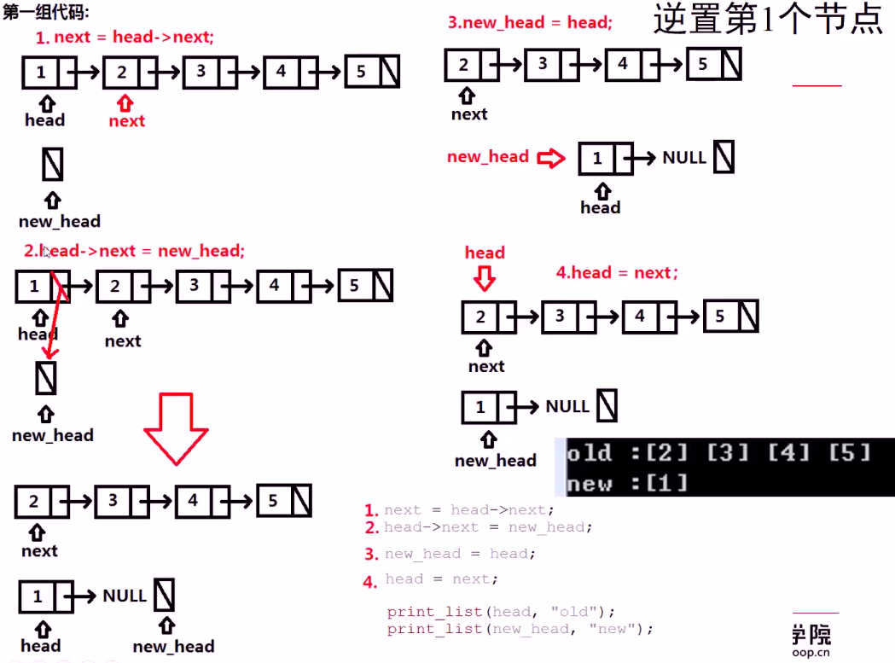
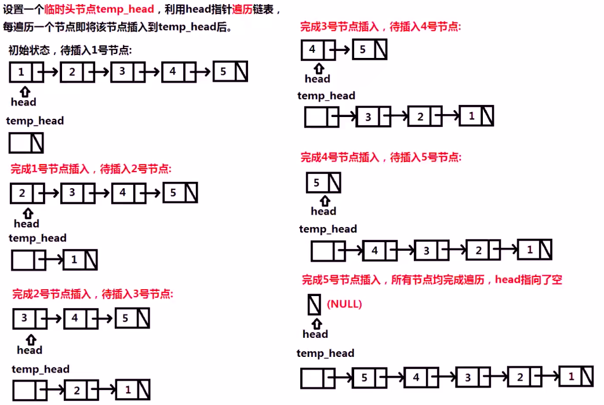
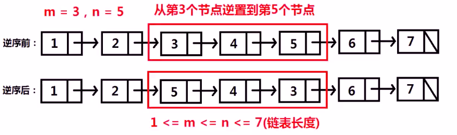

[TOC]

## 链表经典考题

### 链表逆序

已知链表头结点指针 head, 将链表逆序. (不可申请额外的内存空间)

链表结构:

```java
public class ListNode {
    int val;
    ListNode next;
    ListNode (int val) {
        this.val = val;
    }
}
```

#### 方法一: 就地逆置法

方法思想:

新建一个头节点 newHead, 每次将 head 的 next 使用头插法插入 newHead, 从而使 head 逆序



```java
package com.example.test.alg;

/**
 * 功能描述:链表翻转-就地逆置法
 *
 * @auther: pikaqiu
 * @date: 2019/4/23 5:13 PM
 */
public class Reverse {

    public static void main(String[] args) {
        ListNode node1 = new ListNode(1);
        ListNode node2 = new ListNode(2);
        ListNode node3 = new ListNode(3);
        ListNode node4 = new ListNode(4);
        ListNode node5 = new ListNode(5);
        node1.next = node2;
        node2.next = node3;
        node3.next = node4;
        node4.next = node5;
        ListNode head = new ListNode(0);
        head.next = node1;

        System.out.println(head);
        ListNode newHead = new ListNode(0);
        doSth(head);
    }

    private static void doSth(ListNode head) {
        // 指向需要翻转结点的指针, 当前node
        ListNode curNode = head.next.next;

        // 当前节点的上一个节点
        ListNode preNode = head.next;

        while (curNode != null) {

            preNode.next = curNode.next;

            curNode.next = head.next;

            head.next = curNode;

            curNode = preNode.next;

            System.out.println(head);
        }

    }
}

```

#### 方法二: 头插法



```java
package com.example.test.alg;

/**
 * 功能描述: 链表翻转-头插法
 *
 * @auther: pikaqiu
 * @date: 2019/4/23 5:13 PM
 */
public class Reverse {

    public static void main(String[] args) {
        ListNode node1 = new ListNode(1);
        ListNode node2 = new ListNode(2);
        ListNode node3 = new ListNode(3);
        ListNode node4 = new ListNode(4);
        ListNode node5 = new ListNode(5);
        node1.next = node2;
        node2.next = node3;
        node3.next = node4;
        node4.next = node5;
        ListNode head = new ListNode(0);
        head.next = node1;

        System.out.println(head);
        ListNode newHead = new ListNode(0);
        doSth(head, newHead);
    }

    private static void doSth(ListNode head, ListNode newHead) {
        if (head.next !=null) {
            // 让head指向node的下一个节点
            ListNode next = head.next;
            head.next = next.next;

            // 让newHead指向node
            next.next = newHead.next;
            newHead.next = next;
            System.out.println("------------");
            System.out.println("old: " + head);
            System.out.println("new: " + newHead);
            doSth(head, newHead);
        } else {
            System.out.println("#############");
            System.out.println("翻转结果: " + newHead);
        }
    }
}
```

### 链表中间段逆序

已知链表头结点指针 head, 将链表位置从 m 到 n 逆序. (不额外申请空间)



```java
package com.example.test.alg;

/**
 * 功能描述:
 *
 * @auther: pikaqiu
 * @date: 2019/4/23 5:13 PM
 */
public class Reverse {

    public static void main(String[] args) {
        ListNode node1 = new ListNode(1);
        ListNode node2 = new ListNode(2);
        ListNode node3 = new ListNode(3);
        ListNode node4 = new ListNode(4);
        ListNode node5 = new ListNode(5);
        ListNode node6 = new ListNode(6);
        ListNode node7 = new ListNode(7);
        node1.next = node2;
        node2.next = node3;
        node3.next = node4;
        node4.next = node5;
        node5.next = node6;
        node6.next = node7;
        ListNode head = new ListNode(0);
        head.next = node1;

        System.out.println(head);
        ListNode newHead = new ListNode(0);
        doSth(head, 3, 5);
    }

    private static void doSth(ListNode head, int m, int n) {
        ListNode next = head.next;
        ListNode newNodes = new ListNode(0);

        int i = 0;
        while (next != null) {
            i++;
            if (i > m && i <= n) {
                head.next = next.next;
                next.next = null;

                ListNode newNext = newNodes.next;
                int j = 0;
                while (newNext != null) {
                    j++;
                    if (j == m - 1) {
                        next.next = newNext.next;
                        newNext.next = next;
                    }
                    newNext = newNext.next;
                }
            } else {
                head.next = next.next;
                next.next = null;

                ListNode newNext = newNodes.next;
                while (newNext != null && newNext.next != null) {
                    newNext = newNext.next;
                }
                if (newNext != null) {
                    newNext.next = next;
                } else {
                    newNodes.next = next;
                }
            }
            next = head.next;
            System.out.println("----------");
            System.out.println("old: " + head);
            System.out.println("new: " + newNodes);
        }
    }
}

```
