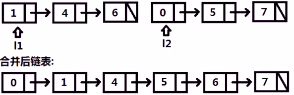

[TOC]

## 链表经典考题

### 链表逆序

已知链表头结点指针 head, 将链表逆序. (不可申请额外的内存空间)

链表结构:

```java
public class ListNode {
    int val;
    ListNode next;
    ListNode (int val) {
        this.val = val;
    }
}
```

#### 方法一: 就地逆置法

方法思想:

新建一个头节点 newHead, 每次将 head 的 next 使用头插法插入 newHead, 从而使 head 逆序


```java
package com.example.test.alg;

/**
 * 功能描述:链表翻转-就地逆置法
 *
 * @auther: pikaqiu
 * @date: 2019/4/23 5:13 PM
 */
public class Reverse {

    public static void main(String[] args) {
        ListNode node1 = new ListNode(1);
        ListNode node2 = new ListNode(2);
        ListNode node3 = new ListNode(3);
        ListNode node4 = new ListNode(4);
        ListNode node5 = new ListNode(5);
        node1.next = node2;
        node2.next = node3;
        node3.next = node4;
        node4.next = node5;
        ListNode head = new ListNode(0);
        head.next = node1;

        System.out.println(head);
        ListNode newHead = new ListNode(0);
        doSth(head);
    }

    private static void doSth(ListNode head) {
        // 指向需要翻转结点的指针, 当前node
        ListNode curNode = head.next.next;

        // 当前节点的上一个节点
        ListNode preNode = head.next;

        while (curNode != null) {

            preNode.next = curNode.next;

            curNode.next = head.next;

            head.next = curNode;

            curNode = preNode.next;

            System.out.println(head);
        }

    }
}

```

#### 方法二: 头插法


```java
package com.example.test.alg;

/**
 * 功能描述: 链表翻转-头插法
 *
 * @auther: pikaqiu
 * @date: 2019/4/23 5:13 PM
 */
public class Reverse {

    public static void main(String[] args) {
        ListNode node1 = new ListNode(1);
        ListNode node2 = new ListNode(2);
        ListNode node3 = new ListNode(3);
        ListNode node4 = new ListNode(4);
        ListNode node5 = new ListNode(5);
        node1.next = node2;
        node2.next = node3;
        node3.next = node4;
        node4.next = node5;
        ListNode head = new ListNode(0);
        head.next = node1;

        System.out.println(head);
        ListNode newHead = new ListNode(0);
        doSth(head, newHead);
    }

    private static void doSth(ListNode head, ListNode newHead) {
        if (head.next !=null) {
            // 让head指向node的下一个节点
            ListNode next = head.next;
            head.next = next.next;

            // 让newHead指向node
            next.next = newHead.next;
            newHead.next = next;
            System.out.println("------------");
            System.out.println("old: " + head);
            System.out.println("new: " + newHead);
            doSth(head, newHead);
        } else {
            System.out.println("#############");
            System.out.println("翻转结果: " + newHead);
        }
    }
}
```

### 链表中间段逆序

已知链表头结点指针 head, 将链表位置从 m 到 n 逆序. (不额外申请空间)


```java
package com.example.test.alg;

/**
 * 功能描述:
 *
 * @auther: pikaqiu
 * @date: 2019/4/23 5:13 PM
 */
public class Reverse {

    public static void main(String[] args) {
        ListNode node1 = new ListNode(1);
        ListNode node2 = new ListNode(2);
        ListNode node3 = new ListNode(3);
        ListNode node4 = new ListNode(4);
        ListNode node5 = new ListNode(5);
        ListNode node6 = new ListNode(6);
        ListNode node7 = new ListNode(7);
        node1.next = node2;
        node2.next = node3;
        node3.next = node4;
        node4.next = node5;
        node5.next = node6;
        node6.next = node7;
        ListNode head = new ListNode(0);
        head.next = node1;

        System.out.println(head);
        ListNode newHead = new ListNode(0);
        doSth(head, 3, 5);
    }

    private static void doSth(ListNode head, int m, int n) {
        ListNode next = head.next;
        ListNode newNodes = new ListNode(0);

        int i = 0;
        while (next != null) {
            i++;
            if (i > m && i <= n) {
                head.next = next.next;
                next.next = null;

                ListNode newNext = newNodes.next;
                int j = 0;
                while (newNext != null) {
                    j++;
                    if (j == m - 1) {
                        next.next = newNext.next;
                        newNext.next = next;
                    }
                    newNext = newNext.next;
                }
            } else {
                head.next = next.next;
                next.next = null;

                ListNode newNext = newNodes.next;
                while (newNext != null && newNext.next != null) {
                    newNext = newNext.next;
                }
                if (newNext != null) {
                    newNext.next = next;
                } else {
                    newNodes.next = next;
                }
            }
            next = head.next;
            System.out.println("----------");
            System.out.println("old: " + head);
            System.out.println("new: " + newNodes);
        }
    }
}

```

### 两个排序链表的合并

两个有序链表 l1 和 l2, 合并为新的有序链表并返回头结点



思路: 两个指针分别指向 l1 和 l2, 谁比较小就成为 head.next

```java
package com.example.test.alg;

/**
 * 功能描述:  两个排序链表的合并
 *
 * @auther: pikaqiu
 * @date: 2019/5/16 12:26 PM
 */
public class Test {

    public static void main(String[] args) {
        // 头结点
        ListNode head = new ListNode(-1);

        ListNode l1 = new ListNode(1);
        ListNode l11 = new ListNode(4);
        ListNode l12 = new ListNode(6);
        l1.next = l11;
        l11.next = l12;

        ListNode l2 = new ListNode(0);
        ListNode l21 = new ListNode(5);
        ListNode l22 = new ListNode(7);
        l2.next = l21;
        l21.next = l22;

        System.out.println(mergeTwoLists(l1, l2));

    }

    private static ListNode mergeTwoLists(ListNode l1, ListNode l2) {

        ListNode head = new ListNode(-1);
        ListNode point = head;

        while (true) {
            if (l1 == null) {
                point.next = l2;
                break;
            } else if (l2 == null) {
                point.next = l1;
                break;
            } else {
                if (l1.val > l2.val) {
                    point.next = l2;
                    l2 = l2.next;
                } else {
                    point.next = l1;
                    l1 = l1.next;
                }
                point = point.next;
            }
        }

        return head.next;
    }

}
```

### 两个链表的交点

已知两个链表的头指针 headA 和 headB, 这两个链表相交, 求他们的交点


方法一 : <span id="ff1"></span>

将 headA 的所有结点放到 set 中, 然后判断 headB 中是否有结点在 set 中存在, 如果存在说明有交点.

```java
package com.example.test.alg;

import java.util.HashSet;
import java.util.Iterator;
import java.util.Set;

/**
 * 功能描述: 两个链表的交点
 *
 * @auther: pikaqiu
 * @date: 2019/5/16 12:26 PM
 */
public class Test {

    public static void main(String[] args) {

        ListNode l1 = new ListNode(1);
        ListNode l11 = new ListNode(4);
        ListNode l12 = new ListNode(6);
        ListNode l13 = new ListNode(8);
        l1.next = l11;
        l11.next = l12;
        l12.next = l13;

        ListNode l2 = new ListNode(0);
        ListNode l21 = new ListNode(5);
        l2.next = l21;
        l21.next = l12;
        l12.next = l13;

        System.out.println(getNode(l1, l2));

    }

    private static ListNode getNode(ListNode l1, ListNode l2) {

        Set<ListNode> set = new HashSet<>();

        while (l1 != null) {
            set.add(l1);
            l1 = l1.next;
        }

        while (l2 != null) {

            Iterator itr = set.iterator();
            while (itr.hasNext()) {
                if (itr.next() == l2) {
                    return l2;
                }
            }

            l2 = l2.next;
        }

        return null;
    }

}
```

方法二:


```java
package com.example.test.alg;

/**
 * 功能描述: 两个链表的交点
 *
 * @auther: pikaqiu
 * @date: 2019/5/16 12:26 PM
 */
public class Test {

    public static void main(String[] args) {

        ListNode l1 = new ListNode(1);
        ListNode l11 = new ListNode(4);
        ListNode l12 = new ListNode(6);
        ListNode l13 = new ListNode(8);
        l1.next = l11;
        l11.next = l12;
        l12.next = l13;

        ListNode l2 = new ListNode(0);
        l2.next = l12;
        l12.next = l13;

        System.out.println(getNode(l1, l2));

    }

    private static ListNode getNode(ListNode headA, ListNode headB) {

        int aLength = getLength(headA);
        int bLength = getLength(headB);

        if (aLength > bLength) {
            int index = 0;
            while (headA != null) {
                headA = headA.next;
                index++;
                if (index == aLength - bLength) {
                    break;
                }
            }
        } else if (aLength < bLength) {
            int index = 0;
            while (headB != null) {
                headB = headB.next;
                index++;
                if (index == aLength - bLength) {
                    break;
                }
            }
        }

        for (int i = 0; i < Math.min(aLength, bLength) && headA != null && headB != null; i++) {
            if (headA == headB) {
                return headA;
            }
            headA = headA.next;
            headB = headB.next;
        }

        return null;
    }

    /**
     * 获取链表长度
     *
     * @param listNode
     * @return
     */
    private static int getLength(ListNode listNode) {

        int length = 0;

        while (listNode != null) {
            length++;
            listNode = listNode.next;
        }

        return length;
    }

}
```

### 链表求环

已知链表可能存在环, 若有环就返回起始结点, 无环返回 null


方法一:

请参考 [两个链表的交点的方法一](#ff1), 这里可以将环的起点当做两个链表的交点来处理, 代码省略

方法二: 快慢指针法

定义两个指针, 慢指针每次走一步, 快指针每次走两步, 如果快指针先结束, 说明不存在环, 如果两个指针相遇了说明存在环

但是在这里需要注意的是, 这个方法只能判断是否存在环, 两个指针相遇的点不一定是环的起点. 如下图, 就是在 6 相遇的


```java
package com.example.test.alg;

/**
 * 功能描述: 链表求环
 *
 * @auther: pikaqiu
 * @date: 2019/5/16 12:26 PM
 */
public class Test {

    public static void main(String[] args) {

        ListNode node1 = new ListNode(1);
        ListNode node2 = new ListNode(2);
        ListNode node3 = new ListNode(3);
        ListNode node4 = new ListNode(4);
        ListNode node5 = new ListNode(5);
        ListNode node6 = new ListNode(6);
        ListNode node7 = new ListNode(7);

        node1.next = node2;
        node2.next = node3;
        node3.next = node4;
        node4.next = node5;
        node5.next = node6;
        node6.next = node7;
        node7.next = node3;

        System.out.println(detectCycle(node1).val);

    }

    private static ListNode detectCycle(ListNode head) {

        ListNode quickP = head;
        ListNode slowP = head;

        ListNode cur = null;

        while (quickP != null) {
            if (slowP.next != null) {
                slowP = slowP.next;
            } else {
                return null;
            }
            if (quickP.next != null && quickP.next.next != null) {
                quickP = quickP.next.next;
            } else {
                return null;
            }

            if (slowP == quickP) {
                cur = slowP;
                break;
            }
        }

        if (cur != null) {
            while (cur != head) {
                cur = cur.next;
                head = head.next;
                if (cur == head) {
                    return cur;
                }
            }
        }

        return null;
    }

}
```

### 链表划分

已知链表头指针 head 与数字 x, 将所有小于 x 的 node 都放到大于等于 x 的 node 前, 保持这些 node 原来的相对位置


```java
package com.example.test.alg;

/**
 * 功能描述: 链表划分
 *
 * @auther: pikaqiu
 * @date: 2019/5/16 12:26 PM
 */
public class Test {

    public static void main(String[] args) {

        ListNode node1 = new ListNode(1);
        ListNode node2 = new ListNode(4);
        ListNode node3 = new ListNode(3);
        ListNode node4 = new ListNode(2);
        ListNode node5 = new ListNode(5);
        ListNode node6 = new ListNode(2);

        node1.next = node2;
        node2.next = node3;
        node3.next = node4;
        node4.next = node5;
        node5.next = node6;

        System.out.println(node1);
        System.out.println(partition(node1, 3));

    }

    private static ListNode partition(ListNode head, int x) {

        ListNode less = null;
        ListNode more = null;

        ListNode lessHead = null;
        ListNode moreHead = null;

        while (head != null) {
            if (head.val < x) {
                if (less == null) {
                    less = new ListNode(head.val);
                } else {
                    less.next = new ListNode(head.val);
                    less = less.next;
                }
            } else {
                if (more == null) {
                    more = new ListNode(head.val);
                } else {
                    more.next = new ListNode(head.val);
                    more = more.next;
                }
            }

            if (lessHead == null && less != null) {
                lessHead = less;
            }
            if (moreHead == null && more != null) {
                moreHead = more;
            }

            head = head.next;
        }

        less.next = moreHead;

        return lessHead;
    }


}
```

## 复杂链表的深度拷贝

已知一个复杂的链表, 节点中有一个指向本链表任意一个的随机指针 (也可为空), 求这个链表的深度拷贝


