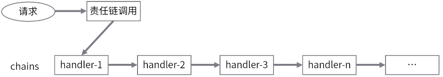

## 责任链模式

### 概念

责任链模式（Chain of Responsiblility Pattern）为请求创立一个处理对象的链。  
**发起请求和具体处理请求的过程进行解耦合：** 职责链上的处理者负责负责处理请求，客户只需要把请求发送到职责链上即可，无需关系请求的细节处理和传递。



### 实现

责任链模式的四要素：**处理器抽象类、具体的处理器实现类、保存处理器信息、处理执行**

实现方式一：集合形式存储（Tomcat 中的 filter）

```java
// 处理器抽象类
class AbstractHandler {
    void doHanlder(Object args){}
}

// 具体处理器的实现类
class Handler1 extends AbstractHandler { assert continue; }
class Handler2 extends AbstractHandler { assert continue; }
class Handler3 extends AbstractHandler { assert continue; }

// 创建集合存储所有的处理器实类信息
List<AbstractHandler> handlers = new ArrayList<>();
handlers.add(handler1, handler2, handler3);

// 处理请求，调用处理器
void process(request) {
    for (AbstractHandler handler : handlers) {
        handler.doHanlder(request);
    }
}

// 发起请求调用，通过责任链处理请求
call.process(request);
```

实现方式二：链表形式调用（Netty）

```java
// 处理器抽象类
class AbstractHandler {
    AbstractHandler next; // 下一个处理
    void doHanlder(Object args){}
}

// 具体处理器的实现类
class Handler1 extends AbstractHandler { assert continue; }
class Handler2 extends AbstractHandler { assert continue; }
class Handler3 extends AbstractHandler { assert continue; }

// 使用链表存储所有的处理器实类信息
pipeline = 头 [handler1 -> handler2 -> handler3] 尾;

// 处理请求，调用处理器
void process(request) {
    handler = pipeline.findOne(); // 查找第一个
    while (handler != null) {
        handler.doHanlder(request);
        handler = handler.next;
    }
}

// 发起请求调用，通过责任链处理请求
call.process(request);
```

### 示例

```java
package gof.responsibilitychain;

/**
 * 功能描述: 责任链链表形式实现（Netty责任链实现方式）
 *
 * @auther: pikaqiu
 * @date: 2019/3/31 4:49 PM
 */
public class PipeLineDemo {

    /**
     * 初始化的时候造一个head，作为责任链的开始，但是并没有具体的处理
     */
    public HandlerChainContext hand = new HandlerChainContext(new AbstractHandler() {
        @Override
        void doHandler(HandlerChainContext handlerChainContext, Object arg0) {
            handlerChainContext.runNext(arg0);
        }
    });

    void requestProcess(Object arg0) {
        this.hand.handler(arg0);
    }

    void addLast(AbstractHandler handler) {
        HandlerChainContext chainContext = hand;
        while (chainContext.next != null) {
            chainContext = chainContext.next;
        }
        chainContext.next = new HandlerChainContext(handler);
    }

    public static void main(String[] args) {
        PipeLineDemo pipeLineDemo = new PipeLineDemo();
        pipeLineDemo.addLast(new Handler1());
        pipeLineDemo.addLast(new Handler2());
        pipeLineDemo.addLast(new Handler1());
        pipeLineDemo.addLast(new Handler2());
        pipeLineDemo.requestProcess("开始：");
    }
}

/**
 * handler上下文，主要负责维护链，和链的执行
 */
class HandlerChainContext {
    HandlerChainContext next; // 下一个任务
    AbstractHandler handler;

    public HandlerChainContext(AbstractHandler handler) {
        this.handler = handler;
    }

    void handler(Object arg0){
        this.handler.doHandler(this, arg0);
    }

    /**
     * 执行下一个方法
     * @param arg0
     */
    void runNext(Object arg0) {
        if (this.next != null) {
            this.next.handler(arg0);
        }
    }
}

// 处理器抽象类
abstract class AbstractHandler {
    /**
     * 处理器，这个处理器就做一件事情，在传入的字符串中增加一个尾巴..
     */
    abstract void doHandler(HandlerChainContext handlerChainContext, Object arg0);
}

// 处理器实现类
class Handler1 extends AbstractHandler {
    @Override
    void doHandler(HandlerChainContext handlerChainContext, Object arg0) {
        arg0 += "这是handler1的尾巴 \t";
        System.out.println("这里是handler1：" + arg0);
        handlerChainContext.runNext(arg0);
    }
}

// 处理器实现类
class Handler2 extends AbstractHandler {
    @Override
    void doHandler(HandlerChainContext handlerChainContext, Object arg0) {
        arg0 += "这是handler2的尾巴 \t";
        System.out.println("这里是handler2：" + arg0);
        handlerChainContext.runNext(arg0);
    }
}
```

---

[设计模式](README.md)  
[主页](../../../../)
