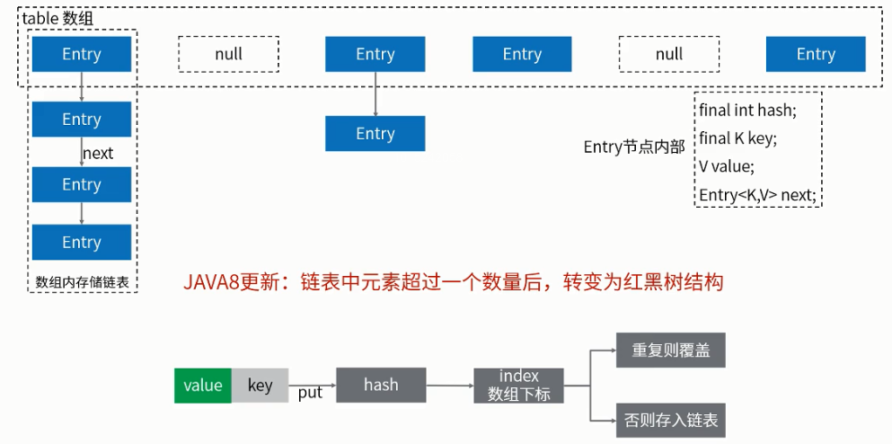
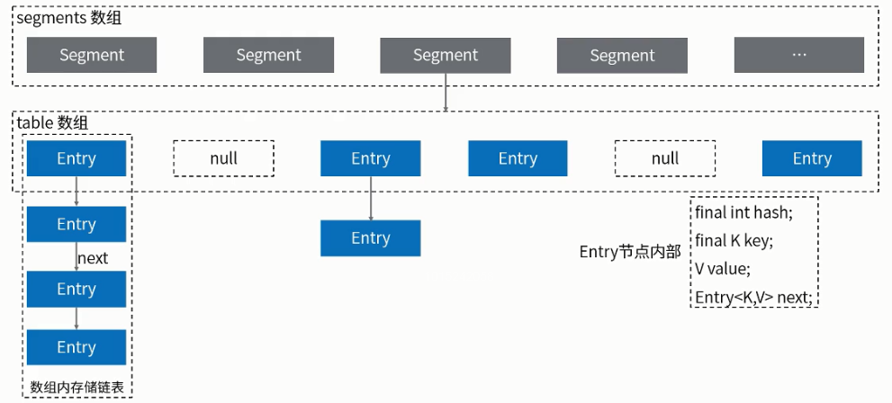
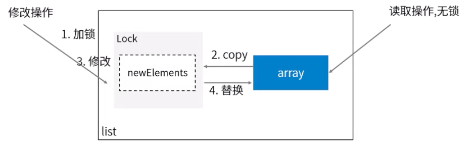

## 容器解析

### HashMap - 非线程安全



**知识点：**

1. 使用散列实现，数组的默认容量为 16，负载因子为 0.75，每次扩容为上次容量的 2 倍
2. JDK 1.7 Entry 为链表，1.8 使用 Node 代替 Entry ， 在链表长度为 8 时将转成红黑树
3. 使用链地址法解决 hash 冲突，1.7 会在链表头部插入，而 1.8 会在链表尾部插入
4. 在 put 时，将数据存到 hash & (length - 1) 下标，数组长度一定是 2 的次幂
5. 扩容（resize）最消耗性能的点：原数组中的数据必须重新计算其在新数组中的位置，并放进去

**常用的构造散列函数的办法：**

1. 直接寻址法：取关键字或关键字的某个线性函数值为散列地址。即 H(key)=key 或 H(key) = a ? key + b，其中 a 和 b 为常数（这种散列函数叫做自身函数）
2. 数字分析法：分析一组数据，比如一组员工的出生年月日，这时我们发现出生年月日的前几位数字大体相 同，这样的话，出现冲突的几率就会很大，但是我们发现年月日的后几位表示月份和具体日期的数字差别很大，如果用后面的数字来构成散列地址，则冲突的几率会 明显降低。因此数字分析法就是找出数字的规律，尽可能利用这些数据来构造冲突几率较低的散列地址。
3. 平方取中法：取关键字平方后的中间几位作为散列地址。
4. 折叠法：将关键字分割成位数相同的几部分，最后一部分位数可以不同，然后取这几部分的叠加和（去除进位）作为散列地址。
5. 随机数法：选择一随机函数，取关键字的随机值作为散列地址，通常用于关键字长度不同的场合。
6. 除留余数法：取关键字被某个不大于散列表表长 m 的数 p 除后所得的余数为散列地址。即 H(key) = key MOD p, p<=m。不仅可以对关键字直接取模，也可在折叠、平方取中等运算之后取模。对 p 的选择很重要，一般取素数或 m，若 p 选的不好，容易产生同义词。

### ConcurrentHashMap - 线程安全

HashTable 实现了在每个 HashMap 方法上加锁，效率很低，不推荐使用。

**1.7 的 ConCurrentHashMap：**
ConcurrentHashMap 在 HashMap 基础上包装了一层 Segment，实现了分段加锁。



**1.8 的 ConCurrentHashMap：**

弃用了 Segment 加锁，而是在发生了 hash 冲突时，采用 CAS 机制。

1.8 的 ConcurrentHashMap 锁的粒度更细

### ArrayList - 非线程安全

**知识点：**

1. 基于数组实现，相当于动态数组。默认容量是 10
2. 在数组容量最大时会扩容，newCapacity = oldCapacity + (oldCapacity >> 1) 即 新容量 = 旧容量 + ( 旧容量 / 2 )
3. 扩容时使用的 Arrays.copyOf
4. 遍历删除时，需要使用 Iterator，直接调用 ArrayList.remove(i)会快速失败
5. 三种遍历方式：fori, foreach, iterator。foi 效率最高、iterator 效率最低
6. ArrayList 提供了两个 toArray()方法：
    - Object[] toArray()：该方法返回的是 Object[] 数组，将 Object[] 转换为其它类型如 Integer[] 会抛出 java.lang.ClassCastException
    - <T> T[] toArray(T[] contents)：可以转为指定类型的数组

### CopyOnWriteArrayList - 线程安全

在 add 时使用 ReentrantLock 加锁，源码为：

```java
public boolean add(E e) {
    final ReentrantLock lock = this.lock;
    lock.lock();
    try {
        Object[] elements = getArray();
        int len = elements.length;
        Object[] newElements = Arrays.copyOf(elements, len + 1);
        newElements[len] = e;
        setArray(newElements);
        return true;
    } finally {
        lock.unlock();
    }
}
```

执行流程为：



与 ArrayList 比，是线程安全的实现，但是缺点也很明显：

1. 多路内存占用：写数据时 copy 一份，多了一倍的内存
2. 写完数据后，其他线程不一定能立即读到最新内容

### Set 集合

| 实现                  | 原理                       | 特点                   |
| --------------------- | -------------------------- | ---------------------- |
| HashSet               | 基于 HashMap               | 非线程安全             |
| CopyOnWriteArraySet   | 基于 CopyOnWriteArrayList  | 线程安全               |
| ConcurrentSkipListSet | 基于 ConcurrentSkipListMap | 线程安全，有序，查询快 |

使用了 CopyOnWriteArrayList 中的 addIfAbsent(E e) 来判断是否在 Array 中已经存在了该元素来保证 CopyOnWriteArraySet 没有重复元素

---

[基础解析](./README.md)  
[Java](../README.md)  
[主页](/)
