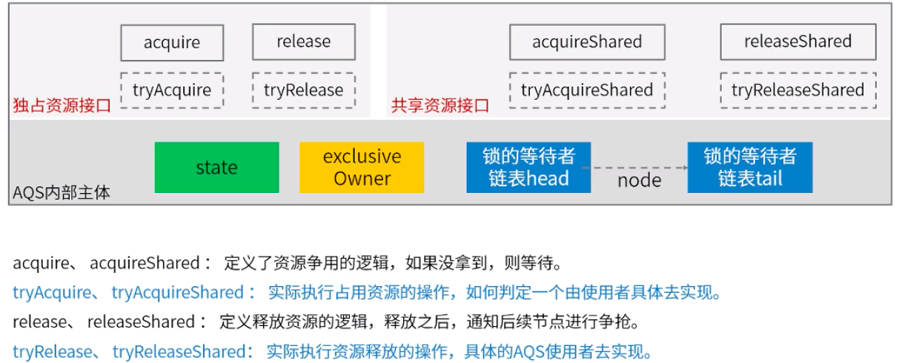

## J.U.C 并发包详解

### Lock 锁接口实现

Lock 的核心 API

方法|描述  
-|-  
lock | 获取锁， 若锁被其他线程占用，则阻塞  
lockInterruptibly | 在获取锁的过程中可以中断当前线程  
tryLock | 尝试非阻塞地获取锁，立即返回  
unlock | 释放锁  

> 根据 Lock 借口源码的注释，Lock 接口的实现和 synchronize 具有相同的内存语义

-   ReentranLock （例子省略）
-   ReadWriteLock（读写锁 或者 共享锁，独占锁）  
     一对关联锁，一个用于只读操作，一个用于写入；读锁可以由多个线程处理，写锁是排他的。  
     适合读写线程比线程比写入线程多的场景，改进互斥锁性能。示例场景：缓存组件、集合的并发线程安全性改造。

    **锁降级**是指写锁降级为读锁。只有当前写锁的同时，再获取到读锁，随后释放写锁的过程。  
    写锁是线程独占，读锁是共享。所以可以 写 -> 读, 不能 读 -> 写

    ```java
    import java.util.HashMap;
    import java.util.Map;
    import java.util.concurrent.locks.ReadWriteLock;
    import java.util.concurrent.locks.ReentrantReadWriteLock;

    /**
    * 功能描述:
    * 读写锁示例
    * @auther: pikaqiu
    * @date: 2019/3/23 9:00 PM
    */
    public class CacheDemo {

        Map<String, Object> map = new HashMap<>();

        // 读写锁
        ReadWriteLock lock = new ReentrantReadWriteLock();

        public Object get(String id) {

            Object value = null;

            // 开启读锁，从缓存中取值
            lock.readLock().lock();
            try {
                value = map.get(id);
                if (value == null) {
                    // 如果直接在这里去数据库查找在高并发情况下很容易造成缓存雪崩，所以需要加写锁，保证只有一个线程能够获取到锁
                    // 先释放读锁
                    lock.readLock().unlock();
                    // 加写锁
                    lock.writeLock().lock();
                    try {
                        // 双重检查，防止已经有线程修改了对应的值
                        if (value == null) {
                            //TODO 去数据库获取数据
                            //TODO value = database.query(id);
                            //TODO 将value设置缓存
                        }
                        // 在释放写锁之前，再次加上读锁，使锁降级。这样就不会有其他的线程能修改这个值，保证了数据一致性
                        lock.readLock().lock();
                    } catch (Exception e) {
                        e.printStackTrace();
                    } finally {
                        // 释放写锁
                        lock.writeLock().unlock();
                    }
                    //TODO 业务代码执行
                }
            } catch (Exception e) {
                e.printStackTrace();
            } finally {
                // 释放读锁
                lock.readLock().unlock();
            }
            return value;

        }

    }

    ```

### AQS 抽象队列同步器详解

用代码实现一个自己的锁

```java
import java.util.Iterator;
import java.util.concurrent.LinkedBlockingQueue;
import java.util.concurrent.TimeUnit;
import java.util.concurrent.atomic.AtomicReference;
import java.util.concurrent.locks.Condition;
import java.util.concurrent.locks.Lock;
import java.util.concurrent.locks.LockSupport;

/**
 * 功能描述:
 *  一个自己的实现的读写锁
 * @auther: pikaqiu
 * @date: 2019/3/23 9:44 PM
 */
public class MyReadWriteLockDemo implements Lock {

    // 获取到锁的线程
    volatile AtomicReference<Thread> owner = new AtomicReference<>();

    // 存放等待的线程 锁池
    volatile LinkedBlockingQueue<Thread> waiters = new LinkedBlockingQueue<>();

    // 实现等待效果
    @Override
    public void lock() {
        while (!tryLock()) {
            // 保存等待的线程
            waiters.offer(Thread.currentThread());
            //开始等待其他线程释放
            LockSupport.park(); // 不再继续执行，等待 unpark
            waiters.remove(Thread.currentThread());
        }
    }

    @Override
    public void lockInterruptibly() throws InterruptedException {

    }

    // 尝试获取锁
    @Override
    public boolean tryLock() {
        return owner.compareAndSet(null, Thread.currentThread());
    }

    @Override
    public boolean tryLock(long time, TimeUnit unit) throws InterruptedException {
        return false;
    }

    @Override
    public void unlock() {
        if(owner.compareAndSet(Thread.currentThread(),null)){
            // 唤醒其他线程
            Iterator<Thread> iterator = waiters.iterator();
            while (iterator.hasNext()) {
                Thread waiter = iterator.next();
                LockSupport.unpark(waiter);
            }
        };
    }

    @Override
    public Condition newCondition() {
        return null;
    }
}

```

#### 同步锁的本质 - 排队

-   同步的方式：独享锁 - 单个队列窗口，共享锁 - 多个队列窗口
-   枪锁的方式：插队强（不公平锁），先来后到拿锁（公平锁）
-   没有抢到锁的处理：快速尝试多次（cas 自旋）、阻塞等待
-   唤醒阻塞线程的方式（叫号器）：全部通知、通知下一个

#### AQS 抽象队列同步器

提供了对资源占用、释放，线程等待、唤醒等等接和具体实现。  
可以用在各种控制资源争用的场景中。（ReentranLock、CountDownLatch、Semphore）  


---

[并发](./README.md)  
[Java](../README.md)  
[主页](../../../../../)
