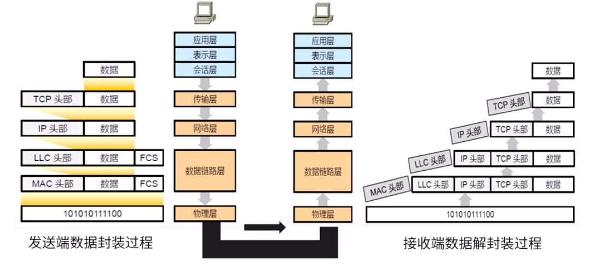
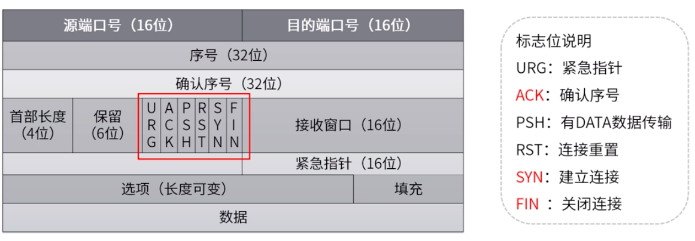
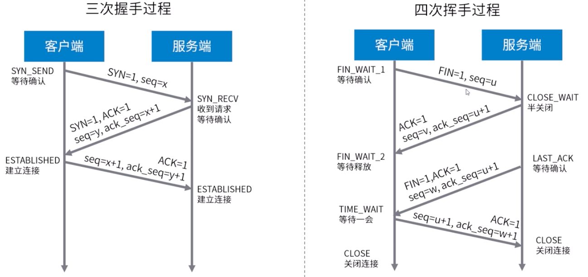
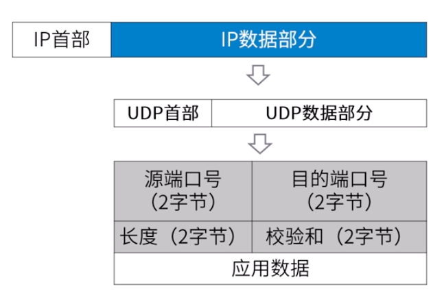

## NIO 网络编程

### OSI 网络七层模型

#### 各层的主要功能：

-   低三层
    -   物理层：使原始的数据比特流能够在物理介质传输
    -   数据链路层：通过校验、确认、反馈重发等手段，形成稳定的数据链路
    -   网络层：进行数据选择和流量控制（IP 协议）
-   传输层：提供可靠的端口到端口的数据传输服务（TCP/UDP 协议）
-   高三层
    -   会话层：负责建立、管理和终止进程之间的会话和数据交换
    -   表示层：负责数据格式转换、数据加密和解密、压缩与解压缩等功能
    -   应用层：为用户的应用进程提供网络服务

#### 传输控制协议 TCP

传输控制协议（TCP）提供了面向连接、可靠、有序、字节流传输服务。应用在使用 TCP 之前，必须建立 TCP 连接。

TCP 握手机制

#### 用户数据报协议 UDP

用户数据报协议 UDP 提供无连接、不可靠、数据报尽力传输服务。

特点：

-   应用进程更容易控制发送什么数据已经何时发送  
-   无需建立连接  
-   无连接状态  
-   首部开销小  

#### TCP和UDP比较  

| TCP            | UDP        |
| -------------- | ---------- |
| 面向连接       | 无连接     |
| 提供可靠性保证 | 无保证     |
| 慢             | 快         |
| 资源占用多     | 资源占用少 |

### Socket编程

Internet中应用最广泛的网络应用编程接口，实现3种底层协议接口：

- 数据报类型套接字SOCK_DGRAM（面向UDP接口）  
- 流式套接字SOCK_STREAM（面向TCP接口）
- 原始套接字SOCK_RAW(面向网络协议接口IP、ICMP等)

主要Socket API及其调用过程：

Socket主要函数定义： 
- listen()、accept()函数只能用于服务端
- connect()函数只能用于客户端
- socket()、bind()、send()、recv()、sendto()、recvfrom()、close()

---

[并发](./README.md)  
[Java](../README.md)  
[主页](../../../../../)
