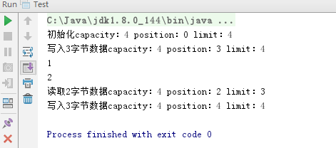
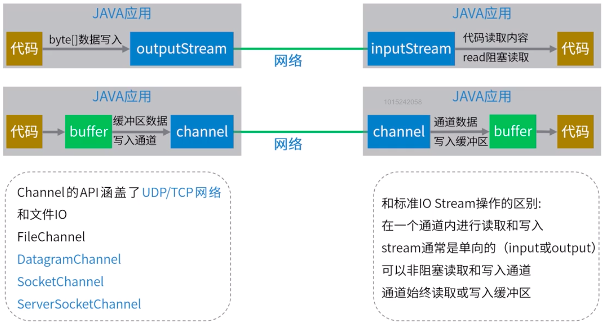
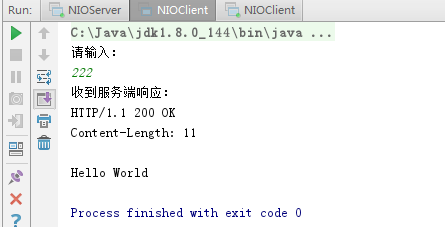
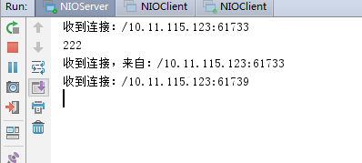
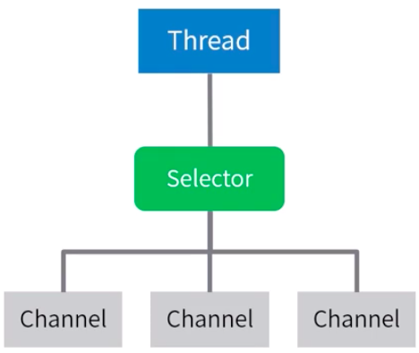
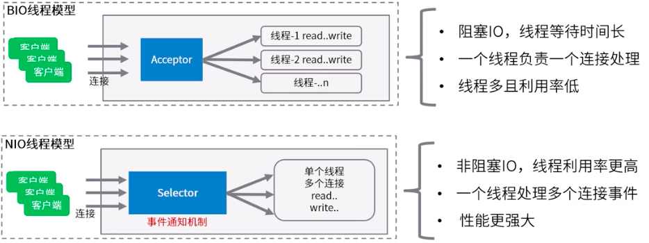
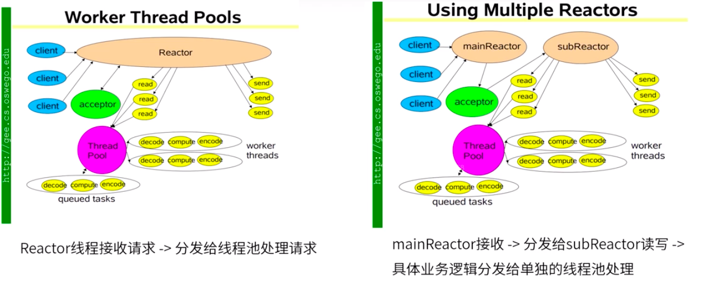

## NIO 网络编程

JDK1.4 开始提供 IO 操作的非阻塞 API。用来取代 Java IO 和 Java Networking 相关的 API。

### 核三个心组件：

-   Buffer 缓存区
-   Channel 通道
-   Selector 选择器

#### Buffer 缓存区

是一个可写入数据的内存块（类似数组）。使用 Buffer 进行数据的读取和写入一般一下四个步骤：

-   将数据写入缓冲区
-   使用 buffer.filp()，转成读取模式
-   读取数据
-   调用 buffer.clear()或 buffer.compact()清除缓冲区

示例代码：

```java
package nio;

import java.nio.ByteBuffer;

/**
 * 功能描述:
 * Buffer示例
 *
 * @auther: pikaqiu
 * @date: 2019/3/26 7:11 AM
 */
public class BufferDemo {
    public static void main(String[] args) {
        // 构建缓冲区容量为4
        ByteBuffer buffer = ByteBuffer.allocate(4);

        System.out.println("初始化capacity：" + buffer.capacity() + " position：" + buffer.position() + " limit：" + buffer.limit());

        // 写入数据
        buffer.put((byte) 1);
        buffer.put((byte) 2);
        buffer.put((byte) 3);

        System.out.println("写入3字节数据capacity：" + buffer.capacity() + " position：" + buffer.position() + " limit：" + buffer.limit());

        // 读取数据
        buffer.flip();
        System.out.println(buffer.get());
        System.out.println(buffer.get());

        System.out.println("读取2字节数据capacity：" + buffer.capacity() + " position：" + buffer.position() + " limit：" + buffer.limit());

        // clear是清除整个缓存区，compact是清除已读数据并转成写模式
        buffer.compact();
        buffer.put((byte) 4);
        buffer.put((byte) 5);
        buffer.put((byte) 6);
        System.out.println("写入3字节数据capacity：" + buffer.capacity() + " position：" + buffer.position() + " limit：" + buffer.limit());

        // rewind() 重置position为0
        // mark() 标记position位置
        // reset() 重置position到上次mark的位置

    }
}

```

运行结果：  


Buffer 提供了直接内存（direct 堆外）和非直接内存（heap 堆）两种实现，堆外内存获取方式:ByteBuffer buffer = ByteBuffer.allocateDirect(4)。

好处：

1. 进行网络 IO 或者问 IO 时，会比 heapBuffer 少一次拷贝（file/socket--- OS memory ---- JVM heap）。GC 会移动对象内存，写 file 或 Socket 过程中，JVM 会把数据复制到堆外然后写入。
2. 在 GC 之外，降低了 GC 的压力，实现了自动管理。DirectBuffer 有个 Clearner 对象，被 GC 前会执行 clean 方法，触发 DirectBuffer 中的 Deallocater。

建议：

1. 性能确实可观时才去使用；分配给大型、长寿命（网络传输、文件读写）
2. 通过虚拟机参数 MaxDirectMemorySize 限制，防止耗尽内存。

#### Channel 通道



##### SocketChannel

用于建立 TCP 网络连接，类似 java.net.Socket。有两种创建 SocketChannel 形式：

1. 客户端主动发起和服务端的连接
2. 服务端获取新的连接

示例：

```java
// 客户端主动发起连接
SocketChannel socketChannel = SocketChannel.open();
// 设置为非阻塞模式
socketChannel.configureBlocking(false);
socketChannel.connect(new InetSocketAddress("httt://localhost", 80));

socketChannel.write(new ByteBuffer[0]); // 发送请求数据 - 向通道写入数据

socketChannel.read(new ByteBuffer[0]); // 读取服务端返回 - 读取缓存数据

socketChannel.close(); // 关闭连接
```

**write**：write()在尚未写入任何内容时就可能返回了，需要在循环中调用 write()。  
**read**：read()方法可能直接返回而根本不读取任何数据，根据返回的 int 值判断读取了多少字节。

##### ServerSocketChannel

ServerSocketChannel 可以监听新建的 TCP 连接通道，类似 ServerSocket。

示例：

```java
// 创建服务端
ServerSocketChannel server = ServerSocketChannel.open();
server.configureBlocking(false); // 设置非阻塞模式
server.socket().bind(new InetSocketAddress(8080)); // 绑定8080端口

while (true) {
    SocketChannel socketChannel = server.accept(); // 获取新的TCP连接通道

    if (socketChannel!=null) {
        // TCP请求 响应/读取
    }
}
```

**accept:** ServerSocketChannel.accept() 如果改通道处于非阻塞模式，那么如果没有挂起的连接，该方法立即返回 null。必须检查返回的 SocketChannel 是否为 null。

使用 Channel 修改 [TCP/UDP 和 BIO](./TCPUDP和BIO.md) 中的程序，代码如下：

```java
package nio;

import java.io.IOException;
import java.net.InetSocketAddress;
import java.nio.ByteBuffer;
import java.nio.channels.ServerSocketChannel;
import java.nio.channels.SocketChannel;

/**
 * server端
 */
public class NIOServer {
    public static void main(String[] args) {
        // 创建服务端
        try (ServerSocketChannel server = ServerSocketChannel.open()) {
            // 设置非阻塞
            server.configureBlocking(false);
            server.socket().bind(new InetSocketAddress(8080)); // 绑定端口
            System.out.println("启动成功！");
            while (true) {
                // 获取连接通道
                SocketChannel socketChannel = server.accept();
                // TCP请求、响应
                if (socketChannel != null) {
                    System.out.println("收到连接：" + socketChannel.getRemoteAddress());
                    socketChannel.configureBlocking(false); // 设置非阻塞
                    ByteBuffer buffer = ByteBuffer.allocate(1024); // 构建缓存区
                    while (socketChannel.isOpen() && socketChannel.read(buffer) != -1) {
                        // 长连接情况下，需要手动判断数据有没有结束（此处做了一个简单的判断：超过0字节就认为请求结束了）
                        if (buffer.position() != 0) break;
                    }
                    if (buffer.position() == 0) continue; // 如果没有数据了就不进行下一步操作
                    buffer.flip(); // 转为读取模式
                    byte[] content = new byte[buffer.limit()];
                    buffer.get(content);
                    System.out.println(new String(content));
                    System.out.println("收到数据，来自：" + socketChannel.getRemoteAddress());

                    // 返回响应结果
                    String response = "HTTP/1.1 200 OK\r\n" + "Content-Length: 11\r\n\r\n" + "Hello World";
                    ByteBuffer byteBuffer = ByteBuffer.wrap(response.getBytes());
                    while (byteBuffer.hasRemaining()) {
                        socketChannel.write(byteBuffer);
                    }
                }
            }
        } catch (IOException e) {
            e.printStackTrace();
        }
    }
}

```

```java
package nio;

import java.io.IOException;
import java.net.InetSocketAddress;
import java.nio.ByteBuffer;
import java.nio.channels.SocketChannel;
import java.util.Scanner;

/**
 * 客户端
 */
public class NIOClient {
    public static void main(String[] args) {
        try (SocketChannel client = SocketChannel.open()) {
            client.configureBlocking(false);
            client.connect(new InetSocketAddress(8080));
            while (!client.finishConnect()) {
                // 没有连上就一直等待
                Thread.yield();
            }
            Scanner scanner = new Scanner(System.in);
            System.out.println("请输入：");
            String msg = scanner.nextLine();
            ByteBuffer buffer = ByteBuffer.wrap(msg.getBytes());
            while (buffer.hasRemaining()) {
                client.write(buffer);
            }

            // 读取响应
            System.out.println("收到服务端响应：");
            ByteBuffer response = ByteBuffer.allocate(1024);

            while (client.isOpen() && client.read(response) != -1) {
                if (response.position() > 0) break;
            }

            response.flip();
            byte[] content = new byte[response.limit()];

            response.get(content);
            System.out.println(new String(content));
            scanner.close();

        } catch (IOException e) {
            e.printStackTrace();
        }

    }
}

```

启动一个服务端和两个客户端，运行结果：  
服务端：  
  
在一个客户端中输入，运行结果：  
客户端：  
  
服务端：


发现坑爹了，经过修改使用 Channel 后服务端不能接收多个连接了。。。  
原因是因为在服务端的代码中有一下这段代码：

```java
while (socketChannel.isOpen() && socketChannel.read(buffer) != -1) {
    // 长连接情况下，需要手动判断数据有没有结束（此处做了一个简单的判断：超过0字节就认为请求结束了）
    if (buffer.position() != 0) break;
}
```

这段代码在第一个连接就会一直循环判断直到请求结束才会进行下一步， 相当于人工阻塞了代码。

优化代码：

```java
package nio;

import java.io.IOException;
import java.net.InetSocketAddress;
import java.nio.ByteBuffer;
import java.nio.channels.ServerSocketChannel;
import java.nio.channels.SocketChannel;
import java.util.ArrayList;
import java.util.Iterator;

/**
 * server端
 */
public class NIOServer {

    // 收到连接的集合
    private static ArrayList<SocketChannel> channels = new ArrayList<>();

    public static void main(String[] args) {
        // 创建服务端
        try (ServerSocketChannel server = ServerSocketChannel.open()) {
            // 设置非阻塞
            server.configureBlocking(false);
            server.socket().bind(new InetSocketAddress(8080)); // 绑定端口
            System.out.println("启动成功！");
            while (true) {
                // 获取连接通道
                SocketChannel socketChannel = server.accept();
                // TCP请求、响应
                if (socketChannel != null) {
                    System.out.println("收到连接：" + socketChannel.getRemoteAddress());
                    socketChannel.configureBlocking(false); // 设置非阻塞
                    channels.add(socketChannel);
                } else {
                    Iterator<SocketChannel> iterator = channels.iterator();
                    while (iterator.hasNext()) {
                        try {
                            SocketChannel next = iterator.next();

                            ByteBuffer buffer = ByteBuffer.allocate(1024); // 构建缓存区
                            if (next.read(buffer) == 0){
                                // 这个通道没有数据，不需要处理
                                continue;
                            }
                            while (next.isOpen() && next.read(buffer) != -1) {
                                // 长连接情况下，需要手动判断数据有没有结束（此处做了一个简单的判断：超过0字节就认为请求结束了）
                                if (buffer.position() != 0) break;
                            }
                            if (buffer.position() == 0) continue; // 如果没有数据了就不进行下一步操作
                            buffer.flip(); // 转为读取模式
                            byte[] content = new byte[buffer.limit()];
                            buffer.get(content);
                            System.out.println(new String(content));
                            System.out.println("收到数据，来自：" + next.getRemoteAddress());

                            // 返回响应结果
                            String response = "HTTP/1.1 200 OK\r\n" + "Content-Length: 11\r\n\r\n" + "Hello World";
                            ByteBuffer byteBuffer = ByteBuffer.wrap(response.getBytes());
                            while (byteBuffer.hasRemaining()) {
                                next.write(byteBuffer);
                            }
                            iterator.remove();
                        } catch (Exception e) {
                            iterator.remove();
                            e.printStackTrace();
                        }
                    }

                }
            }
        } catch (IOException e) {
            e.printStackTrace();
        }
    }
}
```

使用 ArrayList 代替了 while 循环，优化服务端代码后达到了非阻塞接收连接数据的目的。

#### Selector 选择器

可以检查多个 NIO 通道，并确定哪些通道已经读取或者写入，实现了**单线程可以管理多个通道，从而管理多个网络连接。**

一个线程使用 Selector 监听多个 Channel 的不同事件：  
四个事件分别对应 SelectionKey 四个常量：

-   Connect 连接（SelectionKey.OP_CONNECT)
-   Accept 准备就绪（OP_ACCEPT)
-   Read 读取（OP_READ)
-   Write 写入（OP_WRITE)



实现一个线程管理多个通道的核心概念：**事件驱动**。  
非阻塞网络通道下，开发者通过对 Selector 注册感兴趣的事件类型，线程通过监听事件来触发响应的代码执行。（拓展：更底层是操作系统的多路复用机制）

核心代码示例：

```java
Selector selector = Selector.open();
channel.configureBlocking(false);
channel.register(selector, SelectionKey.OP_READ); // 注册感兴趣的事件
while (true) { // 由accept轮询，变成了事件通知
    int readyChannel = selector.select(); // select 收到了新的通知才会返回
    if (readyChannel == 0) continue;
    Set<SelectionKey> selectionKeys = selector.selectedKeys();
    Iterator<SelectionKey> iterator = selectionKeys.iterator();
    while (iterator.hasNext()) {
        SelectionKey key = iterator.next();
        // 不同的事件类型处理对于的逻辑
        // key.isAcceptable()/key.isConnectable()/key.isReadable()/key.isWritable();
        iterator.remove();
    }
}
```

使用 Selector 来优化服务端代码：

```java
package nio;

import java.io.IOException;
import java.net.InetSocketAddress;
import java.nio.ByteBuffer;
import java.nio.channels.SelectionKey;
import java.nio.channels.Selector;
import java.nio.channels.ServerSocketChannel;
import java.nio.channels.SocketChannel;
import java.util.ArrayList;
import java.util.Iterator;
import java.util.Set;

/**
 * server端
 */
public class NIOServer {

    // 收到连接的集合
    private static ArrayList<SocketChannel> channels = new ArrayList<>();

    public static void main(String[] args) {
        // 1. 创建服务端
        try (ServerSocketChannel server = ServerSocketChannel.open()) {
            // 设置非阻塞
            server.configureBlocking(false);

            // 2. 创建Selector选择器，并且注册Channel
            Selector selector = Selector.open();
            SelectionKey selectionKey = server.register(selector, 0, server);
            selectionKey.interestOps(SelectionKey.OP_ACCEPT); // 对accept事件感兴趣

            // 3. 绑定端口
            server.socket().bind(new InetSocketAddress(8080));

            System.out.println("启动成功！");
            while (true) {
                // 改用事件通知方式，select方法有阻塞效果，只有事件通知才会返回
                selector.select();

                // 获取事件
                Set<SelectionKey> selectionKeys = selector.selectedKeys();

                // 遍历查询结果
                Iterator<SelectionKey> iterator = selectionKeys.iterator();

                // TCP请求、响应
                while (iterator.hasNext()) {
                    SelectionKey next = iterator.next();
                    iterator.remove();

                    // 关注 read 和 accept 事件
                    if (next.isAcceptable()) {
                        ServerSocketChannel channel = (ServerSocketChannel) next.attachment();
                        // 客户端通道
                        SocketChannel clientChannel = channel.accept();
                        // 将客户端通道注册到Selector上
                        clientChannel.configureBlocking(false);
                        clientChannel.register(selector, SelectionKey.OP_READ, clientChannel);
                        System.out.println("收到了新的连接：" + clientChannel.getRemoteAddress());
                    }

                    if (next.isReadable()) {
                        SocketChannel socketChannel = (SocketChannel) next.attachment();
                        try {
                            ByteBuffer buffer = ByteBuffer.allocate(1024);

                            while (socketChannel.isOpen() && socketChannel.read(buffer) != -1) {
                                // 长连接情况下,需要手动判断数据有没有读取结束 (此处做一个简单的判断: 超过0字节就认为请求结束了)
                                if (buffer.position() > 0) break;
                            }

                            if (buffer.position() == 0) continue; // 没有数据就不进行后续处理

                            buffer.flip();
                            byte[] content = new byte[buffer.limit()];
                            buffer.get(content);
                            System.out.println(new String(content));
                            System.out.println("收到数据，来自：" + socketChannel.getRemoteAddress());

                            // TODO 业务操作 数据库 接口调用等等

                            // 返回响应结果
                            String response = "HTTP/1.1 200 OK\r\n" + "Content-Length: 11\r\n\r\n" + "Hello World";
                            ByteBuffer byteBuffer = ByteBuffer.wrap(response.getBytes());
                            while (byteBuffer.hasRemaining()) {
                                socketChannel.write(byteBuffer);
                            }

                        } catch (Exception e) {
                            next.cancel();
//                            e.printStackTrace();
                        }
                    }
                }
                selector.selectNow();
            }
        } catch (IOException e) {
            e.printStackTrace();
        }
    }
}
```

**NIO 和 BIO 对比**

  
如果需要支持大量的连接，NIO 是最好的方式。  
Tomcat8 中，已经完全去了 BIO 相关的网络处理代码，默认使用 NIO 进行网络处理。

但是此处一个 selector 监听所有事件，一个线程处理所有请求事件。会成为瓶颈！要有多线程的运用

**NIO 结合多线程改进方案：**
DougLea 的著名文章[《Scalable IO in Java》](http://gee.cs.oswego.edu/dl/cpjslides/nio.pdf)  


---

[并发](./README.md)  
[Java](../README.md)  
[主页](../../../../../)
