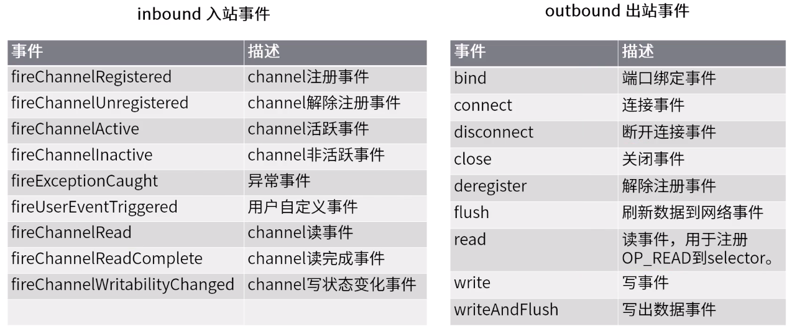
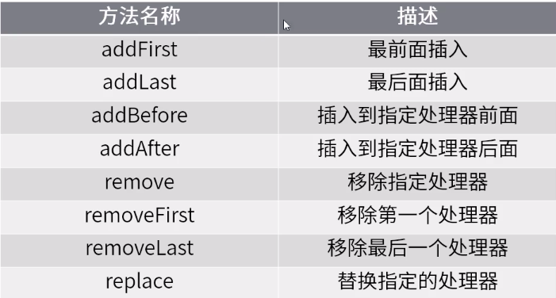
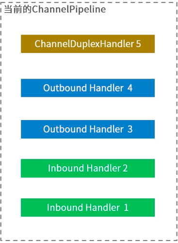
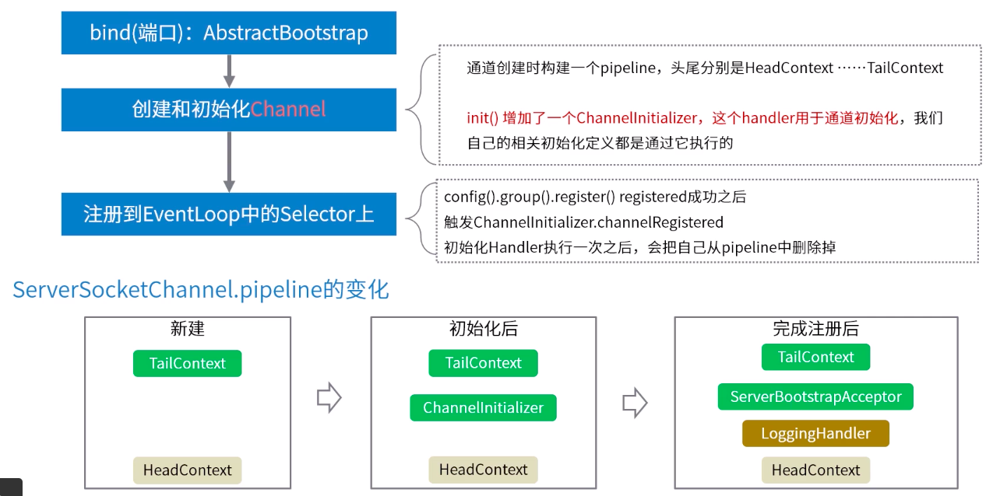
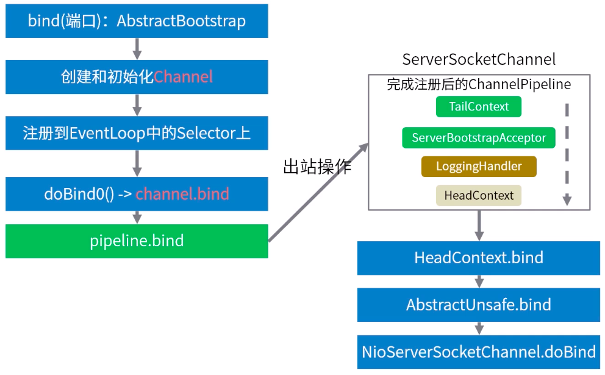
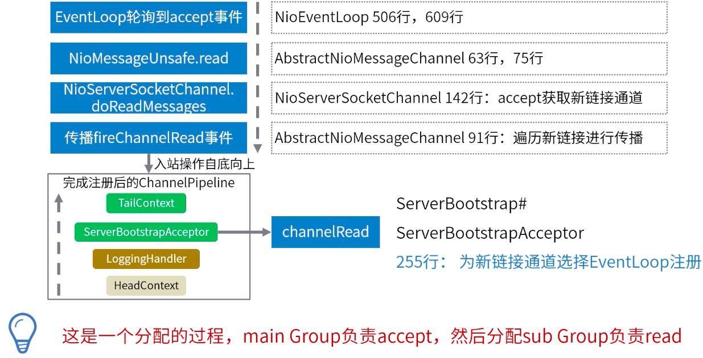
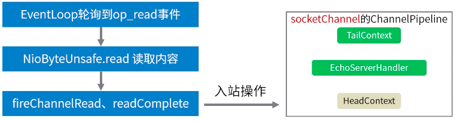
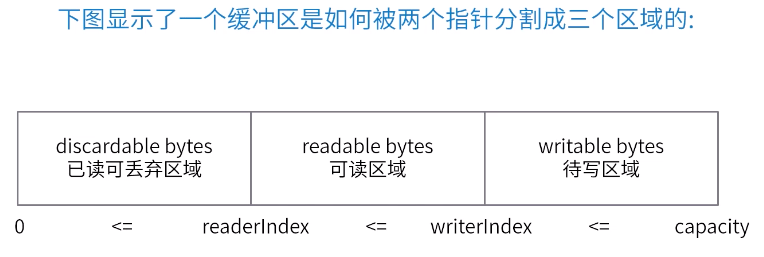
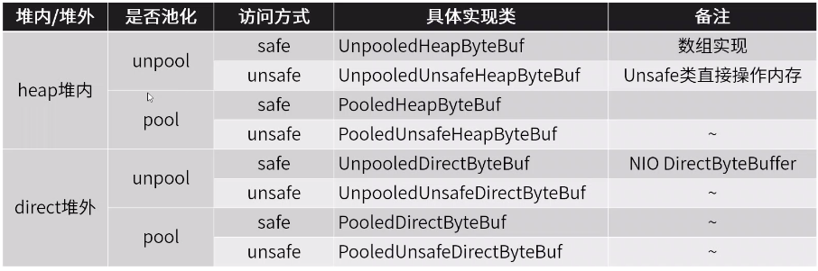

## Netty

官网：[https://netty.io/](https://netty.io/)  
一个异步事件驱动的网络应用程序框架，极大的简化了 TCP 和 UDP 开发。

最重要的四个内容：

-   Reactor 编程模型：一种高性能的多线程程序设计思路
-   Netty 自己定义的 Channel 概念：增强版通道概念
-   ChannelPipeline 职责链设计模式：事件处理机制
-   内存管理： 增强 BytyBuffer 缓存区

Netty 整体结构图：  
  
可以看出 Netty 有三大模块：

1. 支持 Socket 等多种传输方式
2. 提供了多种协议的编解码实现
3. 核心设计包括：**事件处理模型、API 的使用、ByteBuf 的使用**

Netty 服务端代码示例：

```java
package netty;

import io.netty.bootstrap.ServerBootstrap;
import io.netty.buffer.ByteBuf;
import io.netty.buffer.Unpooled;
import io.netty.channel.*;
import io.netty.channel.nio.NioEventLoopGroup;
import io.netty.channel.socket.SocketChannel;
import io.netty.channel.socket.nio.NioServerSocketChannel;
import io.netty.handler.logging.LogLevel;
import io.netty.handler.logging.LoggingHandler;

import java.nio.charset.Charset;

/**
 * 功能描述: Netty服务端代码示例：
 *
 * @auther: pikaqiu
 * @date: 2019/3/29 8:44 PM
 */
public class EchoServer {
    static final int PORT = Integer.parseInt(System.getProperty("port", "8080"));

    public static void main(String[] args) throws InterruptedException {
        // 创建 EventLoopGroup accept 线程
        EventLoopGroup boosGroup = new NioEventLoopGroup(1);
        // 创建 EventLoopGroup io 线程
        EventLoopGroup workGroup = new NioEventLoopGroup();

        // 启动引导工具类
        ServerBootstrap b = new ServerBootstrap();
        // 配置服务端处理的reactor线程组以及服务端的其他配置
        b.group(boosGroup, workGroup).channel(NioServerSocketChannel.class)
                .option(ChannelOption.SO_BACKLOG, 100).handler(new LoggingHandler(LogLevel.DEBUG))
                .childHandler(new ChannelInitializer<SocketChannel>() {
                    @Override
                    protected void initChannel(SocketChannel ch) throws Exception {
                        ChannelPipeline p = ch.pipeline();
                        p.addLast(new EchoServerHandler());
                    }
                });
        // 通过bind启动服务
        ChannelFuture f = b.bind(PORT).sync();
        // 阻塞主线程，直到网络服务被关闭
        f.channel().closeFuture().sync();
    }
}

class EchoServerHandler extends ChannelInboundHandlerAdapter {
    @Override
    public void channelRead(ChannelHandlerContext ctx, Object msg) throws Exception {
        System.out.println("收到数据：" + ((ByteBuf) msg).toString(Charset.defaultCharset()));
        ctx.write(Unpooled.wrappedBuffer("98877".getBytes()));
        ctx.fireChannelRead(msg);
    }

    @Override
    public void channelReadComplete(ChannelHandlerContext ctx) throws Exception {
        ctx.flush();
    }

    @Override
    public void exceptionCaught(ChannelHandlerContext ctx, Throwable cause) throws Exception {
        cause.printStackTrace();
        ctx.close();
    }
}
```

### Netty 线程模型

Netty 实现了 Reactor 模型：

1. Resources 资源（请求/任务）
2. Synchronous Event Demultiplexer 同步事件复用器
3. Dispather 分配器
4. Request Handler 请求处理器


#### EventLoopGroup 初始化过程

  
两组 EventLoopGroup（Main & Sub）处理不同的通道的不同事件

##### EventLoop 的启动

EventLoop 自身实现了 Executor 接口，调用 executor 方法提交任务时，则判断是否启动，未启动则调用内置的 executor 方法来出发 run 方法执行


bind 绑定端口的过程：


#### Channel 概念

Netty 中的 Channel 是一个抽象的概念，可以看做是对 JDK NIO Channel 的增强和扩展。  
常见的属性和方法：  


### Netty 中的责任链

具体的设计模式：[责任链模式](../../GOF/责任链模式.md)

#### Netty 中的 ChannelPipeLine 责任链


PipeLien 管道保存了所有的处理信息。
创建 channel 时会自动创建一个专有的 pipeline。入站事件和出站操作都会调用 pipeline 上的处理器。

##### 入站事件和出站事件

-   **入站事件：** 通常是指 IO 线程生成了入站数据。（通俗理解：就是从 Socket 底层自己冒上来的事件就是入站）  
    如 EventLoop 接收到了 selector 的 OP_READ 事件，**入站处理器**调用 socketChannel.read(ByteBuffer)接收到数据后，这将导致通道的 ChannePipeline 中下一个中的 channelRead 方法被调用。
-   **出站事件：** 通常是 IO 线程执行实际的输出操作。（通俗理解：想主动往 Socket 底层操作的事件都是出站）  
     如 bind 方法用意是请求 serversocket 绑定到给定的 SocketAddress，这将导致通道中 ChannePipeline 包含下一个**出站处理器**中 bind 方法被调用。

Netty 中的事件：  


##### Pipeline 中的 Handler

-   **ChannelHandler：** 处理 IO 事件或拦截 IO 操作，并转发到下一个处理器。  
    这是一个顶级接口，定义的功能很弱，通常使用它的两个子接口：处理入站 IO 事件的 **ChannelInboundHandler**、处理出站 IO 事件的 **ChannelOutboundHandler**

-   **适配器：** 为了开发方便，Netty 提供了简单的实现类：  
    ChannelInboundHandlerAdapter 处理入站 IO 事件  
    ChannelOutboundHandlerAdapter 处理出站 IO 事件  
    ChannelDuplexHandler 支持同时处理出入站事件

-   **ChannelHandlerContext：** 存储在 Pipeline 中的对象并非 ChannelHandler，而是上下文对象。  
     将 Handler 包裹在上下文对象中，通过上下文对象与它所属的 ChannelPipeline 交互，向上或向下传递事件或者修改 Pipeline 都是通过上下文对象。

维护 Pipeline 中的 Handler：  
ChannelPipeline 是线程安全的，ChannelHandler 可以在任何时候添加或删除。例如：可以在即将交换敏感信息时插入加密处理器，并在交换后删除它。  
一般操作：在初始化时增加进去，很少删除。下面是 Pipeline 汇总管理 handler 的 API：



handler 的执行分析：  
  
入站事件执行顺序：1、2、3、4、5  
出站事件执行顺序：5、4、3、2、1  
在这一原则上 ChannelPipeline 在执行时会进行选择，在入站时实际执行的是 1、2、5，出站执行的是 5、4、3  
不同的入站事件会出发 Handler 不同的方法执行：上下文对象中以 file\*\*开头的方法代表入站事件传播和处理，其余的方法代表出站事件的传播和处理

registered 入站事件的处理：



bind 出站事件的处理：  


accept 入站数据处理：  


read 入站事件的处理：  
pipeline 分析的关键 4 要素：什么事件、有哪些处理器、哪些处理器会被触发、执行顺序



#### 小结

用户在管道中有**一个或多个**channelhandler 来接收 IO 事件（例如读取）和请求 IO 操作（例如写入和关闭）。

一个典型的服务器在每个通道的管道中都有以下处理程序，但是根据协议和业务逻辑的复杂性和特征，可能会有所不同：

-   协议解码器：将二进制数据（例如 ByteBuf）转化为 Java 对象
-   协议编码器：将 Java 对象转化为二进制数据
-   业务逻辑处理器：执行实际的业务逻辑（例如数据库操作等）

责任链模式的运用，保证了 Netty 的高度可扩展性

### Netty 的零拷贝机制

#### Netty 的 ByteBuf

Netty 的 ByteBuf 是为解决 Java NIO 中 ByteBuffer 的问题和满足网络应用程序开发人员的日常需求设计的。

Java 中 ByteBuffer 的缺点：

-   不能动态扩容：长度是固定的
-   API 使用很复杂：需要手工调用 flip()和 rewind()方法

Netty 的 ByteBuf 做了以下增强：

-   API 操作跟便捷
-   动态扩容
-   多种 ByteBuf 实现
-   高效的零拷贝机制

##### ByteBuf 的基本操作

ByteBuf 的三个重要属性：capacity 容量、readerIndex 读取位置、writeIndex 写入位置。提供两个指针变量来支持顺序读和写操作。



常用方法定义：

-   随机访问索引：getByte
-   顺序读：read\*
-   顺序写： write\*
-   清除已读内容：discardReadBytes
-   清除缓冲区：clear
-   搜索操作
-   标记和重置
-   引用计数和释放

```java
package netty;

import io.netty.buffer.ByteBuf;
import io.netty.buffer.Unpooled;

import java.util.Arrays;

/**
 * 功能描述: bytebuf的常规API操作示例
 *
 * @auther: pikaqiu
 * @date: 2019/4/1 10:38 PM
 */
public class ByteBufDemo {

    //  +-------------------+------------------+------------------+
    //  | discardable bytes |  readable bytes  |  writable bytes  |
    //  |                   |     (CONTENT)    |                  |
    //  +-------------------+------------------+------------------+
    //  |                   |                  |                  |
    //  0      <=       readerIndex   <=   writerIndex    <=    capacity

    public static void main(String[] args) {
        // 创建容量为10的ByteBuf
        ByteBuf buf = Unpooled.buffer(10);
        System.out.println("原始的ByteBuf为 ============> " + buf);
        System.out.println("1. ByteBuf的内容为 =========> " + Arrays.toString(buf.array()) + "\n");

        // 写入一段数据
        byte[] bytes = {1, 2, 3, 4, 5};
        buf.writeBytes(bytes);
        System.out.println("写入的数据为 ================> " + Arrays.toString(bytes));
        System.out.println("写入了已读数据的ByteBuf为 ====> " + buf);
        System.out.println("2. ByteBuf的内容为 =========> " + Arrays.toString(buf.array()) + "\n");

        // 读取一段数据
        byte b1 = buf.readByte();
        byte b2 = buf.readByte();
        System.out.println("读取到的数据为 ==============> " + Arrays.toString(new byte[]{b1, b2}));
        System.out.println("读取了一段数据的ByteBuf为 ====> " + buf);
        System.out.println("3. ByteBuf的内容为 =========> " + Arrays.toString(buf.array()) + "\n");

        // 把读取到的数据清理掉
        buf.discardReadBytes();
        System.out.println("清除掉已读数据的ByteBuf为 ====> " + buf);
        System.out.println("4. ByteBuf的内容为 =========> " + Arrays.toString(buf.array()) + "\n");

        // 清空读写指针
        buf.clear();
        System.out.println("清除读写指针后的ByteBuf为 ====> " + buf);
        System.out.println("5. ByteBuf的内容为 =========> " + Arrays.toString(buf.array()) + "\n");

        // 再次写入一段数据
        byte[] bytes2 = {1, 2, 3};
        buf.writeBytes(bytes2);
        System.out.println("写入的数据为 ================> " + Arrays.toString(bytes2));
        System.out.println("写入了已读数据的ByteBuf为 ====> " + buf);
        System.out.println("6. ByteBuf的内容为 =========> " + Arrays.toString(buf.array()) + "\n");

        // 清空ByteBuf
        buf.setZero(0, buf.capacity());
        System.out.println("清空数据后的ByteBuf为 =======> " + buf);
        System.out.println("7. ByteBuf的内容为 =========> " + Arrays.toString(buf.array()) + "\n");

        // 写入超过容量的数据
        byte[] bytes3 = {1, 2, 3, 4, 5, 6, 7, 8, 9, 10, 11};
        buf.writeBytes(bytes3);
        System.out.println("写入的数据为 ================> " + Arrays.toString(bytes3));
        System.out.println("写入了已读数据的ByteBuf为 ====> " + buf);
        System.out.println("8. ByteBuf的内容为 =========> " + Arrays.toString(buf.array()) + "\n");

        //  随机访问索引 getByte
        //  顺序读 read*
        //  顺序写 write*
        //  清除已读内容 discardReadBytes
        //  清除缓冲区 clear
        //  搜索操作
        //  标记和重置
        //  完整代码示例：参考
        //  搜索操作 读取指定位置 buf.getByte(1);
    }
}
```

##### ByteBuf 的扩容

**capacity** 默认：256 字节、最大 Integer.MAX_VALUE（2G）

write\* 方法调用时，通过 AbstractByteBuf.ensureWritable(length)进行检查。  
容量计算方法：AbstractByteBufAllocator.calculateNewCapacity(新 capacity 最小要求，capacity 最大值)

根据最新的 capacity 的最小值要求，对应有两套计算方法：

-   没有超过 4M：从 64 字节开始，每次增加一倍直至计算出的新 newCapacity 满足新容量的最小要求。  
    示例：当前容量 256 字节，已写 250 字节，继续写入 10 字节数据，需要最小容量要求为 261 字节，则新容量为 64\*2\*2\*2 = 512
-   超过 4M：新容量 = 新容量最小要求/4M \* 4M + 4M  
    示例：当前大小为 3M，写入 2M 数据，需要容量最小要求为 5M，则新容量为 8M（不超最大值）

##### 选择合适的 ByteBuf 实现

3 个维度的划分方式，8 中具体的实现：



在使用中，都是通过 ByteBufAllocator 分配器进行申请，同时分配器具有内存管理的功能。

---

[并发](./README.md)  
[Java](../README.md)  
[主页](../../../../../)
