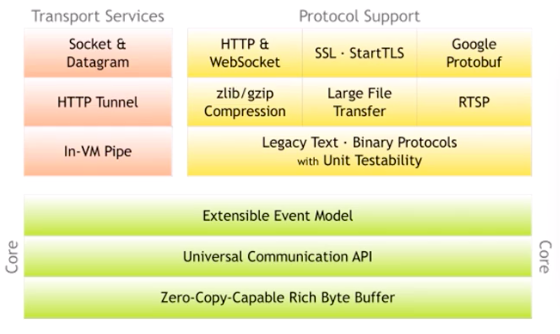

## Netty

官网：[https://netty.io/](https://netty.io/)  
一个异步事件驱动的网络应用程序框架，极大的简化了 TCP 和 UDP 开发。

最重要的四个内容：

-   Reactor 编程模型：一种高性能的多线程程序设计思路
-   Netty 自己定义的 Channel 概念：增强版通道概念
-   ChannelPipeline 职责链设计模式：事件处理机制
-   内存管理： 增强 BytyBuffer 缓存区

Netty 整体结构图：
  
可以看出 Netty 有三大模块：

1. 支持 Socket 等多种传输方式
2. 提供了多种协议的编解码实现
3. 核心设计包括：**事件处理模型、API 的使用、ByteBuf 的使用**

### Netty 线程模型

Netty 实现了 Reactor 模型：

1. Resources 资源（请求/任务）
2. Synchronous Event Demultiplexer 同步事件复用器
3. Dispather 分配器
4. Request Handler 请求处理器

#### EventLoopGroup 初始化过程

  
两组 EventLoopGroup（Main & Sub）处理不同的通道的不同事件

##### EventLoop 的启动

EventLoop 自身实现了 Executor 接口，调用 executor 方法提交任务时，则判断是否启动，未启动则调用内置的 executor 方法来出发 run 方法执行

bind 绑定端口的过程：

#### Channel 概念

Netty 中的 Channel 是一个抽象的概念，可以看做是对 JDK NIO Channel 的增强和扩展。  
常见的属性和方法：  

### Netty 中的责任链

具体的设计模式：[责任链模式](../../GOF/责任链模式.md)

#### Netty 中的 ChannelPipeLine 责任链

PipeLien 管道保存了所有的处理信息。
创建 channel 时会自动创建一个专有的 pipeline。入站事件和出站操作都会调用 pipeline 上的处理器。

---

[并发](./README.md)  
[Java](../README.md)  
[主页](../../../../../)
