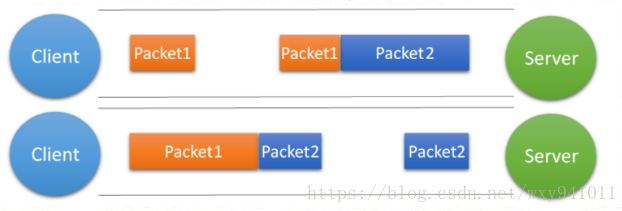

### Netty 示例 - 推送系统功能实现及优化

推送服务整体架构：


其中，重点是在第4步：客户端和Netty服务器建立的长连接

短连接：请求/响应之后，关闭已经建立的TCP连接，下次请求再建立一次连接。  
长连接：请求/响应之后，不关闭TCP连接，多次请求复用**同一个连接**。  
推送服务中：为了避免频繁创建/释放连接带来的性能损耗，以及获取数据的时效性，采用长连接形式。  

#### TCP粘包/拆包

使用TCP传输数据时，假设客户端向服务端连续发送了两个数据包，用 packet1 和 packet2 来表示，那么服务端收到的数据可以分为三种情况：

- 接收端正常收到两个数据包  
    

- 接收端只收到一个数据包，由于TCP是不会出现丢包的，所以这一个数据包中包含了发送端发送的两个数据包的信息，这种现象即为**粘包**。  
    

- 接收端收到了两个数据包，但是这两个数据包要么是不完整的，要么就是多出来一块，这种情况即发生了拆包和粘包。  
      

**产生原因：**  

1. 要发送的数据大于TCP发送缓冲区剩余空间大小，将会发生拆包。
2. 待发送数据大于MSS（最大报文长度），TCP在传输前将进行拆包。
3. 要发送的数据小于TCP发送缓冲区的大小，TCP将多次写入缓冲区的数据一次发送出去，将会发生粘包。
4. 接收数据端的应用层没有及时读取接收缓冲区中的数据，将发生粘包。


**解决方案：**  
1. 发送端给每个数据包添加包首部，首部中应该至少包含数据包的长度，这样接收端在接收到数据后，通过读取包首部的长度字段，便知道每一个数据包的实际长度了。
2. 发送端将每个数据包封装为固定长度（不够的可以通过补0填充），这样接收端每次从接收缓冲区中读取固定长度的数据就自然而然的把每个数据包拆分开来。
3. 可以在数据包之间设置边界，如添加特殊符号，这样，接收端通过这个边界就可以将不同的数据包拆分开。

以上**TCP粘包、拆包及解决方法**均转自博客：[https://blog.csdn.net/wxy941011/article/details/80428470](https://blog.csdn.net/wxy941011/article/details/80428470)  

Netty解决代码示例：

```java

```

---

[并发](./README.md)  
[Java](../README.md)  
[主页](../../../../../)