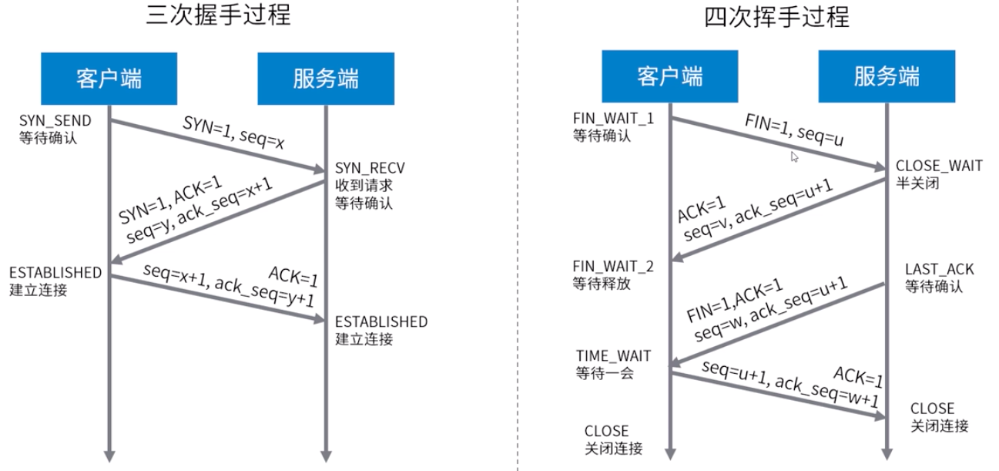

## NIO 网络编程

### OSI 网络七层模型


#### 各层的主要功能：

-   低三层
    -   物理层：使原始的数据比特流能够在物理介质传输
    -   数据链路层：通过校验、确认、反馈重发等手段，形成稳定的数据链路
    -   网络层：进行数据选择和流量控制（IP 协议）
-   传输层：提供可靠的端口到端口的数据传输服务（TCP/UDP 协议）
-   高三层
    -   会话层：负责建立、管理和终止进程之间的会话和数据交换
    -   表示层：负责数据格式转换、数据加密和解密、压缩与解压缩等功能
    -   应用层：为用户的应用进程提供网络服务

#### 传输控制协议 TCP

传输控制协议（TCP）提供了面向连接、可靠、有序、字节流传输服务。应用在使用 TCP 之前，必须建立 TCP 连接。


TCP 握手机制



#### 用户数据报协议 UDP

用户数据报协议 UDP 提供无连接、不可靠、数据报尽力传输服务。


特点：

-   应用进程更容易控制发送什么数据已经何时发送
-   无需建立连接
-   无连接状态
-   首部开销小

#### TCP 和 UDP 比较

| TCP            | UDP        |
| -------------- | ---------- |
| 面向连接       | 无连接     |
| 提供可靠性保证 | 无保证     |
| 慢             | 快         |
| 资源占用多     | 资源占用少 |

### Socket 编程

Internet 中应用最广泛的网络应用编程接口，实现 3 种底层协议接口：

-   数据报类型套接字 SOCK_DGRAM（面向 UDP 接口）
-   流式套接字 SOCK_STREAM（面向 TCP 接口）
-   原始套接字 SOCK_RAW(面向网络协议接口 IP、ICMP 等)

主要 Socket API 及其调用过程：


Socket 主要函数定义：

-   listen()、accept()函数只能用于服务端
-   connect()函数只能用于客户端
-   socket()、bind()、send()、recv()、sendto()、recvfrom()、close()

### BIO 阻塞式网络编程

#### BIO 的初步演示

示例代码：socket 一般的使用

```java
package nio;

import java.io.BufferedReader;
import java.io.IOException;
import java.io.InputStream;
import java.io.InputStreamReader;
import java.net.ServerSocket;
import java.net.Socket;

/**
 * 功能描述:
 * 服务端
 *
 * @auther: pikaqiu
 * @date: 2019/3/25 9:42 PM
 */
public class BIOServer {
    public static void main(String[] args) {
        try (ServerSocket serverSocket = new ServerSocket(8080)) {
            System.out.println("服务线程启动");
            while (!serverSocket.isClosed()) {
                Socket requst = serverSocket.accept(); // 阻塞
                System.out.println("收到新连接：" + requst.toString());
                // 接收数据，打印
                InputStream inputStream = requst.getInputStream(); // net + io
                BufferedReader reader = new BufferedReader(new InputStreamReader(inputStream, "utf-8"));
                String msg;
                while ((msg = reader.readLine()) != null) {
                    if (msg.length() == 0) {
                        break;
                    }
                    System.out.println(msg);
                }
                System.out.println("收到数据，来着：" + requst.toString());
            }
        } catch (IOException e) {
            e.printStackTrace();
        }
    }
}
```

```java
package nio;

import java.io.IOException;
import java.io.OutputStream;
import java.net.Socket;
import java.net.UnknownHostException;
import java.nio.charset.Charset;
import java.util.Scanner;

/**
 * 功能描述:
 * 客户端
 *
 * @auther: pikaqiu
 * @date: 2019/3/25 9:52 PM
 */
public class BIOClient {

    public static Charset charset = Charset.forName("utf-8");

    public static void main(String[] args) {
        try (Socket socket = new Socket("localhost", 8080)) {
            OutputStream outputStream = socket.getOutputStream();

            Scanner scanner = new Scanner(System.in);
            System.out.println("请输入：");
            String msg = scanner.nextLine();

            outputStream.write(msg.getBytes(charset));
            scanner.close();

        } catch (UnknownHostException e) {
            e.printStackTrace();
        } catch (IOException e) {
            e.printStackTrace();
        }
    }
}

```

启动一个服务端，两个客户端，运行结果：  
服务端只收到一个连接：


在一个客户端中输入后结果：

服务端在此时才会收到第二个客户端的连接：


以上结果验证了服务端 accept()是阻塞的。

**使用多线程改进程序：**
示例代码：

```java
package nio;

import java.io.BufferedReader;
import java.io.IOException;
import java.io.InputStream;
import java.io.InputStreamReader;
import java.net.ServerSocket;
import java.net.Socket;
import java.util.concurrent.ExecutorService;
import java.util.concurrent.Executors;

/**
 * 功能描述:
 * 服务端
 *
 * @auther: pikaqiu
 * @date: 2019/3/25 9:42 PM
 */
public class BIOServer {

    private static ExecutorService threadPool = Executors.newCachedThreadPool();

    public static void main(String[] args) {
        try (ServerSocket serverSocket = new ServerSocket(8080)) {
            System.out.println("服务线程启动");
            while (!serverSocket.isClosed()) {
                Socket requst = serverSocket.accept(); // 阻塞
                System.out.println("收到新连接：" + requst.toString());
                threadPool.execute(() -> {
                    try {
                        // 接收数据，打印
                        InputStream inputStream = requst.getInputStream(); // net + io
                        BufferedReader reader = new BufferedReader(new InputStreamReader(inputStream, "utf-8"));
                        String msg;
                        while ((msg = reader.readLine()) != null) {
                            if (msg.length() == 0) {
                                break;
                            }
                            System.out.println(msg);
                        }
                        System.out.println("收到数据，来着：" + requst.toString());
                    } catch (IOException e) {
                        e.printStackTrace();
                    }
                });
            }
        } catch (IOException e) {
            e.printStackTrace();
        }
    }
}

```

启动 1 个服务端，3 个客户端，运行结果：


在三个客户端分别输入，运行结果：


运行结果可以说明在改进后的服务端可以接受多个连接。

#### HTTP 协议

到这里已经实现了简单传统的 C/S 程序，这个可以和浏览器交互吗？
在浏览器访问 localhost:8080 时，服务端结果：

此时，服务端收到了信息，但是客户端却一直没有收到响应

-   Http 请求数据包
    

-   Http 响应数据包
    

-   Http 响应状态码
    -   1xx（临时响应）：表锁临时响应并需要请求者继续操作的状态
    -   2xx（成功）：表示成功处理了请求的状态
    -   3xx（重定向）：表示请求完成，需要进一步操作。通常这些状态码用来重定向
    -   4xx（请求错误）：请求可能出错，妨碍了服务端处理
    -   5xx（服务器错误）：服务器处理请求是发生内部错误。

示例代码：实现和浏览器的通信，返回客户端信息

```java
package nio;

import java.io.*;
import java.net.ServerSocket;
import java.net.Socket;
import java.util.concurrent.ExecutorService;
import java.util.concurrent.Executors;

/**
 * 功能描述:
 * 服务端
 *
 * @auther: pikaqiu
 * @date: 2019/3/25 9:42 PM
 */
public class BIOServer {

    private static ExecutorService threadPool = Executors.newCachedThreadPool();

    public static void main(String[] args) {
        try (ServerSocket serverSocket = new ServerSocket(8080)) {
            System.out.println("服务线程启动");
            while (!serverSocket.isClosed()) {
                Socket requst = serverSocket.accept(); // 阻塞
                System.out.println("收到新连接：" + requst.toString());
                threadPool.execute(() -> {
                    try {
                        // 接收数据，打印
                        InputStream inputStream = requst.getInputStream(); // net + io
                        BufferedReader reader = new BufferedReader(new InputStreamReader(inputStream, "utf-8"));
                        String msg;
                        while ((msg = reader.readLine()) != null) {
                            if (msg.length() == 0) {
                                break;
                            }
                            System.out.println(msg);
                        }
                        System.out.println("收到数据，来着：" + requst.toString());
                        // 返回给客户端响应
                        OutputStream outputStream = requst.getOutputStream();
                        outputStream.write("HTTP/1.1 200 OK\r\n".getBytes());
                        outputStream.write("Content-Length: 11\r\n\n".getBytes());
                        outputStream.write("Hello World".getBytes());
                        outputStream.flush();
                    } catch (IOException e) {
                        e.printStackTrace();
                    }
                });
            }
        } catch (IOException e) {
            e.printStackTrace();
        }
    }
}

```

在浏览器访问 localhost:8080 时，客户端端结果：  
  
服务端结果：  


#### BIO 阻塞 IO 的含义

**阻塞（blocking）IO**：资源不可用时，IO 请求一直阻塞，直到反馈结果（有数据或超时）。  
**非阻塞（non-blocking）IO**：资源不可用时，IO 请求离开返回，返回数据标识资源不可用。

**同步（synchronous）IO**：应用阻塞在发送或接收数据的状态，直到数据成功输出或返回失败。  
**非同步（asynchronous）IO**：应用发送或接收数据后立刻返回，实际处理是异步执行的。

阻塞和非阻塞式获取资源的方式，同步/异步是程序如何处理资源的逻辑设计。  
代码中使用的 API：ServerSocket.accept()，InputStream.read()都是阻塞的 API。操作系统底层 API 中，默认使用 Socket 都是 Blocking 类型，send/recv 等接口都是阻塞的。

---

[并发](./README.md)  
[Java](../README.md)  
[主页](../../../../../)
